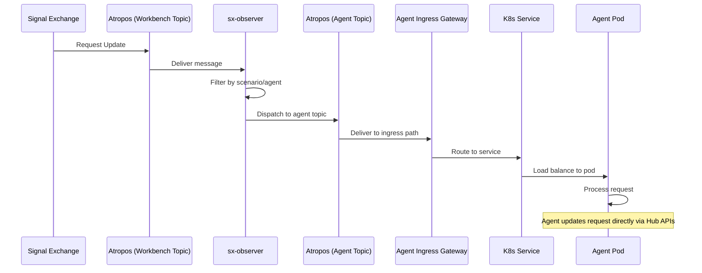
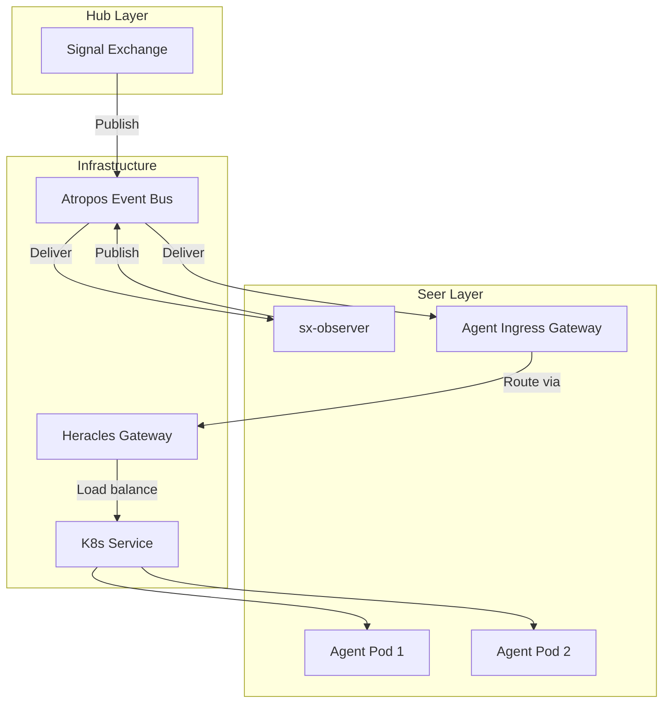

# Agent Ingress Gateway Architecture

> **Status**: 🟢 Design Complete  
> **Last Updated**: 2026-01-12

---

## Overview

Agent Ingress Gateway is a **configuration layer on Heracles**, not a separate service. This document describes the relationship with Heracles, integration with sx-observer, and the request flow architecture.

---

## Relationship with Heracles

### Configuration-Based Gateway

Agent Ingress Gateway consists of:

| Component | Type | Purpose |
|-----------|------|---------|
| **Ingress Rules** | Heracles Kong config | Route requests to agent pods |
| **Atropos Subscriptions** | Event bus config | Receive request updates from sx-observer |
| **K8s Services** | Kubernetes resources | Load balance across agent replicas |

### Why Not a Separate Service

| Approach | Pros | Cons |
|----------|------|------|
| **Separate Service** | Independent scaling, isolation | Operational overhead, additional latency |
| **Heracles Config** ✓ | Leverage existing infra, proven stability | Less isolation |

**Decision**: Use Heracles configuration to minimize operational complexity and leverage existing gateway infrastructure.

---

## Request Flow

### End-to-End Flow



### Request Path

```
Signal Exchange
      │
      │ Atropos: sx.workbench.{workbench_id}.updates
      ▼
sx-observer (store-and-forward)
      │
      │ Atropos: sx.agent.{agent_id}.dispatch
      ▼
Agent Ingress Gateway (Heracles)
      │
      │ Cluster-ingress path
      ▼
K8s Service
      │
      │ Load balancing
      ▼
Agent Pod
```

---

## sx-observer Integration

### Architecture Separation

| Component | Responsibility |
|-----------|----------------|
| **Signal Exchange** | Publishes request updates to workbench topic |
| **sx-observer** | Filters and routes to agent-specific topics |
| **Agent Ingress Gateway** | Receives from agent topics, routes to pods |

**Key Principle**: Signal Exchange is **completely unaware** of Agent Ingress Gateway.

### sx-observer Functions

```
┌─────────────────────────────────────────────────────────────────────────────┐
│                        SX-OBSERVER FUNCTIONS                                 │
│                                                                              │
│   1. RECEIVE                                                                 │
│      • Subscribe to workbench-level Atropos topic                           │
│      • Receive all request updates for the workbench                        │
│                                                                              │
│   2. STORE                                                                   │
│      • Persist messages for reliable delivery                               │
│      • Enable delivery when agents are scaled to zero                       │
│                                                                              │
│   3. FILTER                                                                  │
│      • Match updates to scenarios                                           │
│      • Match scenarios to subscribed agents                                 │
│      • Determine target agents                                              │
│                                                                              │
│   4. SCALE                                                                   │
│      • Detect if target agents are at zero replicas                        │
│      • Trigger scale-up before dispatch                                     │
│                                                                              │
│   5. DISPATCH                                                                │
│      • Publish to agent-specific Atropos topics                            │
│      • Agent Ingress Gateway receives and routes                           │
│                                                                              │
└─────────────────────────────────────────────────────────────────────────────┘
```

---

## Component Interactions



---

## Atropos Topic Structure

### Topic Naming

| Topic Pattern | Publisher | Subscriber |
|---------------|-----------|------------|
| `sx.workbench.{workbench_id}.updates` | Signal Exchange | sx-observer |
| `sx.agent.{agent_id}.dispatch` | sx-observer | Agent Ingress Gateway |

### Message Flow

```yaml
# Message on workbench topic (from Signal Exchange)
topic: sx.workbench.acme-disputes.updates
message:
  request_id: "req-12345"
  scenario: "fraud-investigation"
  update_type: "new_request"
  payload: { ... }

# Message on agent topic (from sx-observer)
topic: sx.agent.fraud-analyst-acme.dispatch
message:
  request_id: "req-12345"
  scenario: "fraud-investigation"
  update_type: "new_request"
  source_workbench: "acme-disputes"
  payload: { ... }
  envelope:
    dispatched_at: "2026-01-12T14:30:00Z"
    retry_count: 0
```

---

## Load Balancing

### Load Balancing via K8s Service

Agent pods are exposed via Kubernetes Service:

```yaml
apiVersion: v1
kind: Service
metadata:
  name: fraud-analyst-acme-retail
  namespace: acme-disputes
spec:
  selector:
    app: fraud-analyst-acme-retail
  ports:
    - port: 8080
      targetPort: 8080
  type: ClusterIP
```

### Load Balancing Strategy

| Strategy | Configuration |
|----------|---------------|
| **Round-Robin** | Default K8s behavior |
| **Session Affinity** | Optional, via `request_id` (opportunistic) |

---

## Configuration

### Ingress Configuration

Seer Operator creates Heracles ingress configuration:

```yaml
apiVersion: networking.k8s.io/v1
kind: Ingress
metadata:
  name: agent-ingress-fraud-analyst-acme
  namespace: acme-disputes
  annotations:
    kubernetes.io/ingress.class: kong
    konghq.com/strip-path: "false"
    konghq.com/plugins: "zone-auth,rate-limiting"
spec:
  rules:
    - host: internal.seer.local
      http:
        paths:
          - path: /seer/subscription/acme-seer/data-plane/workbench/acme-disputes/agents/fraud-analyst-acme-retail/dispatch
            pathType: Prefix
            backend:
              service:
                name: fraud-analyst-acme-retail
                port:
                  number: 8080
```

---

## Related Documentation

- [Subscription Lifecycle](./subscription-lifecycle.md) — Subscription management
- [Request Routing](./request-routing.md) — Routing algorithms
- [Heracles Integration](./heracles-integration.md) — Ingress configuration details
- [Signal Exchange Integration](./signal-exchange-integration.md) — sx-observer details

---

*Agent Ingress Gateway architecture leverages Heracles and Atropos for efficient, configuration-based request routing.*
