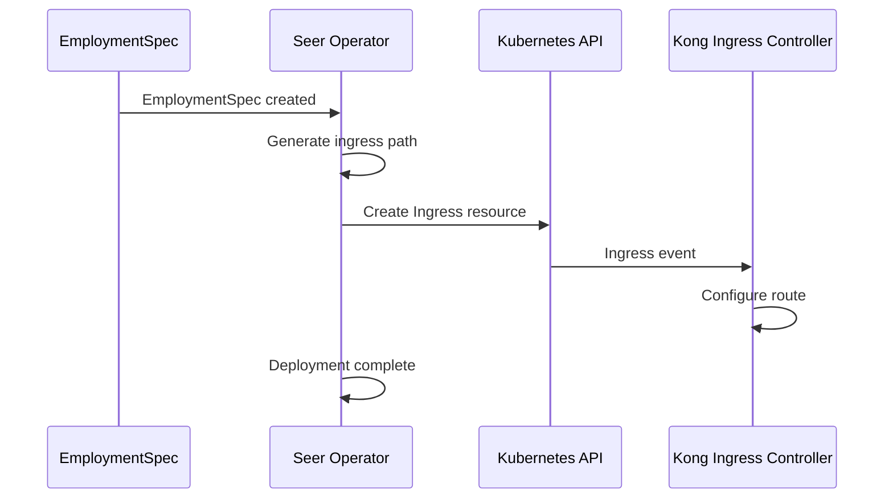
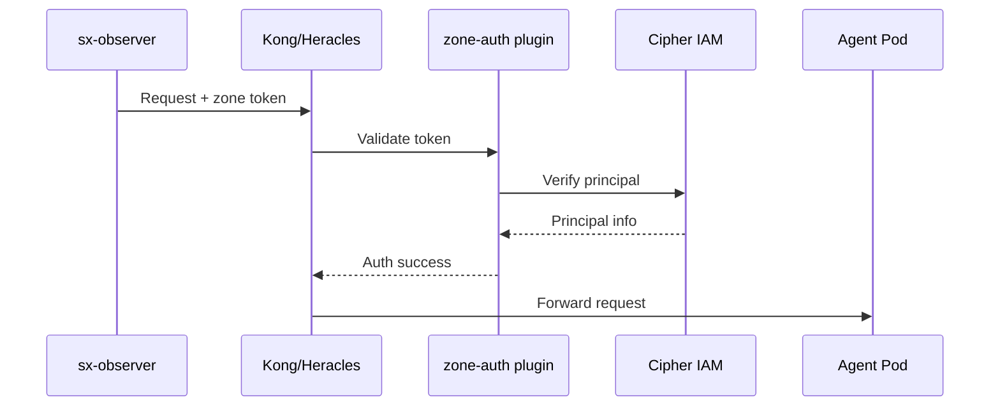

# Heracles Integration

> **Status**: 🟢 Design Complete  
> **Last Updated**: 2026-01-12

---

## Overview

Agent Ingress Gateway is implemented as configuration on Heracles, the Hub API gateway. This document describes the cluster-ingress configuration, authentication setup, and TLS termination.

---

## Cluster-Ingress Configuration

### Ingress Type

Agent Ingress Gateway uses **cluster-ingress** (internal) configuration:

| Ingress Type | Exposure | Use Case |
|--------------|----------|----------|
| **public-ingress** | External | External API access |
| **cluster-ingress** | Internal | Internal service-to-service |
| **zone-ingress** | Zone-scoped | Cross-zone communication |

Agent Ingress Gateway uses **cluster-ingress** because:
- sx-observer is internal to the cluster
- Agent pods are internal
- No external access required

---

## Ingress Path Provisioning

### Path Structure

```
/seer/subscription/{subscription_id}/data-plane/workbench/{workbench_id}/agents/{agent_id}/dispatch
```

### Example Ingress

```yaml
apiVersion: networking.k8s.io/v1
kind: Ingress
metadata:
  name: agent-ingress-fraud-analyst-acme-retail
  namespace: acme-disputes
  annotations:
    kubernetes.io/ingress.class: kong
    konghq.com/strip-path: "false"
    konghq.com/protocols: "https"
    konghq.com/plugins: "zone-auth,rate-limiting"
spec:
  ingressClassName: kong-cluster
  tls:
    - hosts:
        - internal.seer.local
      secretName: seer-internal-tls
  rules:
    - host: internal.seer.local
      http:
        paths:
          - path: /seer/subscription/acme-seer/data-plane/workbench/acme-disputes/agents/fraud-analyst-acme-retail/dispatch
            pathType: Prefix
            backend:
              service:
                name: fraud-analyst-acme-retail
                port:
                  number: 8080
```

### Ingress Provisioning by Seer Operator

Seer Operator creates ingress resources when deploying agents:



---

## Authentication at Ingress

### Zone-Auth Plugin

Heracles uses the `zone-auth` Kong plugin for authentication:

```yaml
apiVersion: configuration.konghq.com/v1
kind: KongPlugin
metadata:
  name: zone-auth
spec:
  plugin: zone-auth
  config:
    auth_endpoint: "http://cipher-iam.hub-system.svc.cluster.local/v1/auth"
    cache_ttl: 300
    required_claims:
      - principal_id
      - zone_id
```

### Authentication Flow



### sx-observer Identity

sx-observer authenticates with a service account:

```yaml
# sx-observer service account token
claims:
  principal_id: "svc:sx-observer:acme-disputes"
  zone_id: "zone-acme"
  roles:
    - "seer:dispatcher"
  permissions:
    - "dispatch:agents:*"
```

---

## Delegation Token Propagation

### Token in Request Headers

When `AUTHORITY_GRANTED` updates are dispatched, delegation tokens are propagated:

```yaml
apiVersion: configuration.konghq.com/v1
kind: KongPlugin
metadata:
  name: delegation-token-propagation
spec:
  plugin: request-transformer
  config:
    add:
      headers:
        - "X-Seer-Delegation-Token:$(body.environment.auth.delegations[0].token)"
```

### Token Validation at Ingress

Delegation tokens are validated at the ingress level (optional, for defense in depth):

```yaml
apiVersion: configuration.konghq.com/v1
kind: KongPlugin
metadata:
  name: delegation-token-validator
spec:
  plugin: jwt
  config:
    claims_to_verify:
      - exp
    key_claim_name: delegation_token
    secret_is_base64: false
    # Token validation is advisory; authoritative validation is at Seer Sidecar
    run_on_preflight: false
```

> **Note**: Authoritative delegation token validation occurs at the Seer Sidecar's [Delegation Service](../seer-sidecar/delegation-service.md). Ingress validation provides early rejection of obviously invalid tokens.

---

## TLS Termination

### TLS Configuration

TLS is terminated at the Kong ingress:

```yaml
spec:
  tls:
    - hosts:
        - internal.seer.local
      secretName: seer-internal-tls
```

### Certificate Management

| Certificate | Issuer | Scope |
|-------------|--------|-------|
| `seer-internal-tls` | Internal CA | Cluster-internal |

Certificates are managed by cert-manager:

```yaml
apiVersion: cert-manager.io/v1
kind: Certificate
metadata:
  name: seer-internal-tls
  namespace: seer-system
spec:
  secretName: seer-internal-tls
  issuerRef:
    name: internal-ca
    kind: ClusterIssuer
  dnsNames:
    - internal.seer.local
    - "*.internal.seer.local"
```

---

## Rate Limiting

### Kong Rate Limiting Plugin

Rate limiting is applied at the ingress level:

```yaml
apiVersion: configuration.konghq.com/v1
kind: KongPlugin
metadata:
  name: agent-rate-limiting
spec:
  plugin: rate-limiting
  config:
    minute: 1000
    policy: cluster
    fault_tolerant: true
    hide_client_headers: false
```

### Rate Limit Headers

Responses include rate limit headers:

```http
X-RateLimit-Limit-Minute: 1000
X-RateLimit-Remaining-Minute: 950
```

---

## Kong Plugin Stack

### Plugins Applied

| Plugin | Purpose | Order |
|--------|---------|-------|
| `zone-auth` | Authentication | 1 |
| `rate-limiting` | Rate limiting | 2 |
| `request-transformer` | Add headers | 3 |
| `prometheus` | Metrics | 4 |

### Request Transformer

Adds tracing and context headers:

```yaml
apiVersion: configuration.konghq.com/v1
kind: KongPlugin
metadata:
  name: agent-request-transformer
spec:
  plugin: request-transformer
  config:
    add:
      headers:
        - "X-Seer-Agent-Id:$(uri_captures.agent_id)"
        - "X-Seer-Workbench:$(uri_captures.workbench_id)"
```

---

## Kong Ingress Controller Configuration

### IngressClass

```yaml
apiVersion: networking.k8s.io/v1
kind: IngressClass
metadata:
  name: kong-cluster
spec:
  controller: ingress-controllers.konghq.com/kong
  parameters:
    apiGroup: configuration.konghq.com
    kind: KongClusterPlugin
    scope: Cluster
```

### Controller Configuration

```yaml
apiVersion: v1
kind: ConfigMap
metadata:
  name: kong-config
  namespace: kong-system
data:
  CONTROLLER_INGRESS_CLASS: "kong-cluster"
  CONTROLLER_ELECTION_ID: "kong-cluster-leader"
  PROXY_LISTEN: "0.0.0.0:8443 ssl"
  SSL_CERT: "/etc/secrets/tls/tls.crt"
  SSL_CERT_KEY: "/etc/secrets/tls/tls.key"
```

---

## Metrics

### Kong Prometheus Metrics

```prometheus
# Request count
kong_http_requests_total{service="fraud-analyst-acme-retail", route="dispatch"} 1234

# Latency
kong_latency_bucket{type="request", service="fraud-analyst-acme-retail", le="100"} 1000

# Upstream health
kong_upstream_target_health{upstream="fraud-analyst-acme-retail", target="10.0.0.1:8080", state="healthy"} 1
```

---

## Related Documentation

- [Architecture](./architecture.md) — Overall architecture
- [Subscription Policies](./subscription-policies.md) — Policy enforcement
- [Heracles Gateway](../../../../olympus-hub-docs/05-infrastructure/heracles-gateway.md) — Heracles documentation
- [Seer Sidecar: Delegation Service](../seer-sidecar/delegation-service.md) — Authoritative delegation token validation
- [Request-Scoped Authority Delegation](../../implementation-concepts/request-scoped-delegation.md) — End-to-end delegation design

---

*Heracles Integration provides secure, authenticated ingress for Agent Ingress Gateway using Kong configuration.*
