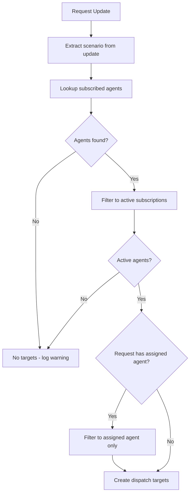

# Request Routing

> **Status**: 🟢 Complete  
> **Last Updated**: 2026-01-12

---

## Overview

Request routing determines which agents receive which request updates. This document describes the routing logic and provides C3-level detail on filtering algorithms.

---

## Routing from sx-observer

### Atropos Topic Structure

| Topic | Publisher | Subscriber |
|-------|-----------|------------|
| `sx.workbench.{workbench_id}.updates` | Signal Exchange | sx-observer |
| `sx.agent.{agent_id}.dispatch` | sx-observer | Agent Ingress Gateway |

### Routing Flow

```
Signal Exchange publishes to: sx.workbench.acme-disputes.updates
                                        │
                                        ▼
                              sx-observer receives
                                        │
                              ┌─────────┴─────────┐
                              │   Filter by:      │
                              │   1. Scenario     │
                              │   2. Agent subs   │
                              └─────────┬─────────┘
                                        │
                    ┌───────────────────┼───────────────────┐
                    ▼                   ▼                   ▼
        sx.agent.fraud-analyst  sx.agent.doc-processor  sx.agent.reviewer
```

---

## Agent Subscription Matching

### From EmploymentSpec

Agents subscribe to scenarios via `workScope.scenarios`:

```yaml
apiVersion: seer.olympus.io/v1
kind: EmploymentSpec
metadata:
  name: fraud-analyst-acme-retail
spec:
  workScope:
    scenarios:
      - "fraud-investigation"
      - "dispute-resolution"
      - "chargeback-review"
```

### Subscription Index

sx-observer maintains an index of agent subscriptions:

```yaml
# Internal subscription index (sx-observer)
subscriptions:
  fraud-investigation:
    - agent_id: fraud-analyst-acme-retail
      topic: sx.agent.fraud-analyst-acme-retail.dispatch
    - agent_id: fraud-analyst-acme-commercial
      topic: sx.agent.fraud-analyst-acme-commercial.dispatch
  
  dispute-resolution:
    - agent_id: fraud-analyst-acme-retail
      topic: sx.agent.fraud-analyst-acme-retail.dispatch
    - agent_id: dispute-handler-acme
      topic: sx.agent.dispute-handler-acme.dispatch
```

---

## Request Filtering Algorithm (C3 Detail)

### Filter Input

```python
@dataclass
class RequestUpdate:
    request_id: str
    scenario: str
    update_type: str  # new_request, status_change, data_update, etc.
    payload: dict


@dataclass
class AgentSubscription:
    agent_id: str
    scenarios: List[str]
    topic: str
    state: SubscriptionState
```

### Filtering Algorithm

```python
class RequestFilter:
    """Filters request updates to determine target agents."""
    
    def __init__(self, subscription_index):
        self.subscriptions = subscription_index
    
    def filter(self, update: RequestUpdate) -> List[DispatchTarget]:
        """
        Determine which agents should receive this update.
        
        Args:
            update: Request update from Signal Exchange
        
        Returns:
            List of dispatch targets (agent + topic)
        """
        targets = []
        
        # Step 1: Find agents subscribed to this scenario
        subscribed_agents = self._get_subscribed_agents(update.scenario)
        
        # Step 2: Filter by agent state (only active subscriptions)
        active_agents = [
            agent for agent in subscribed_agents
            if agent.state == SubscriptionState.ACTIVE
        ]
        
        # Step 3: Apply additional filters (if configured)
        filtered_agents = self._apply_additional_filters(active_agents, update)
        
        # Step 4: Create dispatch targets
        for agent in filtered_agents:
            targets.append(DispatchTarget(
                agent_id=agent.agent_id,
                topic=agent.topic,
                update=update
            ))
        
        return targets
    
    def _get_subscribed_agents(self, scenario: str) -> List[AgentSubscription]:
        """Get all agents subscribed to a scenario."""
        return self.subscriptions.get(scenario, [])
    
    def _apply_additional_filters(
        self, 
        agents: List[AgentSubscription], 
        update: RequestUpdate
    ) -> List[AgentSubscription]:
        """Apply additional filtering rules."""
        # Example: request affinity (if request was previously handled by an agent)
        if update.update_type == "status_change":
            assigned_agent = self._get_assigned_agent(update.request_id)
            if assigned_agent:
                return [a for a in agents if a.agent_id == assigned_agent]
        
        return agents
```

### Filtering Decision Tree



---

## Scenario-to-Agent Mapping (C3 Detail)

### Mapping Data Structure

```python
class ScenarioAgentIndex:
    """Index for scenario to agent mappings."""
    
    def __init__(self):
        # Scenario -> List[AgentSubscription]
        self.scenario_to_agents: Dict[str, List[AgentSubscription]] = {}
        
        # Agent -> List[Scenario]
        self.agent_to_scenarios: Dict[str, List[str]] = {}
    
    def add_subscription(self, agent: AgentSubscription):
        """Add agent subscription to index."""
        for scenario in agent.scenarios:
            if scenario not in self.scenario_to_agents:
                self.scenario_to_agents[scenario] = []
            self.scenario_to_agents[scenario].append(agent)
        
        self.agent_to_scenarios[agent.agent_id] = agent.scenarios
    
    def remove_subscription(self, agent_id: str):
        """Remove agent subscription from index."""
        scenarios = self.agent_to_scenarios.get(agent_id, [])
        
        for scenario in scenarios:
            self.scenario_to_agents[scenario] = [
                a for a in self.scenario_to_agents.get(scenario, [])
                if a.agent_id != agent_id
            ]
        
        del self.agent_to_scenarios[agent_id]
    
    def get_agents_for_scenario(self, scenario: str) -> List[AgentSubscription]:
        """Get all agents subscribed to a scenario."""
        return self.scenario_to_agents.get(scenario, [])
    
    def update_subscription(self, agent: AgentSubscription):
        """Update agent subscription (scenarios changed)."""
        self.remove_subscription(agent.agent_id)
        self.add_subscription(agent)
```

### Index Update Triggers

| Event | Action |
|-------|--------|
| Agent deployed | Add to index |
| Agent scenarios changed | Update index |
| Agent retired | Remove from index |

---

## Request Transformation

### Default Behavior: Pass-Through

By default, no transformation is applied:

```yaml
# Message as received from Signal Exchange
message:
  request_id: "req-12345"
  scenario: "fraud-investigation"
  update_type: "new_request"
  payload: { ... }

# Message as dispatched to agent (same + envelope)
message:
  request_id: "req-12345"
  scenario: "fraud-investigation"
  update_type: "new_request"
  payload: { ... }
  envelope:
    dispatched_at: "2026-01-12T14:30:00Z"
    source_workbench: "acme-disputes"
    retry_count: 0
```

### Optional Transformation

Transformations can be configured per subscription:

```yaml
# EmploymentSpec with transformation
spec:
  workScope:
    scenarios:
      - "fraud-investigation"
    transformation:
      enabled: true
      script: "transforms/fraud-context-enrichment.js"
```

> **Note**: Transformation configuration is optional and implementation-dependent.

---

## Load Balancing Strategy

### Default: Round-Robin via K8s

Agent pods are load-balanced via Kubernetes Service:

```
Agent Ingress Gateway → K8s Service → Pod 1, Pod 2, Pod 3 (round-robin)
```

### Session Affinity (Optional)

Opportunistic session affinity based on `request_id`:

```yaml
apiVersion: v1
kind: Service
metadata:
  name: fraud-analyst-acme-retail
spec:
  sessionAffinity: None  # Default: no affinity
  # Or for sticky sessions:
  # sessionAffinity: ClientIP
  # sessionAffinityConfig:
  #   clientIP:
  #     timeoutSeconds: 3600
```

**Note**: Agents must be stateless — session affinity is opportunistic, not guaranteed.

---

## Related Documentation

- [Architecture](./architecture.md) — Overall architecture
- [Subscription Lifecycle](./subscription-lifecycle.md) — Subscription states
- [Signal Exchange Integration](./signal-exchange-integration.md) — sx-observer details

---

*Request Routing provides scenario-based filtering and efficient dispatch to subscribed agents.*
