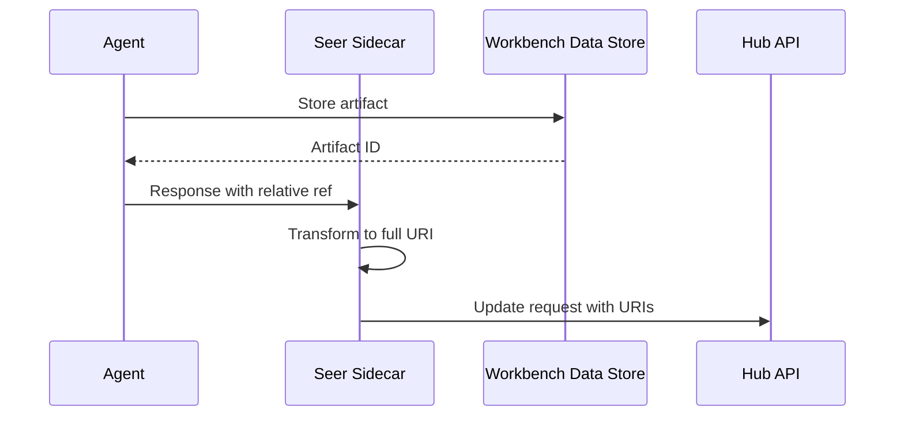

# Response Handling

> **Status**: 🟢 Complete  
> **Last Updated**: 2026-01-12

---

## Overview

Agents handle responses **directly** — they update requests via Hub APIs without flowing back through Agent Ingress Gateway. This document describes the response path and Workbench Data Store integration.

---

## Agent Direct Response

### Response Architecture

```
┌─────────────────────────────────────────────────────────────────────────────┐
│                        RESPONSE HANDLING                                     │
│                                                                              │
│   Agent Ingress Gateway                                                      │
│         │                                                                    │
│         │ Request dispatch (one-way)                                         │
│         ▼                                                                    │
│   ┌───────────────────────────────────────────────────────────────────────┐ │
│   │                      AGENT POD                                         │ │
│   │                                                                         │ │
│   │   1. Receive request update                                            │ │
│   │   2. Process request                                                   │ │
│   │   3. Generate response/update                                          │ │
│   │   4. Call Hub APIs directly                                            │ │
│   │                                                                         │ │
│   └───────────────────────────────────────────────────────────────────────┘ │
│         │                                                                    │
│         │ Direct API calls (NOT via Agent Ingress Gateway)                  │
│         ▼                                                                    │
│   ┌───────────────────────────────────────────────────────────────────────┐ │
│   │                      HUB APIs                                          │ │
│   │                                                                         │ │
│   │   • Request API (update status, add notes)                             │ │
│   │   • Workbench Data Store (store artifacts)                            │ │
│   │   • Signal Exchange (publish updates)                                  │ │
│   │                                                                         │ │
│   └───────────────────────────────────────────────────────────────────────┘ │
│                                                                              │
└─────────────────────────────────────────────────────────────────────────────┘
```

### Why Direct Response

| Approach | Pros | Cons |
|----------|------|------|
| **Via Gateway** | Unified path | Additional latency, complexity |
| **Direct API** ✓ | Lower latency, simpler | Requires agent Hub access |

**Decision**: Agents update requests directly via Hub APIs for simplicity and performance.

---

## Workbench Data Store Integration

### Storing Artifacts

Agents store large artifacts (documents, files) in Workbench Data Store:

```python
# Agent code
from seer_sdk import WorkbenchDataStore

data_store = WorkbenchDataStore(
    workbench_id=os.environ["WORKBENCH_ID"],
    agent_id=os.environ["AGENT_ID"]
)

# Store artifact
artifact_ref = await data_store.store(
    content=generated_document,
    content_type="application/pdf",
    metadata={
        "request_id": request_id,
        "artifact_type": "investigation_report"
    }
)

# Reference in request update
await request_api.update(
    request_id=request_id,
    artifacts=[artifact_ref]
)
```

### Data Store Reference

Artifacts are referenced by URI:

```yaml
artifact_ref:
  uri: "wds://acme-disputes/artifacts/2026-01-12/req-12345/investigation-report.pdf"
  content_type: "application/pdf"
  size_bytes: 125000
  checksum: "sha256:abc123..."
  created_at: "2026-01-12T14:35:00Z"
  created_by: "fraud-analyst-acme-retail"
```

---

## Response Transformation

### Resource URI Injection

When agents reference resources, URIs are injected:

```yaml
# Agent generates relative reference
response:
  artifacts:
    - type: "report"
      path: "investigation-report.pdf"

# Seer Sidecar transforms to full URI
response:
  artifacts:
    - type: "report"
      uri: "wds://acme-disputes/artifacts/2026-01-12/req-12345/investigation-report.pdf"
```

### Transformation Flow



---

## Error Handling

### Error Scenarios

| Scenario | Handling |
|----------|----------|
| **Hub API unavailable** | Retry with backoff, queue locally |
| **Data Store write failure** | Retry, escalate after limit |
| **Request not found** | Log error, notify operations |
| **Authorization failure** | Log, escalate to supervisor |

### Dead Letter Queue (DLQ)

Failed response updates are queued for retry:

```yaml
# DLQ message for failed response
topic: sx.dlq.responses
message:
  agent_id: "fraud-analyst-acme-retail"
  request_id: "req-12345"
  update:
    status: "completed"
    artifacts: [...]
  error:
    type: "api_unavailable"
    message: "Hub API returned 503"
    attempts: 3
  timestamp: "2026-01-12T14:35:00Z"
```

### Retry Logic

```python
class ResponseHandler:
    """Handles response submission with retry."""
    
    async def submit_response(self, request_id, response):
        """Submit response to Hub with retry."""
        for attempt in range(self.max_retries):
            try:
                await self.hub_api.update_request(
                    request_id=request_id,
                    update=response
                )
                return
            
            except HubApiUnavailable:
                if attempt == self.max_retries - 1:
                    await self.dlq.send(request_id, response)
                    raise
                
                await asyncio.sleep(2 ** attempt)  # Exponential backoff
```

---

## Hub API Access

### APIs Used by Agents

| API | Purpose |
|-----|---------|
| **Request API** | Update request status, add notes |
| **Signal Exchange** | Publish events for other observers |
| **Workbench Data Store** | Store artifacts, documents |
| **Memory Service** | Store agent memories |
| **Knowledge Service** | Access knowledge base |

### Authentication

Agents authenticate to Hub APIs via zone-auth:

```yaml
# Agent pod environment
env:
  - name: HUB_API_URL
    value: "https://api.hub.local"
  - name: HUB_AUTH_TOKEN
    valueFrom:
      secretKeyRef:
        name: agent-hub-credentials
        key: token
```

---

## Metrics

### Response Metrics

```prometheus
# Response submission count
seer_agent_responses_total{agent="fraud-analyst", status="success"} 1234
seer_agent_responses_total{agent="fraud-analyst", status="error"} 12

# Response latency
seer_agent_response_latency_seconds_bucket{agent="fraud-analyst", le="1"} 1000

# DLQ messages
seer_agent_dlq_messages_total{agent="fraud-analyst", reason="api_unavailable"} 5
```

---

## Related Documentation

- [Architecture](./architecture.md) — Overall architecture
- [Seer Sidecar](../seer-sidecar/README.md) — Response transformation
- [Agent Runtime](../agent-runtime/README.md) — Hub API access configuration

---

*Response Handling provides reliable direct response submission with retry and DLQ support.*
