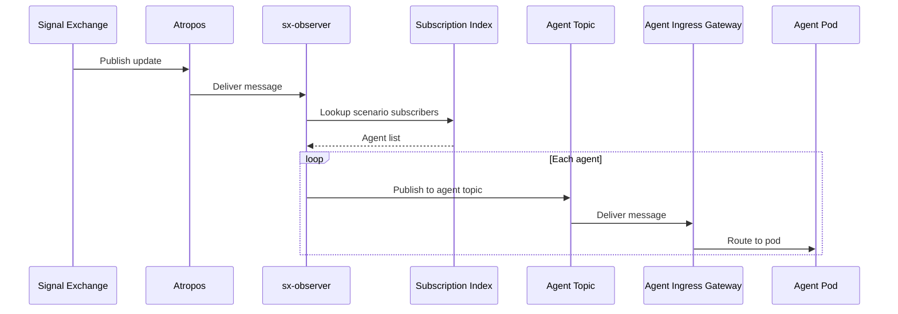
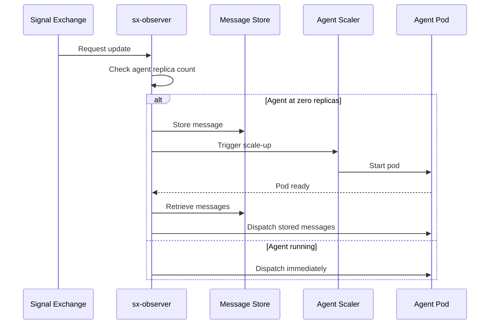

# Signal Exchange Integration

> **Status**: 🟢 Complete  
> **Last Updated**: 2026-01-12

---

## Overview

Agent Ingress Gateway integrates with Signal Exchange via sx-observer. This document describes the integration architecture, Atropos topic model, and filtering logic.

---

## Integration Architecture

### Key Principle: Signal Exchange Isolation

**Signal Exchange is completely unaware of Agent Ingress Gateway.**

| Component | Awareness |
|-----------|-----------|
| Signal Exchange | Only knows about sx-observer |
| sx-observer | Knows about agents and scenarios |
| Agent Ingress Gateway | Receives from sx-observer |

### Integration Flow

```
┌─────────────────────────────────────────────────────────────────────────────┐
│                     SIGNAL EXCHANGE INTEGRATION                              │
│                                                                              │
│   ┌─────────────────────────────────────────────────────────────────────┐   │
│   │                    SIGNAL EXCHANGE                                   │   │
│   │                                                                       │   │
│   │  • Publishes request updates                                         │   │
│   │  • Unaware of agents                                                 │   │
│   │  • Only knows sx-observer as subscriber                             │   │
│   │                                                                       │   │
│   └─────────────────────────────────────────────────────────────────────┘   │
│        │                                                                     │
│        │ Atropos: sx.workbench.{workbench_id}.updates                        │
│        ▼                                                                     │
│   ┌─────────────────────────────────────────────────────────────────────┐   │
│   │                      SX-OBSERVER                                     │   │
│   │                                                                       │   │
│   │  • Subscribes to workbench topic                                     │   │
│   │  • Filters by scenario                                               │   │
│   │  • Routes to agent-specific topics                                   │   │
│   │                                                                       │   │
│   └─────────────────────────────────────────────────────────────────────┘   │
│        │                                                                     │
│        │ Atropos: sx.agent.{agent_id}.dispatch                              │
│        ▼                                                                     │
│   ┌─────────────────────────────────────────────────────────────────────┐   │
│   │             AGENT INGRESS GATEWAY (Heracles Config)                  │   │
│   │                                                                       │   │
│   │  • Receives from agent topics                                        │   │
│   │  • Routes to agent pods                                              │   │
│   │                                                                       │   │
│   └─────────────────────────────────────────────────────────────────────┘   │
│                                                                              │
└─────────────────────────────────────────────────────────────────────────────┘
```

---

## sx-observer Role

### Single Observer per Workbench

Each workbench has one sx-observer instance:

```yaml
# sx-observer deployment per workbench
apiVersion: apps/v1
kind: Deployment
metadata:
  name: sx-observer-acme-disputes
  namespace: acme-disputes
spec:
  replicas: 2  # HA
  template:
    spec:
      containers:
        - name: sx-observer
          image: seer/sx-observer:v1.2.0
          env:
            - name: WORKBENCH_ID
              value: "acme-disputes"
            - name: SX_TOPIC
              value: "sx.workbench.acme-disputes.updates"
```

### sx-observer Responsibilities

| Responsibility | Description |
|----------------|-------------|
| **Subscribe** | Subscribe to workbench-level Signal Exchange topic |
| **Store** | Persist messages for reliable delivery |
| **Filter** | Match updates to scenarios and agents |
| **Scale** | Trigger scale-up of agents at zero replicas |
| **Dispatch** | Publish to agent-specific topics |

---

## Atropos Topic Subscription Model

### Topic Hierarchy

```
sx.workbench.{workbench_id}.updates        (Signal Exchange → sx-observer)
        │
        │ sx-observer filters and routes
        │
        ├── sx.agent.{agent_1_id}.dispatch   (sx-observer → Agent Ingress Gateway)
        ├── sx.agent.{agent_2_id}.dispatch
        └── sx.agent.{agent_n_id}.dispatch
```

### Workbench Topic Configuration

sx-observer registers as a subscriber to Signal Exchange:

```yaml
# Signal Exchange subscriber registration
apiVersion: signalexchange.hub.io/v1
kind: Subscriber
metadata:
  name: sx-observer-acme-disputes
spec:
  topic: "sx.workbench.acme-disputes.updates"
  subscriber:
    name: "sx-observer-acme-disputes"
    endpoint: "atropos://sx.observer.acme-disputes.inbound"
  filter:
    scenarios: "*"  # All scenarios (filtering done by sx-observer)
  delivery:
    mode: "at-least-once"
    ackTimeout: 30s
```

### Agent Topic Configuration

sx-observer creates agent-specific topics:

```yaml
# Agent topic (created by Seer Operator)
apiVersion: messaging.hub.io/v1
kind: Topic
metadata:
  name: sx-agent-fraud-analyst-acme-retail-dispatch
spec:
  name: "sx.agent.fraud-analyst-acme-retail.dispatch"
  retention: 24h
  partitions: 1
  consumer:
    endpoint: "http://internal.seer.local/seer/.../agents/fraud-analyst-acme-retail/dispatch"
```

---

## Filtering Logic

### Scenario-Based Filtering

sx-observer filters updates based on agent scenario subscriptions:

```python
class RequestFilter:
    def __init__(self, subscription_index):
        self.index = subscription_index
    
    def filter(self, update: RequestUpdate) -> List[AgentSubscription]:
        """Filter update to matching agents."""
        # Get agents subscribed to this scenario
        return self.index.get_agents_for_scenario(update.scenario)
```

### Multi-Agent Dispatch

Same update can be dispatched to multiple agents:

```
Update: scenario="fraud-investigation"
                    │
        ┌───────────┼───────────┐
        ▼           ▼           ▼
   Agent A      Agent B      Agent C
   (subscribed) (subscribed) (not subscribed)
   
   Result: Dispatch to Agent A and Agent B
```

### Update Type Filtering

Optional filtering by update type:

```yaml
# EmploymentSpec with update type filter
spec:
  workScope:
    scenarios:
      - "fraud-investigation"
    updateTypes:
      - new_request
      - status_change
    # Ignores: data_update, comment_added, etc.
```

---

## Request Update Dispatch Flow

### Dispatch Sequence



### Message Envelope

sx-observer wraps updates with dispatch metadata:

```yaml
# Original message from Signal Exchange
request_id: "req-12345"
scenario: "fraud-investigation"
update_type: "new_request"
payload: { ... }

# Wrapped message from sx-observer
envelope:
  dispatched_at: "2026-01-12T14:30:00Z"
  source_workbench: "acme-disputes"
  source_topic: "sx.workbench.acme-disputes.updates"
  retry_count: 0
  delivery_id: "del-67890"
original:
  request_id: "req-12345"
  scenario: "fraud-investigation"
  update_type: "new_request"
  payload: { ... }
```

---

## Scale-to-Zero Support

### Store and Forward

When agents are scaled to zero, sx-observer stores messages:



### Message Store Configuration

```yaml
# sx-observer message store config
storage:
  type: redis
  endpoint: redis.seer-system.svc.cluster.local:6379
  retention: 24h
  maxMessages: 10000
```

---

## Metrics

### sx-observer Metrics

```prometheus
# Messages received from Signal Exchange
seer_sx_observer_messages_received_total{workbench="acme-disputes"} 12345

# Messages dispatched to agents
seer_sx_observer_messages_dispatched_total{workbench="acme-disputes", agent="fraud-analyst"} 5000

# Messages stored (scale-to-zero)
seer_sx_observer_messages_stored_total{workbench="acme-disputes"} 500

# Dispatch latency
seer_sx_observer_dispatch_latency_seconds_bucket{workbench="acme-disputes", le="0.1"} 10000
```

---

## Related Documentation

- [Architecture](./architecture.md) — Overall architecture
- [Request Routing](./request-routing.md) — Routing algorithms
- [Subscription Lifecycle](./subscription-lifecycle.md) — Subscription management
- [Agent Runtime: Signal Exchange Integration](../agent-runtime/signal-exchange-integration.md) — Agent perspective

---

*Signal Exchange Integration provides reliable, filtered request dispatch via sx-observer and Atropos.*
