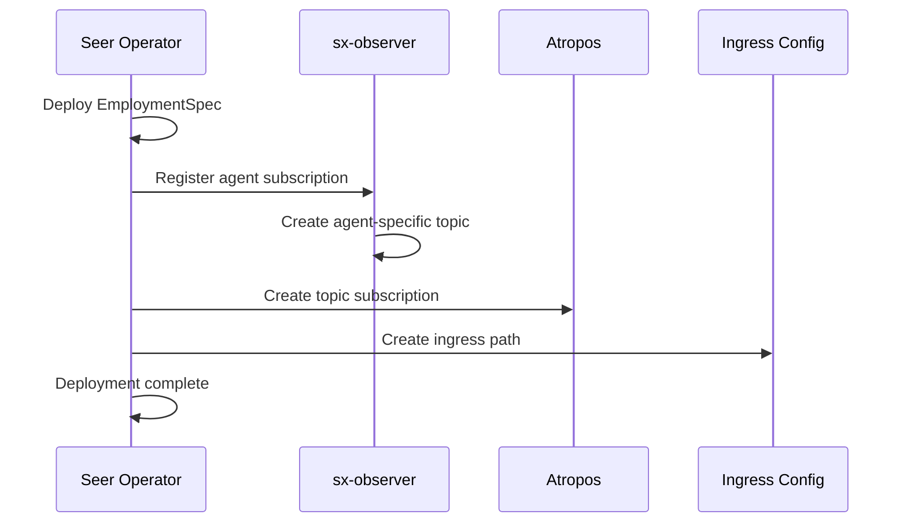
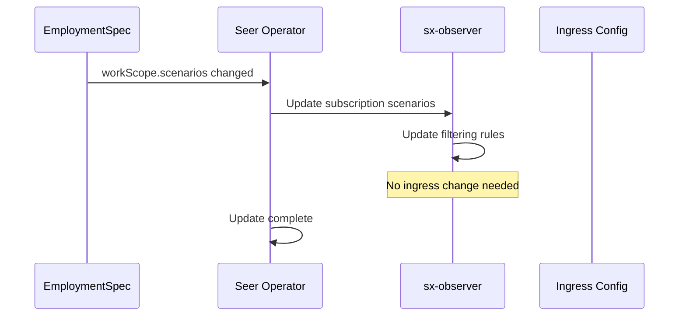
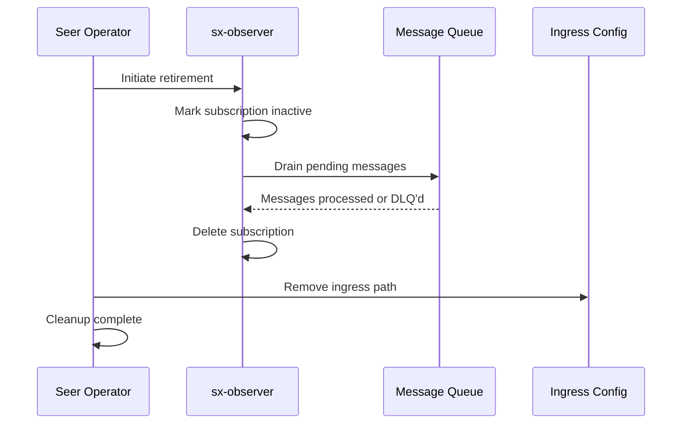

# Subscription Lifecycle

> **Status**: 🟢 Design Complete  
> **Last Updated**: 2026-01-12

---

## Overview

Agent Ingress Gateway subscriptions are created and managed as part of the agent deployment lifecycle. This document describes subscription management and provides C3-level detail on the subscription state machine.

---

## Subscription Creation

### Trigger: Agent Deployment

Subscriptions are created when an Employed Agent is deployed:



### Subscription Data

```yaml
# Agent Subscription Record (internal to sx-observer)
subscription:
  agent_id: "fraud-analyst-acme-retail"
  workbench: "acme-disputes"
  scenarios:
    - "fraud-investigation"
    - "dispute-resolution"
  atropos_topic: "sx.agent.fraud-analyst-acme-retail.dispatch"
  ingress_path: "/seer/subscription/acme-seer/data-plane/workbench/acme-disputes/agents/fraud-analyst-acme-retail/dispatch"
  state: active
  created_at: "2026-01-12T10:00:00Z"
```

---

## Subscription Updates

### Update Triggers

| Trigger | Action |
|---------|--------|
| **Agent deployed** | Create subscription |
| **Agent scenarios changed** | Update filtering rules |
| **Agent retired** | Remove subscription |
| **Workbench retired** | Remove all agent subscriptions |

### Update Flow



---

## Subscription Cleanup

### Cleanup on Agent Retirement



### Cleanup on Workbench Retirement

When a workbench is retired, all agent subscriptions are cleaned up:

1. sx-observer marks all workbench subscriptions as inactive
2. sx-observer unsubscribes from workbench-level topic
3. Pending messages are drained or moved to DLQ
4. All agent subscriptions are deleted
5. All ingress paths are removed

---

## Subscription State Machine (C3 Detail)

### States

| State | Description |
|-------|-------------|
| `pending` | Subscription created, not yet active |
| `active` | Subscription receiving and routing messages |
| `draining` | Subscription stopping, draining pending messages |
| `inactive` | Subscription stopped, awaiting cleanup |
| `deleted` | Subscription removed |

### State Diagram

```
┌─────────────────────────────────────────────────────────────────────────────┐
│                    SUBSCRIPTION STATE MACHINE                                │
│                                                                              │
│                          create                                              │
│                            │                                                 │
│                            ▼                                                 │
│                      ┌─────────┐                                            │
│                      │ pending │                                            │
│                      └────┬────┘                                            │
│                           │ ingress ready                                   │
│                           ▼                                                 │
│                      ┌─────────┐                                            │
│              ┌──────▶│ active  │◀──────┐                                    │
│              │       └────┬────┘       │                                    │
│              │            │            │                                    │
│           resume          │         resume                                  │
│              │            │            │                                    │
│              │      retire/suspend     │                                    │
│              │            │            │                                    │
│              │            ▼            │                                    │
│              │      ┌──────────┐       │                                    │
│              └──────│ draining │───────┘                                    │
│                     └────┬─────┘                                            │
│                          │ queue empty                                      │
│                          ▼                                                  │
│                     ┌──────────┐                                            │
│                     │ inactive │                                            │
│                     └────┬─────┘                                            │
│                          │ cleanup                                          │
│                          ▼                                                  │
│                     ┌──────────┐                                            │
│                     │ deleted  │                                            │
│                     └──────────┘                                            │
│                                                                              │
└─────────────────────────────────────────────────────────────────────────────┘
```

### State Transitions

```python
class SubscriptionState(Enum):
    PENDING = "pending"
    ACTIVE = "active"
    DRAINING = "draining"
    INACTIVE = "inactive"
    DELETED = "deleted"


class SubscriptionStateMachine:
    """Manages subscription state transitions."""
    
    VALID_TRANSITIONS = {
        SubscriptionState.PENDING: [SubscriptionState.ACTIVE],
        SubscriptionState.ACTIVE: [SubscriptionState.DRAINING],
        SubscriptionState.DRAINING: [SubscriptionState.INACTIVE, SubscriptionState.ACTIVE],
        SubscriptionState.INACTIVE: [SubscriptionState.DELETED, SubscriptionState.ACTIVE],
        SubscriptionState.DELETED: [],  # Terminal state
    }
    
    def __init__(self, subscription_id):
        self.subscription_id = subscription_id
        self.state = SubscriptionState.PENDING
        self.state_history = []
    
    def transition(self, new_state, reason):
        """Transition to a new state."""
        if new_state not in self.VALID_TRANSITIONS[self.state]:
            raise InvalidTransitionError(
                f"Cannot transition from {self.state} to {new_state}"
            )
        
        self.state_history.append({
            "from": self.state,
            "to": new_state,
            "reason": reason,
            "timestamp": datetime.now()
        })
        
        self.state = new_state
        self._execute_state_actions(new_state)
    
    def _execute_state_actions(self, state):
        """Execute actions for entering a state."""
        if state == SubscriptionState.ACTIVE:
            self._start_message_processing()
        elif state == SubscriptionState.DRAINING:
            self._stop_accepting_new_messages()
            self._start_drain_timer()
        elif state == SubscriptionState.INACTIVE:
            self._stop_message_processing()
        elif state == SubscriptionState.DELETED:
            self._cleanup_resources()
    
    def activate(self):
        """Activate the subscription after ingress is ready."""
        self.transition(SubscriptionState.ACTIVE, "ingress_ready")
    
    def retire(self):
        """Begin retirement process."""
        self.transition(SubscriptionState.DRAINING, "retirement_initiated")
    
    def drain_complete(self):
        """Called when message queue is drained."""
        self.transition(SubscriptionState.INACTIVE, "queue_empty")
    
    def resume(self):
        """Resume from draining or inactive state."""
        self.transition(SubscriptionState.ACTIVE, "resumed")
    
    def delete(self):
        """Delete the subscription."""
        self.transition(SubscriptionState.DELETED, "cleanup_complete")
```

### Transition Logic

| Current State | Event | New State | Actions |
|---------------|-------|-----------|---------|
| `pending` | Ingress ready | `active` | Start message processing |
| `active` | Retire/suspend | `draining` | Stop accepting, start drain |
| `draining` | Queue empty | `inactive` | Stop processing |
| `draining` | Resume | `active` | Resume message processing |
| `inactive` | Cleanup | `deleted` | Remove all resources |
| `inactive` | Resume | `active` | Resume message processing |

---

## Draining Process (C3 Detail)

### Drain Algorithm

```python
class MessageDrainer:
    """Drains pending messages during subscription retirement."""
    
    def __init__(self, subscription, config):
        self.subscription = subscription
        self.max_drain_time = config.max_drain_time_seconds
        self.retry_limit = config.drain_retry_limit
    
    async def drain(self):
        """Drain all pending messages."""
        start_time = time.now()
        
        while True:
            # Check timeout
            if (time.now() - start_time).seconds > self.max_drain_time:
                await self._move_remaining_to_dlq()
                break
            
            # Get next message
            message = await self._get_next_message()
            if message is None:
                break  # Queue is empty
            
            # Process message
            success = await self._process_with_retry(message)
            if not success:
                await self._move_to_dlq(message)
            
            await self._acknowledge(message)
        
        return DrainResult(
            processed=self.processed_count,
            dlq_count=self.dlq_count,
            duration=(time.now() - start_time).seconds
        )
    
    async def _process_with_retry(self, message):
        """Attempt to process message with retries."""
        for attempt in range(self.retry_limit):
            try:
                await self._dispatch_to_agent(message)
                return True
            except Exception as e:
                if attempt == self.retry_limit - 1:
                    return False
                await asyncio.sleep(2 ** attempt)  # Exponential backoff
        return False
```

### Drain Configuration

```yaml
draining:
  maxDrainTimeSeconds: 300   # 5 minutes max
  retryLimit: 3              # Retries per message
  dlqEnabled: true           # Move failed to DLQ
  gracefulShutdownSeconds: 30
```

---

## Related Documentation

- [Architecture](./architecture.md) — Overall architecture
- [Request Routing](./request-routing.md) — Routing algorithms
- [Signal Exchange Integration](./signal-exchange-integration.md) — sx-observer details

---

*Subscription Lifecycle provides reliable subscription management with graceful draining during retirement.*
