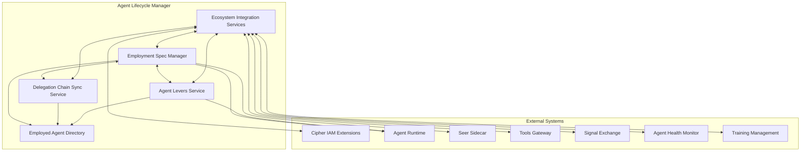

# Agent Lifecycle Manager

> **Status**: 🟢 Design Complete  
> **Last Updated**: 2026-01-12

## Overview

Agent Lifecycle Manager manages the complete lifecycle of Employed Agents, including employment specification management, delegation chain synchronization, agent levers (kill switches, authority controls), ecosystem integration, and the employed agent directory.

---

## Capabilities

### Employment Spec Manager
- Authority Enforcement Controls (layered ceilings, delegation models)
- Resource Quota Management (compute, tokens, API, storage)
- Fair Usage Budget (per subject, signal, time period, action type)
- Delegation Chain Configuration

### Delegation Chain Sync Service
- Authority change detection (IAM Observer integration)
- Synchronization when human authority changes
- Delegation chain validation

### Agent Levers Service
- Kill Switches (suspend, revoke, bulk operations)
- Authority Enforcement Actions (ceiling reduction, tool/scenario revocation)

### Agent Ecosystem Integration Services
- IAM Changes integration
- Subscription Policy Changes integration
- Workbench Policy Changes integration
- Agent Lifecycle Changes integration
- Agent Health Actions integration
- Platform SRE Directives integration
- Tools Gateway integration
- Signal Exchange integration
- Training Management integration

### Employed Agent Directory
- Agent Profiles (identity, work scope, authority, resources, system prompts)
- Accountability Discovery (manager, delegator, human responsibility span)
- Agent Change Log (spec changes, authority changes, enforcement actions)
- Agent Dependency Graph (agent-to-agent, scenario, tool, resource dependencies)

---

## Design Documents

| Document | Description | Status |
|----------|-------------|--------|
| [Employment Spec Manager](./employment-spec-manager.md) | Authority controls, quotas, budgets, delegation chain configuration | ✅ Complete |
| [Delegation Chain Sync Service](./delegation-chain-sync-service.md) | Authority change detection and synchronization | ✅ Complete |
| [Agent Levers Service](./agent-levers-service.md) | Kill switches, authority enforcement actions | ✅ Complete |
| [Employed Agent Directory](./employed-agent-directory.md) | Agent profiles, accountability, change log, dependency graph | ✅ Complete |
| [Agent Ecosystem Integration Services](./agent-ecosystem-integration-services.md) | All 9 integration points with ecosystem | ✅ Complete |
| [SCOPE.md](./SCOPE.md) | Scope document with coverage summary and intended depth | ✅ Complete |

---

## Architecture

---

## Key Design Decisions

### CRD-Based Control Plane
- All control plane changes use CRD updates (EmploymentSpec, TrainingSpec)
- Seer Operator watches CRDs and reconciles desired state
- Employment Spec Manager publishes CRDs; Seer Operator executes

### Event-Driven Data Plane
- Data plane operations use event-driven patterns
- Atropos event bus for message routing
- Observer patterns for external system monitoring (IAM Observer, SX Observer)

### Authority Inheritance Model
- Agent authority is always a subset of delegator's current authority
- IAM Observer Service detects delegator changes
- Delegation Chain Sync Service propagates authority narrowing

### Kill Switch Architecture
- Kill switches are operational controls, not CRD changes
- Immediate execution for emergency response
- Revoke action includes IAM revocation before runtime scale-to-zero

### Separation of Concerns
- Seer Operator only watches CRDs (not IAM directly)
- IAM Observer Service handles IAM event subscriptions
- Employment Spec Manager handles spec validation and publishing

---

## Related Subsystems

| Subsystem | Relationship |
|-----------|-------------|
| [Agent Runtime](../agent-runtime/README.md) | Deployment, respawning, kill switch execution |
| [Cipher IAM Extensions](../cipher-iam-extensions/README.md) | IAM profile provisioning, authority delegation |
| [Seer Sidecar](../seer-sidecar/README.md) | Runtime enforcement of authority and quotas |
| [Trained Agent Lifecycle Manager](../trained-agent-lifecycle-manager/README.md) | Training Spec management |
| [Raw Agent Lifecycle Manager](../raw-agent-lifecycle-manager/README.md) | Raw Agent management |

---

## Related Documentation

- [Implementation Concepts: Agent Lifecycle](../../implementation-concepts/agent-lifecycle.md) — Three-layer agent model
- [Implementation Concepts: Authority Enforcement](../../implementation-concepts/authority-enforcement.md) — Authority enforcement architecture
- [Implementation Concepts: Agent Levers](../../implementation-concepts/agent-levers.md) — Runtime control mechanisms
- [Implementation Concepts: Kill Switch & Emergency Controls](../../implementation-concepts/kill-switch-emergency-controls.md) — Emergency controls
- [Implementation Concepts: Delegation Chains](../../implementation-concepts/delegation-chains.md) — Authority delegation model
- [Implementation Concepts: Human Accountability](../../implementation-concepts/human-accountability.md) — RASCI accountability
- [Agent Lifecycle API](../agent-lifecycle-api.md) — REST API for agent lifecycle operations

---

*Agent Lifecycle Manager provides comprehensive lifecycle management for Employed Agents with layered authority controls, operational levers, and ecosystem integration.*
