# Agent Ecosystem Integration Services

> **Status**: 🟢 Design Complete  
> **Last Updated**: 2026-01-12

---

## Overview

Agent Ecosystem Integration Services is a suite of integration services that connect the Agent Lifecycle Manager to the broader Hub and Seer ecosystem. These services operate with **tenant-admin authority** and follow an **event-driven integration pattern** for data plane operations while using **CRD-based updates** for control plane changes.

---

## Architecture

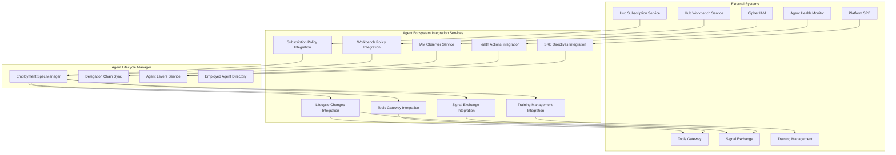

---

## Integration Architecture

### Functional Scope

Agent Ecosystem Integration Services provides bidirectional integration between the Agent Lifecycle Manager and external systems:

- **Inbound:** Receive events from external systems, propagate to Lifecycle Manager components
- **Outbound:** Receive events from Lifecycle Manager, propagate to external systems

### Integration Patterns

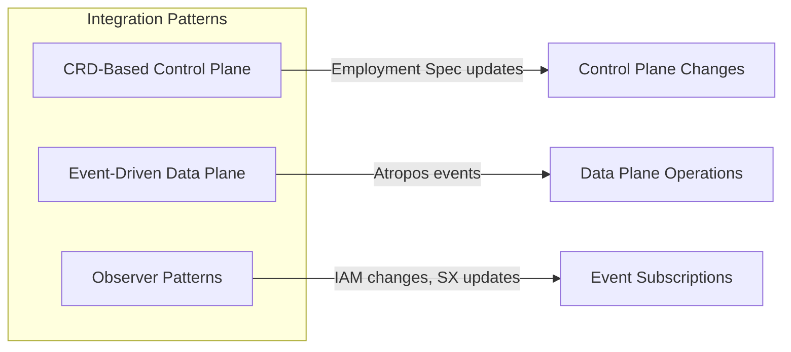

| Pattern | Use Case | Examples |
|---------|----------|----------|
| **CRD-Based** | Control plane changes | Employment Spec updates, Training Spec changes |
| **Event-Driven** | Data plane operations | Request routing, runtime notifications |
| **Observer** | External system monitoring | IAM changes, policy updates |

### Common Integration Flow

All integration services follow the same general pattern:

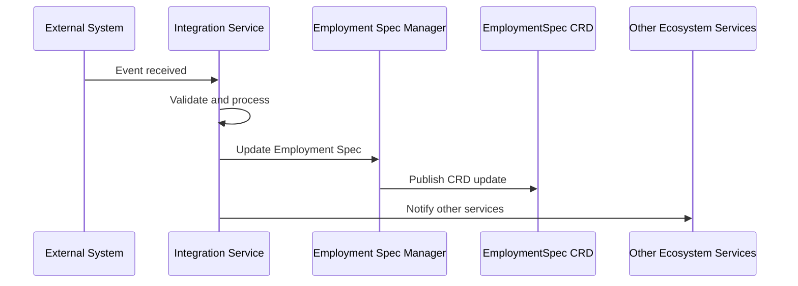

---

## IAM Changes Integration

### Functional Scope

The IAM Observer Service monitors Cipher IAM for changes that affect Employed Agents, particularly changes to delegator roles and groups.

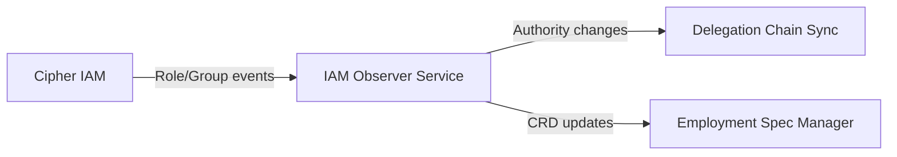

### IAM Observer Service

```yaml
iamObserverService:
  # What it monitors
  subscriptions:
    - eventType: "user.roles.changed"
      filter:
        hasDelegatedAgents: true
    - eventType: "user.groups.changed"
      filter:
        hasDelegatedAgents: true
    - eventType: "role.permissions.changed"
      filter:
        hasAgentMembers: true
        
  # What it does
  actions:
    - detect: "delegator authority changed"
      action: "notify Delegation Chain Sync Service"
    - detect: "role permissions changed"
      action: "update affected Employment Specs"
      
  # Authority level
  authority: "tenant-admin"
```

### Integration Points

| Target System | Hand-off | Direction |
|--------------|----------|-----------|
| **Cipher IAM** | IAM changes → IAM Observer Service | Inbound |
| **Delegation Chain Sync Service** | IAM Observer → Authority synchronization | Outbound |
| **Employment Spec Manager** | IAM changes → Employment Spec updates | Outbound |

---

## Subscription Policy Changes Integration

### Functional Scope

Receives subscription policy changes from Hub and updates agent work scope if scenarios are affected.

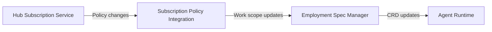

### Policy Change Handling

```yaml
subscriptionPolicyIntegration:
  # Events received
  subscriptions:
    - eventType: "subscription.scenarios.changed"
    - eventType: "subscription.limits.changed"
    - eventType: "subscription.suspended"
    
  # Processing logic
  handlers:
    scenariosChanged:
      - findAffectedAgents: "by workScope.scenarios"
      - updateEmploymentSpecs: "add/remove scenarios"
      - notifyRuntime: "work scope changed"
      
    limitChanged:
      - findAffectedAgents: "by subscription"
      - updateEmploymentSpecs: "adjust quotas"
      
    subscriptionSuspended:
      - findAffectedAgents: "all in subscription"
      - triggerSuspend: "suspend all agents"
```

### Integration Points

| Target System | Hand-off | Direction |
|--------------|----------|-----------|
| **Hub Subscription Service** | Policy changes → Agent Ecosystem Integration Services | Inbound |
| **Employment Spec Manager** | Policy changes → Work scope updates | Outbound |
| **Agent Runtime** | Work scope changes → Runtime updates | Outbound |

---

## Workbench Policy Changes Integration

### Functional Scope

Receives workbench policy changes (authority ceilings, tool access) and updates affected Employment Specs.

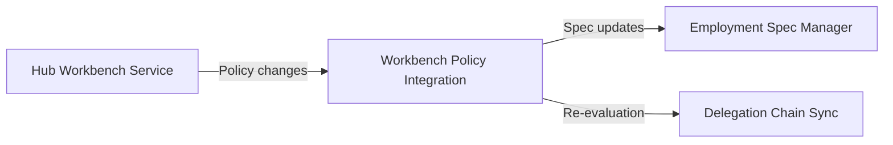

### Workbench Policy Handling

```yaml
workbenchPolicyIntegration:
  # Events received
  subscriptions:
    - eventType: "workbench.ceilings.changed"
    - eventType: "workbench.tools.changed"
    - eventType: "workbench.scenarios.changed"
    
  # Processing logic
  handlers:
    ceilingsChanged:
      - findAffectedAgents: "by workbench"
      - action: "narrow agent ceilings to new workbench ceiling"
      - triggerReEvaluation: "authority re-evaluation"
      
    toolsChanged:
      - findAffectedAgents: "by tool bindings"
      - updateEmploymentSpecs: "add/remove tool bindings"
      
    scenariosChanged:
      - findAffectedAgents: "by scenario participation"
      - updateEmploymentSpecs: "update work scope"
```

### Integration Points

| Target System | Hand-off | Direction |
|--------------|----------|-----------|
| **Hub Workbench Service** | Policy changes → Agent Ecosystem Integration Services | Inbound |
| **Employment Spec Manager** | Policy changes → Employment Spec updates | Outbound |
| **Delegation Chain Sync Service** | Policy changes → Authority re-evaluation | Outbound |

---

## Agent Lifecycle Changes Integration

### Functional Scope

Propagates agent lifecycle events to ecosystem services when agents are activated, suspended, revoked, or modified.

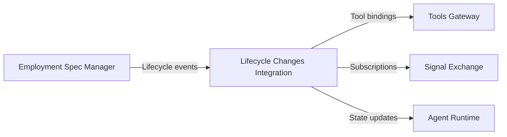

### Lifecycle Event Propagation

```yaml
lifecycleIntegration:
  # Events generated
  events:
    employmentActivated:
      - notifyToolsGateway: "register tool bindings"
      - notifySignalExchange: "register scenario subscriptions"
      - notifyDirectory: "update profile status"
      
    employmentSuspended:
      - notifyToolsGateway: "suspend tool access"
      - notifySignalExchange: "pause subscriptions"
      - notifyDirectory: "update profile status"
      
    employmentRevoked:
      - notifyToolsGateway: "revoke tool bindings"
      - notifySignalExchange: "unregister subscriptions"
      - notifyDirectory: "archive profile"
      
    authorityChanged:
      - notifyRuntime: "trigger respawning"
      - notifyCipherIAM: "update IAM profile"
      - notifyDirectory: "log change"
```

### Integration Points

| Target System | Hand-off | Direction |
|--------------|----------|-----------|
| **Employment Spec Manager** | Lifecycle changes → Agent Ecosystem Integration Services | Inbound |
| **Tools Gateway** | Activation events → Tool binding updates | Outbound |
| **Signal Exchange** | Activation events → Scenario subscription registration | Outbound |
| **Agent Runtime** | Lifecycle changes → Runtime state updates | Outbound |

---

## Agent Health Actions Integration

### Functional Scope

Receives health alerts from Agent Health Monitor and triggers appropriate actions, including kill switches for critical issues.

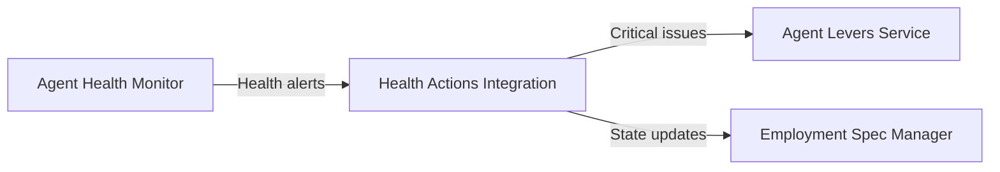

### Health Alert Handling

```yaml
healthActionsIntegration:
  # Events received
  subscriptions:
    - eventType: "agent.health.critical"
    - eventType: "agent.health.warning"
    - eventType: "agent.health.recovered"
    
  # Processing logic
  handlers:
    critical:
      - severity: "critical"
        action: "trigger kill switch (suspend)"
        notifyLevers: true
        
    warning:
      - severity: "warning"
        action: "log and alert supervisor"
        updateState: "unhealthy"
        
    recovered:
      - action: "update state to healthy"
      - notifyDirectory: "log recovery"
```

### Health Alert Criteria

```yaml
healthAlertCriteria:
  critical:
    - condition: "error_rate > 50%"
      duration: "5m"
    - condition: "response_time > 30s"
      duration: "2m"
    - condition: "security_violation_detected"
      duration: "immediate"
      
  warning:
    - condition: "error_rate > 20%"
      duration: "10m"
    - condition: "quota_usage > 90%"
      duration: "1h"
```

### Integration Points

| Target System | Hand-off | Direction |
|--------------|----------|-----------|
| **Agent Health Monitor** | Health alerts → Agent Ecosystem Integration Services | Inbound |
| **Agent Levers Service** | Critical health issues → Kill switch triggers | Outbound |
| **Employment Spec Manager** | Health status → Agent state updates | Outbound |

---

## Platform SRE Directives Integration

### Functional Scope

Receives platform-wide directives from Platform SRE for maintenance, incidents, or regulatory requirements.

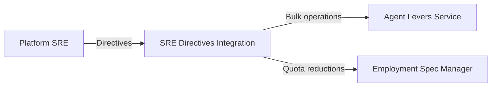

### SRE Directive Handling

```yaml
sreDirectivesIntegration:
  # Directive types
  directiveTypes:
    maintenance:
      - action: "graceful_shutdown"
        scope: "region" | "workbench" | "tenant"
        
    incident:
      - action: "emergency_suspend"
        scope: "platform" | "tenant"
        
    capacityReduction:
      - action: "reduce_quotas"
        reduction: "percentage"
        scope: "tenant" | "workbench"
        
    regulatoryHold:
      - action: "suspend_and_preserve"
        scope: "tenant"
        
  # Processing logic
  handlers:
    maintenance:
      - notifyAgents: "graceful shutdown in X minutes"
      - coordinateLevers: "suspend agents in batches"
      
    incident:
      - coordinateLevers: "immediate bulk suspend"
      - notifyDirectory: "log incident action"
      
    capacityReduction:
      - updateEmploymentSpecs: "reduce quotas by percentage"
      - notifyRuntime: "scale down replicas"
```

### Integration Points

| Target System | Hand-off | Direction |
|--------------|----------|-----------|
| **Platform SRE** | Directives → Agent Ecosystem Integration Services | Inbound |
| **Agent Levers Service** | SRE directives → Bulk kill switch operations | Outbound |
| **Employment Spec Manager** | SRE directives → Quota reductions | Outbound |

---

## Tools Gateway Integration

### Functional Scope

Manages tool bindings and access for Employed Agents in coordination with Tools Gateway.

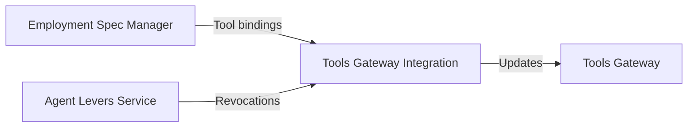

### Tool Binding Management

```yaml
toolsGatewayIntegration:
  # Events handled
  events:
    toolBindingsUpdated:
      - source: "Employment Spec Manager"
      - action: "register/update tool bindings in Tools Gateway"
      
    authorityChanged:
      - source: "Delegation Chain Sync"
      - action: "update tool access permissions"
      
    killSwitchTriggered:
      - source: "Agent Levers Service"
      - action: "revoke all tool bindings immediately"
      
  # Tool binding registration
  registration:
    - notifyToolsGateway:
        agentId: "es-fraud-analyst-acme-retail"
        tools:
          - protocol: "temenos-t24/get-transactions"
            credentials:
              secretRef: "acme-core-banking-creds"
        authority:
          ceilings: "from Employment Spec"
```

### Integration Points

| Target System | Hand-off | Direction |
|--------------|----------|-----------|
| **Employment Spec Manager** | Tool bindings → Tools Gateway notification | Outbound |
| **Agent Levers Service** | Kill switches → Tool revocation | Outbound |
| **Tools Gateway** | Tool access updates → Runtime tool access enforcement | Outbound |

---

## Signal Exchange Integration

### Functional Scope

Manages scenario subscriptions for Employed Agents in coordination with Signal Exchange.

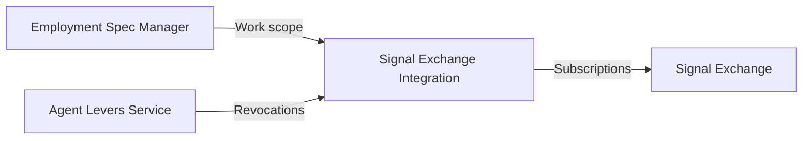

### Scenario Subscription Management

```yaml
signalExchangeIntegration:
  # Events handled
  events:
    employmentActivated:
      - action: "register scenario subscriptions"
      
    workScopeChanged:
      - action: "update scenario subscriptions"
      - added: "register new scenarios"
      - removed: "unregister removed scenarios"
      
    employmentRevoked:
      - action: "unregister all subscriptions"
      
  # Subscription registration
  registration:
    - notifySignalExchange:
        agentId: "es-fraud-analyst-acme-retail"
        workbench: "acme-disputes"
        scenarios:
          - "dispute-resolution"
          - "customer-inquiry"
        sxObserver: "sx-observer-acme-disputes"
```

### Integration Points

| Target System | Hand-off | Direction |
|--------------|----------|-----------|
| **Employment Spec Manager** | Work scope → Scenario subscription registration | Outbound |
| **Agent Levers Service** | Agent revocation → Subscription unregistration | Outbound |
| **Signal Exchange** | Subscription updates → Request routing updates | Outbound |

---

## Training Management Integration

### Functional Scope

Receives Training Spec changes and updates Employment Specs that reference the changed Training Spec.

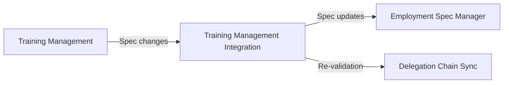

### Training Spec Change Handling

```yaml
trainingManagementIntegration:
  # Events received
  subscriptions:
    - eventType: "training.spec.published"
    - eventType: "training.spec.archived"
    - eventType: "training.spec.deprecated"
    
  # Processing logic
  handlers:
    published:
      - findAffectedEmployments: "by trainingSpecRef with version constraint"
      - action: "update to new version if compatible"
      - triggerReValidation: "if authority ceilings changed"
      
    archived:
      - findAffectedEmployments: "by trainingSpecRef"
      - action: "notify supervisor, no new deployments"
      
    deprecated:
      - findAffectedEmployments: "by trainingSpecRef"
      - action: "warn supervisor, recommend upgrade"
```

### Integration Points

| Target System | Hand-off | Direction |
|--------------|----------|-----------|
| **Training Management** | Training Spec changes → Agent Ecosystem Integration Services | Inbound |
| **Employment Spec Manager** | Training Spec changes → Employment Spec reference updates | Outbound |
| **Delegation Chain Sync Service** | Authority-affecting changes → Re-validation triggers | Outbound |

---

## Error Handling

### Common Error Handling Patterns

```yaml
errorHandling:
  # Retry policy for transient failures
  retryPolicy:
    maxRetries: 3
    backoff: "exponential"
    initialDelay: "1s"
    maxDelay: "30s"
    
  # Dead letter queue for failed events
  deadLetterQueue:
    enabled: true
    retention: "7d"
    alertOnDLQ: true
    
  # Fallback behavior
  fallback:
    communicationFailure:
      action: "log_and_retry"
      alertSeverity: "warning"
    persistentFailure:
      action: "escalate_to_supervisor"
      alertSeverity: "high"
```

---

## Related Documentation

- [Agent Lifecycle Manager README](./README.md) — Subsystem overview
- [Employment Spec Manager](./employment-spec-manager.md) — Employment Spec configuration
- [Delegation Chain Sync Service](./delegation-chain-sync-service.md) — Authority synchronization
- [Agent Levers Service](./agent-levers-service.md) — Kill switches and enforcement
- [Agent Runtime](../agent-runtime/README.md) — sx-observer service and agent deployment
- [Hub Signal Exchange](../../../../olympus-hub-docs/04-subsystems/signal-exchange/README.md) — Signal Exchange
- [Hub Tools Gateway](../../../../olympus-hub-docs/04-subsystems/signal-providers/tools-gateway.md) — Tools Gateway

---

*Agent Ecosystem Integration Services provides the integration fabric connecting Agent Lifecycle Manager to the Hub and Seer ecosystem through event-driven and CRD-based patterns.*
