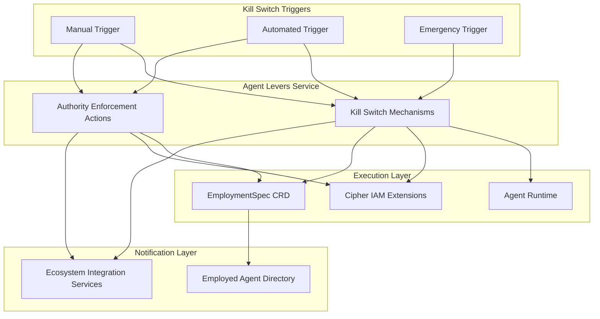
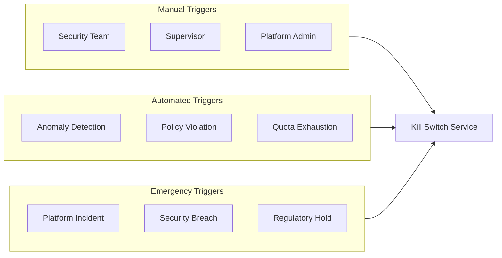
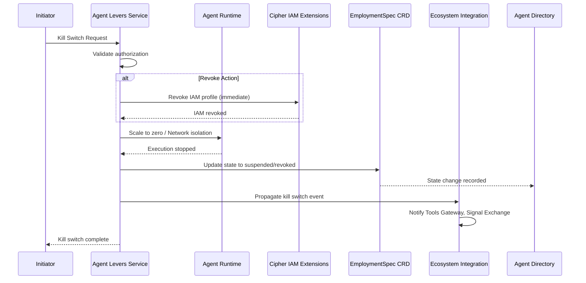
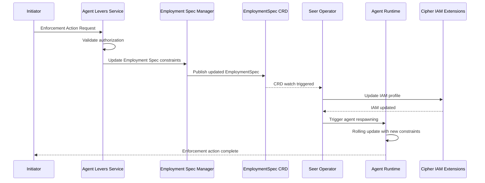

# Agent Levers Service

> **Status**: 🟢 Design Complete  
> **Last Updated**: 2026-01-12

---

## Overview

The Agent Levers Service provides operational control mechanisms for Employed Agents, including kill switches and authority enforcement actions. These "levers" enable supervisors, security teams, and automated systems to control agent behavior in real-time.

Unlike CRD-based control plane changes, kill switches are designed for **immediate operational response** and may bypass normal CRD reconciliation for emergency situations.

---

## Architecture



---

## Kill Switch Mechanisms

### Functional Scope

Kill switches provide immediate control over Employed Agents, enabling suspension or revocation of agent execution. Kill switches are the primary safety mechanism for responding to security incidents, anomalous behavior, or policy violations.

#### Kill Switch Actions

| Action | Authority Impact | Execution Impact | Reversibility |
|--------|-----------------|------------------|---------------|
| **Suspend** | Authority retained | Execution stopped | Reversible (Resume) |
| **Revoke** | Authority permanently removed | Execution stopped | Irreversible (new Employment required) |
| **Bulk Suspend** | Multiple agents suspended | Multiple agents stopped | Reversible |
| **Bulk Revoke** | Multiple agents revoked | Multiple agents stopped | Irreversible |

#### Suspend Action

Suspends an Employed Agent while retaining its authority. The agent can be resumed without re-approval.

```yaml
# Suspend Action Request
apiVersion: seer.olympus.io/v1
kind: AgentLeverAction
metadata:
  name: suspend-fraud-analyst-001
spec:
  action: suspend
  target:
    type: employment
    ref: "es-fraud-analyst-acme-001"
  reason: "Investigating anomalous behavior"
  initiator: "user:security-team@acme.com"
  duration: 3600  # Optional: auto-resume after 1 hour
  execution:
    method: "scale-to-zero"  # or "network-isolation"
```

**Execution Methods:**
- **Scale-to-zero:** Scale agent pods to 0 replicas
- **Network isolation:** Apply network policy to block traffic (faster, but pods remain)

#### Revoke Action

Permanently revokes an Employed Agent's authority. A new Employment must be created to restore the agent.

```yaml
# Revoke Action Request
apiVersion: seer.olympus.io/v1
kind: AgentLeverAction
metadata:
  name: revoke-fraud-analyst-001
spec:
  action: revoke
  target:
    type: employment
    ref: "es-fraud-analyst-acme-001"
  reason: "Security incident response"
  initiator: "user:security-team@acme.com"
  execution:
    iamRevocation: true  # Immediately revoke IAM profile
    scaleToZero: true    # Scale pods to 0
    cleanupResources: true  # Clean up associated resources
```

**Revoke includes:**
- IAM profile revocation (immediate)
- Runtime scale-to-zero
- Scenario subscription unregistration
- Tool binding revocation

#### Bulk Operations

Bulk operations enable suspend/revoke of multiple agents by filter criteria.

```yaml
# Bulk Suspend by Training Spec
apiVersion: seer.olympus.io/v1
kind: AgentLeverAction
metadata:
  name: bulk-suspend-fraud-analysts
spec:
  action: bulk-suspend
  filter:
    trainingSpec: "fraud-analyst-v2"
    tenant: "acme"
  reason: "Critical vulnerability in training spec"
  initiator: "user:security-team@acme.com"
  execution:
    method: "scale-to-zero"
    parallelism: 10  # Max concurrent suspensions
```

**Filter Criteria:**
- By training spec (all agents using a specific training spec)
- By tenant (all agents in a tenant)
- By workbench (all agents in a workbench)
- By scenario (all agents subscribed to a scenario)

### Kill Switch Triggers



| Trigger Type | Source | Typical Action |
|-------------|--------|----------------|
| **Manual** | Security team, supervisor, admin | Suspend or Revoke |
| **Automated** | Anomaly detection, policy violations | Suspend (pending review) |
| **Emergency** | Platform incidents, security breaches | Bulk Suspend/Revoke |

### Kill Switch Execution Flow



**Execution Order (for Revoke):**
1. **IAM revocation first** — Immediately revoke authority
2. **Runtime scale-to-zero** — Stop execution
3. **CRD state update** — Record state change
4. **Ecosystem notification** — Propagate to all services

### Integration Points

| Target System | Hand-off | Direction |
|--------------|----------|-----------|
| **Agent Runtime** | Kill switch command → Scale-to-zero or network isolation | Outbound |
| **Cipher IAM Extensions** | Revoke action → IAM profile revocation | Outbound |
| **Employment Spec Manager** | Kill switch → Employment Spec state update | Outbound |
| **Agent Ecosystem Integration Services** | Kill switch events → Ecosystem notification | Outbound |

---

## Authority Enforcement Actions

### Functional Scope

Authority Enforcement Actions modify an Employed Agent's authority without fully suspending or revoking the agent. These actions enable fine-grained control over agent capabilities.

#### Enforcement Action Types

| Action Type | Description | Example |
|------------|-------------|---------|
| **Ceiling Reduction** | Narrow authority ceilings | `maxSingleTransaction: 5000 → 1000` |
| **Tool Revocation** | Disable specific tools | Revoke access to `core-banking` tool |
| **Scenario Revocation** | Remove from scenarios | Remove from `high-value-disputes` scenario |
| **Approval Escalation** | Require approval for actions | Require approval for all refunds |

#### Ceiling Reduction

```yaml
apiVersion: seer.olympus.io/v1
kind: AgentLeverAction
metadata:
  name: reduce-ceiling-fraud-analyst-001
spec:
  action: reduce-ceiling
  target:
    type: employment
    ref: "es-fraud-analyst-acme-001"
  changes:
    authority:
      ceilings:
        maxSingleTransaction: 1000  # Was: 5000
        maxDailyTotal: 10000        # Was: 50000
  reason: "Reduce authority pending investigation"
  initiator: "user:supervisor@acme.com"
```

#### Tool Access Revocation

```yaml
apiVersion: seer.olympus.io/v1
kind: AgentLeverAction
metadata:
  name: revoke-tool-access-001
spec:
  action: revoke-tool-access
  target:
    type: employment
    ref: "es-fraud-analyst-acme-001"
  changes:
    tools:
      revoked:
        - "core-banking"
        - "payment-processor"
  reason: "Tool access violation detected"
  initiator: "user:security-team@acme.com"
```

#### Scenario Access Revocation

```yaml
apiVersion: seer.olympus.io/v1
kind: AgentLeverAction
metadata:
  name: revoke-scenario-access-001
spec:
  action: revoke-scenario-access
  target:
    type: employment
    ref: "es-fraud-analyst-acme-001"
  changes:
    scenarios:
      revoked:
        - "high-value-disputes"
        - "vip-customer-handling"
  reason: "Agent behavior not suitable for high-value cases"
  initiator: "user:supervisor@acme.com"
```

#### Approval Requirement Escalation

```yaml
apiVersion: seer.olympus.io/v1
kind: AgentLeverAction
metadata:
  name: escalate-approval-001
spec:
  action: escalate-approval
  target:
    type: employment
    ref: "es-fraud-analyst-acme-001"
  changes:
    approval:
      requirements:
        - action: "refund"
          threshold: 0  # Require approval for all refunds
        - action: "account-freeze"
          threshold: 0
  reason: "Increase oversight pending review"
  initiator: "user:supervisor@acme.com"
```

### Enforcement Action Execution Flow



**Enforcement actions trigger agent respawning** to apply new constraints. This ensures agents always operate with current authority.

### Integration Points

| Target System | Hand-off | Direction |
|--------------|----------|-----------|
| **Employment Spec Manager** | Enforcement actions → Employment Spec constraint updates | Outbound |
| **Agent Runtime** | Constraint updates → Agent respawning trigger | Outbound |
| **Cipher IAM Extensions** | Authority changes → IAM profile updates | Outbound |
| **Seer Sidecar** | Authority constraints → Runtime enforcement point updates | Outbound |

---

## Resume Operation

After suspension, agents can be resumed:

```yaml
apiVersion: seer.olympus.io/v1
kind: AgentLeverAction
metadata:
  name: resume-fraud-analyst-001
spec:
  action: resume
  target:
    type: employment
    ref: "es-fraud-analyst-acme-001"
  reason: "Investigation complete, no issues found"
  initiator: "user:security-team@acme.com"
```

**Resume Flow:**
1. Validate authorization to resume
2. Update EmploymentSpec state to Active
3. Scale agent pods back to configured replicas
4. Notify ecosystem services of resume

---

## Audit Trail

All lever actions are recorded in the Agent Change Log:

```yaml
changeLogEntry:
  timestamp: "2026-01-12T15:30:00Z"
  actor: "user:security-team@acme.com"
  action: "suspend"
  target: "es-fraud-analyst-acme-001"
  reason: "Investigating anomalous behavior"
  beforeState:
    state: "active"
    replicas: 2
  afterState:
    state: "suspended"
    replicas: 0
  executionDetails:
    method: "scale-to-zero"
    duration: "150ms"
    iamRevoked: false
```

---

## Related Documentation

- [Agent Lifecycle Manager README](./README.md) — Subsystem overview
- [Employment Spec Manager](./employment-spec-manager.md) — Employment Spec configuration
- [Agent Runtime: Kill Switch](../agent-runtime/runtime-deployment.md) — Kill switch execution
- [Employed Agent Directory](./employed-agent-directory.md) — Change log
- [Agent Ecosystem Integration Services](./agent-ecosystem-integration-services.md) — Event propagation

---

*Agent Levers Service provides operational control mechanisms for Employed Agents, enabling immediate response to security incidents, policy violations, and operational needs.*
