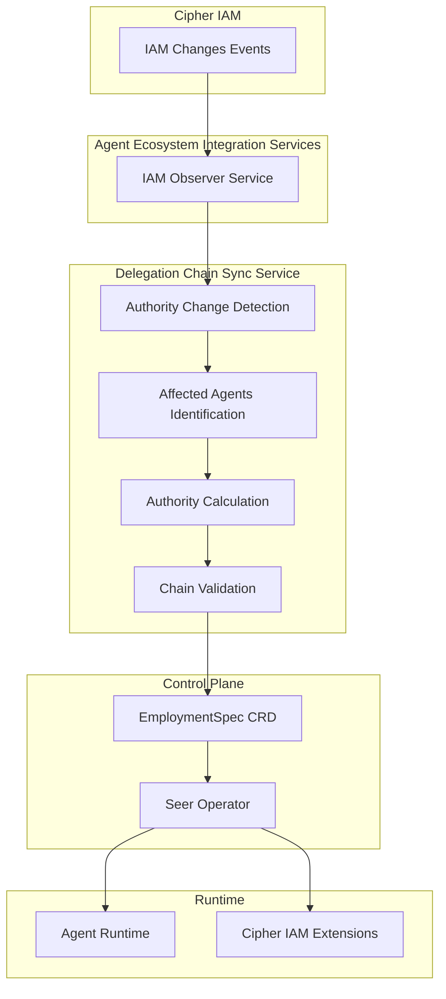
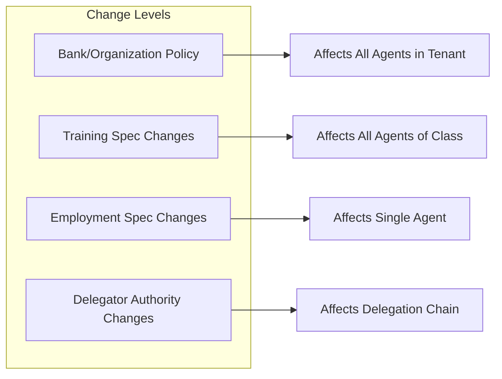
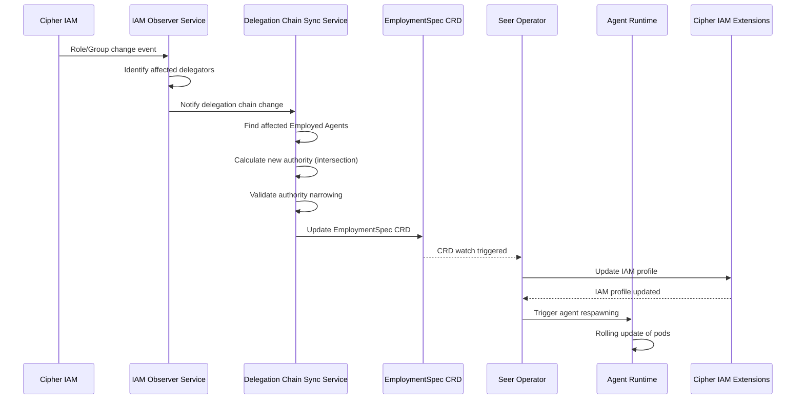
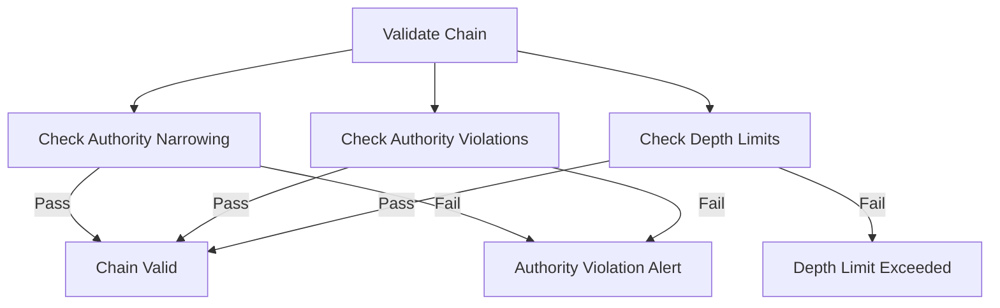
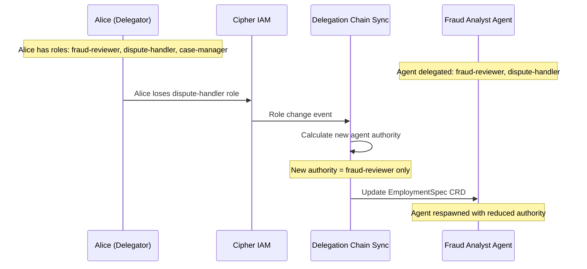

# Delegation Chain Sync Service

> **Status**: 🟢 Design Complete  
> **Last Updated**: 2026-01-12

---

## Overview

The Delegation Chain Sync Service ensures that Employed Agent authority remains synchronized with delegator authority. When a human delegator's authority changes (roles added/removed, group membership changes), the service detects these changes and propagates them to all affected Employed Agents.

This service works in conjunction with the IAM Observer Service (part of Agent Ecosystem Integration Services) to maintain the **Authority Inheritance Rule**:

> The delegated authority at any time is always a subset of what the delegator is currently authorized to do.

---

## Architecture



---

## Authority Change Detection

### Functional Scope

Authority Change Detection identifies when delegator authority changes and determines which Employed Agents are affected. The detection is event-driven, using IAM event subscriptions.

#### Change Detection Architecture

**Separation of Concerns:**

| Component | Responsibility |
|-----------|----------------|
| **Seer Operator** | Only watches for changes to CRDs (EmploymentSpec, TrainingSpec) |
| **IAM Observer Service** | Listens to IAM changes, tracks delegator role/group changes |
| **Delegation Chain Sync Service** | Calculates authority impacts, updates Employment Specs |

**Key Principle:** The Seer Operator does NOT listen to IAM directly. All IAM changes are detected by the IAM Observer Service and propagated via CRD updates.

#### Authority Change Sources



| Change Level | Description | Scope |
|-------------|-------------|-------|
| **Bank/Organization Policy** | Tenant-wide policy changes | All agents in tenant |
| **Training Spec Changes** | Agent class authority changes | All employed agents using that training spec |
| **Employment Spec Changes** | Agent instance authority changes | Single employed agent |
| **Delegator Authority Changes** | Human delegator loses roles/groups | All agents in delegation chain |

#### Change Detection Mechanisms

```yaml
# IAM Observer Service Configuration
iamObserver:
  subscriptions:
    - eventType: "user.roles.changed"
      filter:
        # Only watch users who are delegators
        hasDelegatedAgents: true
    - eventType: "user.groups.changed"
      filter:
        hasDelegatedAgents: true
    - eventType: "role.permissions.changed"
      filter:
        # Watch roles that agents hold
        hasAgentMembers: true
    - eventType: "group.members.changed"
      filter:
        hasAgentMembers: true
  reconciliation:
    # Periodic reconciliation as safety net
    enabled: true
    interval: "1h"
```

**Detection Mechanisms:**
- **IAM event subscriptions:** Real-time events for role/group changes
- **Policy update notifications:** Events when OPA policies change
- **Periodic reconciliation:** Safety net for missed events (configurable interval)

### Integration Points

| Target System | Hand-off | Direction |
|--------------|----------|-----------|
| **Agent Ecosystem Integration Services (IAM Observer)** | IAM changes → Authority change detection | Inbound |
| **Employment Spec Manager** | Detected changes → Employment Spec updates | Outbound |

---

## Authority Synchronization Flow

### Functional Scope

Authority Synchronization ensures that when delegator authority changes, all affected Employed Agents are updated with their new (narrowed) authority and respawned with updated IAM profiles.

#### Synchronization Process



**Step-by-Step Flow:**

1. **IAM Change Occurs** — Delegator roles/groups changed in Cipher IAM
2. **IAM Observer Detects** — IAM Observer Service receives change event
3. **Identify Affected Agents** — Find all Employed Agents in delegator's delegation chains
4. **Calculate New Authority** — Compute intersection of delegator's new authority with agent's delegated authority
5. **Validate Narrowing** — Ensure agent authority is still subset of delegator authority
6. **Update EmploymentSpec CRD** — Publish updated authority ceilings to CRD
7. **Seer Operator Detects** — Operator watches CRD and detects change
8. **Update IAM Profile** — Operator calls Cipher IAM Extensions to update profile
9. **Trigger Respawning** — Agent Runtime performs rolling update of agent pods

#### Authority Inheritance Updates

```yaml
# Before: Delegator has roles A, B, C, D
# Agent delegated roles: A, B
# 
# After: Delegator loses role B
# Agent new authority: A only (intersection)

spec:
  delegation:
    type: user
    delegator: "user:john.smith@acme.com"
    roles: "fraud-reviewer"  # Was: "fraud-reviewer,dispute-handler"
    # dispute-handler removed because delegator lost it
    syncStatus:
      lastSync: "2026-01-12T15:30:00Z"
      reason: "Delegator authority changed"
      removedRoles: ["dispute-handler"]
```

**Authority Calculation Rules:**
- **New agent authority = Intersection(delegator current authority, agent delegated authority)**
- **Authority can only narrow, never expand**
- **Removed permissions are logged for audit**

#### Delegation Chain Validation

After authority updates, the service validates chain integrity:



**Validation Checks:**
- **Authority narrowing:** Verify agent authority ⊆ delegator authority
- **Authority violations:** Check if agent has permissions delegator lacks
- **Depth limits:** Validate chain depth within configured limits

**On Violation:**
- Agent authority is forcibly narrowed to valid subset
- Alert generated for supervisor review
- Agent marked as out-of-sync until acknowledged

### Integration Points

| Target System | Hand-off | Direction |
|--------------|----------|-----------|
| **Agent Ecosystem Integration Services (IAM Observer)** | IAM changes → EmploymentSpec CRD updates | Inbound |
| **Agent Runtime** | EmploymentSpec changes → Agent respawning trigger | Outbound |
| **Cipher IAM Extensions** | Authority updates → IAM profile updates | Outbound |
| **Employment Spec Manager** | Authority changes → Employment Spec configuration updates | Outbound |

---

## Synchronization Scenarios

### Scenario 1: Delegator Loses Role



### Scenario 2: Delegator Gains Role (No Change to Agent)

```yaml
# Delegator gains a new role - agent authority unchanged
# Agent authority is intersection, so gaining roles doesn't expand agent authority

# Before:
# Delegator roles: fraud-reviewer, dispute-handler
# Agent delegated: fraud-reviewer

# After:
# Delegator roles: fraud-reviewer, dispute-handler, case-manager (new)
# Agent authority: fraud-reviewer (unchanged - no CRD update needed)
```

### Scenario 3: Delegator Removed from Group

```yaml
# Delegator removed from "fraud-analysts" group
# All agents in delegation chain that inherited from this group lose membership

syncEvent:
  type: "group.membership.removed"
  delegator: "user:john.smith@acme.com"
  group: "fraud-analysts"
  affectedAgents:
    - "es-fraud-analyst-acme-001"
    - "es-fraud-analyst-acme-002"
  action: "Remove group membership from affected agents"
```

---

## Error Handling

### IAM Communication Failures

```yaml
errorHandling:
  iamCommunicationFailure:
    retryPolicy:
      maxRetries: 3
      backoff: "exponential"
      initialDelay: "1s"
      maxDelay: "30s"
    fallback:
      action: "log_and_alert"
      alertSeverity: "high"
      # Agent continues with current authority until sync succeeds
```

### Chain Validation Failures

When chain validation fails, the service:

1. **Forcibly narrows** agent authority to valid subset
2. **Generates alert** for supervisor review
3. **Marks agent** as out-of-sync in directory
4. **Logs violation** in agent change log

---

## Related Documentation

- [Agent Lifecycle Manager README](./README.md) — Subsystem overview
- [Employment Spec Manager](./employment-spec-manager.md) — Employment Spec configuration
- [Agent Ecosystem Integration Services](./agent-ecosystem-integration-services.md) — IAM Observer Service
- [Agent Runtime](../agent-runtime/README.md) — Agent respawning and deployment
- [Implementation Concepts: Authority Enforcement](../../implementation-concepts/authority-enforcement.md) — Authority concepts

---

*Delegation Chain Sync Service ensures Employed Agent authority remains synchronized with delegator authority, maintaining the fundamental principle that agent authority is always a subset of delegator authority.*
