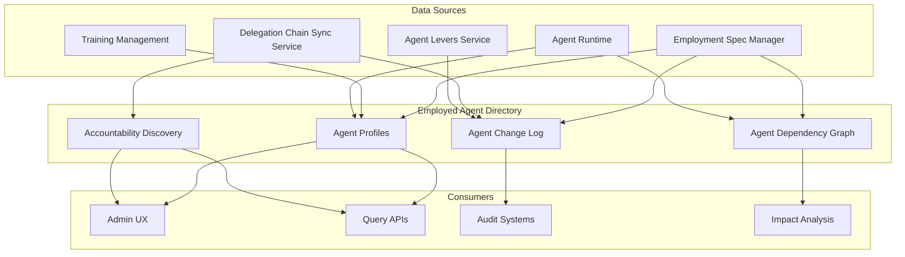
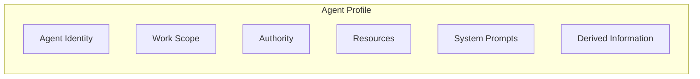
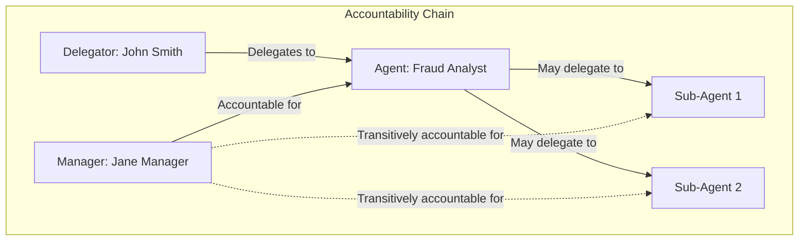
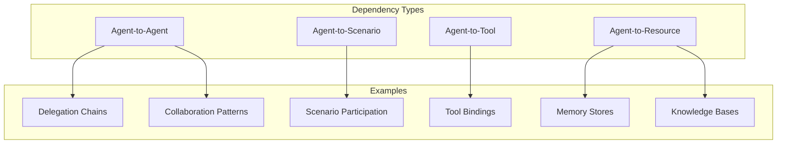

# Employed Agent Directory

> **Status**: 🟢 Design Complete  
> **Last Updated**: 2026-01-12

---

## Overview

The Employed Agent Directory provides a comprehensive registry of all Employed Agents, including their profiles, capabilities, accountability relationships, change history, and dependency graphs. It serves as the central source of truth for querying agent information and discovering accountability chains.

---

## Architecture



---

## Agent Profiles

### Functional Scope

Agent Profiles provide a complete view of an Employed Agent, aggregating information from Employment Specs, Training Specs, and runtime state.

#### Profile Structure



#### Complete Profile Example

```yaml
agentProfile:
  # Core Identity
  identity:
    employmentSpecId: "es-fraud-analyst-acme-retail"
    name: "fraud-analyst-acme-retail"
    namespace: "acme-disputes"
    versions:
      raw: "2.4.1"
      trained: "1.7.0"
      employed: "3.2.0"
    state: "active"
    
    # Raw Agent Identity
    rawAgent:
      name: "fraud-analyst-base"
      version: "2.4.1"
      containerImage: "registry.olympus.io/seer/agents/fraud-analyst:fraud-analyst-base-2.4.1"
      capabilitiesSummary:
        toolCalling:
          supportedProtocols: ["temenos-t24/get-transactions", "case-management/update-case"]
        archetypeRoles: ["thinker", "doer"]
        orchestration:
          multiAgentCoordination: true
    
    # Trained Agent Identity
    trainedAgent:
      trainingSpecName: "fraud-analyst-v2"
      trainingSpecVersion: "1.7.0"
      trainingSpecRef:
        name: "fraud-analyst-v2"
        namespace: "acme-disputes"
        version: "1.7.0"
    
  # Work Scope
  workScope:
    workbench: "acme-disputes"
    scenarios:
      - "dispute-resolution"
      - "customer-inquiry"
    temporalScope: "continuous"
    functionalScope: "tier-1-disputes"
    
  # Authority
  authority:
    delegation:
      type: "user"
      delegator: "user:john.smith@acme.com"
      accountable: "user:jane.manager@acme.com"
    ceilings:
      maxSingleTransaction: 5000
      maxDailyTotal: 50000
      maxPerCustomer: 10000
    opaPolicies:
      - pep: "tool-gateway"
        policyRef: "policies/tool-gateway-restrictions.rego"
        
  # Resources
  resources:
    quotas:
      compute:
        cpu: "2"
        memory: "4Gi"
        replicas: 2
      tokens:
        daily: 1000000
        perRequest: 50000
    budgets:
      perCustomer:
        tokensPerDay: 10000
      perScenario:
        disputeResolution: 50000
        
  # System Prompts and Configuration (from Training Spec)
  systemPrompts:
    goals:
      - "Resolve disputes fairly and efficiently"
      - "Protect bank from fraud while maintaining customer trust"
    skills:
      - "Fraud pattern recognition"
      - "Customer communication"
      - "Evidence evaluation"
    behaviors:
      - "Always explain reasoning"
      - "Escalate when uncertain"
    guardrails:
      - ref: "pii-protection-v1"
      - ref: "decision-explanation-required"
    contextCompilerDsl: "dispute-resolution-context.dsl"
    tools:
      - protocol: "temenos-t24/get-transactions"
        alias: "get_transactions"
      - protocol: "case-management/get-case"
        alias: "get_case"
        
  # Derived Information
  derived:
    skills:
      - "fraud-detection"
      - "dispute-resolution"
      - "customer-service"
    capabilities:
      - "transaction-analysis"
      - "evidence-review"
      - "refund-processing"
    labels:
      department: "disputes"
      riskLevel: "medium"
      customerTier: "all"
    tags:
      - "fraud"
      - "disputes"
      - "tier-1"
      
  # Runtime Status
  runtime:
    deploymentName: "fraud-analyst-acme-retail-deployment"
    availableReplicas: 2
    readyReplicas: 2
    lastActivityAt: "2026-01-12T15:30:00Z"
```

#### Profile Components

| Component | Source | Description |
|-----------|--------|-------------|
| **Identity** | Employment Spec | Agent identity, versions, state |
| **Work Scope** | Employment Spec | Workbench, scenarios, scope |
| **Authority** | Employment Spec | Delegation, ceilings, policies |
| **Resources** | Employment Spec | Quotas, budgets, capacity |
| **System Prompts** | Training Spec | Goals, skills, behaviors, guardrails |
| **Derived** | Inference | Skills, capabilities, labels, tags |
| **Runtime** | Agent Runtime | Deployment status, availability |

### Integration Points

| Target System | Hand-off | Direction |
|--------------|----------|-----------|
| **Employment Spec Manager** | Employment Spec → Profile core information | Inbound |
| **Training Management** | Training Spec → System prompts and derived capabilities | Inbound |
| **Agent Runtime** | Runtime state → Profile status | Inbound |

---

## Accountability Discovery

### Functional Scope

Accountability Discovery enables finding all humans accountable for an Employed Agent's actions and understanding the delegation chain relationships.

#### Accountability Relationships



#### Accountability Graph Structure

```yaml
accountabilityGraph:
  agent: "es-fraud-analyst-acme-retail"
  
  # Upward Chain (Agent → Humans)
  upwardChain:
    - level: 1
      type: "manager"
      principal: "user:jane.manager@acme.com"
      role: "Accountable"
    - level: 2
      type: "delegator"
      principal: "user:john.smith@acme.com"
      role: "Authority Source"
    - level: 3
      type: "organizational"
      principal: "role:disputes-team-lead"
      role: "Organizational Oversight"
      
  # Downward Chain (Agent → Sub-agents)
  downwardChain:
    - agent: "es-fraud-analyst-helper-001"
      delegatedBy: "es-fraud-analyst-acme-retail"
      authorityScope: "evidence-retrieval-only"
      
  # Cross-Agent Relationships
  crossAgentRelationships:
    sameWorkbench:
      - "es-customer-service-acme-001"
      - "es-case-router-acme-001"
    sameScenarios:
      - agent: "es-dispute-reviewer-acme-001"
        sharedScenarios: ["dispute-resolution"]
    collaborators:
      - agent: "es-fraud-analyst-acme-002"
        relationship: "peer"
```

#### Human Responsibility Span

The Human Responsibility Span identifies all humans who bear accountability for an agent's actions:

```yaml
humanResponsibilitySpan:
  agent: "es-fraud-analyst-acme-retail"
  
  accountableHumans:
    - principal: "user:jane.manager@acme.com"
      role: "Manager"
      scope: "All agent actions"
      
    - principal: "user:john.smith@acme.com"
      role: "Delegator"
      scope: "Delegated authority actions"
      
    - principal: "role:disputes-team-lead"
      role: "Organizational Oversight"
      scope: "Team-level accountability"
      
  transitiveAccountability:
    # Also accountable for sub-agents
    subAgents:
      - "es-fraud-analyst-helper-001"
```

### Integration Points

| Target System | Hand-off | Direction |
|--------------|----------|-----------|
| **Employment Spec Manager** | Delegation chain → Accountability relationships | Inbound |
| **Delegation Chain Sync Service** | Chain updates → Accountability graph updates | Inbound |

---

## Agent Change Log

### Functional Scope

The Agent Change Log provides a complete audit trail of all changes to an Employed Agent, including spec changes, authority changes, enforcement actions, and lifecycle events.

#### Change Log Entry Types

| Entry Type | Source | Examples |
|-----------|--------|----------|
| **Employment Spec Changes** | Employment Spec Manager | Version updates, configuration changes |
| **Authority Changes** | Delegation Chain Sync | Ceiling updates, delegation changes |
| **Enforcement Actions** | Agent Levers Service | Kill switches, authority enforcement |
| **Lifecycle Events** | Employment Spec Manager | Activation, suspension, revocation |
| **Resource Changes** | Employment Spec Manager | Quota updates, budget changes |
| **Work Scope Changes** | Employment Spec Manager | Scenario additions/removals |

#### Change Log Entry Structure

```yaml
changeLogEntry:
  id: "cle-2026-01-12-001"
  timestamp: "2026-01-12T15:30:00Z"
  agent: "es-fraud-analyst-acme-retail"
  
  # Actor and Change Type
  actor:
    type: "user"
    principal: "user:security-team@acme.com"
  changeType: "enforcement_action"
  action: "suspend"
  
  # Before/After State
  beforeState:
    state: "active"
    authority:
      maxSingleTransaction: 5000
    runtime:
      replicas: 2
  afterState:
    state: "suspended"
    authority:
      maxSingleTransaction: 5000  # Unchanged
    runtime:
      replicas: 0
      
  # Change Details
  reason: "Investigating anomalous behavior"
  approval:
    required: false
  relatedResources:
    - type: "iam_profile"
      ref: "iam-fraud-analyst-acme-retail"
      action: "unchanged"  # Authority retained during suspend
    - type: "deployment"
      ref: "fraud-analyst-acme-retail-deployment"
      action: "scaled_to_zero"
```

#### Querying Change History

```yaml
# Query: Get all changes for an agent in the last 24 hours
query:
  agent: "es-fraud-analyst-acme-retail"
  timeRange:
    from: "2026-01-11T15:30:00Z"
    to: "2026-01-12T15:30:00Z"
  changeTypes:
    - "authority_change"
    - "enforcement_action"
    - "lifecycle_event"
    
# Response
results:
  - timestamp: "2026-01-12T15:30:00Z"
    changeType: "enforcement_action"
    action: "suspend"
    actor: "user:security-team@acme.com"
    
  - timestamp: "2026-01-12T10:00:00Z"
    changeType: "authority_change"
    action: "ceiling_reduced"
    actor: "system:delegation-chain-sync"
    reason: "Delegator authority changed"
```

### Integration Points

| Target System | Hand-off | Direction |
|--------------|----------|-----------|
| **Employment Spec Manager** | Spec changes → Change log entries | Inbound |
| **Delegation Chain Sync Service** | Authority changes → Change log entries | Inbound |
| **Agent Levers Service** | Enforcement actions → Change log entries | Inbound |

---

## Agent Dependency Graph

### Functional Scope

The Agent Dependency Graph tracks relationships between agents and other resources, enabling impact analysis and dependency discovery.

#### Dependency Types



#### Dependency Graph Structure

```yaml
dependencyGraph:
  agent: "es-fraud-analyst-acme-retail"
  
  # Agent-to-Agent Dependencies
  agentDependencies:
    delegationChain:
      - delegatedTo: "es-fraud-analyst-helper-001"
        authorityScope: "evidence-retrieval"
    collaboration:
      - agent: "es-case-router-acme-001"
        relationship: "upstream"
        description: "Receives cases from router"
      - agent: "es-dispute-reviewer-acme-001"
        relationship: "peer"
        description: "Collaborates on complex cases"
        
  # Agent-to-Scenario Dependencies
  scenarioDependencies:
    - scenario: "dispute-resolution"
      role: "primary-handler"
      subscription: "active"
    - scenario: "customer-inquiry"
      role: "secondary-handler"
      subscription: "active"
      
  # Agent-to-Tool Dependencies
  toolDependencies:
    - tool: "temenos-t24/get-transactions"
      alias: "get_transactions"
      usage: "high"
      criticality: "essential"
    - tool: "case-management/get-case"
      alias: "get_case"
      usage: "high"
      criticality: "essential"
    - tool: "customer-info/get-profile"
      alias: "get_customer"
      usage: "medium"
      criticality: "important"
      
  # Agent-to-Resource Dependencies
  resourceDependencies:
    memoryStores:
      - store: "case-dialog"
        type: "conversation"
        workbenchStore: "disputes-conversation-store"
    knowledgeBases:
      - kb: "fraud-patterns"
        type: "semantic"
        usage: "reference"
```

#### Dependency Graph Construction

Dependencies are constructed from multiple sources:

| Source | Dependency Type | Method |
|--------|----------------|--------|
| **Employment Specs** | Explicit dependencies | Parse `spec.delegation`, `spec.tools` |
| **Work Scope** | Scenario dependencies | Parse `spec.workScope.scenarios` |
| **Runtime** | Runtime dependencies | Observe agent interactions |
| **Signal Exchange** | Scenario subscriptions | Query subscription registry |

#### Impact Analysis Queries

The dependency graph enables impact analysis:

```yaml
# Query: What agents are affected if scenario "dispute-resolution" is disabled?
impactQuery:
  type: "scenario_disabled"
  target: "dispute-resolution"
  
# Response
impactAnalysis:
  affectedAgents:
    - agent: "es-fraud-analyst-acme-retail"
      impact: "primary-handler"
      severity: "high"
    - agent: "es-dispute-reviewer-acme-001"
      impact: "secondary-handler"
      severity: "medium"
    - agent: "es-case-router-acme-001"
      impact: "upstream-dependency"
      severity: "low"
      
---

# Query: What breaks if agent "es-fraud-analyst-acme-retail" is revoked?
impactQuery:
  type: "agent_revoked"
  target: "es-fraud-analyst-acme-retail"
  
# Response
impactAnalysis:
  subAgents:
    - agent: "es-fraud-analyst-helper-001"
      impact: "loses_delegator"
      action: "must_be_revoked_too"
  scenarios:
    - scenario: "dispute-resolution"
      impact: "loses_primary_handler"
      action: "fallback_to_secondary"
  collaborators:
    - agent: "es-case-router-acme-001"
      impact: "loses_routing_target"
      action: "update_routing_rules"
```

### Integration Points

| Target System | Hand-off | Direction |
|--------------|----------|-----------|
| **Employment Spec Manager** | Employment Specs → Dependency graph construction | Inbound |
| **Agent Runtime** | Runtime interactions → Runtime dependency tracking | Inbound |
| **Signal Exchange** | Scenario subscriptions → Agent-to-Scenario dependencies | Inbound |

---

## Query Capabilities

The Employed Agent Directory supports various query patterns:

```yaml
# Search by workbench
query:
  type: "list"
  filter:
    workbench: "acme-disputes"
    state: "active"
    
# Search by scenario
query:
  type: "list"
  filter:
    scenarios:
      contains: "dispute-resolution"
      
# Search by training spec
query:
  type: "list"
  filter:
    trainingSpec: "fraud-analyst-v2"
    
# Get agent profile with full context
query:
  type: "profile"
  agent: "es-fraud-analyst-acme-retail"
  include:
    - "identity"
    - "workScope"
    - "authority"
    - "resources"
    - "systemPrompts"
    - "derived"
    - "runtime"
    
# Get accountability relationships
query:
  type: "accountability"
  agent: "es-fraud-analyst-acme-retail"
  include:
    - "upwardChain"
    - "downwardChain"
    - "humanResponsibilitySpan"
    
# Get change history
query:
  type: "changeHistory"
  agent: "es-fraud-analyst-acme-retail"
  timeRange:
    from: "2026-01-01T00:00:00Z"
  changeTypes:
    - "authority_change"
    - "enforcement_action"
```

---

## Related Documentation

- [Agent Lifecycle Manager README](./README.md) — Subsystem overview
- [Employment Spec Manager](./employment-spec-manager.md) — Employment Spec configuration
- [Delegation Chain Sync Service](./delegation-chain-sync-service.md) — Authority synchronization
- [Agent Levers Service](./agent-levers-service.md) — Enforcement actions
- [Implementation Concepts: Agent Lifecycle](../../implementation-concepts/agent-lifecycle.md) — Lifecycle concepts

---

*Employed Agent Directory provides comprehensive agent registry with profiles, accountability discovery, change tracking, and dependency analysis for governance and operational visibility.*
