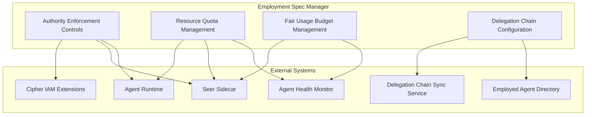
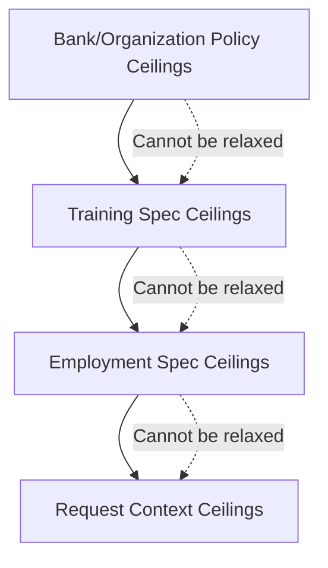
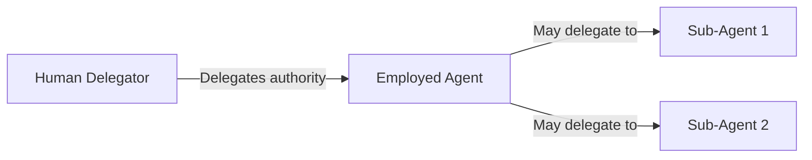
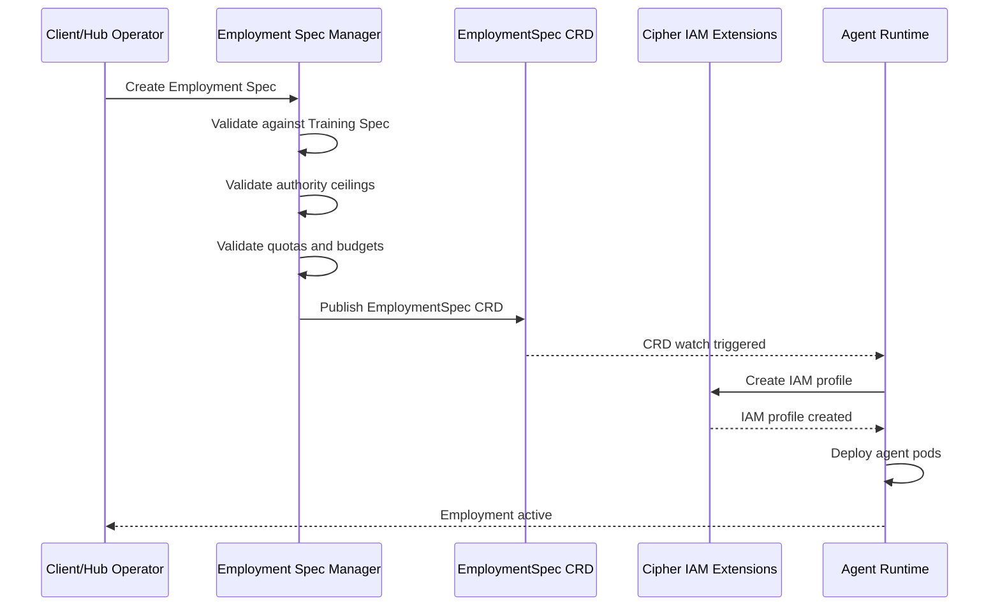
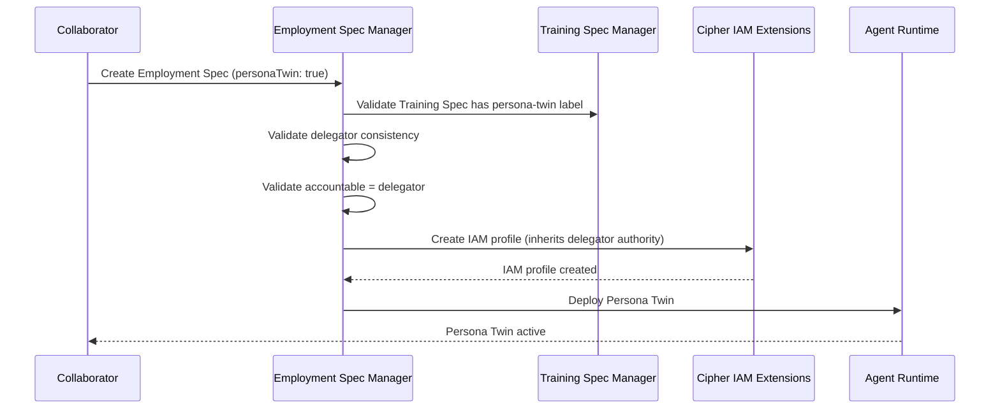

# Employment Spec Manager

> **Status**: 🟢 Design Complete  
> **Last Updated**: 2026-01-12

---

## Overview

Employment Spec Manager is the foundational component of the Agent Lifecycle Manager subsystem. It manages Employment Specifications for Employed Agents, including authority enforcement controls, resource quotas, fair usage budgets, and delegation chain configuration.

All control plane changes to Employment Specs are CRD-based, following Kubernetes-native patterns.

---

## Architecture



---

## Authority Enforcement Controls

### Functional Scope

Authority Enforcement Controls define how an Employed Agent's authority is specified, validated, and enforced. Authority follows a layered ceiling architecture where each layer can only narrow (never expand) the authority defined by the layer above.

#### Authority Ceiling Architecture



**Layered Ceilings:**
- **Bank/Organization Policy** — Highest level, tenant-wide authority limits
- **Training Spec Ceilings** — Agent class limits (what the trained agent is allowed to do)
- **Employment Spec Ceilings** — Agent instance limits (narrowed for specific deployment)
- **Request Context** — Runtime limits based on request characteristics

**Ceiling Immutability Principle:** Training ceilings cannot be relaxed at Employment time. Employment can only narrow, never expand, what Training permits.

#### Ceiling Types

| Ceiling Type | Description | Examples |
|-------------|-------------|----------|
| **Value Ceilings** | Maximum values for transactions/actions | `maxSingleTransaction: 5000`, `maxDailyTotal: 50000` |
| **Rate Ceilings** | Maximum rates for actions | `maxRequestsPerMinute: 100`, `maxDecisionsPerHour: 500` |
| **Scope Ceilings** | Boundaries for what agent can access | `customerTiers: [standard, premium]`, `regions: [US, EU]` |
| **Approval Ceilings** | Thresholds requiring human approval | `requiresApproval: { threshold: 1000, actions: [refund] }` |

#### Authority Delegation Models

**User Delegation** — Agent acts as delegate of a specific user:

```yaml
delegation:
  type: user
  delegator: "user:john.smith@acme.com"
  accountable: "user:jane.manager@acme.com"
  roles: "fraud-reviewer,dispute-handler"  # CSV: only subset delegator has
  groups: "disputes-team"
```

**Role Delegation** — Agent represents an organizational role:

```yaml
delegation:
  type: role
  role: "fraud-analyst"
  accountable: "user:jane.manager@acme.com"
  roles: "*"  # Wildcard: copies all role's permissions
  groups: "fraud-analysts,disputes-team"
```

**Bot Mode** — No delegator, base identity only:

```yaml
delegation:
  type: bot
  accountable: "user:jane.manager@acme.com"  # Manager is accountable human
```

**Persona Twin Delegation** — Agent acts as personal delegate of collaborator (delegator and accountable are same):

```yaml
delegation:
  type: user
  delegator: "user:john.smith@acme.com"
  accountable: "user:john.smith@acme.com"  # Same as delegator for Persona Twins
  roles: "*"  # Inherits all delegator's roles
  groups: "*"  # Inherits all delegator's groups
  personaTwin: true  # Marks as Persona Twin delegation
  # No roles/groups inheritance - base identity only
```

#### Authority Inheritance Rules

> The delegated authority at any time is always a subset of what the delegator is currently authorized to do.

- **Wildcard (`*`):** Copies all delegator's roles/groups
- **CSV value:** Only subset that delegator has is retained; rest rejected with warning; resource marked as out-of-sync
- **Bot mode:** No inheritance; base identity only; manager is accountable human

#### OPA Policy Configuration

```yaml
spec:
  delegation:
    policies:
      - pep: "tool-gateway"
        policyRef: "policies/tool-gateway-restrictions.rego"
      - pep: "signal-exchange"
        policyRef: "policies/signal-exchange-restrictions.rego"
      - pep: "model-gateway"
        policyRef: "policies/model-gateway-limits.rego"
```

- **Policy references per PEP:** Each Policy Enforcement Point can have its own policy
- **File-based (not inline):** Policies are referenced files, not inline content
- **Unknown PEPs ignored:** If a PEP is not recognized by Cipher, the policy is ignored

### Integration Points

| Target System | Hand-off | Direction |
|--------------|----------|-----------|
| **Cipher IAM Extensions** | Authority delegation configuration → IAM profile creation/updates | Outbound |
| **Seer Sidecar** | Authority ceilings → Runtime enforcement | Outbound |
| **Agent Runtime** | Employment Spec → IAM profile provisioning trigger | Outbound |
| **Delegation Chain Sync Service** | Authority changes → Employment Spec updates | Inbound |

---

## Resource Quota Management

### Functional Scope

Resource Quota Management defines and enforces resource limits for Employed Agents, ensuring fair resource allocation and preventing resource exhaustion.

#### Quota Types

| Quota Type | Description | Configuration |
|-----------|-------------|---------------|
| **Compute** | CPU, memory, replicas | `cpu: "2"`, `memory: "4Gi"`, `replicas: 3` |
| **Token** | LLM token budgets | `dailyTokens: 1000000`, `perRequestTokens: 50000` |
| **API** | Rate limits per tool/service | `toolGateway: 100/min`, `coreBanking: 50/min` |
| **Storage** | Memory store limits | `conversationHistory: 100`, `memoryStoreSize: 1Gi` |

#### Employment Spec Quota Configuration

```yaml
apiVersion: seer.olympus.io/v1
kind: EmploymentSpec
metadata:
  name: fraud-analyst-acme-retail
  namespace: acme-disputes
spec:
  capacity:
    compute:
      cpu: "2"
      memory: "4Gi"
      replicas: 2
    tokens:
      daily: 1000000
      monthly: 25000000
      perRequest: 50000
    api:
      toolGateway:
        requestsPerMinute: 100
        requestsPerHour: 5000
      coreBanking:
        requestsPerMinute: 50
    storage:
      conversationHistory: 100  # messages
      memoryStoreSize: "1Gi"
```

#### Quota Validation

- **Against Training Spec minimums:** Employment quotas cannot exceed Training Spec maximums
- **Can only restrict, not expand:** Employment quotas are a subset of Training quotas
- **Validation at submission:** Quota validation happens when Employment Spec is created/updated

#### Quota Enforcement

- **Runtime tracking:** Seer Sidecar tracks quota consumption in real-time
- **Exhaustion handling:**
  - **Graceful degradation:** Reduce quality/speed rather than fail
  - **Escalation:** Notify Agent Health Monitor when approaching limits
  - **Rejection:** Reject requests when hard limits are reached

### Integration Points

| Target System | Hand-off | Direction |
|--------------|----------|-----------|
| **Agent Runtime** | Quota configuration → Resource allocation and enforcement | Outbound |
| **Seer Sidecar** | Quota limits → Runtime quota tracking | Outbound |
| **Agent Health Monitor** | Quota exhaustion → Health alerts | Outbound |

---

## Fair Usage Budget Management

### Functional Scope

Fair Usage Budget Management ensures equitable resource distribution across different dimensions (subjects, signals, time periods, action types), preventing any single dimension from consuming disproportionate resources.

#### Budget Dimensions

| Dimension | Description | Examples |
|-----------|-------------|----------|
| **Per Subject** | Limits per customer/account | `perCustomer: 1000 tokens/day`, `perAccount: 500 requests/day` |
| **Per Signal** | Limits per request type/scenario | `perScenario: 10000 tokens/day`, `perRequestType: 5000 tokens/request` |
| **Per Time Period** | Limits per time window | `hourly: 50000 tokens`, `daily: 500000 tokens` |
| **Per Action Type** | Limits per tool/API | `perTool: 1000 calls/day`, `perEndpoint: 500 calls/day` |

#### Budget Configuration

```yaml
spec:
  fairUsage:
    budgets:
      perSubject:
        customer:
          tokensPerDay: 10000
          requestsPerDay: 100
        account:
          tokensPerDay: 5000
          requestsPerDay: 50
      perSignal:
        scenario:
          disputeResolution:
            tokensPerDay: 50000
          customerInquiry:
            tokensPerDay: 20000
      perTimePeriod:
        hourly:
          tokens: 100000
          requests: 1000
        daily:
          tokens: 1000000
          requests: 10000
      perActionType:
        tool:
          coreBanking:
            callsPerDay: 5000
          caseManagement:
            callsPerDay: 10000
    aggregation:
      method: "sum"  # or "max", "average"
    reset:
      schedule: "0 0 * * *"  # Daily at midnight
```

#### Budget Tracking and Enforcement

- **Real-time consumption tracking:** Seer Sidecar tracks budget consumption per dimension
- **Exhaustion policies:**
  - **Reject:** Reject requests when budget exhausted
  - **Escalate:** Notify supervisor for approval
  - **Throttle:** Slow down requests rather than reject

### Integration Points

| Target System | Hand-off | Direction |
|--------------|----------|-----------|
| **Seer Sidecar** | Budget limits → Runtime budget tracking and enforcement | Outbound |
| **Agent Health Monitor** | Budget exhaustion → Health alerts and reporting | Outbound |

---

## Delegation Chain Configuration

### Functional Scope

Delegation Chain Configuration manages the chain of authority from human delegators to Employed Agents, ensuring accountability and authority inheritance.

#### Delegation Chain Structure



**Chain Structure:**
- **Delegator → Agent:** Primary delegation from human to agent
- **Agent → Sub-agents:** Optional delegation to sub-agents (if permitted)
- **Depth limits:** Maximum chain depth configurable per tenant

**Chain Validation:**
- **Authority narrowing:** Each link can only narrow, never expand authority
- **No cycles:** Delegation chains must be acyclic
- **Depth limits:** Configurable maximum chain depth

#### Delegation Chain Metadata

```yaml
spec:
  delegation:
    type: user
    delegator: "user:john.smith@acme.com"
    delegatorAuthority:
      snapshot: "2026-01-12T10:00:00Z"
      roles: ["fraud-reviewer", "dispute-handler", "case-manager"]
      groups: ["disputes-team", "fraud-analysts"]
    accountable: "user:jane.manager@acme.com"
    timestamp: "2026-01-12T10:00:00Z"
    expiration: "2027-01-12T10:00:00Z"  # Optional: time-bounded
    scope:
      workbench: "acme-disputes"
      scenarios: ["dispute-resolution", "customer-inquiry"]
      customers: ["tier-1", "tier-2"]  # Optional: customer scope
    approval:
      status: "approved"
      approver: "user:jane.manager@acme.com"
      approvedAt: "2026-01-12T10:05:00Z"
```

**Metadata Components:**
- **Delegator identity:** Who delegated authority
- **Authority snapshot:** Point-in-time snapshot of delegator's authority
- **Timestamp/expiration:** When delegation was created and expires
- **Scope:** Boundaries of delegation (workbench, scenarios, customers)
- **Approval workflow state:** Approval status and history

### Integration Points

| Target System | Hand-off | Direction |
|--------------|----------|-----------|
| **Delegation Chain Sync Service** | Chain change detection → Authority synchronization | Bidirectional |
| **Employed Agent Directory** | Chain metadata → Accountability discovery | Outbound |

---

## Employment Spec Creation Flow



**Flow Steps:**
1. Client submits Employment Spec
2. Employment Spec Manager validates against Training Spec (authority, quotas)
3. Employment Spec Manager validates delegation chain
4. EmploymentSpec CRD published to Kubernetes
5. Seer Operator (Agent Runtime) detects CRD change
6. Agent Runtime creates IAM profile via Cipher IAM Extensions
7. Agent Runtime deploys agent pods
8. Employment becomes active

---

## Persona Twin Support

### Overview

Employment Spec Manager supports **Persona Twins**—personal AI agents that collaborators create to delegate their responsibilities. Persona Twins have a specialized authority delegation model where the delegator is also the accountable human.

### Persona Twin Authority Delegation

For Persona Twins, the delegation model is simplified:

| Field | Value | Description |
|-------|-------|-------------|
| `type` | `user` | Standard user delegation |
| `delegator` | User reference | The collaborator creating the twin |
| `accountable` | Same as delegator | Delegator is accountable for twin's actions |
| `personaTwin` | `true` | Marks this as Persona Twin delegation |

#### Authority Inheritance

Persona Twins inherit authority from their delegator:

```yaml
delegation:
  type: user
  delegator: "user:john.smith@acme.com"
  accountable: "user:john.smith@acme.com"
  personaTwin: true
  
  # Authority configuration options
  roles: "*"      # Wildcard: copies all delegator's roles
  # OR
  roles: "analyst,reviewer"  # CSV: specific subset of delegator's roles
  
  groups: "*"     # Wildcard: copies all delegator's groups
  # OR
  groups: "disputes-team"   # CSV: specific subset of delegator's groups
  
  # Optional OPA policies for fine-grained authority control
  opaPolicies:
    - pep: "tool-gateway"
      policyRef: "persona-twin/task-scope-only.rego"
    - pep: "external-service"
      policyRef: "persona-twin/no-financial-actions.rego"
```

### Employment Spec Validation for Persona Twins

Employment Spec Manager validates Persona Twin specific constraints:

| Rule | Validation | Error Type |
|------|------------|------------|
| **Training Spec Label** | If Training Spec has `persona-twin` label, Employment Spec must configure Persona Twin delegation | ValidationError |
| **Delegator Consistency** | Employment Spec delegator must match Training Spec delegator | ValidationError |
| **Accountable Same as Delegator** | For Persona Twins, `accountable` must equal `delegator` | ValidationError |
| **Authority Subset** | Delegated roles/groups must be subset of delegator's current authority | AuthorityError |

### Persona Twin Employment Flow



### Non-Developer Creation

Unlike standard Employment Specs which require Developer or APO persona, Persona Twin Employment Specs can be created by any collaborator:

- **Authorization**: Collaborator must be member of target workbench
- **Validation**: Standard authority validation applies (cannot exceed own authority)
- **Approval**: No admin approval required for self-delegation

---

## Related Documentation

- [Agent Lifecycle Manager README](./README.md) — Subsystem overview
- [Delegation Chain Sync Service](./delegation-chain-sync-service.md) — Authority synchronization
- [Agent Runtime IAM Provisioning](../agent-runtime/iam-provisioning.md) — IAM profile creation
- [Implementation Concepts: Agent Lifecycle](../../implementation-concepts/agent-lifecycle.md) — Lifecycle concepts
- [Implementation Concepts: Authority Enforcement](../../implementation-concepts/authority-enforcement.md) — Authority enforcement
- [Persona Twins](../../implementation-concepts/persona-twins.md) — Persona Twin concept documentation
- [Cipher IAM Extensions: Authority Delegation](../cipher-iam-extensions/authority-delegation.md) — Authority delegation patterns

---

*Employment Spec Manager provides the foundation for managing Employed Agent specifications with layered authority controls, resource quotas, fair usage budgets, and delegation chain configuration. It supports Persona Twins with specialized authority delegation.*
