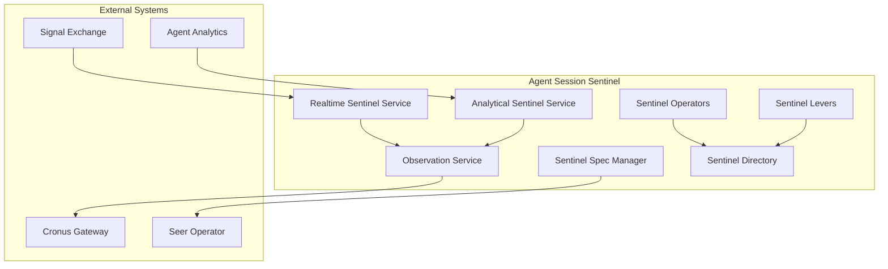

# Agent Session Sentinel

> **Status**: 🟢 Design Complete  
> **Last Updated**: 2026-01-13

## Overview

Agent Session Sentinel provides sentinel oversight for agent sessions, managing sentinel policies, observations, and escalations for failed or stuck agents.

---

## Design Documents

| Document | Description | Status |
|----------|-------------|--------|
| [SCOPE.md](./SCOPE.md) | Design scope, coverage summary, key decisions | Overview |
| [Sentinel Spec Manager](./sentinel-spec-manager.md) | Spec structure, validation, deployment configuration | C2 |
| [Realtime Sentinel Service](./realtime-sentinel-service.md) | SX event observation, OPA policy evaluation | C2 |
| [Analytical Sentinel Service](./analytical-sentinel-service.md) | Templated SQL execution on analytics data mart | C2 |
| [Observation Service](./observation-service.md) | Cronus Observations/Exceptions generation | C2 |
| [Sentinel Operators](./sentinel-operators.md) | Lifecycle management, state transitions | C2 |
| [Sentinel Levers](./sentinel-levers.md) | Runtime controls, enable/disable, suspend | C2 |
| [Sentinel Directory](./sentinel-directory.md) | Registry, search, version tracking | C2 |

---

## Architecture

---

## Key Design Decisions

### Two Sentinel Types

- **Realtime Sentinel**: Observes SX events, evaluates OPA policies, generates real-time Observations/Exceptions
- **Analytical Sentinel**: Runs templated SQL on analytics data mart periodically, generates analytical Observations/Exceptions

### Cronus Integration

- **Generates Observations/Exceptions via Cronus Gateway** (Hub model)
- **Uses Hub's existing Observation/Exception model**—no new model required
- **Workbench routing** via Cronus for Ops Center display

### Deployment Model

- **Sentinels deployed via Deployment CRDs** referencing Spec CRDs
- **Deployment CRD corresponds to Spec CRD** where templatized definition is stored
- **Clear separation** between spec definition and deployment configuration

### Lifecycle Pattern

- **Follows same pattern** as Trained/Employed Agent lifecycle managers
- **Spec Manager handles validation** and structure management
- **Seer Operator reconciles** CRDs to Kubernetes state

---

## Related

- [Agent Health Monitor](../agent-health-monitor/README.md) — Can trigger sentinels on SLO deviations (if configured)
- [Agent Analytics](../agent-analytics/README.md) — Uses Agent Analytics data mart for analytical sentinels
- [Signal Exchange](../../../olympus-hub-docs/04-subsystems/signal-exchange/README.md) — SX event source for realtime sentinels
- [Cronus Gateway](../../../olympus-hub-docs/04-subsystems/signal-providers/cronus-business-exceptions.md) — Observations/Exceptions publishing
