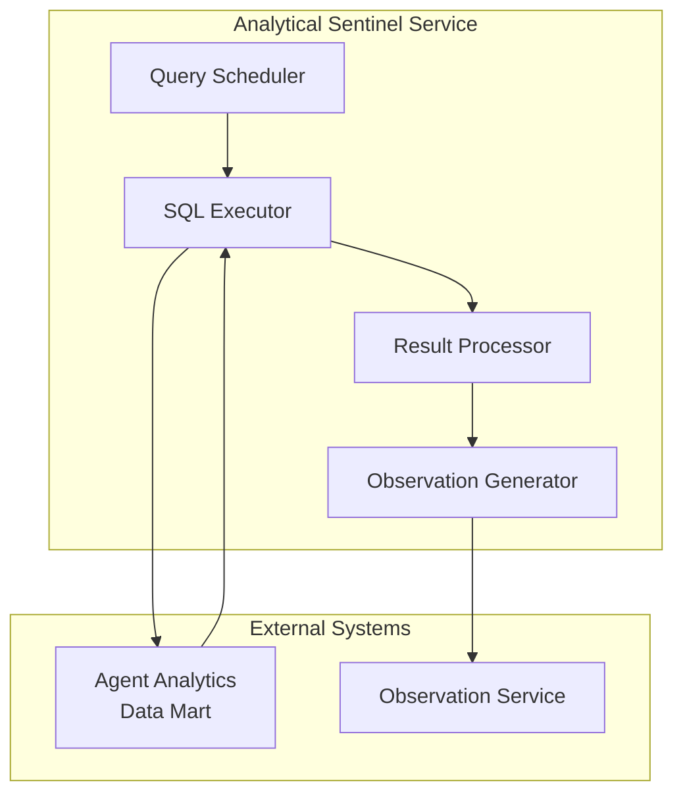
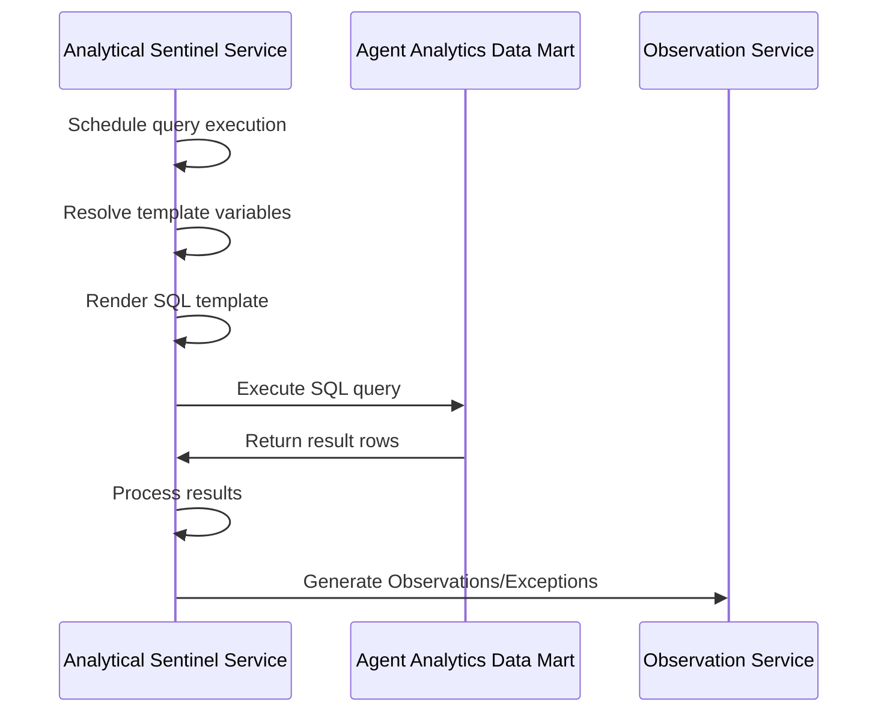
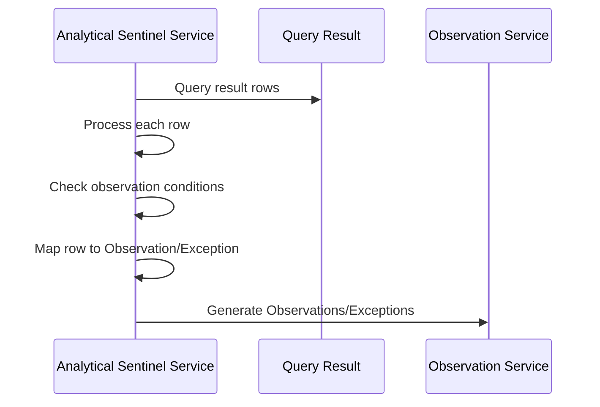

# Analytical Sentinel Service

> **Status**: 🟢 Design Complete  
> **Last Updated**: 2026-01-13  
> **Design Level**: C2 (Container)

---

## Overview

Analytical Sentinel Service runs templated SQL queries on the Agent Analytics data mart periodically to generate Observations and Exceptions. It provides sentinel oversight based on historical patterns and aggregated metrics.

**Key Principle**: Analytical Sentinel Service operates on analytics data (not real-time events), evaluating templated SQL queries to detect patterns that require sentinel attention.

---

## Architecture



---

## Functional Scope

### Templated SQL Execution

Analytical Sentinel Service executes templated SQL queries on the analytics data mart:

#### SQL Template Structure

```yaml
sql_template: |
  SELECT 
    agent_id,
    workbench_id,
    session_id,
    last_activity_time,
    current_time - last_activity_time as inactivity_duration,
    session_status
  FROM agent_sessions
  WHERE 
    workbench_id IN {{ .workbench_ids }}
    AND current_time - last_activity_time > INTERVAL '5 minutes'
    AND session_status = 'active'
```

#### Template Variables

```yaml
template_variables:
  workbench_ids: ["acme-disputes"]
  agent_ids: []  # Optional
  time_range:
    start: "2026-01-13T00:00:00Z"
    end: "2026-01-13T23:59:59Z"
```

#### SQL Execution Flow



---

### Periodic Execution

Analytical Sentinel Service executes queries periodically:

#### Schedule Configuration

```yaml
analytical_config:
  schedule: "*/5 * * * *"  # Every 5 minutes (cron format)
  query_timeout: "30s"
  max_results: 1000
```

#### Execution Modes

| Mode | Description | Use Case |
|------|-------------|----------|
| **Scheduled** | Periodic execution (cron) | Regular pattern detection |
| **On-Demand** | Manual trigger | Ad-hoc analysis |
| **Event-Driven** | Triggered by data mart updates | Near-real-time analysis |

---

### Result Processing

Analytical Sentinel Service processes SQL query results:

#### Result Structure

```yaml
query_result:
  columns:
    - agent_id
    - workbench_id
    - session_id
    - inactivity_duration
    - session_status
  rows:
    - agent_id: "fraud-analyst-acme-retail"
      workbench_id: "acme-disputes"
      session_id: "session-12345"
      inactivity_duration: "10 minutes"
      session_status: "active"
```

#### Result to Observation Mapping

```yaml
observation_mapping:
  generate_observation:
    condition: "inactivity_duration > INTERVAL '5 minutes' AND inactivity_duration <= INTERVAL '15 minutes'"
    observation_type: "agent_stuck"
    severity: "warning"
    metadata:
      agent_id: "{{ row.agent_id }}"
      session_id: "{{ row.session_id }}"
      inactivity_duration: "{{ row.inactivity_duration }}"
  
  generate_exception:
    condition: "inactivity_duration > INTERVAL '15 minutes'"
    exception_type: "agent_stuck_critical"
    criticality: "tier-1"
    metadata:
      agent_id: "{{ row.agent_id }}"
      session_id: "{{ row.session_id }}"
      inactivity_duration: "{{ row.inactivity_duration }}"
```

#### Result Processing Flow



---

## Integration Points

### Upstream Integration

| Service | Integration Method | Purpose |
|---------|-------------------|---------|
| **Agent Analytics** | Data mart query API | SQL query execution |

### Downstream Integration

| Service | Integration Method | Purpose |
|---------|-------------------|---------|
| **Observation Service** | Observation/Exception generation | Generate sentinel observations |

---

## Key Design Decisions

### Periodic Processing

- **Executes queries periodically** (not real-time)
- **Scheduled execution** via cron or event-driven triggers
- **Efficient batch processing** for pattern detection

### Templated SQL Model

- **SQL templates with variables** for flexible querying
- **Results mapped to Observations/Exceptions** via configuration
- **Column mapping** from query results to observation metadata

### Analytics-Based Supervision

- **Uses Agent Analytics data mart** for historical analysis
- **Detects patterns** across time windows
- **Aggregated metrics** for trend analysis

---

## Related Documentation

- [Sentinel Spec Manager](./sentinel-spec-manager.md) — Spec structure and validation
- [Realtime Sentinel Service](./realtime-sentinel-service.md) — Real-time sentinel (SX events)
- [Observation Service](./observation-service.md) — Observation/Exception generation
- [Agent Analytics](../agent-analytics/data-mart-service.md) — Analytics data mart source

---

*Analytical Sentinel Service provides sentinel oversight by running templated SQL queries on the analytics data mart periodically.*
