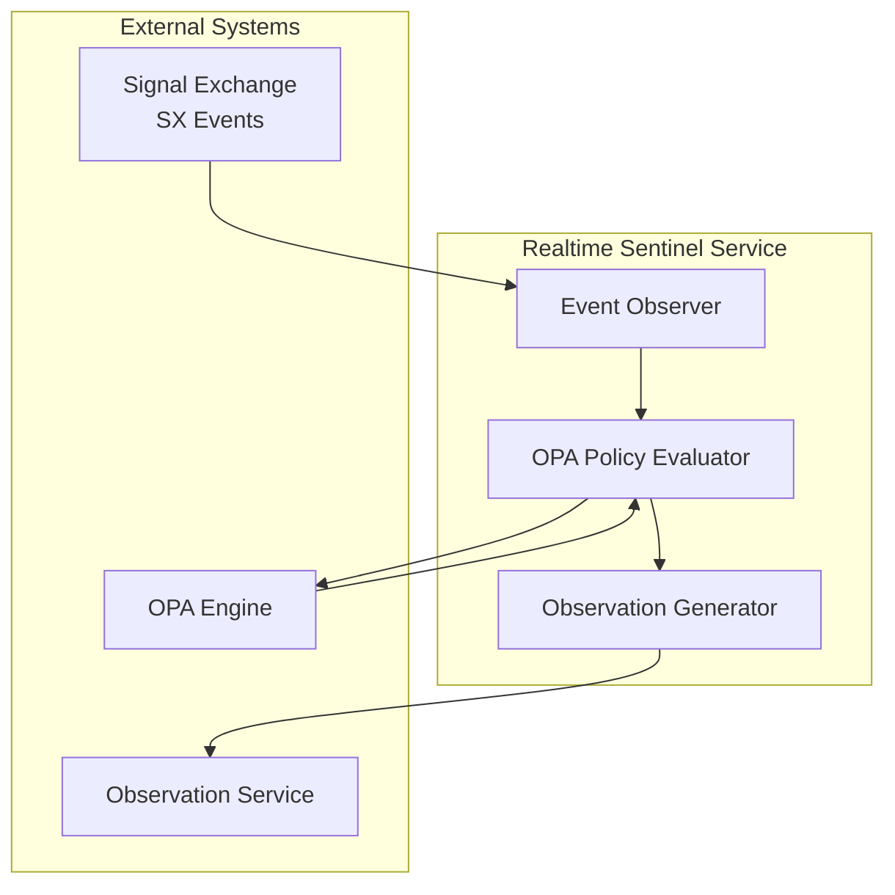
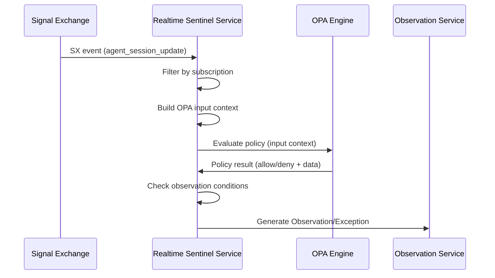
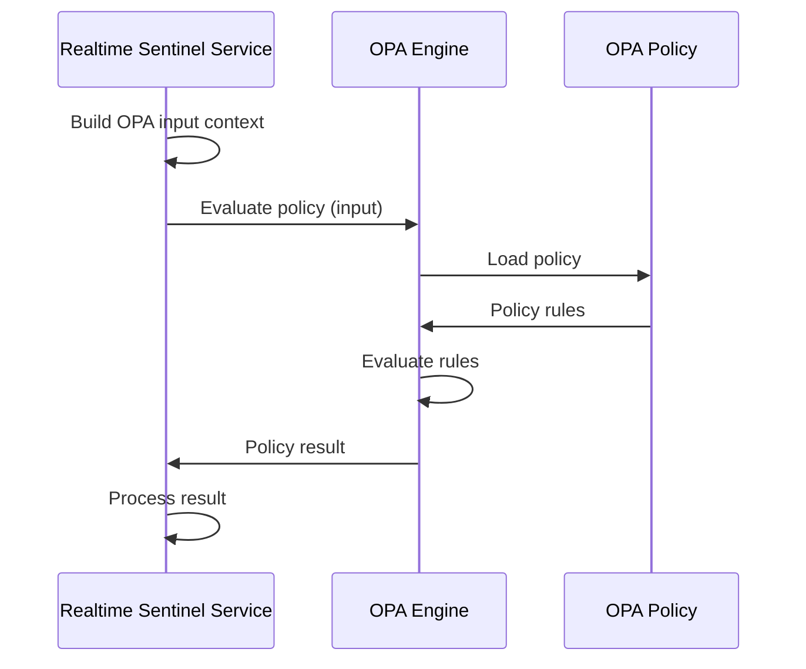
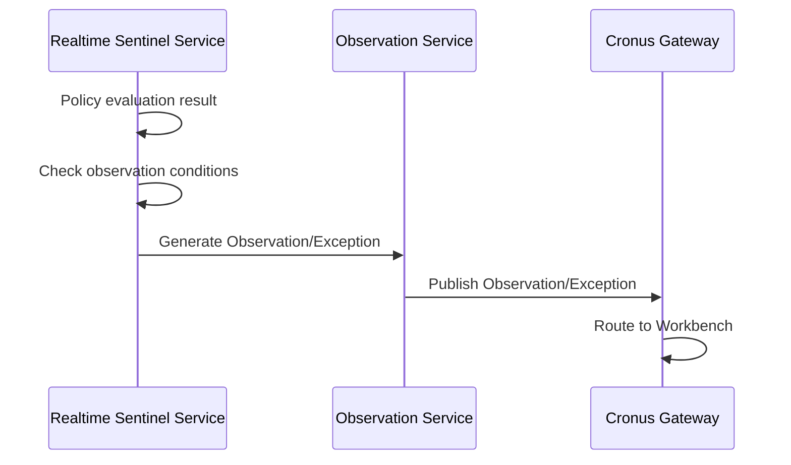

# Realtime Sentinel Service

> **Status**: 🟢 Design Complete  
> **Last Updated**: 2026-01-13  
> **Design Level**: C2 (Container)

---

## Overview

Realtime Sentinel Service observes Signal Exchange (SX) events and evaluates OPA policies to generate real-time Observations and Exceptions. It provides immediate sentinel oversight for agent sessions based on runtime events.

**Key Principle**: Realtime Sentinel Service operates on SX events in real-time, evaluating OPA policies to detect conditions that require sentinel attention.

---

## Architecture



---

## Functional Scope

### SX Event Observation

Realtime Sentinel Service observes SX events for agent sessions:

#### Event Subscription

```yaml
event_subscriptions:
  - event_type: "agent_session_update"
    filters:
      workbench_id: "acme-disputes"
      agent_id: "fraud-analyst-acme-retail"  # Optional
```

#### Event Types Observed

| Event Type | Description | Use Case |
|-----------|-------------|----------|
| **agent_session_update** | Agent session state changes | Detect stuck agents, session health |
| **agent_request_update** | Agent request state changes | Detect failed requests, request timeouts |
| **guardrail_violation** | Guardrail violations | Escalate guardrail observations |
| **policy_violation** | Policy violations | Escalate policy violations |
| **cost_anomaly** | Cost anomalies | Detect cost runaway scenarios |

#### Event Observation Flow



---

### OPA Policy Evaluation

Realtime Sentinel Service evaluates OPA policies on SX events:

#### OPA Input Context

```yaml
opa_input:
  event:
    type: "agent_session_update"
    timestamp: "2026-01-13T10:30:00Z"
    agent_id: "fraud-analyst-acme-retail"
    workbench_id: "acme-disputes"
    session_id: "session-12345"
    session_state: "active"
    last_activity_time: "2026-01-13T10:25:00Z"
  
  agent_context:
    agent_id: "fraud-analyst-acme-retail"
    training_spec_id: "fraud-analyst-v2"
    workbench_id: "acme-disputes"
  
  time:
    now_ns: 1705143000000000000
    last_activity_ns: 1705142700000000000
```

#### OPA Policy Example

```rego
package seer.sentinel.stuck_agent

default allow = false

# Generate observation if agent inactive for > 5 minutes
allow {
    input.event.type == "agent_session_update"
    input.event.session_state == "active"
    time.now_ns() - input.event.last_activity_ns > 300000000000  # 5 minutes
}

# Generate exception if agent inactive for > 15 minutes
exception {
    input.event.type == "agent_session_update"
    input.event.session_state == "active"
    time.now_ns() - input.event.last_activity_ns > 900000000000  # 15 minutes
}
```

#### Policy Evaluation Flow



---

### Observation Generation

Realtime Sentinel Service generates Observations and Exceptions based on policy results:

#### Observation Conditions

```yaml
observation_config:
  generate_observation:
    condition: "policy_result.allow == true"
    observation_type: "agent_stuck"
    severity: "warning"
    metadata:
      inactivity_duration: "{{ policy_result.inactivity_duration }}"
      agent_id: "{{ event.agent_id }}"
  
  generate_exception:
    condition: "policy_result.exception == true"
    exception_type: "agent_stuck_critical"
    criticality: "tier-1"
    metadata:
      inactivity_duration: "{{ policy_result.inactivity_duration }}"
      agent_id: "{{ event.agent_id }}"
```

#### Observation Generation Flow



---

## Integration Points

### Upstream Integration

| Service | Integration Method | Purpose |
|---------|-------------------|---------|
| **Signal Exchange** | SX event subscription | Event observation |
| **OPA Engine** | OPA policy evaluation API | Policy evaluation |

### Downstream Integration

| Service | Integration Method | Purpose |
|---------|-------------------|---------|
| **Observation Service** | Observation/Exception generation | Generate sentinel observations |

---

## Key Design Decisions

### Real-Time Processing

- **Processes SX events in real-time** as they arrive
- **Low-latency policy evaluation** for immediate sentinel response
- **Event-driven architecture** for scalability

### OPA Policy Model

- **Policies written in Rego** (OPA policy language)
- **Policies evaluate SX events** with agent context
- **Policies return structured results** for observation generation

### Observation Model

- **Generates Observations** for informational concerns
- **Generates Exceptions** for critical issues requiring action
- **Uses Hub's Cronus model** for Observations/Exceptions

---

## Related Documentation

- [Sentinel Spec Manager](./sentinel-spec-manager.md) — Spec structure and validation
- [Analytical Sentinel Service](./analytical-sentinel-service.md) — Analytical sentinel (periodic SQL)
- [Observation Service](./observation-service.md) — Observation/Exception generation
- [Signal Exchange](../../../olympus-hub-docs/04-subsystems/signal-exchange/README.md) — SX event source

---

*Realtime Sentinel Service provides real-time sentinel oversight by observing SX events and evaluating OPA policies.*
