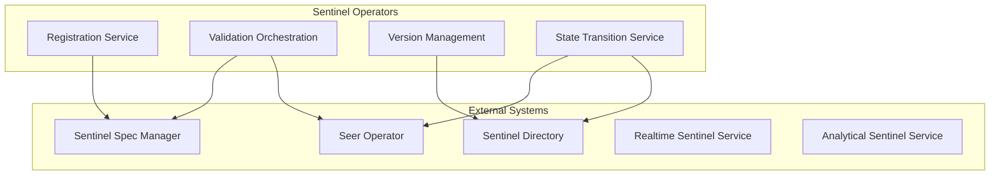
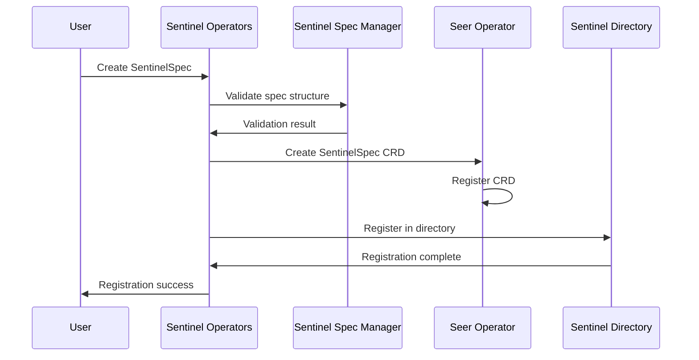
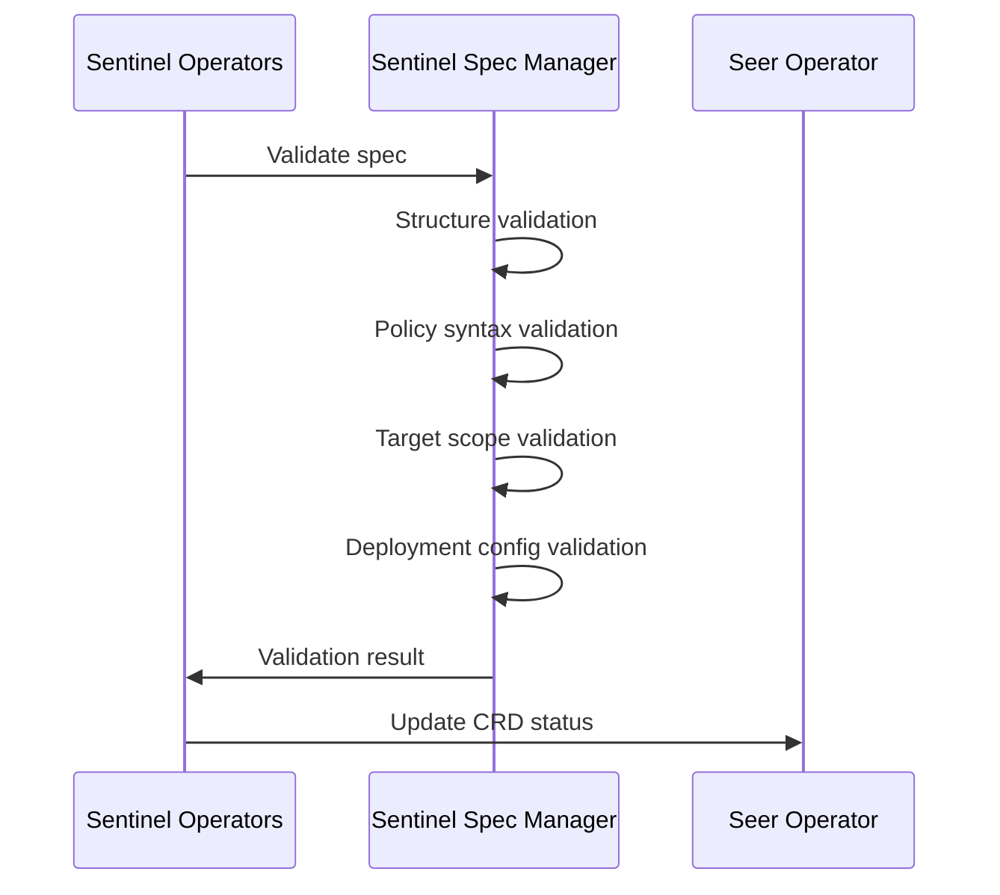
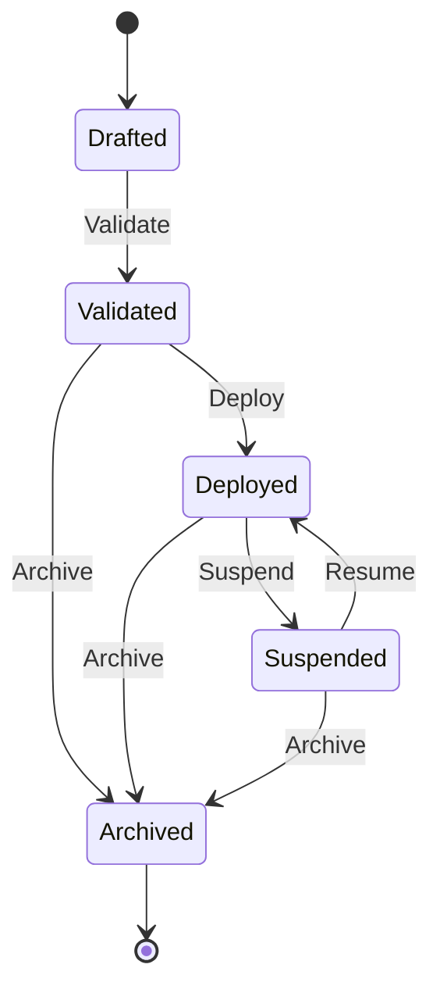

# Sentinel Operators

> **Status**: 🟢 Design Complete  
> **Last Updated**: 2026-01-13  
> **Design Level**: C2 (Container)

---

## Overview

Sentinel Operators manage the lifecycle of Sentinel Specs and Deployments via Seer Operator. They handle registration, validation, versioning, and state transitions for sentinels.

**Key Principle**: Sentinel Operators coordinate lifecycle management across Sentinel Spec Manager, Sentinel Directory, and Seer Operator, following the same pattern as Trained/Employed Agent lifecycle managers.

---

## Architecture

---

## Functional Scope

### Registration Service

Sentinel Operators register new Sentinel Specs:

#### Registration Flow

#### Registration Steps

1. **Spec Validation**: Validate spec structure via Sentinel Spec Manager
2. **CRD Creation**: Create SentinelSpec CRD via Seer Operator
3. **Directory Registration**: Register spec in Sentinel Directory
4. **State Initialization**: Initialize spec state (Drafted)

---

### Validation Orchestration

Sentinel Operators orchestrate validation across systems:

#### Validation Checks

| Check | Description | Validated By |
|-------|-------------|--------------|
| **Structure Validation** | Spec structure, required fields | Sentinel Spec Manager |
| **Policy Syntax Validation** | OPA policy syntax (Realtime) or SQL syntax (Analytical) | Sentinel Spec Manager |
| **Target Scope Validation** | Target agents/workbenches exist | Sentinel Spec Manager |
| **Deployment Config Validation** | Deployment configuration valid | Sentinel Spec Manager |

#### Validation Flow

---

### Version Management

Sentinel Operators manage sentinel versions:

#### Version Assignment

| State | Version Rule |
|-------|-------------|
| **Drafted** | No version assigned |
| **Validated** | Version assigned (e.g., `1.0.0`) |
| **Deployed** | Version locked |

#### Version Compatibility

- **Major version**: Breaking changes (incompatible policies)
- **Minor version**: New features (backward compatible)
- **Patch version**: Bug fixes (backward compatible)

---

### State Transition Service

Sentinel Operators manage sentinel state transitions:

#### Lifecycle States

| State | Description | Allowed Transitions |
|-------|-------------|-------------------|
| **Drafted** | Spec created, not validated | → Validated |
| **Validated** | Spec validated, ready for deployment | → Deployed, → Archived |
| **Deployed** | Sentinel deployed and active | → Suspended, → Archived |
| **Suspended** | Sentinel suspended (temporarily disabled) | → Deployed, → Archived |
| **Archived** | Sentinel archived (no longer active) | (terminal) |

#### State Transition Flow

#### State Transition Rules

| Transition | Condition | Action |
|-----------|-----------|--------|
| **Drafted → Validated** | Spec validation passes | Assign version, update CRD status |
| **Validated → Deployed** | Deployment CRD created | Deploy sentinel service |
| **Deployed → Suspended** | Suspend lever activated | Stop sentinel service |
| **Suspended → Deployed** | Resume lever activated | Restart sentinel service |
| **Any → Archived** | Archive lever activated | Remove sentinel service, mark archived |

---

## Integration Points

### Upstream Integration

| Service | Integration Method | Purpose |
|---------|-------------------|---------|
| **Sentinel Spec Manager** | Spec validation API | Validate specs before registration |
| **Seer Operator** | CRD reconciliation | CRD creation and state management |

### Downstream Integration

| Service | Integration Method | Purpose |
|---------|-------------------|---------|
| **Sentinel Directory** | Spec registration API | Register specs in directory |
| **Realtime Sentinel Service** | Deployment trigger | Deploy realtime sentinels |
| **Analytical Sentinel Service** | Deployment trigger | Deploy analytical sentinels |

---

## Key Design Decisions

### Lifecycle Pattern

- **Follows same pattern** as Trained/Employed Agent lifecycle managers
- **State-based lifecycle** with clear transition rules
- **Version management** for spec evolution

### Seer Operator Boundary

- **Sentinel Operators coordinate** lifecycle management
- **Seer Operator reconciles** CRDs to Kubernetes state
- **Clear separation** between business logic and controller logic

### Deployment Model

- **Deployment CRDs** reference SentinelSpec CRDs
- **Deployment triggers** sentinel service deployment
- **State transitions** control sentinel lifecycle

---

## Related Documentation

- [Sentinel Spec Manager](./sentinel-spec-manager.md) — Spec structure and validation
- [Sentinel Levers](./sentinel-levers.md) — Runtime controls and state transitions
- [Sentinel Directory](./sentinel-directory.md) — Registry and search
- [Seer Operator](../../hub-integration/training-spec-crd.md) — CRD reconciliation

---

*Sentinel Operators manage the lifecycle of Sentinel Specs and Deployments via Seer Operator.*
