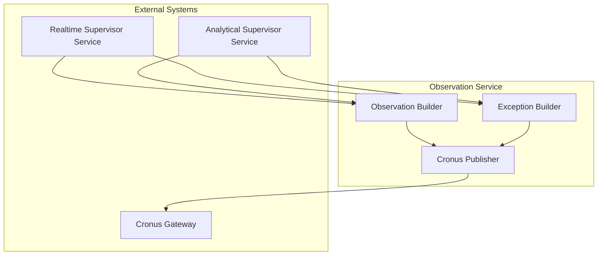
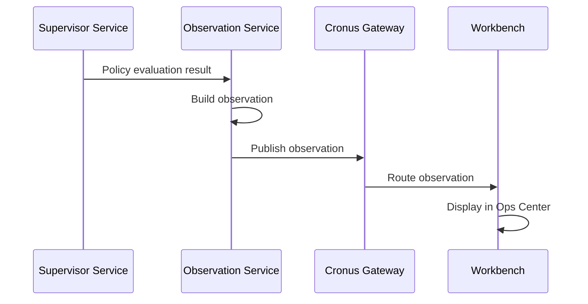
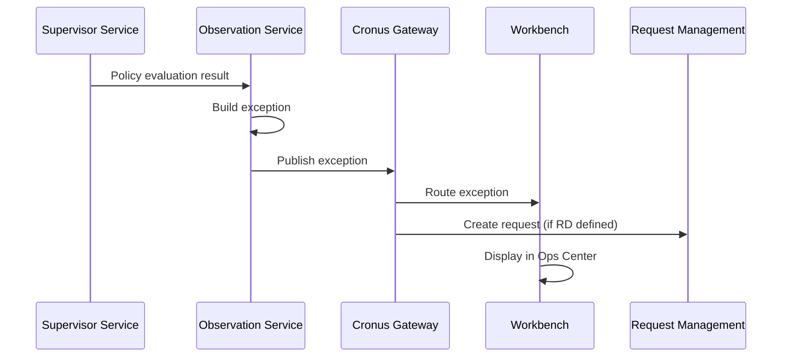
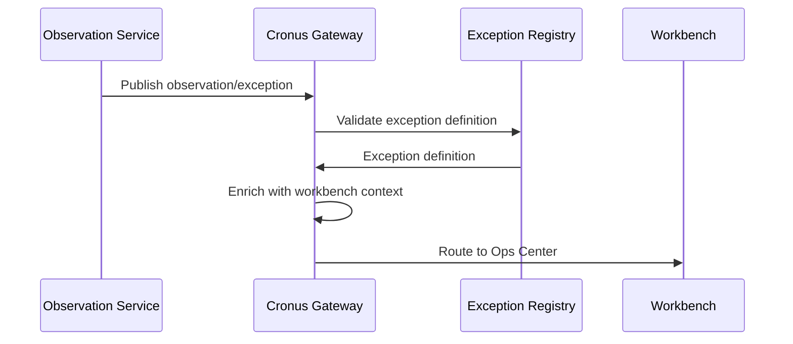

# Observation Service

> **Status**: 🟢 Design Complete  
> **Last Updated**: 2026-01-13  
> **Design Level**: C2 (Container)

---

## Overview

Observation Service generates Cronus Observations and Exceptions based on supervisor policy evaluation results. It integrates with Cronus Gateway to publish Observations/Exceptions to the appropriate Workbenches.

**Key Principle**: Observation Service uses Hub's Cronus model for Observations and Exceptions—no new model is required. It generates Observations for informational concerns and Exceptions for critical issues requiring action.

---

## Architecture



---

## Functional Scope

### Observation Generation

Observation Service generates Cronus Observations:

#### Observation Structure

```yaml
observation:
  observation_type: "agent_stuck"
  workbench_id: "acme-disputes"
  agent_id: "fraud-analyst-acme-retail"
  session_id: "session-12345"
  severity: "warning"
  metadata:
    inactivity_duration: "10 minutes"
    last_activity_time: "2026-01-13T10:25:00Z"
    supervisor_id: "stuck-agent-detector"
  timestamp: "2026-01-13T10:35:00Z"
```

#### Observation Generation Flow



---

### Exception Generation

Observation Service generates Cronus Exceptions:

#### Exception Structure

```yaml
exception:
  exception_type: "agent_stuck_critical"
  workbench_id: "acme-disputes"
  agent_id: "fraud-analyst-acme-retail"
  session_id: "session-12345"
  criticality: "tier-1"
  metadata:
    inactivity_duration: "20 minutes"
    last_activity_time: "2026-01-13T10:20:00Z"
    supervisor_id: "stuck-agent-detector"
  timestamp: "2026-01-13T10:40:00Z"
```

#### Exception Generation Flow



---

### Cronus Integration

Observation Service integrates with Cronus Gateway:

#### Cronus Publishing

```yaml
cronus_publish:
  observation:
    exception_definition_code: "SEXAGENTSTUCK001"  # For exceptions
    workbench_id: "acme-disputes"
    exception_specific_info:
      agent_id: "fraud-analyst-acme-retail"
      session_id: "session-12345"
      inactivity_duration: "20 minutes"
      supervisor_id: "stuck-agent-detector"
```

#### Cronus Integration Flow



---

## Integration Points

### Upstream Integration

| Service | Integration Method | Purpose |
|---------|-------------------|---------|
| **Realtime Supervisor Service** | Observation/Exception requests | Real-time observation generation |
| **Analytical Supervisor Service** | Observation/Exception requests | Analytical observation generation |

### Downstream Integration

| Service | Integration Method | Purpose |
|---------|-------------------|---------|
| **Cronus Gateway** | Observation/Exception publishing API | Publish to Hub workbenches |

---

## Key Design Decisions

### Hub Cronus Model

- **Uses Hub's Cronus model** for Observations and Exceptions
- **No new model required**—follows existing Hub patterns
- **Exception definitions** registered in Cronus Exception Registry

### Observation vs. Exception

- **Observations**: Informational concerns that may be of operational interest
- **Exceptions**: Critical issues requiring human attention and decision
- **Condition-based generation** based on supervisor policy results

### Workbench Routing

- **Observations/Exceptions routed to Workbenches** via Cronus
- **Workbench context** automatically injected by Cronus
- **Ops Center display** for viewing and resolution

---

## Related Documentation

- [Realtime Supervisor Service](./realtime-supervisor-service.md) — Real-time observation source
- [Analytical Supervisor Service](./analytical-supervisor-service.md) — Analytical observation source
- [Cronus Business Exceptions](../../../olympus-hub-docs/04-subsystems/signal-providers/cronus-business-exceptions.md) — Hub Cronus model

---

*Observation Service generates Cronus Observations and Exceptions based on supervisor policy evaluation results.*
