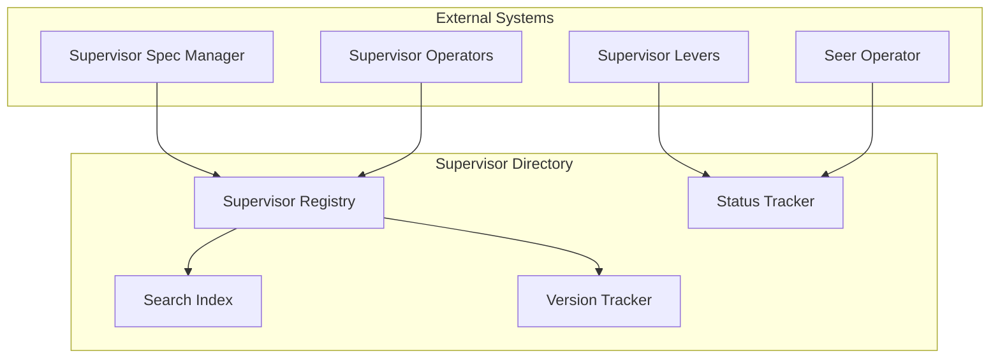
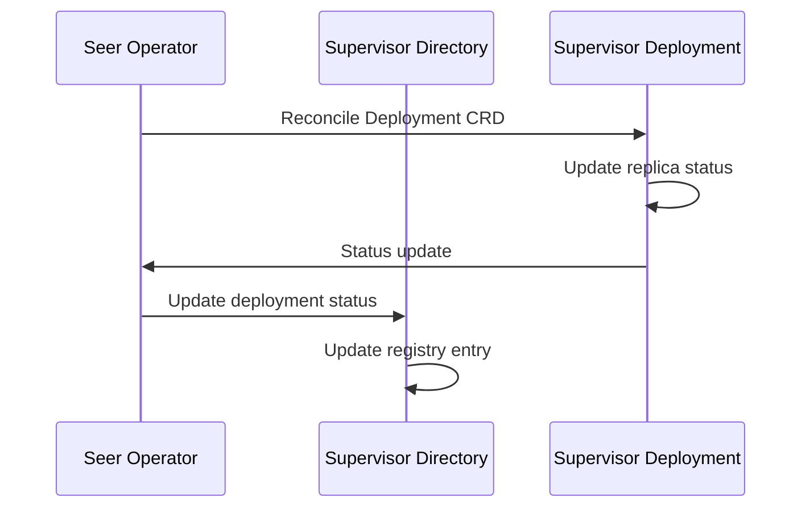

# Supervisor Directory

> **Status**: 🟢 Design Complete  
> **Last Updated**: 2026-01-13  
> **Design Level**: C2 (Container)

---

## Overview

Supervisor Directory is the registry for Supervisor Specs and Deployments. It provides search, version tracking, and deployment status for supervisors.

**Key Principle**: Supervisor Directory maintains a searchable index of all supervisors, their versions, deployment status, and associated metadata.

---

## Architecture



---

## Functional Scope

### Supervisor Registry

Supervisor Directory maintains a registry of Supervisor Specs:

#### Registry Entry Structure

```yaml
supervisor_entry:
  supervisor_id: "stuck-agent-detector"
  supervisor_name: "Stuck Agent Detector"
  supervisor_type: "realtime"  # realtime | analytical
  version: "1.0.0"
  workbench_id: "acme-disputes"
  target_scope:
    workbench_ids: ["acme-disputes"]
    agent_ids: []
  state: "deployed"  # drafted | validated | deployed | suspended | archived
  deployment_status:
    deployment_id: "stuck-agent-detector-deployment"
    replicas: 2
    active_replicas: 2
    last_deployment: "2026-01-13T10:00:00Z"
  metadata:
    created_at: "2026-01-13T09:00:00Z"
    created_by: "user@acme.com"
    updated_at: "2026-01-13T10:00:00Z"
```

#### Registry Indexes

| Index | Purpose |
|-------|---------|
| **By Supervisor ID** | Direct lookup |
| **By Workbench** | Workbench-scoped supervisors |
| **By Supervisor Type** | Realtime vs. Analytical |
| **By State** | Active supervisors |
| **By Deployment Status** | Deployment health |

---

### Search & Discovery

Supervisor Directory provides search capabilities:

#### Search Queries

| Query Type | Description | Example |
|-----------|-------------|---------|
| **By Workbench** | Find supervisors for a workbench | `workbench_id=acme-disputes` |
| **By Supervisor Type** | Find realtime or analytical supervisors | `type=realtime` |
| **By Agent** | Find supervisors targeting an agent | `target_agent_id=fraud-analyst` |
| **By State** | Find supervisors in a specific state | `state=deployed` |
| **By Deployment Status** | Find supervisors by deployment health | `deployment_status=healthy` |

#### Search Example

```yaml
search_query:
  workbench_id: "acme-disputes"
  supervisor_type: "realtime"
  state: "deployed"
  
search_results:
  - supervisor_id: "stuck-agent-detector"
    supervisor_name: "Stuck Agent Detector"
    state: "deployed"
    deployment_status: "healthy"
  - supervisor_id: "cost-anomaly-detector"
    supervisor_name: "Cost Anomaly Detector"
    state: "deployed"
    deployment_status: "healthy"
```

---

### Version Tracking

Supervisor Directory tracks supervisor versions:

#### Version History

```yaml
version_history:
  supervisor_id: "stuck-agent-detector"
  versions:
    - version: "1.0.0"
      state: "deployed"
      deployed_at: "2026-01-13T10:00:00Z"
      deployment_id: "stuck-agent-detector-deployment-v1"
    - version: "0.9.0"
      state: "archived"
      archived_at: "2026-01-13T09:00:00Z"
```

#### Version Compatibility

- **Version tracking** for spec evolution
- **Compatibility matrix** for version upgrades
- **Migration paths** for version transitions

---

### Deployment Status Tracking

Supervisor Directory tracks deployment status:

#### Deployment Status

| Status | Description |
|--------|-------------|
| **Healthy** | All replicas active, no errors |
| **Degraded** | Some replicas inactive, errors present |
| **Unhealthy** | All replicas inactive, critical errors |
| **Unknown** | Status cannot be determined |

#### Status Update Flow



---

## Integration Points

### Upstream Integration

| Service | Integration Method | Purpose |
|---------|-------------------|---------|
| **Supervisor Spec Manager** | Spec registration API | Register new specs |
| **Supervisor Operators** | Lifecycle API | Update lifecycle state |
| **Supervisor Levers** | Status update API | Update runtime status |
| **Seer Operator** | Deployment status API | Update deployment status |

### Downstream Integration

| Service | Integration Method | Purpose |
|---------|-------------------|---------|
| **Search Consumers** | Search API | Query supervisor registry |

---

## Key Design Decisions

### Registry Model

- **Centralized registry** for all supervisors
- **Searchable indexes** for efficient queries
- **Version tracking** for spec evolution

### Status Tracking

- **Real-time status updates** from Seer Operator
- **Deployment health** monitoring
- **State synchronization** across systems

### Discovery Model

- **Workbench-scoped** supervisor discovery
- **Agent-scoped** supervisor discovery
- **Type-based** supervisor filtering

---

## Related Documentation

- [Supervisor Spec Manager](./supervisor-spec-manager.md) — Spec structure and registration
- [Supervisor Operators](./supervisor-operators.md) — Lifecycle management
- [Supervisor Levers](./supervisor-levers.md) — Runtime controls

---

*Supervisor Directory provides a searchable registry of Supervisor Specs and Deployments with version tracking and deployment status.*
