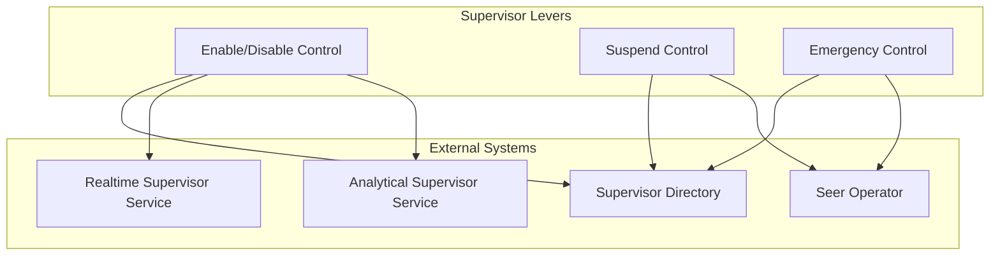
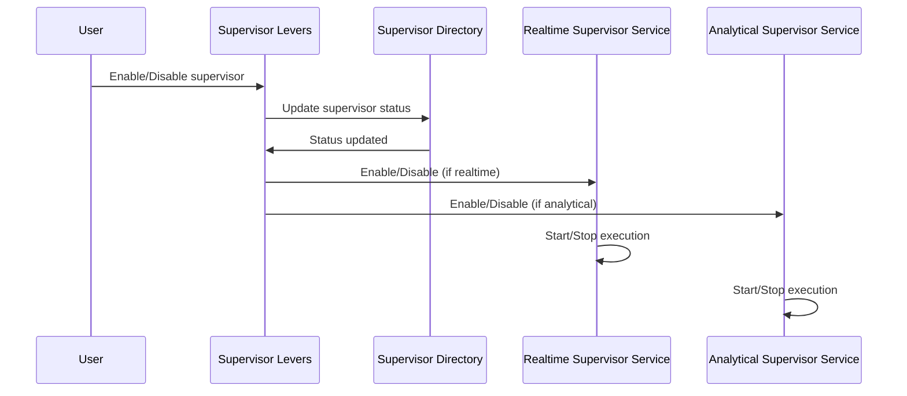
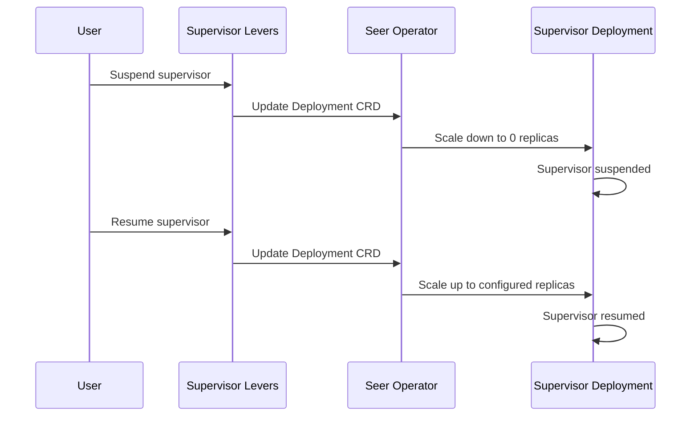
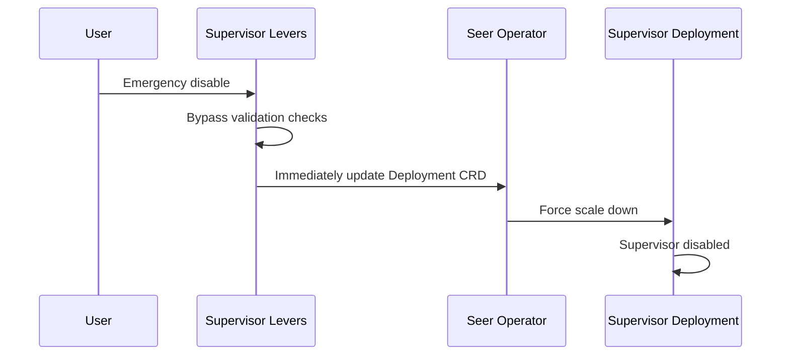

# Supervisor Levers

> **Status**: 🟢 Design Complete  
> **Last Updated**: 2026-01-13  
> **Design Level**: C2 (Container)

---

## Overview

Supervisor Levers provide runtime controls for supervisors. They enable/disable supervisors, suspend execution, and provide emergency controls for immediate supervisor management.

**Key Principle**: Supervisor Levers provide operational controls that affect supervisor execution without modifying supervisor specifications.

---

## Architecture



---

## Functional Scope

### Enable/Disable Control

Supervisor Levers enable or disable supervisors:

#### Enable Action

```yaml
enable_action:
  supervisor_id: "stuck-agent-detector"
  deployment_id: "stuck-agent-detector-deployment"
  action: "enable"
  effect: "Resume supervisor execution"
```

#### Disable Action

```yaml
disable_action:
  supervisor_id: "stuck-agent-detector"
  deployment_id: "stuck-agent-detector-deployment"
  action: "disable"
  effect: "Stop supervisor execution"
```

#### Enable/Disable Flow



---

### Suspend Control

Supervisor Levers suspend supervisor execution:

#### Suspend Action

```yaml
suspend_action:
  supervisor_id: "stuck-agent-detector"
  deployment_id: "stuck-agent-detector-deployment"
  action: "suspend"
  reason: "Maintenance window"
  effect: "Temporarily stop supervisor execution"
```

#### Resume Action

```yaml
resume_action:
  supervisor_id: "stuck-agent-detector"
  deployment_id: "stuck-agent-detector-deployment"
  action: "resume"
  effect: "Resume supervisor execution"
```

#### Suspend Flow



---

### Emergency Control

Supervisor Levers provide emergency controls:

#### Emergency Disable

```yaml
emergency_disable:
  supervisor_id: "stuck-agent-detector"
  deployment_id: "stuck-agent-detector-deployment"
  action: "emergency_disable"
  reason: "False positive rate too high"
  effect: "Immediately stop supervisor execution"
  bypass_checks: true
```

#### Emergency Controls

| Control | Description | Use Case |
|---------|-------------|----------|
| **Emergency Disable** | Immediately disable supervisor | False positives, performance issues |
| **Emergency Suspend** | Immediately suspend supervisor | Critical bug, security issue |
| **Emergency Archive** | Immediately archive supervisor | Deprecated supervisor |

#### Emergency Control Flow



---

## Integration Points

### Upstream Integration

| Service | Integration Method | Purpose |
|---------|-------------------|---------|
| **Supervisor Directory** | Status update API | Update supervisor status |

### Downstream Integration

| Service | Integration Method | Purpose |
|---------|-------------------|---------|
| **Seer Operator** | Deployment CRD updates | Control supervisor deployment |
| **Realtime Supervisor Service** | Enable/disable API | Control realtime supervisor execution |
| **Analytical Supervisor Service** | Enable/disable API | Control analytical supervisor execution |

---

## Key Design Decisions

### Runtime Controls

- **Levers provide runtime controls** without modifying specs
- **Enable/disable** for normal operational control
- **Suspend/resume** for temporary suspension
- **Emergency controls** for immediate response

### State Management

- **Levers update supervisor state** in Supervisor Directory
- **State transitions** coordinated via Supervisor Operators
- **Deployment state** managed via Seer Operator

### Emergency Response

- **Emergency controls bypass validation** for immediate response
- **Force state transitions** for critical situations
- **Audit trail** for all lever actions

---

## Related Documentation

- [Supervisor Operators](./supervisor-operators.md) — Lifecycle management and state transitions
- [Supervisor Directory](./supervisor-directory.md) — Registry and status tracking
- [Seer Operator](../../hub-integration/training-spec-crd.md) — CRD reconciliation

---

*Supervisor Levers provide runtime controls for supervisors, enabling operational management without spec modifications.*
