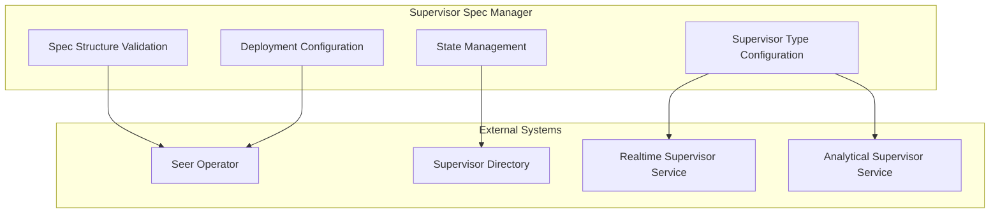
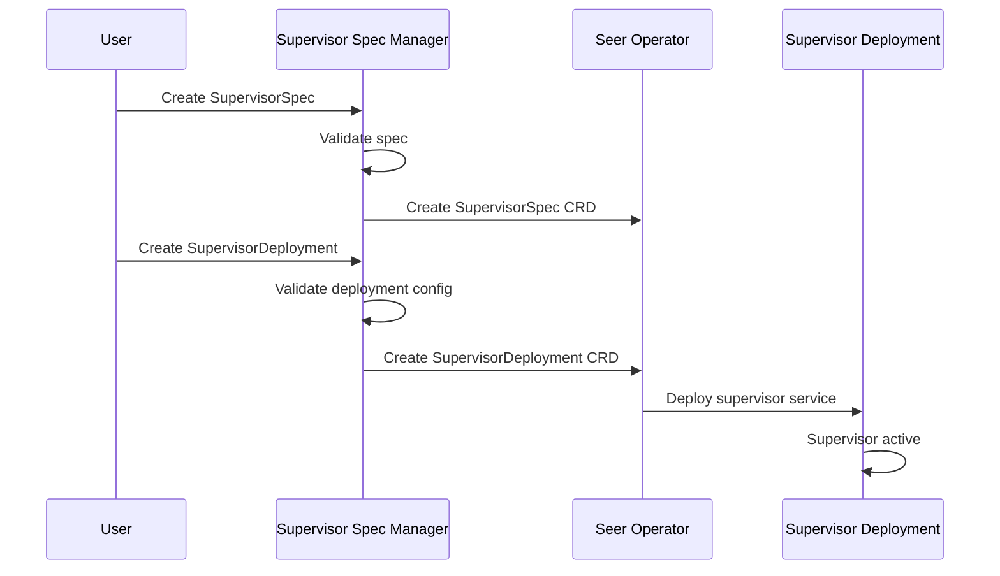

# Supervisor Spec Manager

> **Status**: 🟢 Design Complete  
> **Last Updated**: 2026-01-13  
> **Design Level**: C2 (Container)

---

## Overview

Supervisor Spec Manager is the foundational component of the Agent Session Supervisor subsystem. It manages Supervisor Specifications (SupervisorSpec CRDs) that define supervisory policies for agent sessions.

Supervisor Spec Manager handles spec structure validation, supervisor type configuration (Realtime vs. Analytical), and deployment configuration.

---

## Architecture



---

## Functional Scope

### Supervisor Spec Structure

Supervisor Spec Manager validates the complete structure of SupervisorSpec CRDs:

#### Core Components

| Component | Description | Validation Rules |
|-----------|-------------|------------------|
| **Supervisor Type** | Realtime or Analytical | Required, must be one of: `realtime`, `analytical` |
| **Supervisor Name** | Unique identifier | Required, must be unique within workbench |
| **Target Scope** | Agents/workbenches to supervise | Required, must specify agent_ids or workbench_ids |
| **Policy Definition** | OPA policy (Realtime) or SQL template (Analytical) | Required, validated for syntax |
| **Observation Configuration** | When to generate Observations vs. Exceptions | Required, must specify conditions |
| **Deployment Configuration** | Deployment CRD reference | Required for deployment |

#### Spec Structure Example

```yaml
apiVersion: seer.olympus.io/v1
kind: SupervisorSpec
metadata:
  name: stuck-agent-detector
  namespace: acme-disputes
spec:
  # Supervisor Type (required)
  type: realtime  # realtime | analytical
  
  # Target Scope (required)
  target:
    workbench_ids: ["acme-disputes"]
    agent_ids: []  # Empty = all agents in workbench
  
  # Policy Definition (required)
  policy:
    # For Realtime: OPA policy
    opa_policy: |
      package seer.supervisor.stuck_agent
      
      default allow = false
      
      allow {
        input.event_type == "agent_session_update"
        input.agent_id == data.target_agent_id
        time.now_ns() - input.last_activity_ns > 300000000000  # 5 minutes
      }
    
    # For Analytical: SQL template
    sql_template: |
      SELECT 
        agent_id,
        workbench_id,
        session_id,
        last_activity_time,
        current_time - last_activity_time as inactivity_duration
      FROM agent_sessions
      WHERE 
        workbench_id IN {{ .workbench_ids }}
        AND current_time - last_activity_time > INTERVAL '5 minutes'
        AND session_status = 'active'
  
  # Observation Configuration (required)
  observation_config:
    generate_observation:
      condition: "policy_result == true"
      observation_type: "agent_stuck"
      severity: "warning"
    
    generate_exception:
      condition: "policy_result == true AND inactivity_duration > INTERVAL '15 minutes'"
      exception_type: "agent_stuck_critical"
      criticality: "tier-1"
  
  # Deployment Configuration (required)
  deployment:
    enabled: true
    replicas: 2
    resources:
      cpu: "100m"
      memory: "256Mi"
```

---

### Supervisor Type Configuration

Supervisor Spec Manager configures supervisor types:

#### Realtime Supervisor

| Configuration | Description |
|---------------|-------------|
| **Event Source** | Signal Exchange (SX) events |
| **Policy Engine** | OPA policy evaluation |
| **Evaluation Trigger** | On SX event arrival |
| **Output** | Real-time Observations/Exceptions |

#### Analytical Supervisor

| Configuration | Description |
|---------------|-------------|
| **Data Source** | Agent Analytics data mart |
| **Query Engine** | Templated SQL execution |
| **Evaluation Trigger** | Periodic (configurable interval) |
| **Output** | Analytical Observations/Exceptions |

---

### Deployment Configuration

Supervisor Spec Manager manages deployment configuration:

#### Deployment CRD Structure

```yaml
apiVersion: seer.olympus.io/v1
kind: SupervisorDeployment
metadata:
  name: stuck-agent-detector-deployment
  namespace: acme-disputes
spec:
  supervisor_spec_ref:
    name: stuck-agent-detector
    version: "1.0.0"
  
  deployment_config:
    replicas: 2
    resources:
      cpu: "100m"
      memory: "256Mi"
    
    # For Realtime Supervisor
    realtime_config:
      event_subscriptions:
        - event_type: "agent_session_update"
          filters:
            workbench_id: "acme-disputes"
    
    # For Analytical Supervisor
    analytical_config:
      schedule: "*/5 * * * *"  # Every 5 minutes
      query_timeout: "30s"
```

#### Deployment Flow



---

### Spec Validation

Supervisor Spec Manager validates supervisor specs:

#### Validation Rules

| Validation Type | Description | Action on Failure |
|-----------------|-------------|-------------------|
| **Structure Validation** | Required fields present, correct types | Reject spec |
| **Supervisor Type Validation** | Type is `realtime` or `analytical` | Reject spec |
| **Policy Syntax Validation** | OPA policy syntax (Realtime) or SQL syntax (Analytical) | Reject spec |
| **Target Scope Validation** | Target agents/workbenches exist | Reject spec |
| **Observation Config Validation** | Observation/Exception conditions valid | Reject spec |
| **Deployment Config Validation** | Deployment configuration valid | Reject spec |

---

## Integration Points

### Upstream Integration

| Service | Integration Method | Purpose |
|---------|-------------------|---------|
| **Seer Operator** | CRD reconciliation | CRD creation and state management |

### Downstream Integration

| Service | Integration Method | Purpose |
|---------|-------------------|---------|
| **Supervisor Directory** | Spec registration | Registry and search |
| **Realtime Supervisor Service** | Spec configuration | Realtime supervisor execution |
| **Analytical Supervisor Service** | Spec configuration | Analytical supervisor execution |
| **Supervisor Operators** | Spec lifecycle | Registration and state transitions |

---

## Key Design Decisions

### Two Supervisor Types

- **Realtime Supervisor**: Observes SX events, evaluates OPA policies, generates real-time Observations/Exceptions
- **Analytical Supervisor**: Runs templated SQL on analytics data mart periodically, generates analytical Observations/Exceptions

### Deployment Model

- **Supervisors deployed via Deployment CRDs** referencing Spec CRDs
- **Deployment CRD corresponds to Spec CRD** where templatized definition is stored
- **Clear separation** between spec definition and deployment configuration

### Lifecycle Pattern

- **Follows same pattern** as Trained/Employed Agent lifecycle managers
- **Spec Manager handles validation** and structure management
- **Seer Operator reconciles** CRDs to Kubernetes state

---

## Related Documentation

- [Realtime Supervisor Service](./realtime-supervisor-service.md) — SX event observation and OPA policy evaluation
- [Analytical Supervisor Service](./analytical-supervisor-service.md) — SQL template execution on analytics data mart
- [Supervisor Operators](./supervisor-operators.md) — Lifecycle management and state transitions
- [Supervisor Directory](./supervisor-directory.md) — Registry and search

---

*Supervisor Spec Manager provides the foundation for Agent Session Supervisor by managing supervisor specifications and deployment configuration.*
