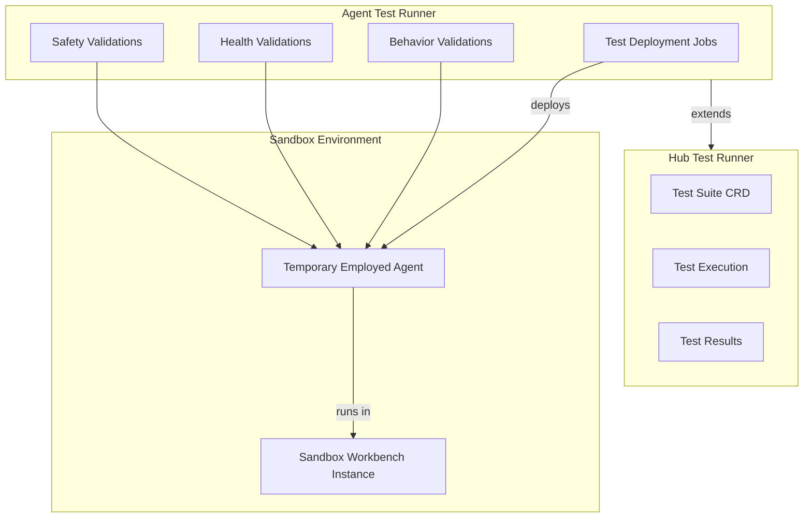

# Agent Test Runner

> **Status**: 🟢 Design Complete  
> **Last Updated**: 2026-01-13

## Overview

Agent Test Runner extends Hub Test Runner to provide testing capabilities for agents. It includes jobs to deploy temporary Employed Agents in sandbox workbench instances and validations for behavior (consistency, quality), health, and safety.

---

## Design Documents

| Document | Description | Status |
|----------|-------------|--------|
| [SCOPE.md](./SCOPE.md) | Design scope, MVP vs parked scope, key decisions | Overview |
| [Test Deployment Jobs](./test-deployment-jobs.md) | Temporary Employed Agent deployment for testing | C2 |
| [Behavior Validations](./behavior-validations.md) | Consistency and quality validations | C2 |
| [Health Validations](./health-validations.md) | Pod health, connectivity, stability checks | C2 |
| [Safety Validations](./safety-validations.md) | Guardrail enforcement validation | C2 |

---

## Architecture

---

## Key Design Decisions

### Extends Hub Test Runner

- **Agent Test Runner extends Hub Test Runner** rather than being a separate system
- Reuses Hub Test Runner infrastructure and test execution framework
- Adds agent-specific test types and assertions
- Consistent test management and reporting

### Temporary Deployment Model

- **Creates temporary Employment Specs** that combine Training Specs with minimal employment configuration
- Deploys temporary Employed Agents in **sandbox workbench instances**
- Automatic teardown after test execution completes
- Tests run in realistic deployment context

### MVP Scope: Go/No-Go Validations

- **MVP focuses on go/no-go checks** (pass/fail) rather than quality scoring
- Behavior: consistency and basic quality checks
- Health: pod health, model connectivity, memory stability
- Safety: guardrail enforcement, prohibited action blocking
- Advanced evaluations (quality scoring, benchmarks, regression) are **deferred to post-MVP** per ADR-0077

### Sandbox Isolation

- **All tests run in sandbox workbench instances** with isolated data
- Tests use synthetic or anonymized data
- Network isolation prevents external calls
- Test data reset between test runs

---

## MVP Scope (Validations)

| Validation Type | Description | Go/No-Go Check |
|----------------|-------------|---------------|
| **Behavior Consistency** | Agent responds consistently to same inputs | Pass/Fail |
| **Behavior Quality** | Basic output quality checks (completeness, format) | Pass/Fail |
| **Health** | Pod health, model connectivity, memory stability | Pass/Fail |
| **Safety** | Guardrail enforcement, prohibited actions blocked | Pass/Fail |

## Parked Scope (Evaluations)

See [parked-capabilities.md](./parked-capabilities.md) for capabilities deferred to post-MVP:
- Quality scoring and benchmarks
- Regression testing across versions
- Adversarial testing
- CI/CD quality gates

---

## Capabilities

Based on `olympus-hub-docs/scratchpad/seer-subsystems.md`:

- ✅ Jobs to deploy temporary Employed Agents in sandbox workbench instances
- ✅ Behavior validations (consistency, quality)
- ✅ Health validations (pod health, model connectivity, memory stability)
- ✅ Safety validations (guardrail enforcement, prohibited action blocking)

---

## Related Documentation

### Hub Test Runner
- [Hub Test Runner](../../../olympus-hub-docs/04-subsystems/ci-subsystem/test-runner.md) — Foundation test execution framework
- [ADR-0050: Hub Test Runner as Hub Application](../../../olympus-hub-docs/decision-logs/0050-test-runner-as-hub-application.md) — Test Runner architecture

### Related Subsystems
- [Trained Agent Lifecycle Manager](../trained-agent-lifecycle-manager/README.md) — Training Specs for test deployment
- [Agent Lifecycle Manager](../agent-lifecycle-manager/README.md) — Temporary Employment Spec management
- [Agent Runtime](../agent-runtime/README.md) — Agent pod deployment
- [Seer Sidecar](../seer-sidecar/README.md) — Guardrail enforcement validation

### Parked Capabilities
- [Parked Capabilities](./parked-capabilities.md) — Deferred evaluation capabilities
- [ADR-0077: Agent Evaluation Deferred](../../../olympus-hub-docs/decision-logs/0077-seer-evaluation-deferred.md) — Evaluation deferral rationale

---

*Agent Test Runner extends Hub Test Runner with agent-specific testing capabilities, enabling validation of agent behavior, health, and safety before deployment.*
