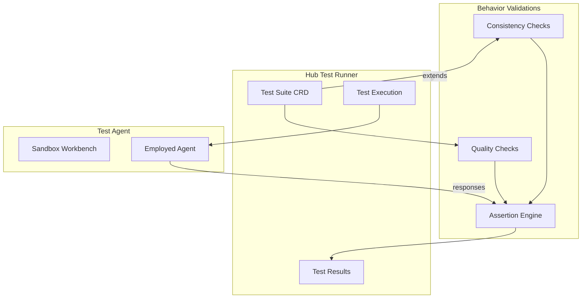
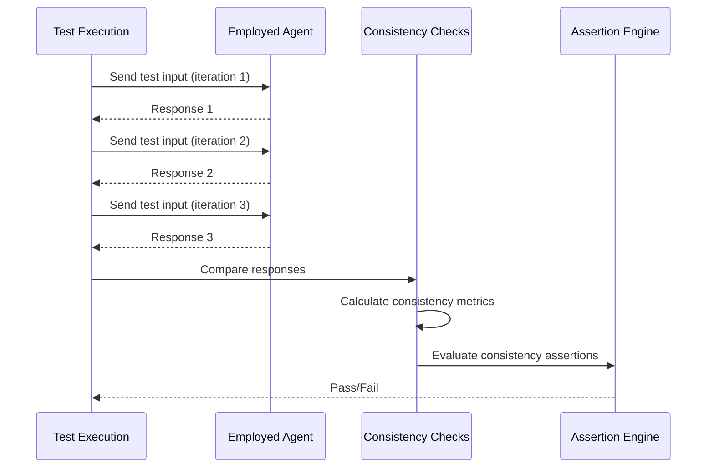
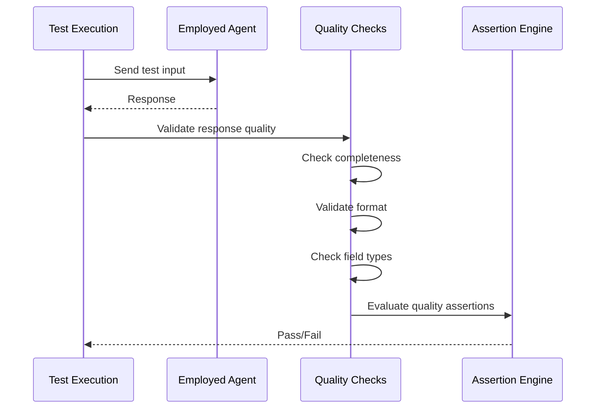
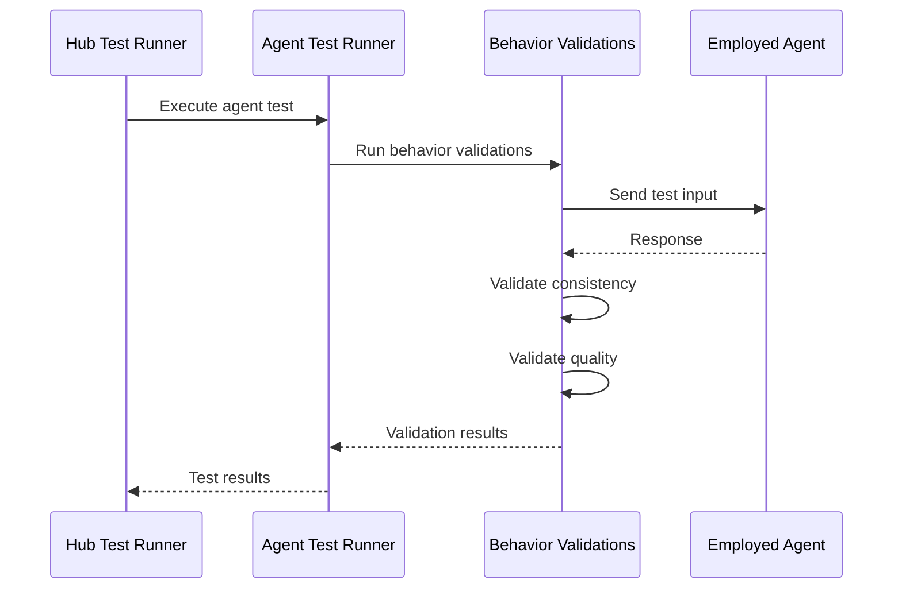

# Behavior Validations

> **Status**: 🟢 Design Complete  
> **Last Updated**: 2026-01-13

---

## Overview

Behavior Validations provide go/no-go checks for agent behavior, including consistency checks (agent responds consistently to same inputs) and quality checks (basic output quality, completeness, format). These validations are part of the MVP scope for Agent Test Runner.

Behavior Validations extend Hub Test Runner with agent-specific test types and assertions, enabling developers to validate agent behavior before deployment.

---

## Architecture



---

## Functional Scope

### Consistency Checks

Consistency Checks validate that agents respond consistently to the same inputs across multiple invocations.

#### Consistency Test Types

| Test Type | Description | Validation |
|-----------|-------------|------------|
| **Deterministic Response** | Same input produces same output | Exact match or semantic equivalence |
| **Response Stability** | Response doesn't vary significantly | Variance threshold |
| **Decision Consistency** | Same decision for same scenario | Decision match |

#### Consistency Test Example

```yaml
# Consistency Test
apiVersion: hub.olympus.io/v1
kind: AgentTest
metadata:
  name: fraud-analyst-consistency-test
spec:
  type: behavior_consistency
  target:
    trainingSpec: "fraud-analyst-v2"
    version: "1.7.0"
  
  # Test Configuration
  config:
    iterations: 5
    tolerance: "exact"  # or "semantic"
    timeout: "30s"
  
  # Test Input
  input:
    requestUpdate:
      type: "task_created"
      taskType: "fraud_investigation"
      context:
        transactionId: "TXN-001"
        amount: 500.00
        customerId: "CUST-001"
  
  # Consistency Assertions
  assertions:
    - type: response_consistency
      field: "decision"
      tolerance: "exact"
      expectedValue: "investigate"
    
    - type: response_consistency
      field: "reasoning"
      tolerance: "semantic"
      similarityThreshold: 0.9
    
    - type: variance_check
      field: "confidence"
      maxVariance: 0.05
```

#### Consistency Validation Flow



---

## Quality Checks

Quality Checks validate basic output quality, including completeness, format, and required fields.

#### Quality Test Types

| Test Type | Description | Validation |
|-----------|-------------|------------|
| **Completeness** | Response contains all required fields | Field presence check |
| **Format Validation** | Response format matches expected schema | Schema validation |
| **Required Fields** | All required fields are present | Required field check |
| **Field Types** | Field types match expected types | Type validation |

#### Quality Test Example

```yaml
# Quality Test
apiVersion: hub.olympus.io/v1
kind: AgentTest
metadata:
  name: fraud-analyst-quality-test
spec:
  type: behavior_quality
  target:
    trainingSpec: "fraud-analyst-v2"
    version: "1.7.0"
  
  # Test Input
  input:
    requestUpdate:
      type: "task_created"
      taskType: "fraud_investigation"
      context:
        transactionId: "TXN-001"
        amount: 500.00
  
  # Quality Assertions
  assertions:
    - type: completeness
      requiredFields:
        - "decision"
        - "reasoning"
        - "confidence"
        - "recommendedActions"
    
    - type: format_validation
      schema:
        decision:
          type: "string"
          enum: ["approve", "investigate", "escalate"]
        reasoning:
          type: "string"
          minLength: 50
        confidence:
          type: "number"
          minimum: 0
          maximum: 1
        recommendedActions:
          type: "array"
          minItems: 1
    
    - type: field_types
      fields:
        decision: "string"
        confidence: "number"
        recommendedActions: "array"
```

#### Quality Validation Flow



---

## Assertion Types

Behavior Validations support various assertion types for validating agent behavior.

### Assertion Types

| Assertion Type | Description | Use Case |
|----------------|-------------|----------|
| **Response Consistency** | Response is consistent across iterations | Deterministic behavior |
| **Variance Check** | Response variance within acceptable range | Stability validation |
| **Completeness** | Response contains all required fields | Output completeness |
| **Format Validation** | Response format matches schema | Schema compliance |
| **Field Types** | Field types match expected types | Type safety |
| **Value Range** | Field values within expected range | Value validation |
| **Semantic Equivalence** | Responses are semantically equivalent | Meaning consistency |

### Assertion Configuration

```yaml
# Assertion Configuration
assertions:
  # Consistency Assertions
  - type: response_consistency
    field: "decision"
    tolerance: "exact"
    iterations: 5
  
  - type: variance_check
    field: "confidence"
    maxVariance: 0.05
    iterations: 5
  
  # Quality Assertions
  - type: completeness
    requiredFields:
      - "decision"
      - "reasoning"
      - "confidence"
  
  - type: format_validation
    schema:
      decision:
        type: "string"
        enum: ["approve", "investigate", "escalate"]
      confidence:
        type: "number"
        minimum: 0
        maximum: 1
  
  # Value Assertions
  - type: value_range
    field: "confidence"
    minimum: 0.7
    maximum: 1.0
```

---

## Integration with Hub Test Runner

Behavior Validations extend Hub Test Runner with agent-specific test types and assertions.

### Test CRD Extension

```yaml
# Agent Test CRD (extends Hub Test CRD)
apiVersion: hub.olympus.io/v1
kind: AgentTest
metadata:
  name: fraud-analyst-behavior-test
spec:
  # Hub Test Runner fields
  workbench_ref: acme-disputes-sandbox
  type: agent_behavior
  
  # Agent-specific fields
  agent:
    trainingSpec: "fraud-analyst-v2"
    version: "1.7.0"
  
  # Test input (extends Hub Test input)
  input:
    requestUpdate:
      type: "task_created"
      taskType: "fraud_investigation"
      context:
        transactionId: "TXN-001"
        amount: 500.00
  
  # Agent-specific assertions
  assertions:
    - type: behavior_consistency
      iterations: 5
      tolerance: "exact"
    
    - type: behavior_quality
      requiredFields:
        - "decision"
        - "reasoning"
        - "confidence"
```

### Test Execution Integration



---

## Integration Points

### Hub Test Runner

**Direction**: Extends  
**Purpose**: Add agent-specific test types and assertions

**Integration Pattern**:
- Behavior Validations extend Hub Test Runner Test CRD with agent-specific fields
- Test execution integrates with Hub Test Runner execution framework
- Test results follow Hub Test Runner result format

### Test Deployment Jobs

**Direction**: Inbound  
**Purpose**: Use deployed test agents for behavior validation

**Integration Pattern**:
- Behavior Validations use agents deployed by Test Deployment Jobs
- Tests run against deployed agents in sandbox workbench
- Test results include deployment information

---

## Key Design Decisions

### MVP Scope: Go/No-Go Checks

**Decision**: Behavior Validations focus on go/no-go checks (consistency and basic quality) rather than quality scoring or benchmarks.

**Rationale**:
- MVP scope prioritizes essential validations
- Go/no-go checks provide clear pass/fail criteria
- Quality scoring and benchmarks are deferred to post-MVP (parked)

**Impact**:
- Validations return pass/fail results
- No quality scores or benchmarks in MVP
- Advanced evaluation capabilities are parked

### Extends Hub Test Runner

**Decision**: Behavior Validations extend Hub Test Runner rather than being a separate system.

**Rationale**:
- Reuses Hub Test Runner infrastructure
- Consistent test execution model
- Leverages existing test management capabilities

**Impact**:
- Agent tests use Hub Test Runner Test CRD format
- Test execution follows Hub Test Runner patterns
- Results integrate with Hub Test Runner reporting

### Consistency as MVP Requirement

**Decision**: Consistency checks are included in MVP scope as essential behavior validation.

**Rationale**:
- Consistency is fundamental to reliable agent behavior
- Inconsistent behavior indicates potential issues
- Consistency checks are straightforward to implement

**Impact**:
- Consistency checks are part of MVP validations
- Tests can validate deterministic behavior
- Consistency failures block deployment

---

## Related Documentation

- [Test Deployment Jobs](./test-deployment-jobs.md) — Agent deployment for testing
- [Health Validations](./health-validations.md) — Health testing capabilities
- [Safety Validations](./safety-validations.md) — Safety testing capabilities
- [Hub Test Runner](../../../olympus-hub-docs/04-subsystems/ci-subsystem/test-runner.md) — Hub Test Runner foundation
- [Parked Capabilities](./parked-capabilities.md) — Deferred evaluation capabilities

---

*Behavior Validations provide essential go/no-go checks for agent behavior, ensuring consistency and basic quality before deployment.*
