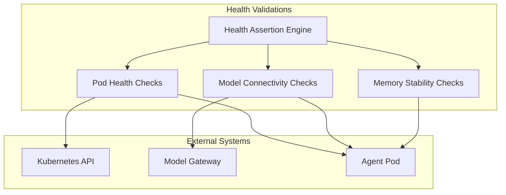
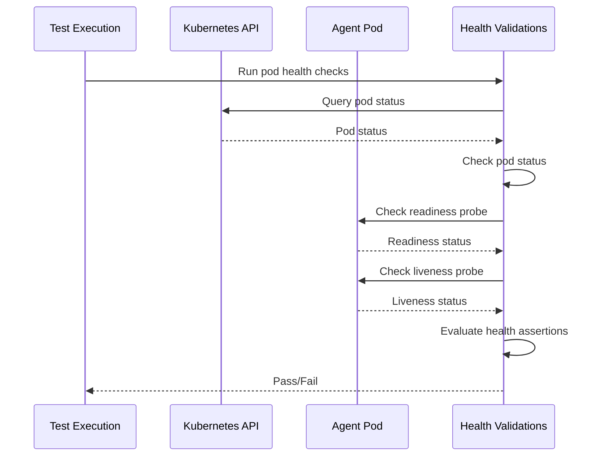
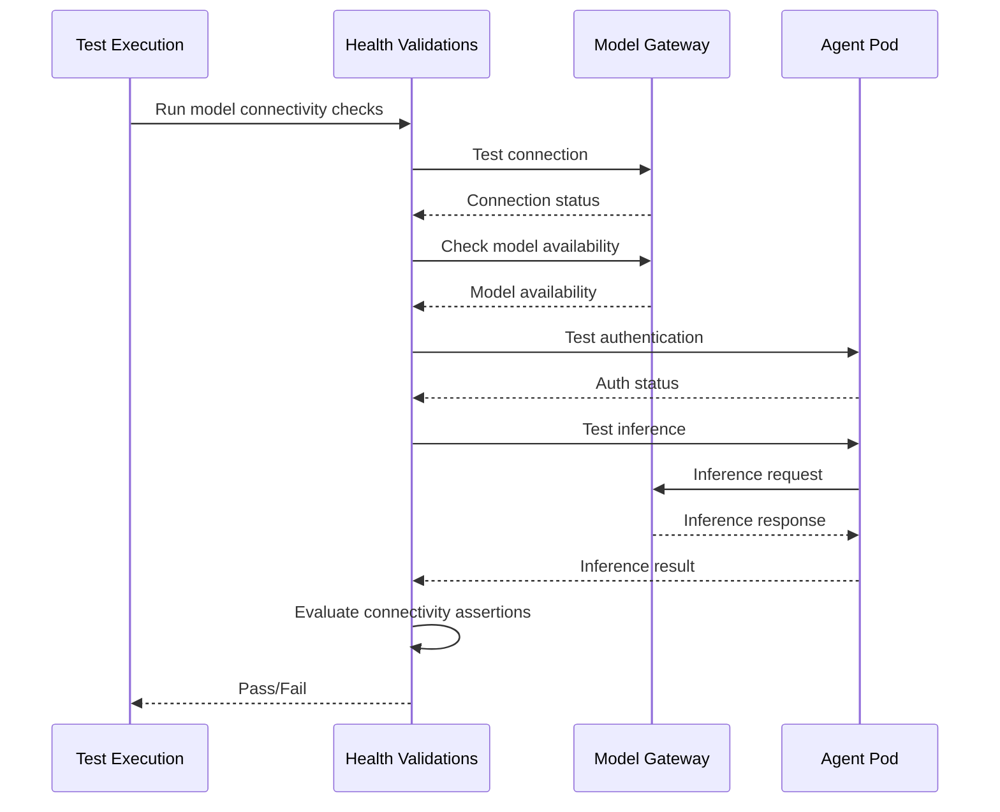
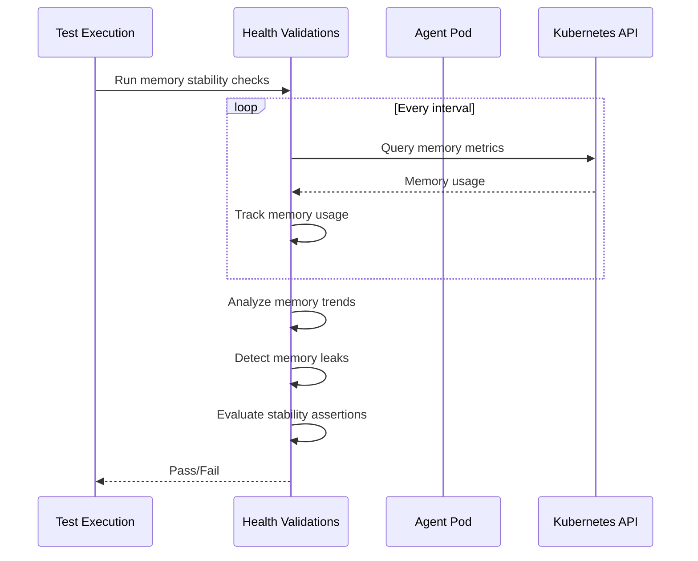

# Health Validations

> **Status**: 🟢 Design Complete  
> **Last Updated**: 2026-01-13

---

## Overview

Health Validations provide go/no-go checks for agent health, including pod health, model connectivity, and memory stability. These validations are part of the MVP scope for Agent Test Runner.

Health Validations ensure that deployed agents are healthy and ready for production use, validating infrastructure and runtime health rather than behavior.

---

## Architecture



---

## Functional Scope

### Pod Health Checks

Pod Health Checks validate that agent pods are running, healthy, and ready to handle requests.

#### Health Check Types

| Check Type | Description | Validation |
|------------|-------------|------------|
| **Pod Status** | Pod is in Running state | Status check |
| **Readiness Probe** | Pod passes readiness probe | Readiness check |
| **Liveness Probe** | Pod passes liveness probe | Liveness check |
| **Resource Usage** | Pod resource usage within limits | Resource check |
| **Container Status** | All containers are running | Container status check |

#### Pod Health Test Example

```yaml
# Pod Health Test
apiVersion: hub.olympus.io/v1
kind: AgentTest
metadata:
  name: fraud-analyst-pod-health-test
spec:
  type: health_pod
  target:
    trainingSpec: "fraud-analyst-v2"
    version: "1.7.0"
  
  # Health Check Configuration
  config:
    timeout: "5m"
    retries: 3
    interval: "30s"
  
  # Pod Health Assertions
  assertions:
    - type: pod_status
      expectedStatus: "Running"
      timeout: "2m"
    
    - type: readiness_probe
      required: true
      timeout: "1m"
    
    - type: liveness_probe
      required: true
      timeout: "1m"
    
    - type: container_status
      allContainers: true
      expectedStatus: "Running"
    
    - type: resource_usage
      cpu:
        maxUsage: "80%"
      memory:
        maxUsage: "80%"
```

#### Pod Health Validation Flow



---

## Model Connectivity Checks

Model Connectivity Checks validate that agents can successfully connect to and communicate with Model Gateway.

#### Connectivity Check Types

| Check Type | Description | Validation |
|------------|-------------|------------|
| **Model Gateway Connection** | Agent can connect to Model Gateway | Connection check |
| **Model Availability** | Required models are available | Model availability check |
| **Authentication** | Agent authentication succeeds | Auth check |
| **Test Inference** | Agent can perform test inference | Inference check |

#### Model Connectivity Test Example

```yaml
# Model Connectivity Test
apiVersion: hub.olympus.io/v1
kind: AgentTest
metadata:
  name: fraud-analyst-model-connectivity-test
spec:
  type: health_model_connectivity
  target:
    trainingSpec: "fraud-analyst-v2"
    version: "1.7.0"
  
  # Connectivity Check Configuration
  config:
    timeout: "2m"
    retries: 3
    testInference: true
  
  # Model Connectivity Assertions
  assertions:
    - type: model_gateway_connection
      endpoint: "model-gateway.olympus.io"
      timeout: "30s"
    
    - type: model_availability
      requiredModels:
        - "gpt-4"
        - "claude-3-opus"
      timeout: "1m"
    
    - type: authentication
      method: "spiffe"
      timeout: "30s"
    
    - type: test_inference
      prompt: "Test connection"
      expectedResponse: "success"
      timeout: "1m"
```

#### Model Connectivity Validation Flow



---

## Memory Stability Checks

Memory Stability Checks validate that agent memory usage is stable and doesn't exhibit memory leaks.

#### Stability Check Types

| Check Type | Description | Validation |
|------------|-------------|------------|
| **Memory Usage** | Memory usage within limits | Usage check |
| **Memory Growth** | Memory doesn't grow unbounded | Growth check |
| **Memory Leaks** | No memory leaks detected | Leak detection |
| **GC Behavior** | Garbage collection is functioning | GC check |

#### Memory Stability Test Example

```yaml
# Memory Stability Test
apiVersion: hub.olympus.io/v1
kind: AgentTest
metadata:
  name: fraud-analyst-memory-stability-test
spec:
  type: health_memory_stability
  target:
    trainingSpec: "fraud-analyst-v2"
    version: "1.7.0"
  
  # Stability Check Configuration
  config:
    duration: "10m"
    interval: "1m"
    maxMemoryGrowth: "10%"
  
  # Memory Stability Assertions
  assertions:
    - type: memory_usage
      maxUsage: "1Gi"
      threshold: "80%"
    
    - type: memory_growth
      maxGrowth: "10%"
      duration: "10m"
    
    - type: memory_leak
      detectionMethod: "trend_analysis"
      threshold: "5%"
    
    - type: gc_behavior
      required: true
      maxGCTime: "100ms"
```

#### Memory Stability Validation Flow



---

## Assertion Types

Health Validations support various assertion types for validating agent health.

### Assertion Types

| Assertion Type | Description | Use Case |
|----------------|-------------|----------|
| **Pod Status** | Pod is in expected state | Basic health |
| **Readiness Probe** | Pod passes readiness checks | Readiness validation |
| **Liveness Probe** | Pod passes liveness checks | Liveness validation |
| **Container Status** | All containers are running | Container health |
| **Resource Usage** | Resource usage within limits | Resource validation |
| **Model Gateway Connection** | Connection to Model Gateway succeeds | Connectivity |
| **Model Availability** | Required models are available | Model access |
| **Authentication** | Authentication succeeds | Auth validation |
| **Test Inference** | Test inference succeeds | Inference validation |
| **Memory Usage** | Memory usage within limits | Memory validation |
| **Memory Growth** | Memory growth within acceptable range | Stability |
| **Memory Leak** | No memory leaks detected | Leak detection |

### Assertion Configuration

```yaml
# Health Assertion Configuration
assertions:
  # Pod Health Assertions
  - type: pod_status
    expectedStatus: "Running"
    timeout: "2m"
  
  - type: readiness_probe
    required: true
    timeout: "1m"
  
  - type: resource_usage
    cpu:
      maxUsage: "80%"
    memory:
      maxUsage: "80%"
  
  # Model Connectivity Assertions
  - type: model_gateway_connection
    endpoint: "model-gateway.olympus.io"
    timeout: "30s"
  
  - type: model_availability
    requiredModels:
      - "gpt-4"
    timeout: "1m"
  
  # Memory Stability Assertions
  - type: memory_usage
    maxUsage: "1Gi"
    threshold: "80%"
  
  - type: memory_growth
    maxGrowth: "10%"
    duration: "10m"
```

---

## Integration Points

### Kubernetes API

**Direction**: Outbound  
**Purpose**: Query pod status and resource metrics

**Integration Pattern**:
- Health Validations query Kubernetes API for pod status
- Resource metrics retrieved from Kubernetes metrics API
- Health checks use Kubernetes readiness/liveness probe results

### Model Gateway

**Direction**: Outbound  
**Purpose**: Test model connectivity and availability

**Integration Pattern**:
- Health Validations test connection to Model Gateway
- Model availability checked via Model Gateway API
- Test inference performed to validate connectivity

### Test Deployment Jobs

**Direction**: Inbound  
**Purpose**: Use deployed test agents for health validation

**Integration Pattern**:
- Health Validations use agents deployed by Test Deployment Jobs
- Health checks run against deployed agents in sandbox workbench
- Health results include deployment information

---

## Key Design Decisions

### MVP Scope: Infrastructure Health

**Decision**: Health Validations focus on infrastructure and runtime health (pod, connectivity, memory) rather than behavior health.

**Rationale**:
- Infrastructure health is prerequisite for behavior validation
- Pod and connectivity issues prevent behavior testing
- Memory stability is essential for production readiness

**Impact**:
- Health validations check infrastructure health
- Behavior health is separate (Behavior Validations)
- Health failures block deployment

### Go/No-Go Checks

**Decision**: Health Validations return pass/fail results rather than health scores.

**Rationale**:
- MVP scope prioritizes essential health checks
- Go/no-go checks provide clear deployment criteria
- Health scoring can be added post-MVP

**Impact**:
- Validations return pass/fail results
- No health scores in MVP
- Clear deployment gates

---

## Related Documentation

- [Test Deployment Jobs](./test-deployment-jobs.md) — Agent deployment for testing
- [Behavior Validations](./behavior-validations.md) — Behavior testing capabilities
- [Safety Validations](./safety-validations.md) — Safety testing capabilities
- [Hub Test Runner](../../../olympus-hub-docs/04-subsystems/ci-subsystem/test-runner.md) — Hub Test Runner foundation

---

*Health Validations ensure that deployed agents are healthy and ready for production use, validating infrastructure and runtime health.*
