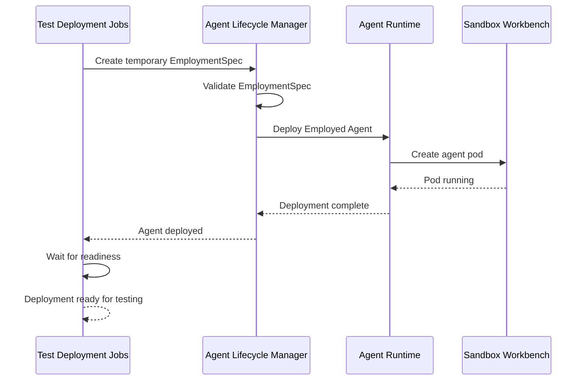
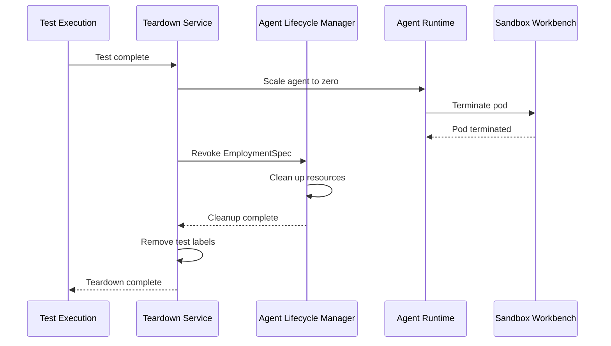

# Test Deployment Jobs

> **Status**: 🟢 Design Complete  
> **Last Updated**: 2026-01-13

---

## Overview

Test Deployment Jobs handle the deployment of temporary Employed Agents in sandbox workbench instances for testing purposes. Since Raw Agents and Trained Agents are not directly deployable, Test Deployment Jobs create temporary Employment Specs and deploy Employed Agents that reference the Training Spec being tested.

Test deployments are isolated in sandbox workbench instances and are automatically torn down after test execution completes.

---

## Architecture

```mermaid
flowchart TB
    subgraph TestDeployment[Test Deployment Jobs]
        TempSpecGen[Temporary Employment Spec Generation]
        SandboxDeploy[Sandbox Deployment]
        Teardown[Teardown Service]
    end
    
    subgraph ExternalSystems[External Systems]
        TALM[Trained Agent Lifecycle Manager]
        ALM[Agent Lifecycle Manager]
        AgentRuntime[Agent Runtime]
        SandboxWB[Sandbox Workbench Instance]
    end
    
    TALM -->|"Training Spec"| TempSpecGen
    TempSpecGen --> ALM
    ALM --> AgentRuntime
    AgentRuntime -->|"Deploy"| SandboxWB
    SandboxWB -->|"Test Execution"| TestDeployment
    TestDeployment --> Teardown
    Teardown --> AgentRuntime
    Teardown --> ALM
```



---

## Functional Scope

### Temporary Employment Spec Generation

Test Deployment Jobs generate temporary Employment Specs that combine a Training Spec with minimal employment configuration for testing purposes.

#### Employment Spec Structure

```yaml
# Temporary Employment Spec for Testing
apiVersion: seer.olympus.io/v1
kind: EmploymentSpec
metadata:
  name: test-fraud-analyst-v2-001
  namespace: acme-disputes-sandbox
  labels:
    seer.olympus.io/resource-type: test-employment
    seer.olympus.io/test-run-id: "test-run-20260113-001"
    seer.olympus.io/auto-cleanup: "true"
spec:
  # Training Spec Reference
  trainingSpec:
    name: fraud-analyst-v2
    version: "1.7.0"
    namespace: acme-disputes
  
  # Minimal Authority Configuration
  authority:
    delegation:
      type: test
      delegator: "system:agent-test-runner"
      accountable: "user:test-runner@acme.com"
    ceilings:
      # Minimal ceilings for testing
      value:
        maxSingleTransaction: 1000  # Lower than production
      scope:
        customerTiers: ["test"]
  
  # Workbench Assignment
  workbench:
    name: acme-disputes-sandbox
    instance: sandbox-test-001
  
  # Minimal Resource Quotas
  resourceQuotas:
    compute:
      cpu: "500m"
      memory: "1Gi"
    tokens:
      perRequest: 10000
      perDay: 100000
  
  # Test-Specific Configuration
  testConfig:
    isolation: "sandbox"
    dataSource: "synthetic"
    cleanupAfter: "test_completion"
    timeout: "30m"
```

#### Generation Rules

| Rule | Description | Rationale |
|------|-------------|-----------|
| **Minimal Authority** | Test-specific authority with lower ceilings | Safety: test agents have limited authority |
| **Sandbox Workbench** | Always deploy to sandbox workbench instances | Isolation: tests don't affect production |
| **Auto-Cleanup** | Mark for automatic teardown after tests | Resource management: prevent resource leaks |
| **Test Labels** | Label with test run ID for tracking | Traceability: link deployments to test runs |
| **Synthetic Data** | Use synthetic or anonymized data | Privacy: no real customer data in tests |

---

## Sandbox Deployment

Sandbox Deployment handles the actual deployment of temporary Employed Agents in sandbox workbench instances.

### Deployment Flow



### Deployment Steps

| Step | Description | Validation |
|------|-------------|------------|
| **1. Employment Spec Creation** | Create temporary EmploymentSpec CRD | Schema validation |
| **2. Authority Provisioning** | Provision test authority via Cipher IAM | IAM validation |
| **3. Agent Runtime Deployment** | Deploy agent pod in sandbox workbench | Runtime validation |
| **4. Readiness Check** | Wait for agent pod to be ready | Health check |
| **5. Test Environment Setup** | Configure test data and environment | Environment validation |

### Sandbox Workbench Configuration

```yaml
# Sandbox Workbench Instance for Testing
apiVersion: hub.olympus.io/v1
kind: WorkbenchInstance
metadata:
  name: acme-disputes-sandbox
  labels:
    hub.olympus.io/lifecycle-stage: dev
    hub.olympus.io/purpose: testing
spec:
  workbenchSpec: acme-disputes
  environment: sandbox
  
  # Synthetic or anonymized data
  dataSource:
    type: synthetic
    generator: dispute-synthetic-v1
  
  # Isolated from production systems
  isolation:
    network: sandbox-only
    externalCalls: mocked
  
  # Test-specific resources
  resources:
    data_stores:
      - ref: ganymede-test-db
        reset_on_test_run: true
    caches:
      - ref: callisto-test-cache
        flush_on_test_run: true
```

---

## Teardown Service

Teardown Service handles the cleanup of temporary Employed Agents after test execution completes.

### Teardown Triggers

| Trigger | Description | Timing |
|--------|-------------|--------|
| **Test Completion** | Tests complete successfully or fail | Immediate |
| **Test Timeout** | Tests exceed timeout threshold | After timeout |
| **Manual Teardown** | Explicit teardown request | On demand |
| **Error Recovery** | Test execution error requires cleanup | On error |

### Teardown Flow



### Teardown Steps

| Step | Description | Cleanup Scope |
|------|-------------|---------------|
| **1. Agent Pod Termination** | Scale agent pod to zero | Pod resources |
| **2. Employment Spec Revocation** | Revoke temporary EmploymentSpec | IAM credentials, authority |
| **3. Resource Cleanup** | Clean up allocated resources | Quotas, budgets |
| **4. Test Data Cleanup** | Reset test data stores | Test data |
| **5. Label Removal** | Remove test-specific labels | Metadata cleanup |

### Teardown Configuration

```yaml
# Teardown Configuration
teardown:
  triggers:
    - type: test_completion
      action: immediate
    - type: timeout
      timeout: "30m"
      action: force_teardown
    - type: error
      action: immediate
  
  cleanup:
    agentPod: true
    employmentSpec: true
    resources: true
    testData: true
    labels: true
  
  retention:
    logs: "24h"
    metrics: "7d"
    artifacts: "30d"
```

---

## Integration Points

### Trained Agent Lifecycle Manager

**Direction**: Inbound  
**Purpose**: Retrieve Training Specs for test deployment

**Integration Pattern**:
- Test Deployment Jobs query Trained Agent Lifecycle Manager for Training Specs
- Training Specs must be in "Published" or "Active" state for testing
- Training Spec configuration is used to generate temporary Employment Specs

### Agent Lifecycle Manager

**Direction**: Outbound  
**Purpose**: Create and manage temporary Employment Specs

**Integration Pattern**:
- Test Deployment Jobs create temporary EmploymentSpec CRDs via Agent Lifecycle Manager
- Agent Lifecycle Manager validates and provisions authority
- Agent Lifecycle Manager manages Employment Spec lifecycle during testing

### Agent Runtime

**Direction**: Outbound  
**Purpose**: Deploy and manage agent pods

**Integration Pattern**:
- Test Deployment Jobs request agent pod deployment via Agent Runtime
- Agent Runtime deploys agent pods in sandbox workbench instances
- Agent Runtime handles pod lifecycle (creation, readiness, termination)

### Sandbox Workbench

**Direction**: Outbound  
**Purpose**: Provide isolated test environment

**Integration Pattern**:
- Test Deployment Jobs deploy to sandbox workbench instances
- Sandbox workbench provides isolated environment with synthetic data
- Test data is reset between test runs

---

## Key Design Decisions

### Temporary Employment Spec Model

**Decision**: Test deployments create temporary Employment Specs that combine Training Specs with minimal employment configuration.

**Rationale**:
- Raw/Trained Agents are not directly deployable; only Employed Agents are deployable
- Temporary Employment Specs provide minimal configuration for testing
- Enables testing of Training Specs in realistic deployment context

**Impact**:
- Test Deployment Jobs generate temporary Employment Specs
- Employment Specs are marked for auto-cleanup
- Tests run in realistic deployment environment

### Sandbox Isolation

**Decision**: All test deployments run in sandbox workbench instances with isolated data.

**Rationale**:
- Tests should not affect production systems
- Sandbox isolation ensures test safety
- Synthetic data prevents privacy concerns

**Impact**:
- Test deployments always target sandbox workbenches
- Test data is synthetic or anonymized
- Network isolation prevents external calls

### Automatic Teardown

**Decision**: Test deployments are automatically torn down after test execution completes.

**Rationale**:
- Prevents resource leaks from test deployments
- Ensures clean test environment for subsequent tests
- Reduces manual cleanup burden

**Impact**:
- Teardown Service automatically cleans up after tests
- Test deployments are marked for auto-cleanup
- Teardown is triggered by test completion, timeout, or error

---

## Related Documentation

- [Behavior Validations](./behavior-validations.md) — Behavior testing capabilities
- [Health Validations](./health-validations.md) — Health testing capabilities
- [Safety Validations](./safety-validations.md) — Safety testing capabilities
- [Hub Test Runner](../../../olympus-hub-docs/04-subsystems/ci-subsystem/test-runner.md) — Hub Test Runner foundation
- [Agent Lifecycle Manager](../agent-lifecycle-manager/README.md) — Employment Spec management

---

*Test Deployment Jobs enable testing of Training Specs by deploying temporary Employed Agents in isolated sandbox workbench instances.*
