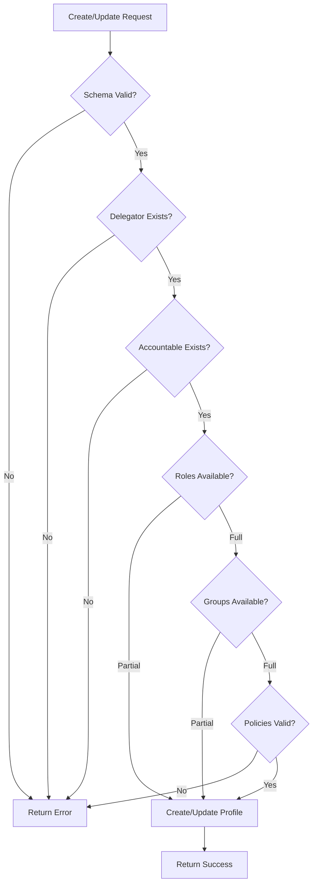

# Agent Profile API

> **Status**: 🟢 Complete  
> **Last Updated**: 2026-01-12

---

## Overview

The Agent Profile API provides endpoints for creating, updating, and managing agent profiles. This document provides C3-level detail on API specification, endpoints, request/response schemas, and error handling.

---

## API Endpoints

### Endpoint Summary

| Method | Path | Description |
|--------|------|-------------|
| `POST` | `/v1/agents/profiles` | Create agent profile |
| `GET` | `/v1/agents/profiles/{profile_id}` | Get agent profile |
| `PUT` | `/v1/agents/profiles/{profile_id}` | Update agent profile |
| `DELETE` | `/v1/agents/profiles/{profile_id}` | Delete agent profile |
| `POST` | `/v1/agents/profiles/{profile_id}/revoke` | Revoke profile (kill switch) |
| `GET` | `/v1/agents/profiles/{profile_id}/delegation` | Get delegation chain |

---

## Create Agent Profile (C3 Detail)

### Request

```http
POST /v1/agents/profiles
Content-Type: application/json
Authorization: Bearer {operator_token}
```

### Request Schema

```json
{
  "profileId": "fraud-analyst-acme-retail",
  "type": "employed",
  
  "identity": {
    "subscription": "acme-seer-subscription",
    "workbench": "acme-disputes",
    "agentCode": "fraud-analyst-acme-retail"
  },
  
  "delegation": {
    "type": "user",
    "delegator": "user:john.smith@acme.com",
    "accountable": "user:jane.manager@acme.com",
    "roles": "*",
    "groups": "disputes-team,fraud-analysts"
  },
  
  "policies": [
    {
      "pep": "tool-gateway",
      "policyRef": "policies/tool-gateway-restrictions.rego"
    },
    {
      "pep": "model-gateway",
      "policyRef": "policies/model-access.rego"
    }
  ]
}
```

### Request Field Descriptions

| Field | Type | Required | Description |
|-------|------|----------|-------------|
| `profileId` | string | Yes | Unique profile identifier |
| `type` | enum | Yes | Profile type: `raw`, `trained`, `employed` |
| `identity.subscription` | string | Yes | Seer subscription ID |
| `identity.workbench` | string | Yes | Workbench ID |
| `identity.agentCode` | string | Yes | Unique agent code |
| `delegation.type` | enum | Yes | Delegation type: `user`, `role`, `bot` |
| `delegation.delegator` | string | No | Identity delegating authority (not for `bot`) |
| `delegation.accountable` | string | Yes | Accountable human identity |
| `delegation.roles` | string | No | `*` or CSV of roles |
| `delegation.groups` | string | No | `*` or CSV of groups |
| `policies[]` | array | No | Per-PEP policy configurations |
| `policies[].pep` | string | Yes | Policy Enforcement Point ID |
| `policies[].policyRef` | string | Yes | Policy file reference |

### Response Schema

```json
{
  "profileId": "fraud-analyst-acme-retail",
  "status": "active",
  
  "identity": {
    "spiffeId": "spiffe://acme.hub.io/seer/agent/acme-seer-subscription/fraud-analyst-acme-retail",
    "subscription": "acme-seer-subscription",
    "workbench": "acme-disputes"
  },
  
  "delegation": {
    "type": "user",
    "delegator": "user:john.smith@acme.com",
    "accountable": "user:jane.manager@acme.com",
    "inheritedRoles": ["fraud-reviewer", "dispute-handler"],
    "inheritedGroups": ["disputes-team", "fraud-analysts"],
    "warnings": []
  },
  
  "credentials": {
    "virtualKey": "vk_acme_fraud_analyst_retail_001",
    "tokenSecretRef": "fraud-analyst-acme-retail-secrets"
  },
  
  "metadata": {
    "createdAt": "2026-01-12T10:00:00Z",
    "version": 1
  }
}
```

### Response Codes

| Code | Description |
|------|-------------|
| `201 Created` | Profile created successfully |
| `400 Bad Request` | Invalid request schema |
| `401 Unauthorized` | Invalid or missing authorization |
| `403 Forbidden` | Insufficient permissions |
| `409 Conflict` | Profile ID already exists |
| `422 Unprocessable Entity` | Delegation validation failed |

---

## Get Agent Profile

### Request

```http
GET /v1/agents/profiles/{profile_id}
Authorization: Bearer {token}
```

### Response

```json
{
  "profileId": "fraud-analyst-acme-retail",
  "type": "employed",
  "status": "active",
  
  "identity": {
    "spiffeId": "spiffe://acme.hub.io/seer/agent/acme-seer-subscription/fraud-analyst-acme-retail",
    "subscription": "acme-seer-subscription",
    "workbench": "acme-disputes"
  },
  
  "delegation": {
    "type": "user",
    "delegator": "user:john.smith@acme.com",
    "accountable": "user:jane.manager@acme.com",
    "inheritedRoles": ["fraud-reviewer", "dispute-handler"],
    "inheritedGroups": ["disputes-team", "fraud-analysts"],
    "warnings": []
  },
  
  "policies": [
    {
      "pep": "tool-gateway",
      "policyRef": "policies/tool-gateway-restrictions.rego",
      "status": "loaded"
    }
  ],
  
  "metadata": {
    "createdAt": "2026-01-12T10:00:00Z",
    "updatedAt": "2026-01-12T14:30:00Z",
    "version": 3
  }
}
```

---

## Update Agent Profile

### Request

```http
PUT /v1/agents/profiles/{profile_id}
Content-Type: application/json
Authorization: Bearer {operator_token}
```

### Request Schema

Same as create, but only changed fields need to be included. The API performs a merge update.

### Partial Update Example

```json
{
  "delegation": {
    "roles": "fraud-reviewer,case-closer"
  }
}
```

### Response Codes

| Code | Description |
|------|-------------|
| `200 OK` | Profile updated successfully |
| `400 Bad Request` | Invalid request schema |
| `404 Not Found` | Profile not found |
| `409 Conflict` | Version conflict (optimistic locking) |
| `422 Unprocessable Entity` | Delegation validation failed |

---

## Delete Agent Profile

### Request

```http
DELETE /v1/agents/profiles/{profile_id}
Authorization: Bearer {operator_token}
```

### Response

```json
{
  "profileId": "fraud-analyst-acme-retail",
  "status": "deleted",
  "deletedAt": "2026-01-12T16:00:00Z"
}
```

### Response Codes

| Code | Description |
|------|-------------|
| `200 OK` | Profile deleted successfully |
| `404 Not Found` | Profile not found |
| `409 Conflict` | Profile still in use (pods running) |

---

## Revoke Profile (Kill Switch)

### Request

```http
POST /v1/agents/profiles/{profile_id}/revoke
Content-Type: application/json
Authorization: Bearer {operator_token}
```

### Request Schema

```json
{
  "reason": "Security incident SI-12345",
  "revokedBy": "user:security@acme.com"
}
```

### Response

```json
{
  "profileId": "fraud-analyst-acme-retail",
  "status": "revoked",
  "revokedAt": "2026-01-12T15:00:00Z",
  "revokedBy": "user:security@acme.com",
  "reason": "Security incident SI-12345"
}
```

### Revocation Effects

1. **Immediate** — All active tokens are invalidated
2. **Immediate** — Profile status set to `revoked`
3. **Cascading** — Agent Runtime notified to terminate pods
4. **Audit** — Revocation logged to CAF

---

## Get Delegation Chain

### Request

```http
GET /v1/agents/profiles/{profile_id}/delegation
Authorization: Bearer {token}
```

### Response

```json
{
  "profileId": "fraud-analyst-acme-retail",
  "delegationChain": [
    {
      "level": 0,
      "identity": "agent:fraud-analyst-acme-retail",
      "type": "employed_agent"
    },
    {
      "level": 1,
      "identity": "user:john.smith@acme.com",
      "type": "delegator"
    },
    {
      "level": 2,
      "identity": "user:jane.manager@acme.com",
      "type": "accountable"
    }
  ],
  "inheritedAuthority": {
    "roles": ["fraud-reviewer", "dispute-handler"],
    "groups": ["disputes-team", "fraud-analysts"]
  }
}
```

---

## Error Handling (C3 Detail)

### Error Response Schema

```json
{
  "error": {
    "code": "DELEGATION_VALIDATION_FAILED",
    "message": "Requested roles not available from delegator",
    "details": {
      "requestedRoles": ["fraud-reviewer", "case-closer"],
      "availableRoles": ["fraud-reviewer"],
      "unavailableRoles": ["case-closer"]
    },
    "requestId": "req-12345",
    "timestamp": "2026-01-12T10:00:00Z"
  }
}
```

### Error Codes

| Code | HTTP Status | Description |
|------|-------------|-------------|
| `PROFILE_NOT_FOUND` | 404 | Profile does not exist |
| `PROFILE_ALREADY_EXISTS` | 409 | Profile ID already in use |
| `DELEGATION_VALIDATION_FAILED` | 422 | Delegation constraints not met |
| `DELEGATOR_NOT_FOUND` | 422 | Delegator identity does not exist |
| `ACCOUNTABLE_NOT_FOUND` | 422 | Accountable identity does not exist |
| `ROLE_NOT_AVAILABLE` | 422 | Requested role not available from delegator |
| `GROUP_NOT_AVAILABLE` | 422 | Requested group not available from delegator |
| `POLICY_INVALID` | 422 | Referenced policy file invalid |
| `PEP_UNKNOWN` | 200 | Unknown PEP (warning, not error) |
| `VERSION_CONFLICT` | 409 | Optimistic locking conflict |

### Validation Flow



---

## Related Documentation

- [Architecture](./architecture.md) — Overall architecture
- [Authority Delegation](./authority-delegation.md) — Delegation validation details
- [Integration Patterns](./integration-patterns.md) — How Seer Operator uses this API

---

*Agent Profile API provides comprehensive profile management with detailed validation and error handling.*
