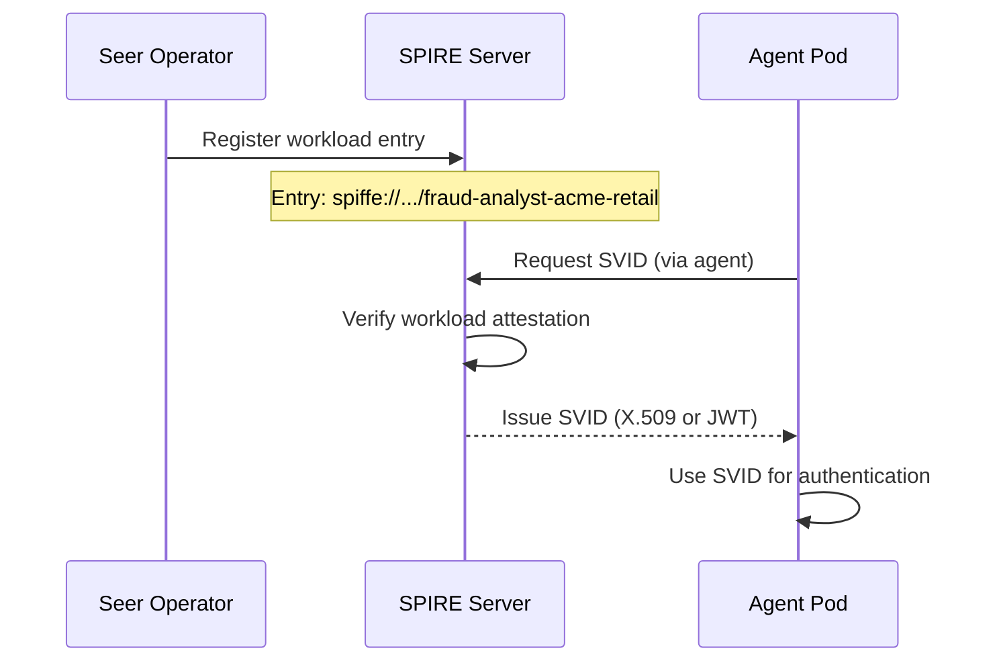
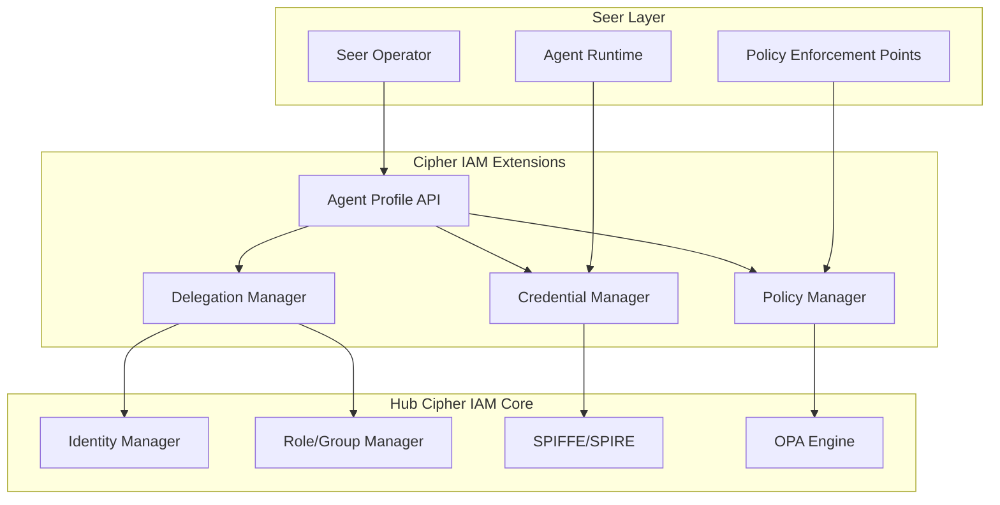

# Cipher IAM Extensions Architecture

> **Status**: 🟢 Complete  
> **Last Updated**: 2026-01-12

---

## Overview

Cipher IAM Extensions extends Hub Cipher IAM to support agent identity and authority. This document describes the relationship with Hub Cipher IAM, agent identity types, and SPIFFE integration.

---

## Relationship with Hub Cipher IAM

### Extension Model

Cipher IAM Extensions **extends** Hub Cipher IAM rather than replacing it:

```
┌─────────────────────────────────────────────────────────────────────────────┐
│                     EXTENSION RELATIONSHIP                                   │
│                                                                              │
│   ┌─────────────────────────────────────────────────────────────────────┐   │
│   │                 CIPHER IAM EXTENSIONS (Seer-specific)                │   │
│   │                                                                       │   │
│   │   • Agent Profile Types (Raw, Trained, Employed)                     │   │
│   │   • Authority Delegation Semantics                                   │   │
│   │   • Human Accountability                                             │   │
│   │   • Per-PEP Policy Configuration                                     │   │
│   │                                                                       │   │
│   └─────────────────────────────────────────────────────────────────────┘   │
│                          │ extends                                           │
│                          ▼                                                   │
│   ┌─────────────────────────────────────────────────────────────────────┐   │
│   │                     HUB CIPHER IAM (Core)                            │   │
│   │                                                                       │   │
│   │   • Identity Management (users, services, agents)                    │   │
│   │   • Role and Group Management                                        │   │
│   │   • SPIFFE/SPIRE Integration                                         │   │
│   │   • OPA Policy Engine                                                │   │
│   │   • Credential Issuance                                              │   │
│   │                                                                       │   │
│   └─────────────────────────────────────────────────────────────────────┘   │
│                                                                              │
└─────────────────────────────────────────────────────────────────────────────┘
```

### Division of Responsibilities

| Responsibility | Owner | Details |
|----------------|-------|---------|
| **Agent Semantics** | Seer (Cipher IAM Extensions) | Profile types, delegation model |
| **Identity Infrastructure** | Hub Cipher IAM | SPIFFE, OPA, credential issuance |
| **API Surface** | Cipher IAM Extensions | Agent-specific API endpoints |
| **Policy Engine** | Hub Cipher IAM | OPA evaluation, policy bundle management |

---

## Agent Identity Types

### Three Identity Types

```
┌─────────────────────────────────────────────────────────────────────────────┐
│                        AGENT IDENTITY TYPES                                  │
│                                                                              │
│   ┌─────────────────────────────────────────────────────────────────────┐   │
│   │  RAW AGENT                                                           │   │
│   │  • Base capabilities declared                                        │   │
│   │  • No deployment authority                                           │   │
│   │  • Template for training                                             │   │
│   └─────────────────────────────────────────────────────────────────────┘   │
│                                 │                                            │
│                          Training                                            │
│                                 ▼                                            │
│   ┌─────────────────────────────────────────────────────────────────────┐   │
│   │  TRAINED AGENT                                                       │   │
│   │  • Refined capabilities                                              │   │
│   │  • Trained behaviors                                                 │   │
│   │  • Still no deployment authority                                     │   │
│   └─────────────────────────────────────────────────────────────────────┘   │
│                                 │                                            │
│                          Employment                                          │
│                                 ▼                                            │
│   ┌─────────────────────────────────────────────────────────────────────┐   │
│   │  EMPLOYED AGENT                                                      │   │
│   │  • Full deployment identity                                          │   │
│   │  • Delegation chain to human                                         │   │
│   │  • Role/group memberships                                            │   │
│   │  • Per-PEP policies                                                  │   │
│   └─────────────────────────────────────────────────────────────────────┘   │
│                                                                              │
└─────────────────────────────────────────────────────────────────────────────┘
```

### Identity Type Comparison

| Aspect | Raw Agent | Trained Agent | Employed Agent |
|--------|-----------|---------------|----------------|
| **Exists In** | Foundry | Foundry | Workbench |
| **Has IAM Profile** | No | No | Yes |
| **Can Be Deployed** | No | No | Yes |
| **Has Delegation** | No | No | Yes |
| **Has Policies** | No | No | Yes |

---

## SPIFFE Integration

### SPIFFE ID Structure

Employed Agents receive SPIFFE identities:

```
spiffe://{trust_domain}/seer/agent/{subscription}/{agent_code}

Example: spiffe://acme.hub.io/seer/agent/acme-seer-subscription/fraud-analyst-acme-retail
```

### SPIFFE ID Components

| Component | Description | Example |
|-----------|-------------|---------|
| `trust_domain` | Hub trust domain | `acme.hub.io` |
| `seer` | Seer namespace | `seer` |
| `agent` | Agent type | `agent` |
| `subscription` | Seer subscription ID | `acme-seer-subscription` |
| `agent_code` | Unique agent code | `fraud-analyst-acme-retail` |

### SVID Issuance

Agent pods receive SVIDs (SPIFFE Verifiable Identity Documents):



### SPIRE Workload Registration

```yaml
# SPIRE workload entry (created by Seer Operator)
apiVersion: spire.spiffe.io/v1alpha1
kind: ClusterSPIFFEID
metadata:
  name: fraud-analyst-acme-retail
spec:
  spiffeIDTemplate: "spiffe://acme.hub.io/seer/agent/acme-seer-subscription/fraud-analyst-acme-retail"
  podSelector:
    matchLabels:
      app: fraud-analyst-acme-retail
      seer.olympus.io/agent: "true"
  namespaceSelector:
    matchLabels:
      seer.olympus.io/workbench: "acme-disputes"
```

---

## Component Architecture



---

## Profile Storage Model

### Profile Data Structure

```yaml
# Agent Profile (internal representation)
profile:
  id: "fraud-analyst-acme-retail"
  type: "employed"
  
  identity:
    spiffeId: "spiffe://acme.hub.io/seer/agent/acme-seer-subscription/fraud-analyst-acme-retail"
    subscription: "acme-seer-subscription"
    workbench: "acme-disputes"
  
  delegation:
    type: "user"
    delegator: "user:john.smith@acme.com"
    accountable: "user:jane.manager@acme.com"
    inheritedRoles:
      - "fraud-reviewer"
      - "dispute-handler"
    inheritedGroups:
      - "disputes-team"
      - "fraud-analysts"
  
  policies:
    - pep: "tool-gateway"
      policyRef: "policies/tool-gateway-restrictions.rego"
    - pep: "model-gateway"
      policyRef: "policies/model-access.rego"
  
  credentials:
    virtualKey: "vk_acme_fraud_analyst_retail_001"
    tokenSecretRef: "fraud-analyst-acme-retail-secrets"
  
  metadata:
    createdAt: "2026-01-12T10:00:00Z"
    updatedAt: "2026-01-12T14:30:00Z"
    version: 3
```

### Storage Backend

Profiles are stored in Hub Cipher IAM's identity store:

| Storage Aspect | Details |
|----------------|---------|
| **Backend** | Hub Cipher IAM database (PostgreSQL) |
| **Caching** | Redis for frequently accessed profiles |
| **Replication** | Same as Hub Cipher IAM |

---

## Related Documentation

- [Agent Profile API](./agent-profile-api.md) — API specification
- [Authority Delegation](./authority-delegation.md) — Delegation model
- [Credential Management](./credential-management.md) — Credential issuance

---

*Cipher IAM Extensions architecture provides agent-specific identity management built on Hub Cipher IAM infrastructure.*
