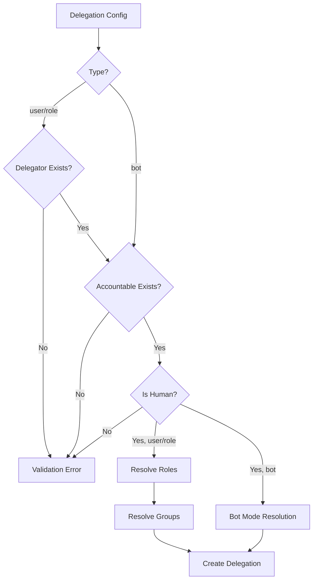

# Authority Delegation

> **Status**: 🟢 Complete  
> **Last Updated**: 2026-01-12

---

## Overview

Authority delegation defines how agents inherit authority from humans or roles. This document describes the delegation model and provides C3-level detail on inheritance algorithms.

---

## Delegation Model

### Delegation Types

| Type | Description | Use Case |
|------|-------------|----------|
| **User Delegation** | Agent acts on behalf of a specific user | Personal assistant agents |
| **Role Delegation** | Agent inherits from a role | Team-level agents |
| **Bot Mode** | Agent has base identity only | Fully automated agents |

### Delegation Chain

```
┌─────────────────────────────────────────────────────────────────────────────┐
│                        DELEGATION CHAIN                                      │
│                                                                              │
│   ┌─────────────────────────────────────────────────────────────────────┐   │
│   │  EMPLOYED AGENT                                                      │   │
│   │  fraud-analyst-acme-retail                                          │   │
│   └─────────────────────────────────────────────────────────────────────┘   │
│                                 │                                            │
│                          delegates from                                      │
│                                 ▼                                            │
│   ┌─────────────────────────────────────────────────────────────────────┐   │
│   │  DELEGATOR                                                           │   │
│   │  user:john.smith@acme.com                                           │   │
│   │  Roles: [fraud-reviewer, dispute-handler, case-closer]              │   │
│   │  Groups: [disputes-team, fraud-analysts, acme-employees]           │   │
│   └─────────────────────────────────────────────────────────────────────┘   │
│                                 │                                            │
│                          accountable to                                      │
│                                 ▼                                            │
│   ┌─────────────────────────────────────────────────────────────────────┐   │
│   │  ACCOUNTABLE HUMAN                                                   │   │
│   │  user:jane.manager@acme.com                                         │   │
│   └─────────────────────────────────────────────────────────────────────┘   │
│                                                                              │
└─────────────────────────────────────────────────────────────────────────────┘
```

---

## Delegation Configuration

### EmploymentSpec Delegation Section

```yaml
spec:
  delegation:
    type: user                           # user | role | bot
    delegator: "user:john.smith@acme.com" # Identity delegating authority
    accountable: "user:jane.manager@acme.com" # Manager for accountability
    roles: "*"                           # "*" or CSV list
    groups: "disputes-team,fraud-analysts" # "*" or CSV list
```

### User Delegation

Agent inherits authority from a specific user:

```yaml
delegation:
  type: user
  delegator: "user:john.smith@acme.com"
  accountable: "user:jane.manager@acme.com"
  roles: "*"  # All of delegator's roles
  groups: "*" # All of delegator's groups
```

### Role Delegation

Agent inherits authority from a role:

```yaml
delegation:
  type: role
  delegator: "role:fraud-analyst"
  accountable: "user:jane.manager@acme.com"
  roles: "*"  # All permissions from role
  groups: "fraud-analysts"
```

### Bot Mode

Agent has base identity only, no delegation:

```yaml
delegation:
  type: bot
  accountable: "user:jane.manager@acme.com"
  roles: "automated-processor"  # Explicit roles only
  groups: "bots"
```

---

## Inheritance Algorithms (C3 Detail)

### Role Inheritance Algorithm

```python
class RoleInheritanceResolver:
    """Resolves role inheritance from delegator to agent."""
    
    def resolve_roles(
        self, 
        delegator_id: str, 
        requested_roles: str
    ) -> InheritanceResult:
        """
        Resolve which roles the agent will inherit.
        
        Args:
            delegator_id: Identity of the delegator
            requested_roles: "*" for all, or CSV list
        
        Returns:
            InheritanceResult with inherited roles and warnings
        """
        # Get delegator's roles
        delegator_roles = self._get_delegator_roles(delegator_id)
        
        if requested_roles == "*":
            # Inherit all roles
            return InheritanceResult(
                inherited=delegator_roles,
                warnings=[]
            )
        
        # Parse requested roles
        requested = set(requested_roles.split(","))
        
        # Compute intersection
        available = set(delegator_roles)
        inherited = requested.intersection(available)
        unavailable = requested - available
        
        # Generate warnings for unavailable roles
        warnings = []
        if unavailable:
            warnings.append(InheritanceWarning(
                type="roles_not_available",
                requested=list(unavailable),
                message=f"Roles {list(unavailable)} not available from delegator"
            ))
        
        return InheritanceResult(
            inherited=list(inherited),
            unavailable=list(unavailable),
            warnings=warnings
        )
    
    def _get_delegator_roles(self, delegator_id: str) -> List[str]:
        """Get all roles for a delegator identity."""
        if delegator_id.startswith("user:"):
            return self.iam_client.get_user_roles(delegator_id)
        elif delegator_id.startswith("role:"):
            return self.iam_client.get_role_permissions(delegator_id)
        else:
            raise ValueError(f"Unknown delegator type: {delegator_id}")
```

### Group Inheritance Algorithm

```python
class GroupInheritanceResolver:
    """Resolves group inheritance from delegator to agent."""
    
    def resolve_groups(
        self, 
        delegator_id: str, 
        requested_groups: str
    ) -> InheritanceResult:
        """
        Resolve which groups the agent will inherit.
        
        Args:
            delegator_id: Identity of the delegator
            requested_groups: "*" for all, or CSV list
        
        Returns:
            InheritanceResult with inherited groups and warnings
        """
        # Get delegator's groups
        delegator_groups = self._get_delegator_groups(delegator_id)
        
        if requested_groups == "*":
            # Inherit all groups
            return InheritanceResult(
                inherited=delegator_groups,
                warnings=[]
            )
        
        # Parse requested groups
        requested = set(requested_groups.split(","))
        
        # Compute intersection
        available = set(delegator_groups)
        inherited = requested.intersection(available)
        unavailable = requested - available
        
        # Generate warnings for unavailable groups
        warnings = []
        if unavailable:
            warnings.append(InheritanceWarning(
                type="groups_not_available",
                requested=list(unavailable),
                message=f"Groups {list(unavailable)} not available from delegator"
            ))
        
        return InheritanceResult(
            inherited=list(inherited),
            unavailable=list(unavailable),
            warnings=warnings
        )
```

### Wildcard Handling

When `*` is specified:

```python
def handle_wildcard(delegator_id: str, field: str) -> List[str]:
    """
    Handle wildcard (*) for roles or groups.
    Returns all items from delegator.
    """
    if field == "roles":
        return iam_client.get_user_roles(delegator_id)
    elif field == "groups":
        return iam_client.get_user_groups(delegator_id)
```

### CSV Subset Logic

When CSV is specified:

```
Requested: [fraud-reviewer, dispute-handler, case-closer]
Delegator Has: [fraud-reviewer, dispute-handler]

Algorithm:
1. Parse requested as set
2. Get delegator's items as set
3. Compute intersection = inherited
4. Compute difference = unavailable
5. If unavailable is non-empty, add warning

Result:
  inherited: [fraud-reviewer, dispute-handler]
  unavailable: [case-closer]
  warnings: ["case-closer not available from delegator"]
```

---

## Bot Mode Behavior

### No Inheritance

In bot mode, there is no delegator, so no inheritance:

```python
def resolve_bot_mode(
    accountable: str,
    roles: str,
    groups: str
) -> BotModeResult:
    """
    Resolve bot mode - no inheritance, explicit assignment only.
    
    All roles and groups must be explicitly assignable to bot accounts.
    """
    # Verify accountable exists
    if not iam_client.identity_exists(accountable):
        raise ValueError(f"Accountable {accountable} not found")
    
    # Parse explicit roles/groups
    explicit_roles = roles.split(",") if roles else []
    explicit_groups = groups.split(",") if groups else []
    
    # Verify roles are bot-assignable
    for role in explicit_roles:
        if not iam_client.role_is_bot_assignable(role):
            raise ValueError(f"Role {role} not assignable to bots")
    
    return BotModeResult(
        roles=explicit_roles,
        groups=explicit_groups,
        accountable=accountable
    )
```

### Bot Mode Comparison

| Aspect | User/Role Delegation | Bot Mode |
|--------|---------------------|----------|
| **Delegator** | Required | None |
| **Role Inheritance** | From delegator | Explicit only |
| **Group Inheritance** | From delegator | Explicit only |
| **Policy Inheritance** | From delegator | Explicit only |
| **Accountability** | Required | Required |

---

## Delegation Validation

### Validation Rules

| Rule | Description | Error |
|------|-------------|-------|
| **Delegator exists** | Delegator identity must exist in IAM | `DELEGATOR_NOT_FOUND` |
| **Accountable exists** | Accountable identity must exist | `ACCOUNTABLE_NOT_FOUND` |
| **Accountable is human** | Accountable must be a user, not role/agent | `ACCOUNTABLE_NOT_HUMAN` |
| **Role subset** | Requested roles must be delegator's subset | Warning only |
| **Group subset** | Requested groups must be delegator's subset | Warning only |

### Validation Flow



---

## Delegation Chain Updates

### When Delegator Changes

If a delegator's roles/groups change:

1. **Detection** — Delegation Chain Sync Service detects change
2. **Re-resolution** — Agent's inherited roles/groups are re-resolved
3. **Update** — Agent profile is updated
4. **Optional Respawn** — Agent may be respawned if authority significantly changes

### Authority Change Response

```python
def handle_delegator_authority_change(delegator_id: str):
    """Handle when a delegator's authority changes."""
    
    # Find all agents delegating from this identity
    agents = profile_store.find_by_delegator(delegator_id)
    
    for agent in agents:
        # Re-resolve inheritance
        new_roles = role_resolver.resolve_roles(
            delegator_id, 
            agent.delegation.roles
        )
        new_groups = group_resolver.resolve_groups(
            delegator_id,
            agent.delegation.groups
        )
        
        # Check for significant changes
        if authority_significantly_changed(agent, new_roles, new_groups):
            # Trigger respawn
            respawn_service.trigger(agent.profile_id)
        else:
            # Just update profile
            profile_store.update(agent.profile_id, {
                "inheritedRoles": new_roles.inherited,
                "inheritedGroups": new_groups.inherited
            })
```

---

## Related Documentation

- [Agent Profile API](./agent-profile-api.md) — API for profile management
- [Human Accountability](./human-accountability.md) — Accountable human requirements
- [Profile Tags](./profile-tags.md) — Profile tag structure

---

*Authority Delegation provides comprehensive inheritance with wildcard and subset support.*
