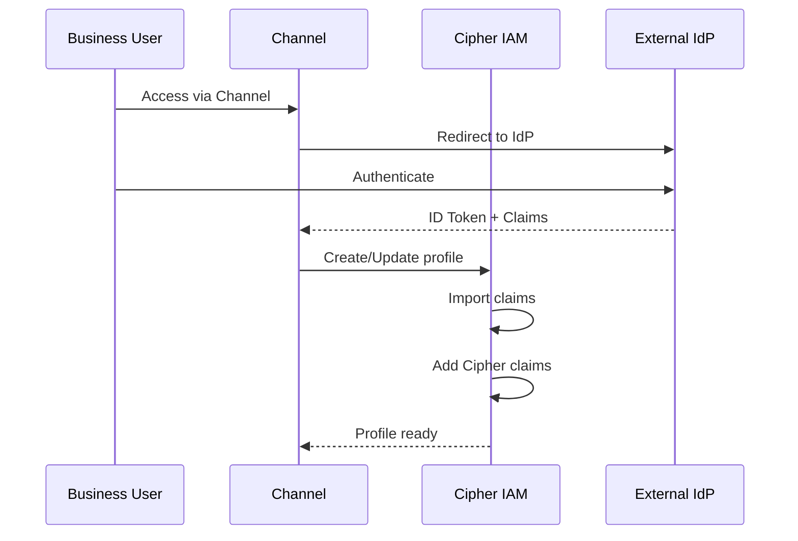
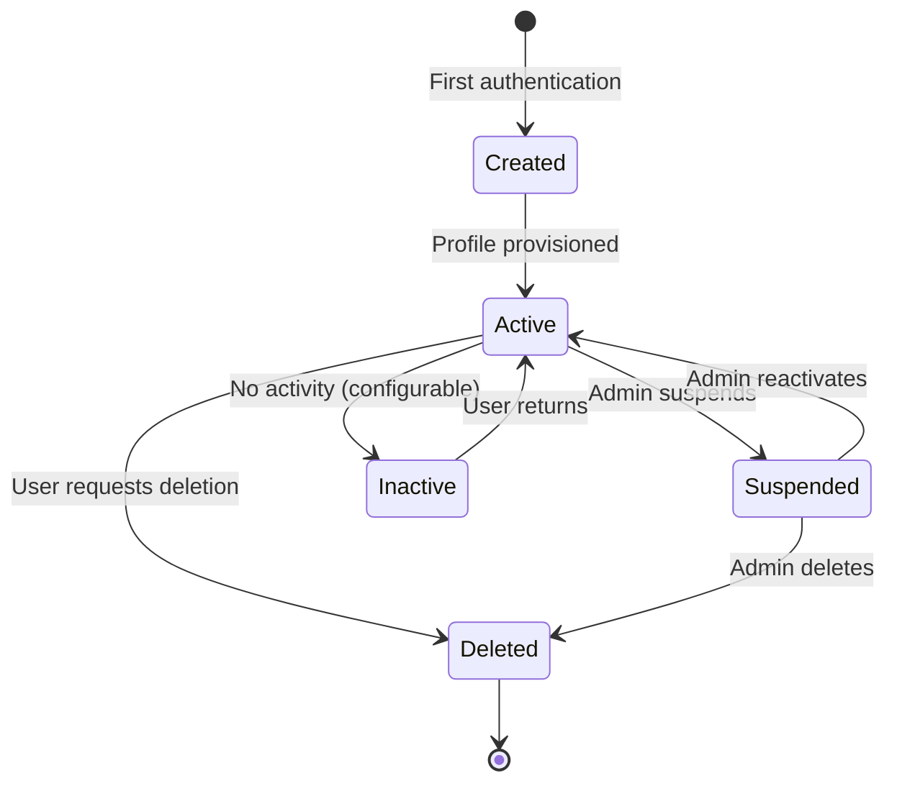

# Business User Profiles

> **Status**: 🟢 Design Complete  
> **Last Updated**: 2026-01-17  
> **Related**: [Request-Scoped Delegation](../../implementation-concepts/request-scoped-delegation.md)

---

## Overview

**Business User Profiles** represent end-users (customers, external employees, business system identities) in Cipher IAM. These profiles exist in the **Business User Identity Domain**, which is separate from the Enterprise/Operator Identity Domain used for internal staff.

Business User Profiles are the identity source for delegators in request-scoped delegation.

---

## Two Identity Domains

Cipher IAM manages two distinct identity domains:

| Domain | Identity Type | Example | Use in Delegation |
|--------|--------------|---------|-------------------|
| **Enterprise** | Bank employees, internal staff | `john.smith@bank.com` | User/Role/Bot delegation |
| **Business User** | Customers, external employees | `jane.customer@example.com` | Request-scoped delegation |

These domains are orthogonal. An agent may have:
- Enterprise delegation (what it can do internally)
- Business user delegation (what it can do on behalf of end-users)

---

## Profile Schema

### Business User Profile

```yaml
apiVersion: cipher.zeta.tech/v1
kind: BusinessUserProfile
metadata:
  id: "bu-12345-67890"
  namespace: "retail-banking"
  
spec:
  # Core identity
  identity:
    type: "customer"  # "customer" | "external-employee" | "system"
    externalId: "cust-98765"
    email: "jane.customer@example.com"
    
  # Federated identity source
  federation:
    provider: "retail-banking-idp"
    providerId: "https://auth.retailbank.com"
    subjectId: "auth0|abc123def456"
    lastSync: "2026-01-17T09:00:00Z"
  
  # Claims (imported + added)
  claims:
    # Imported from IdP
    email: "jane.customer@example.com"
    email_verified: true
    name: "Jane Customer"
    
    # Added by Cipher
    customer_tier: "premium"
    account_types: ["checking", "savings", "investment"]
    kyc_verified: true
    kyc_level: "enhanced"
  
  # Delegatable authority (what this user CAN delegate)
  delegatableAuthority:
    templates:
      - "personal-finance-assistant"
      - "portfolio-viewer"
      - "expense-approval-small"
    maxDelegations: 10
    
  # Active delegations
  activeDelegations:
    - certificateId: "cert-12345"
      template: "personal-finance-assistant"
      issuedAt: "2026-01-17T10:00:00Z"
      expiresAt: "2026-01-17T22:00:00Z"

status:
  state: "active"
  lastActivity: "2026-01-17T14:30:00Z"
  delegationCount: 3
```

---

## Identity Federation

### Federation Flow



### Claim Import

```python
class ClaimImporter:
    """Imports claims from federated identity providers."""
    
    STANDARD_CLAIMS = [
        "sub", "email", "email_verified", "name", 
        "given_name", "family_name", "phone_number"
    ]
    
    async def import_claims(
        self,
        id_token: dict,
        provider_config: ProviderConfig
    ) -> dict:
        """Import claims from ID token."""
        
        imported = {}
        
        # Import standard claims
        for claim in self.STANDARD_CLAIMS:
            if claim in id_token:
                imported[claim] = id_token[claim]
        
        # Import provider-specific claims
        for mapping in provider_config.claim_mappings:
            source = mapping.source
            target = mapping.target
            
            if source in id_token:
                imported[target] = id_token[source]
        
        return imported
```

### Cipher-Added Claims

Cipher can add claims not present in the federated identity:

```python
async def add_cipher_claims(
    profile_id: str,
    claims: dict
) -> BusinessUserProfile:
    """Add Cipher-managed claims to a profile."""
    
    profile = await profile_store.get(profile_id)
    
    # Validate claims are allowed to be added
    for claim_name in claims:
        if claim_name in RESERVED_CLAIMS:
            raise ValidationError(f"Cannot override reserved claim: {claim_name}")
    
    # Merge claims (Cipher claims override imported)
    profile.claims.update(claims)
    profile.claims_source = {
        **profile.claims_source,
        **{k: "cipher" for k in claims}
    }
    
    await profile_store.update(profile)
    return profile
```

---

## Delegatable Authority

### Authority Assignment

Tenant admins define what each business user can delegate:

```python
async def assign_delegatable_authority(
    profile_id: str,
    templates: List[str],
    max_delegations: int = 10
) -> BusinessUserProfile:
    """Assign delegatable authority to a business user."""
    
    profile = await profile_store.get(profile_id)
    
    # Validate templates exist and are active
    for template_name in templates:
        template = await template_registry.get(template_name)
        if not template or template.status != "active":
            raise ValidationError(f"Template {template_name} not available")
    
    profile.delegatable_authority = DelegatableAuthority(
        templates=templates,
        max_delegations=max_delegations
    )
    
    await profile_store.update(profile)
    return profile
```

### Authority Validation

When a user attempts to delegate:

```python
async def validate_delegation_authority(
    delegator_id: str,
    template_name: str
) -> ValidationResult:
    """Validate a user can delegate a specific template."""
    
    profile = await profile_store.get(delegator_id)
    
    # Check template is in delegatable list
    if template_name not in profile.delegatable_authority.templates:
        return ValidationResult.denied(
            f"User not authorized to delegate template: {template_name}"
        )
    
    # Check max delegations not exceeded
    active_count = len(profile.active_delegations)
    if active_count >= profile.delegatable_authority.max_delegations:
        return ValidationResult.denied(
            f"Maximum delegations ({profile.delegatable_authority.max_delegations}) reached"
        )
    
    return ValidationResult.allowed()
```

---

## Profile Lifecycle

### State Diagram



### Profile Creation

```python
async def create_or_update_profile(
    federation_info: FederationInfo,
    claims: dict
) -> BusinessUserProfile:
    """Create or update a business user profile on authentication."""
    
    # Check if profile exists
    existing = await profile_store.find_by_federation(
        provider=federation_info.provider,
        subject_id=federation_info.subject_id
    )
    
    if existing:
        # Update existing profile
        existing.claims = {**existing.claims, **claims}
        existing.federation.last_sync = datetime.now()
        existing.status.last_activity = datetime.now()
        await profile_store.update(existing)
        return existing
    else:
        # Create new profile
        profile = BusinessUserProfile(
            id=generate_id(),
            identity=Identity(
                type="customer",
                email=claims.get("email")
            ),
            federation=federation_info,
            claims=claims,
            delegatable_authority=DelegatableAuthority(
                templates=[],  # Empty until admin assigns
                max_delegations=10
            ),
            status=ProfileStatus(state="active")
        )
        await profile_store.save(profile)
        return profile
```

---

## Revocation Cascade

When a business user's authority changes, existing delegations may be affected:

```python
async def handle_authority_change(
    profile_id: str,
    old_authority: DelegatableAuthority,
    new_authority: DelegatableAuthority
):
    """Handle changes to a user's delegatable authority."""
    
    # Find templates that were removed
    removed_templates = set(old_authority.templates) - set(new_authority.templates)
    
    if removed_templates:
        # Find active certificates for removed templates
        certificates = await certificate_store.find({
            "delegator.id": profile_id,
            "template.name": {"$in": list(removed_templates)},
            "status.state": "active"
        })
        
        # Revoke affected certificates
        for cert in certificates:
            await revoke_certificate(
                certificate_id=cert.id,
                revoked_by="system",
                reason="Delegator authority revoked"
            )
```

---

## Privacy and Compliance

### Data Minimization

```python
# Only store necessary claims
REQUIRED_CLAIMS = ["sub", "email"]
OPTIONAL_CLAIMS = ["name", "phone_number"]

async def filter_claims(claims: dict) -> dict:
    """Filter claims to required + opted-in optional."""
    
    filtered = {}
    
    for claim in REQUIRED_CLAIMS:
        if claim in claims:
            filtered[claim] = claims[claim]
    
    for claim in OPTIONAL_CLAIMS:
        if claim in claims and user_consented_to_claim(claim):
            filtered[claim] = claims[claim]
    
    return filtered
```

### Right to Deletion

```python
async def delete_user_data(profile_id: str) -> DeletionResult:
    """Delete all data for a business user (GDPR/CCPA)."""
    
    # Revoke all active delegations
    certificates = await certificate_store.find_by_delegator(profile_id)
    for cert in certificates:
        await revoke_certificate(cert.id, "system", "User data deletion")
    
    # Delete profile
    await profile_store.delete(profile_id)
    
    # Audit log (anonymized)
    await audit.log_user_deletion(
        profile_id_hash=hash(profile_id),
        timestamp=datetime.now()
    )
    
    return DeletionResult.success()
```

---

## Related Documentation

- [Delegation Templates](./delegation-templates.md) — What users can delegate
- [Delegation Certificates](./delegation-certificates.md) — User consent representation
- [Request-Scoped Delegation](../../implementation-concepts/request-scoped-delegation.md) — Comprehensive design

---

*Business User Profiles represent end-users with federated identity and delegatable authority management.*
