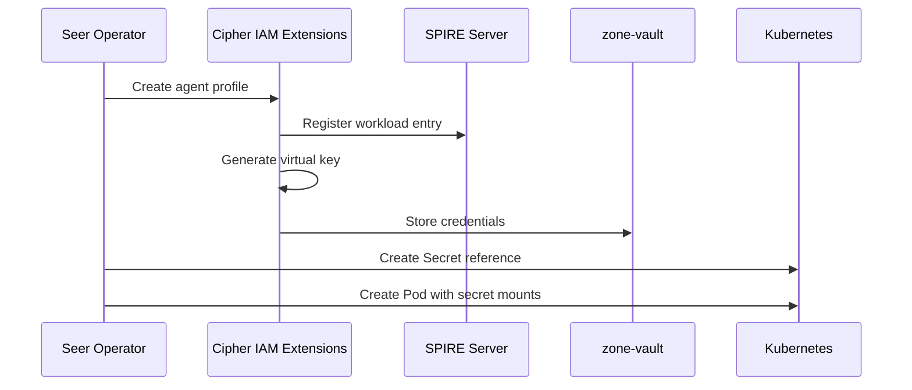
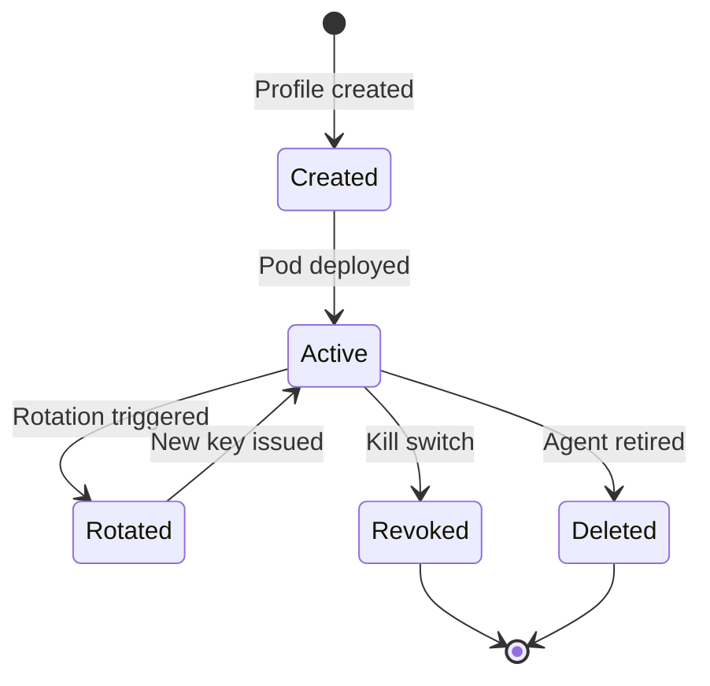
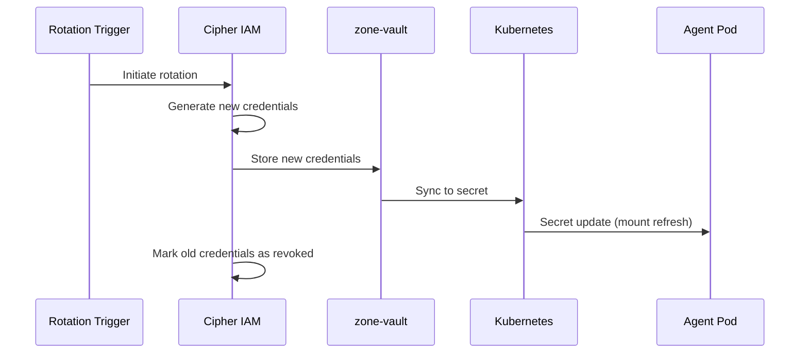

# Credential Management

> **Status**: 🟢 Design Complete  
> **Last Updated**: 2026-01-12

---

## Overview

Credential Management handles the issuance, injection, and lifecycle of agent credentials. This document describes credential types, issuance flow, and virtual key management.

---

## Credential Types

### Agent Credentials

| Credential Type | Purpose | Storage |
|-----------------|---------|---------|
| **SPIFFE SVID** | Service identity | SPIRE Agent |
| **Agent Token** | API authentication | zone-vault |
| **Virtual Key** | Model Gateway access | zone-vault |
| **Service Account** | K8s API access | K8s Secret |

---

## Credential Issuance

### Issuance Flow



### Agent Token Issuance

```python
def issue_agent_token(profile_id: str) -> AgentToken:
    """Issue authentication token for agent."""
    
    # Generate token
    token = token_generator.generate(
        subject=profile_id,
        issuer="cipher-iam",
        audience=["seer-services"],
        expiry=timedelta(hours=24),
        claims={
            "agent_id": profile_id,
            "type": "agent",
        }
    )
    
    # Store in vault
    vault_client.store(
        path=f"agents/{profile_id}/token",
        data={"token": token.value}
    )
    
    return token
```

---

## Virtual Key Management

### Virtual Key Purpose

Virtual keys provide:

| Function | Description |
|----------|-------------|
| **Agent Identification** | Unique identifier for Model Gateway |
| **Usage Tracking** | Attribute token usage to agent |
| **Budget Enforcement** | Enforce per-agent budgets |
| **Audit Trail** | Link all LLM calls to agent |

### Virtual Key Format

```
vk_{subscription}_{agent_id}_{sequence}

Example: vk_acme_fraud_analyst_retail_001
```

### Virtual Key Lifecycle



### Virtual Key Generation

```python
def generate_virtual_key(profile: AgentProfile) -> str:
    """Generate virtual key for agent."""
    
    # Build key components
    subscription = sanitize(profile.identity.subscription)
    agent_id = sanitize(profile.profile_id)
    sequence = get_next_sequence(profile.profile_id)
    
    virtual_key = f"vk_{subscription}_{agent_id}_{sequence:03d}"
    
    # Store mapping
    virtual_key_store.store(virtual_key, {
        "profile_id": profile.profile_id,
        "subscription": profile.identity.subscription,
        "workbench": profile.identity.workbench,
        "created_at": datetime.now(),
        "status": "active"
    })
    
    return virtual_key
```

---

## Credential Injection

### Pod Environment Variables

Credentials are injected via environment variables:

```yaml
spec:
  containers:
    - name: agent
      env:
        # Agent token for API authentication
        - name: AGENT_TOKEN
          valueFrom:
            secretKeyRef:
              name: fraud-analyst-acme-retail-secrets
              key: agent-token
        
        # Virtual key for Model Gateway
        - name: VIRTUAL_KEY
          valueFrom:
            secretKeyRef:
              name: fraud-analyst-acme-retail-secrets
              key: virtual-key
        
        # OpenAI SDK compatibility
        - name: OPENAI_API_KEY
          valueFrom:
            secretKeyRef:
              name: fraud-analyst-acme-retail-secrets
              key: virtual-key
```

### zone-vault Integration

Credentials are stored in zone-vault and synced to K8s secrets:

```yaml
apiVersion: secrets.hashicorp.com/v1
kind: VaultStaticSecret
metadata:
  name: fraud-analyst-acme-retail-secrets
  namespace: acme-disputes
spec:
  type: kv-v2
  mount: seer-agents
  path: fraud-analyst-acme-retail
  destination:
    name: fraud-analyst-acme-retail-secrets
    create: true
  refreshAfter: 30m
```

---

## Credential Rotation

### Rotation Triggers

| Trigger | Action |
|---------|--------|
| **Scheduled** | Rotate based on policy (e.g., every 24h) |
| **Security Event** | Immediate rotation on compromise |
| **Manual** | Admin-triggered rotation |

### Rotation Flow



### Rotation Configuration

```yaml
rotation:
  enabled: true
  interval: 24h
  gracePeriod: 5m  # Both old and new valid
  onCompromise: immediate
```

---

## SPIFFE/SVID Integration

### SVID Issuance

Agent pods receive SVIDs via SPIRE:

```yaml
# SPIRE workload entry
apiVersion: spire.spiffe.io/v1alpha1
kind: ClusterSPIFFEID
metadata:
  name: fraud-analyst-acme-retail
spec:
  spiffeIDTemplate: "spiffe://acme.hub.io/seer/agent/acme-seer-subscription/fraud-analyst-acme-retail"
  podSelector:
    matchLabels:
      app: fraud-analyst-acme-retail
```

### SVID Usage

SVIDs are used for:

| Use Case | Method |
|----------|--------|
| **mTLS** | Service mesh authentication |
| **JWT-SVID** | API authentication |

---

## Credential Revocation

### Revocation Triggers

| Trigger | Scope |
|---------|-------|
| **Kill Switch** | Immediate revocation of all credentials |
| **Profile Deletion** | Credentials deleted with profile |
| **Rotation** | Old credentials revoked after grace period |

### Revocation Flow

```python
async def revoke_credentials(profile_id: str, reason: str):
    """Revoke all credentials for an agent."""
    
    # Revoke agent token
    await token_store.revoke(profile_id)
    
    # Revoke virtual key
    virtual_key = await virtual_key_store.get_by_profile(profile_id)
    await virtual_key_store.revoke(virtual_key)
    
    # Revoke SPIFFE entry
    await spire_client.delete_entry(profile_id)
    
    # Delete K8s secret
    await k8s_client.delete_secret(
        name=f"{profile_id}-secrets",
        namespace=profile.identity.namespace
    )
    
    # Audit
    await audit.log({
        "event": "credentials_revoked",
        "profile_id": profile_id,
        "reason": reason,
        "timestamp": datetime.now()
    })
```

---

## Metrics

### Credential Metrics

```prometheus
# Credentials issued
seer_credentials_issued_total{type="virtual_key"} 1234
seer_credentials_issued_total{type="agent_token"} 1234

# Credentials revoked
seer_credentials_revoked_total{type="virtual_key", reason="rotation"} 500
seer_credentials_revoked_total{type="virtual_key", reason="kill_switch"} 2

# Credential age
seer_credential_age_seconds{type="virtual_key", profile="fraud-analyst"} 3600
```

---

## Related Documentation

- [Architecture](./architecture.md) — SPIFFE integration
- [Agent Profile API](./agent-profile-api.md) — Credential fields in API
- [Model Gateway Agent Access](../model-gateway/agent-access.md) — Virtual key usage

---

*Credential Management provides secure issuance, injection, and lifecycle management for agent credentials.*
