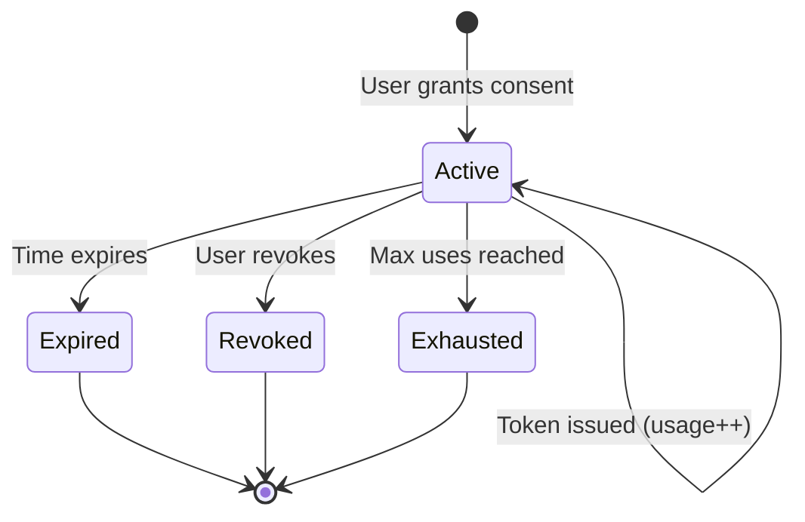
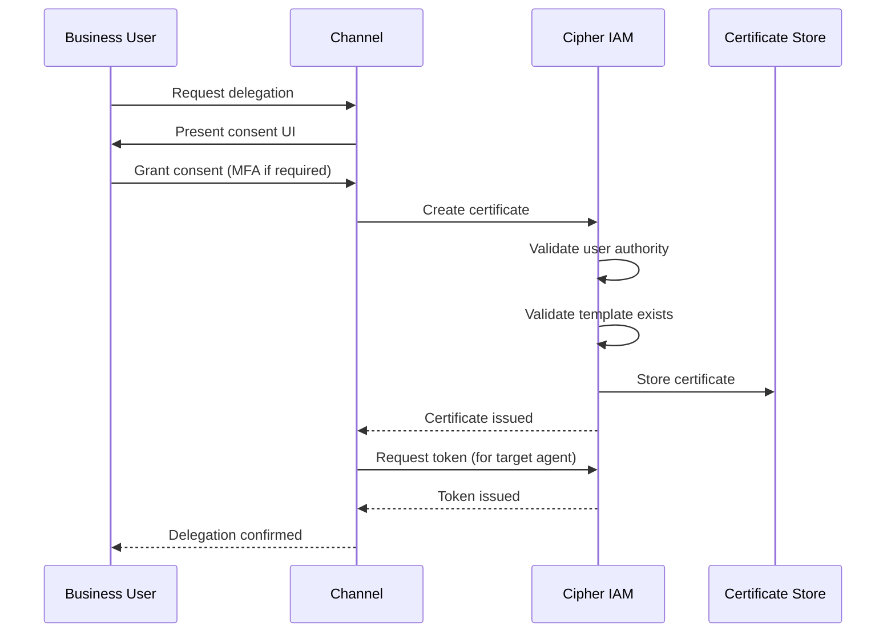

# Delegation Certificates

> **Status**: 🟢 Design Complete  
> **Last Updated**: 2026-01-17  
> **Related**: [Request-Scoped Delegation](../../implementation-concepts/request-scoped-delegation.md)

---

## Overview

A **Delegation Certificate** represents a business user's consent to delegate authority to an agent. It references a Delegation Template and specifies who can use the delegated authority.

Delegation Certificates are the second artifact in the Template → Certificate → Token hierarchy for request-scoped delegation.

---

## Key Characteristics

| Characteristic | Description |
|----------------|-------------|
| **User consent** | Represents explicit user consent to delegate |
| **Template-bound** | References a specific Delegation Template version |
| **Delegate patterns** | Can specify delegate by identity, role, or group |
| **Time-bounded** | Has explicit expiry and optional session scope |
| **Revocable** | Can be revoked at any time by the delegator |

---

## Certificate Schema

### Full Specification

```yaml
apiVersion: cipher.zeta.tech/v1
kind: DelegationCertificate
metadata:
  id: "cert-12345-67890"
  issuedAt: "2026-01-17T10:00:00Z"
  
spec:
  # Who is delegating
  delegator:
    type: "business-user"
    id: "user-67890"
    source: "retail-banking-idp"
    claims:
      email: "jane.customer@example.com"
      customer_tier: "premium"
  
  # Which template defines the authority
  template:
    name: "personal-finance-assistant"
    namespace: "retail-banking"
    version: 2
  
  # Who can use this certificate
  delegate:
    pattern: "role"  # "specific-identity" | "role" | "group"
    value: "personal-assistant-agent"
  
  # Constraints on certificate usage
  constraints:
    expiry: "2026-01-17T22:00:00Z"
    chainingAllowed: false
    sessionScoped: true
    maxUses: null  # null = unlimited
    allowedWorkbenches: ["retail-banking"]
  
  # Revocation configuration
  revocation:
    mechanism: "cipher-revocation-list"
    checkUrl: "https://cipher.internal/revoke/check"
    revoked: false
    revokedAt: null
    revokedReason: null

status:
  state: "active"  # "active" | "expired" | "revoked" | "exhausted"
  usageCount: 3
  lastUsedAt: "2026-01-17T14:30:00Z"
  lastUsedBy: "spiffe://seer/agents/my-assistant"
```

### Field Reference

| Field | Required | Description |
|-------|----------|-------------|
| `delegator.type` | Yes | Type of delegator ("business-user", "system") |
| `delegator.id` | Yes | Unique identifier of the delegator |
| `delegator.source` | Yes | Identity provider source |
| `template.name` | Yes | Template name |
| `template.version` | Yes | Specific template version |
| `delegate.pattern` | Yes | How to match eligible delegates |
| `delegate.value` | Yes | Pattern value for matching |
| `constraints.expiry` | Yes | When certificate expires |
| `constraints.chainingAllowed` | Yes | Can delegate grant sub-delegation? |
| `constraints.sessionScoped` | No | Tied to specific request/session |

---

## Delegate Patterns

### Specific Identity

Delegate to a specific agent:

```yaml
delegate:
  pattern: "specific-identity"
  value: "spiffe://seer/agents/acme/personal-assistant"
```

### Role-Based

Delegate to any agent with a specific role:

```yaml
delegate:
  pattern: "role"
  value: "personal-assistant-agent"
```

### Group-Based

Delegate to any agent in a group:

```yaml
delegate:
  pattern: "group"
  value: "retail-banking-agents"
```

### Wildcard Domain

Delegate to any agent in a domain:

```yaml
delegate:
  pattern: "domain"
  value: "*@retail-banking.acme.hub.io"
```

---

## Certificate Lifecycle

### State Diagram



### Issuance Flow



> **Note**: The Channel orchestrates the full flow — after obtaining the Certificate, it also requests the Delegation Access Token for the target agent from Cipher. Both are then attached to the Request.

### Issuance Algorithm

```python
class CertificateIssuer:
    """Issues Delegation Certificates."""
    
    async def issue_certificate(
        self,
        delegator: Identity,
        template_ref: TemplateReference,
        delegate: DelegatePattern,
        constraints: CertificateConstraints
    ) -> DelegationCertificate:
        """Issue a new Delegation Certificate."""
        
        # Step 1: Validate delegator identity
        if not await self._validate_delegator(delegator):
            raise DelegationError("Delegator identity not valid")
        
        # Step 2: Get template
        template = await self._get_template(template_ref)
        if not template:
            raise DelegationError(f"Template {template_ref} not found")
        
        # Step 3: Validate delegator can delegate this template
        if not await self._can_delegate(delegator, template):
            raise DelegationError("Delegator lacks authority for this template")
        
        # Step 4: Validate constraints against template limits
        validated_constraints = self._validate_constraints(
            constraints, 
            template.spec.constraints
        )
        
        # Step 5: Check MFA if required
        if template.spec.constraints.requiresMfaAtDelegation:
            if not delegator.mfa_verified:
                raise MFARequiredError("MFA verification required")
        
        # Step 6: Create certificate
        certificate = DelegationCertificate(
            id=self._generate_id(),
            issued_at=datetime.now(),
            delegator=delegator,
            template=template_ref,
            delegate=delegate,
            constraints=validated_constraints,
            status=CertificateStatus(state="active")
        )
        
        # Step 7: Sign and store
        signed = self._sign_certificate(certificate)
        await self._store.save(signed)
        
        # Step 8: Audit log
        await self._audit.log_certificate_issued(certificate)
        
        return signed
    
    def _validate_constraints(
        self,
        requested: CertificateConstraints,
        template_limits: TemplateConstraints
    ) -> CertificateConstraints:
        """Validate and narrow constraints to template limits."""
        
        # Duration cannot exceed template max
        if requested.duration > template_limits.maxDuration:
            requested.duration = template_limits.maxDuration
        
        # Chaining only if template allows
        if requested.chainingAllowed and not template_limits.chainingAllowed:
            requested.chainingAllowed = False
        
        return requested
```

---

## Certificate Lookup

### By Delegate Eligibility

```python
async def find_certificates_for_agent(
    agent_id: str,
    template_name: str = None
) -> List[DelegationCertificate]:
    """Find certificates an agent is eligible to use."""
    
    agent = await agent_profile_store.get(agent_id)
    
    # Build eligibility criteria
    criteria = [
        # Specific identity match
        {"delegate.pattern": "specific-identity", "delegate.value": agent.spiffe_id},
        # Role match
        {"delegate.pattern": "role", "delegate.value": {"$in": agent.roles}},
        # Group match
        {"delegate.pattern": "group", "delegate.value": {"$in": agent.groups}},
    ]
    
    # Query for active certificates
    query = {
        "$or": criteria,
        "status.state": "active",
        "constraints.expiry": {"$gt": datetime.now()}
    }
    
    if template_name:
        query["template.name"] = template_name
    
    return await certificate_store.find(query)
```

### By Delegator

```python
async def find_certificates_by_delegator(
    delegator_id: str,
    include_expired: bool = False
) -> List[DelegationCertificate]:
    """Find all certificates issued by a delegator."""
    
    query = {"delegator.id": delegator_id}
    
    if not include_expired:
        query["status.state"] = "active"
        query["constraints.expiry"] = {"$gt": datetime.now()}
    
    return await certificate_store.find(query)
```

---

## Certificate Revocation

### Revocation Triggers

| Trigger | Initiator | Scope |
|---------|-----------|-------|
| **User revokes** | Delegator | Single certificate |
| **Admin revokes** | Tenant admin | Single or batch |
| **Kill switch** | Operator | All certificates for agent |
| **Delegator authority change** | System | Cascade to affected certificates |

### Revocation Flow

```python
async def revoke_certificate(
    certificate_id: str,
    revoked_by: str,
    reason: str
) -> DelegationCertificate:
    """Revoke a Delegation Certificate."""
    
    certificate = await certificate_store.get(certificate_id)
    
    if certificate.status.state != "active":
        raise InvalidStateError(f"Certificate is {certificate.status.state}")
    
    # Update status
    certificate.status.state = "revoked"
    certificate.revocation.revoked = True
    certificate.revocation.revokedAt = datetime.now()
    certificate.revocation.revokedReason = reason
    
    # Persist
    await certificate_store.update(certificate)
    
    # Add to revocation list for fast lookup
    await revocation_list.add(certificate_id)
    
    # Audit log
    await audit.log_certificate_revoked(
        certificate_id=certificate_id,
        revoked_by=revoked_by,
        reason=reason
    )
    
    return certificate
```

### Revocation Checking

Revocation is checked when issuing Delegation Access Tokens:

```python
async def check_revocation(certificate_id: str) -> bool:
    """Check if a certificate is revoked."""
    
    # Fast path: check revocation list cache
    if await revocation_list.contains(certificate_id):
        return True
    
    # Slow path: check certificate status
    cert = await certificate_store.get(certificate_id)
    return cert.status.state == "revoked"
```

---

## Chaining Rules

### When Chaining is Allowed

A certificate allows chaining when:

1. Template has `chainingAllowed: true`
2. Certificate has `chainingAllowed: true`
3. Chain depth < `maxChainDepth`

### Chaining Flow

```python
async def create_chained_certificate(
    parent_certificate: DelegationCertificate,
    new_delegate: DelegatePattern,
    constraints: CertificateConstraints
) -> DelegationCertificate:
    """Create a chained certificate from an existing one."""
    
    # Validate chaining is allowed
    if not parent_certificate.constraints.chainingAllowed:
        raise ChainingNotAllowedError("Parent certificate does not allow chaining")
    
    template = await template_registry.get(parent_certificate.template)
    if not template.spec.constraints.chainingAllowed:
        raise ChainingNotAllowedError("Template does not allow chaining")
    
    # Check chain depth
    current_depth = parent_certificate.chain_depth or 0
    if current_depth >= template.spec.constraints.maxChainDepth:
        raise MaxChainDepthError(f"Max chain depth {template.spec.constraints.maxChainDepth} reached")
    
    # Create chained certificate with narrowed constraints
    chained = DelegationCertificate(
        id=generate_id(),
        delegator=parent_certificate.delegator,  # Original delegator
        template=parent_certificate.template,
        delegate=new_delegate,
        constraints=narrow_constraints(
            constraints, 
            parent_certificate.constraints
        ),
        chain_parent=parent_certificate.id,
        chain_depth=current_depth + 1
    )
    
    return await certificate_store.save(chained)
```

---

## Related Documentation

- [Delegation Templates](./delegation-templates.md) — Template definitions
- [Credential Management](./credential-management.md) — Delegation Access Token lifecycle
- [Request-Scoped Delegation](../../implementation-concepts/request-scoped-delegation.md) — Comprehensive design

---

*Delegation Certificates represent user consent with template binding, delegate patterns, and revocation support.*
