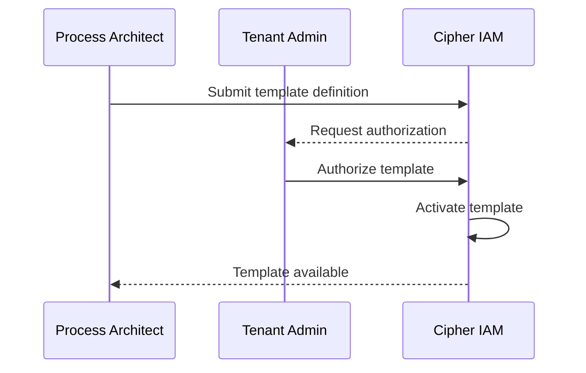

# Delegation Templates

> **Status**: 🟢 Design Complete  
> **Last Updated**: 2026-01-17  
> **Related**: [Request-Scoped Delegation](../../implementation-concepts/request-scoped-delegation.md)

---

## Overview

A **Delegation Template** defines a package of authority that can be delegated from a business user to an agent. Templates are designed for cognitive ergonomics — users should understand what authority they're granting when they consent.

Delegation Templates are the first artifact in the Template → Certificate → Token hierarchy for request-scoped delegation.

---

## Key Characteristics

| Characteristic | Description |
|----------------|-------------|
| **Tenant-scoped** | Templates are defined per tenant |
| **Human-readable** | Designed for user consent flows |
| **Policy-bearing** | Can include OPA policies that constrain usage |
| **Chaining control** | Explicitly allows or denies re-delegation |
| **Immutable + Versioned** | Changes create new versions; existing certificates retain original template version |

---

## Template Schema

### Full CRD Specification

```yaml
apiVersion: cipher.zeta.tech/v1
kind: DelegationTemplate
metadata:
  name: personal-finance-assistant
  namespace: retail-banking
  labels:
    category: personal-finance
    riskLevel: medium
spec:
  # Human-readable display
  displayName: "Personal Finance Assistant"
  description: "View accounts, initiate transfers under $500"
  
  # Delegatable permissions
  permissions:
    - resource: "accounts"
      actions: ["read", "list"]
    - resource: "transfers"
      actions: ["create"]
      constraints:
        maxAmount: 500
        currency: "USD"
    - resource: "transactions"
      actions: ["read"]
      constraints:
        dateRange: "90d"
  
  # Template-level constraints
  constraints:
    maxDuration: "24h"           # Maximum validity for certificates
    chainingAllowed: false       # Can delegates re-delegate?
    maxChainDepth: 0             # If chaining allowed, max depth
    requiresMfaAtDelegation: true  # MFA required when user grants
    allowedDelegateTypes:
      - "employed-agent"
      - "user"
  
  # OPA policies applied when this template is used
  policies:
    - name: "business-hours-only"
      rego: |
        package delegation.personal_finance
        
        default allow = false
        
        allow {
          input.time.hour >= 9
          input.time.hour < 17
          input.time.weekday >= 1
          input.time.weekday <= 5
        }
    
    - name: "domestic-transfers-only"
      rego: |
        package delegation.personal_finance
        
        default allow = true
        
        deny["International transfers not permitted"] {
          input.transfer.type == "international"
        }
  
  # Scope restrictions
  scope:
    workbenches: ["retail-banking", "wealth-management"]
    scenarios: []  # Empty = all scenarios in workbenches
  
  # Consent UI customization
  consentDisplay:
    icon: "wallet"
    permissions:
      - "View your account balances and transactions"
      - "Make transfers up to $500"
    warnings:
      - "The assistant will be able to move money on your behalf"
```

### Field Reference

| Field | Required | Description |
|-------|----------|-------------|
| `displayName` | Yes | Human-readable name for consent UI |
| `description` | Yes | Brief description of what authority is granted |
| `permissions` | Yes | List of delegatable permissions with constraints |
| `constraints.maxDuration` | Yes | Maximum validity period (ISO 8601 duration) |
| `constraints.chainingAllowed` | Yes | Whether delegates can re-delegate |
| `constraints.maxChainDepth` | No | Maximum chaining depth (default: 0) |
| `constraints.requiresMfaAtDelegation` | No | Require MFA when granting (default: false) |
| `policies` | No | OPA policies applied at delegation time |
| `scope.workbenches` | No | Restrict to specific workbenches |
| `scope.scenarios` | No | Restrict to specific scenarios |
| `consentDisplay` | No | Customization for consent UI |

---

## Template Registry

### Storage

Delegation Templates are stored in Cipher IAM's template registry:

```
cipher-iam/
└── delegation-templates/
    └── {tenant}/
        └── {namespace}/
            └── {template-name}/
                ├── v1.yaml
                ├── v2.yaml
                └── current -> v2.yaml
```

### Versioning

Templates are **immutable and versioned**:

```python
class DelegationTemplateRegistry:
    """Registry for Delegation Templates."""
    
    def create_template(
        self, 
        template: DelegationTemplate
    ) -> TemplateVersion:
        """Create a new template (version 1)."""
        
        version = TemplateVersion(
            template_id=template.metadata.name,
            version=1,
            spec=template.spec,
            created_at=datetime.now()
        )
        
        self._store.save(version)
        return version
    
    def update_template(
        self, 
        template_id: str,
        new_spec: DelegationTemplateSpec
    ) -> TemplateVersion:
        """Create a new version of existing template."""
        
        current = self._get_current_version(template_id)
        
        new_version = TemplateVersion(
            template_id=template_id,
            version=current.version + 1,
            spec=new_spec,
            created_at=datetime.now(),
            previous_version=current.version
        )
        
        self._store.save(new_version)
        self._update_current_pointer(template_id, new_version.version)
        
        return new_version
```

### Certificate Version Binding

When a Delegation Certificate is issued, it binds to a specific template version:

```yaml
# Certificate references specific template version
spec:
  template:
    name: "personal-finance-assistant"
    namespace: "retail-banking"
    version: 2  # Explicit version binding
```

Template updates do **not** invalidate existing certificates. The certificate retains the authority defined in the original template version.

---

## Template Authorization

### Who Can Create Templates

| Role | Capability |
|------|------------|
| **Tenant Admin** | Authorize templates for the tenant |
| **Process Architect** | Define template specifications |
| **Developer** | Define template specifications |

### Authorization Flow



### Authorization Policies

```python
def authorize_template(
    template: DelegationTemplate,
    authorizer: Identity
) -> AuthorizationResult:
    """Authorize a delegation template."""
    
    # Check authorizer is tenant admin
    if not authorizer.has_role("tenant-admin"):
        return AuthorizationResult.denied("Only tenant admins can authorize templates")
    
    # Validate permissions are grantable
    for permission in template.spec.permissions:
        if not is_delegatable_permission(permission):
            return AuthorizationResult.denied(
                f"Permission {permission.resource}:{permission.actions} is not delegatable"
            )
    
    # Validate policies are valid OPA
    for policy in template.spec.policies:
        if not validate_opa_policy(policy.rego):
            return AuthorizationResult.denied(
                f"Invalid OPA policy: {policy.name}"
            )
    
    return AuthorizationResult.authorized()
```

---

## Template Lookup

### By Scenario Requirements

Scenarios declare which templates they accept:

```python
def find_templates_for_scenario(
    scenario_id: str,
    required_only: bool = False
) -> List[DelegationTemplate]:
    """Find applicable templates for a scenario."""
    
    scenario = scenario_registry.get(scenario_id)
    
    templates = []
    for req in scenario.delegation_requirements.templates:
        if required_only and not req.required:
            continue
        
        template = template_registry.get(
            name=req.name,
            namespace=scenario.workbench
        )
        templates.append(template)
    
    return templates
```

### By Agent Eligibility

```python
def find_templates_for_agent(
    agent_id: str,
    workbench: str
) -> List[DelegationTemplate]:
    """Find templates an agent is eligible to use."""
    
    agent = agent_profile_store.get(agent_id)
    
    # Get templates allowed by employment spec
    allowed = agent.employment_spec.request_scoped_delegation.allowed_templates
    
    templates = []
    for template_name in allowed:
        template = template_registry.get(
            name=template_name,
            namespace=workbench
        )
        if template:
            templates.append(template)
    
    return templates
```

---

## Example Templates

### Personal Finance Assistant

```yaml
apiVersion: cipher.zeta.tech/v1
kind: DelegationTemplate
metadata:
  name: personal-finance-assistant
  namespace: retail-banking
spec:
  displayName: "Personal Finance Assistant"
  description: "Manage accounts and make small transfers"
  permissions:
    - resource: "accounts"
      actions: ["read", "list"]
    - resource: "transfers"
      actions: ["create"]
      constraints:
        maxAmount: 500
  constraints:
    maxDuration: "24h"
    chainingAllowed: false
```

### Expense Approval Bot

```yaml
apiVersion: cipher.zeta.tech/v1
kind: DelegationTemplate
metadata:
  name: expense-approval-small
  namespace: corporate-banking
spec:
  displayName: "Small Expense Approval"
  description: "Approve expense reports under $100"
  permissions:
    - resource: "expense-reports"
      actions: ["read", "approve", "reject"]
      constraints:
        maxAmount: 100
  constraints:
    maxDuration: "8h"
    chainingAllowed: false
    requiresMfaAtDelegation: false
```

### View-Only Portfolio

```yaml
apiVersion: cipher.zeta.tech/v1
kind: DelegationTemplate
metadata:
  name: portfolio-viewer
  namespace: wealth-management
spec:
  displayName: "Portfolio Viewer"
  description: "View investment portfolio and performance"
  permissions:
    - resource: "portfolio"
      actions: ["read"]
    - resource: "positions"
      actions: ["read", "list"]
    - resource: "performance"
      actions: ["read"]
  constraints:
    maxDuration: "7d"
    chainingAllowed: true
    maxChainDepth: 1
```

---

## Related Documentation

- [Delegation Certificates](./delegation-certificates.md) — Certificate lifecycle
- [Credential Management](./credential-management.md) — Delegation Access Token lifecycle
- [Request-Scoped Delegation](../../implementation-concepts/request-scoped-delegation.md) — Comprehensive design

---

*Delegation Templates define delegatable authority packages with human-readable descriptions and policy constraints.*
