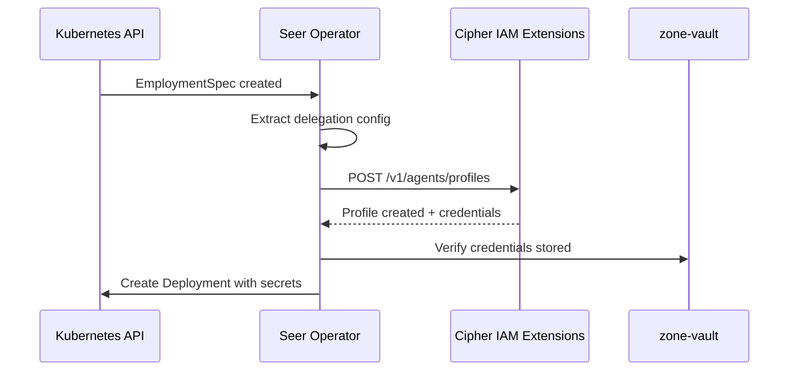

# Integration Patterns

> **Status**: 🟢 Complete  
> **Last Updated**: 2026-01-12

---

## Overview

This document describes how Seer components integrate with Cipher IAM Extensions, including patterns for Seer Operator, Agent Runtime, and Policy Enforcement Points.

---

## Seer Operator Integration

### Profile Provisioning

Seer Operator is the primary client for profile management:



### Operator Pattern

```python
class EmploymentSpecController:
    """Seer Operator controller for EmploymentSpec."""
    
    async def reconcile(self, spec: EmploymentSpec):
        """Reconcile EmploymentSpec to desired state."""
        
        # Step 1: Create/Update IAM Profile
        profile = await self._ensure_profile(spec)
        if not profile:
            return ReconcileResult.retry(delay=30)
        
        # Step 2: Verify credentials
        if not await self._verify_credentials(spec, profile):
            return ReconcileResult.retry(delay=10)
        
        # Step 3: Create/Update Deployment
        await self._ensure_deployment(spec, profile)
        
        return ReconcileResult.success()
    
    async def _ensure_profile(self, spec: EmploymentSpec) -> Optional[AgentProfile]:
        """Ensure IAM profile exists and is up to date."""
        
        profile_id = spec.metadata.name
        
        # Check if profile exists
        existing = await self.iam_client.get_profile(profile_id)
        
        if existing:
            # Update if changed
            if self._profile_needs_update(existing, spec):
                return await self.iam_client.update_profile(
                    profile_id,
                    self._build_profile_request(spec)
                )
            return existing
        else:
            # Create new profile
            return await self.iam_client.create_profile(
                self._build_profile_request(spec)
            )
    
    def _build_profile_request(self, spec: EmploymentSpec) -> dict:
        """Build profile creation/update request."""
        return {
            "profileId": spec.metadata.name,
            "type": "employed",
            "identity": {
                "subscription": spec.subscription,
                "workbench": spec.metadata.namespace,
                "agentCode": spec.spec.agent_code
            },
            "delegation": {
                "type": spec.spec.delegation.type,
                "delegator": spec.spec.delegation.delegator,
                "accountable": spec.spec.delegation.accountable,
                "roles": spec.spec.delegation.roles,
                "groups": spec.spec.delegation.groups
            },
            "policies": spec.spec.delegation.policies
        }
```

### Profile Lifecycle Events

| Event | Operator Action |
|-------|-----------------|
| EmploymentSpec created | Create IAM profile |
| EmploymentSpec updated | Update IAM profile |
| EmploymentSpec deleted | Delete IAM profile |
| Kill switch activated | Revoke IAM profile |

---

## Agent Runtime Integration

### Credential Injection

Agent Runtime retrieves credentials for pod deployment:

```python
class AgentPodBuilder:
    """Builds agent pod specifications."""
    
    def build_pod_spec(self, spec: EmploymentSpec, profile: AgentProfile) -> dict:
        """Build pod specification with credentials."""
        
        return {
            "spec": {
                "containers": [{
                    "name": "agent",
                    "image": spec.spec.image,
                    "env": [
                        # Agent token
                        {
                            "name": "AGENT_TOKEN",
                            "valueFrom": {
                                "secretKeyRef": {
                                    "name": profile.credentials.token_secret_ref,
                                    "key": "agent-token"
                                }
                            }
                        },
                        # Virtual key
                        {
                            "name": "VIRTUAL_KEY",
                            "valueFrom": {
                                "secretKeyRef": {
                                    "name": profile.credentials.token_secret_ref,
                                    "key": "virtual-key"
                                }
                            }
                        },
                        # SPIFFE socket (for SVID)
                        {
                            "name": "SPIFFE_ENDPOINT_SOCKET",
                            "value": "unix:///run/spire/sockets/agent.sock"
                        },
                        # Agent identity
                        {
                            "name": "AGENT_ID",
                            "value": profile.profile_id
                        }
                    ],
                    "volumeMounts": [
                        {
                            "name": "spire-agent-socket",
                            "mountPath": "/run/spire/sockets",
                            "readOnly": True
                        }
                    ]
                }],
                "volumes": [
                    {
                        "name": "spire-agent-socket",
                        "csi": {
                            "driver": "csi.spiffe.io",
                            "readOnly": True
                        }
                    }
                ]
            }
        }
```

### Runtime Authentication

```python
class AgentAuthenticator:
    """Authenticates agent to Hub services."""
    
    def __init__(self):
        self.token = os.environ["AGENT_TOKEN"]
        self.virtual_key = os.environ["VIRTUAL_KEY"]
        self.agent_id = os.environ["AGENT_ID"]
    
    def get_auth_headers(self, service: str) -> dict:
        """Get authentication headers for a service."""
        
        if service == "model-gateway":
            return {"Authorization": f"Bearer {self.virtual_key}"}
        else:
            return {"Authorization": f"Bearer {self.token}"}
    
    async def get_svid(self) -> str:
        """Get SVID for mTLS authentication."""
        
        from spiffe import WorkloadAPIClient
        
        client = WorkloadAPIClient()
        svid = await client.fetch_x509_svid()
        return svid
```

---

## PEP Integration

### PEP Query Pattern

Policy Enforcement Points query Cipher IAM for authorization:

```python
class PEPAuthorizer:
    """Authorization for Policy Enforcement Points."""
    
    def __init__(self, pep_id: str, iam_client, opa_client):
        self.pep_id = pep_id
        self.iam = iam_client
        self.opa = opa_client
    
    async def authorize(
        self, 
        agent_token: str, 
        request_context: dict
    ) -> AuthorizationResult:
        """Authorize an agent request at this PEP."""
        
        # Step 1: Validate token and get agent ID
        agent_id = await self.iam.validate_token(agent_token)
        if not agent_id:
            return AuthorizationResult.denied("Invalid token")
        
        # Step 2: Get agent profile
        profile = await self.iam.get_profile(agent_id)
        if not profile:
            return AuthorizationResult.denied("Profile not found")
        
        # Step 3: Check profile status
        if profile.status != "active":
            return AuthorizationResult.denied(f"Profile status: {profile.status}")
        
        # Step 4: Evaluate policy
        decision = await self.opa.evaluate(
            path=f"/v1/data/{self.pep_id}/allow",
            input={
                "agent": {
                    "id": profile.profile_id,
                    "roles": profile.delegation.inherited_roles,
                    "groups": profile.delegation.inherited_groups,
                },
                "request": request_context
            }
        )
        
        if decision.get("allow"):
            return AuthorizationResult.allowed()
        else:
            return AuthorizationResult.denied(decision.get("deny", ["Policy denied"]))
```

### PEP Integration Examples

#### Model Gateway

```python
@app.middleware("http")
async def model_gateway_auth(request: Request, call_next):
    """Model Gateway authentication middleware."""
    
    # Extract virtual key
    auth_header = request.headers.get("Authorization")
    virtual_key = auth_header.replace("Bearer ", "")
    
    # Authorize
    authorizer = PEPAuthorizer("model-gateway", iam_client, opa_client)
    result = await authorizer.authorize(
        agent_token=virtual_key,
        request_context={
            "model": request.json().get("model"),
            "action": "inference"
        }
    )
    
    if not result.allowed:
        return JSONResponse(
            status_code=403,
            content={"error": result.reason}
        )
    
    return await call_next(request)
```

#### Tool Gateway

```python
class ToolGatewayAuthorizer:
    """Tool Gateway authorization."""
    
    async def authorize_tool_call(
        self, 
        agent_id: str, 
        tool_id: str, 
        parameters: dict
    ) -> AuthorizationResult:
        
        authorizer = PEPAuthorizer("tool-gateway", iam_client, opa_client)
        return await authorizer.authorize(
            agent_token=await self.get_agent_token(agent_id),
            request_context={
                "tool": tool_id,
                "parameters": parameters,
                "action": "invoke"
            }
        )
```

---

## Audit Logging Integration

### CAF Logging

All profile operations are logged to CAF:

```python
class IAMAuditLogger:
    """Audit logging for IAM operations."""
    
    async def log_profile_created(self, profile: AgentProfile, created_by: str):
        await caf_client.log({
            "event_type": "agent_profile_created",
            "timestamp": datetime.now().isoformat(),
            "agent": {
                "id": profile.profile_id,
                "spiffe_id": profile.identity.spiffe_id
            },
            "delegation": {
                "type": profile.delegation.type,
                "delegator": profile.delegation.delegator,
                "accountable": profile.delegation.accountable
            },
            "created_by": created_by
        })
    
    async def log_profile_revoked(self, profile_id: str, revoked_by: str, reason: str):
        await caf_client.log({
            "event_type": "agent_profile_revoked",
            "timestamp": datetime.now().isoformat(),
            "agent_id": profile_id,
            "revoked_by": revoked_by,
            "reason": reason
        })
```

---

## Error Handling Patterns

### Retry with Backoff

```python
class IAMClientWithRetry:
    """IAM client with retry logic."""
    
    async def create_profile_with_retry(
        self, 
        request: dict, 
        max_retries: int = 3
    ) -> AgentProfile:
        
        for attempt in range(max_retries):
            try:
                return await self.iam_client.create_profile(request)
            except IAMUnavailableError:
                if attempt == max_retries - 1:
                    raise
                await asyncio.sleep(2 ** attempt)
            except IAMValidationError:
                # Don't retry validation errors
                raise
```

### Circuit Breaker

```python
class IAMCircuitBreaker:
    """Circuit breaker for IAM calls."""
    
    def __init__(self):
        self.failure_count = 0
        self.state = "closed"
        self.last_failure = None
    
    async def call(self, func, *args, **kwargs):
        if self.state == "open":
            if self._timeout_expired():
                self.state = "half-open"
            else:
                raise CircuitOpenError()
        
        try:
            result = await func(*args, **kwargs)
            self._record_success()
            return result
        except Exception as e:
            self._record_failure()
            raise
```

---

## Related Documentation

- [Seer Operator](../seer-operator/README.md) — Operator details
- [Agent Runtime](../agent-runtime/README.md) — Runtime details
- [Agent Profile API](./agent-profile-api.md) — API specification

---

*Integration Patterns provide consistent approaches for Seer components to interact with Cipher IAM Extensions.*
