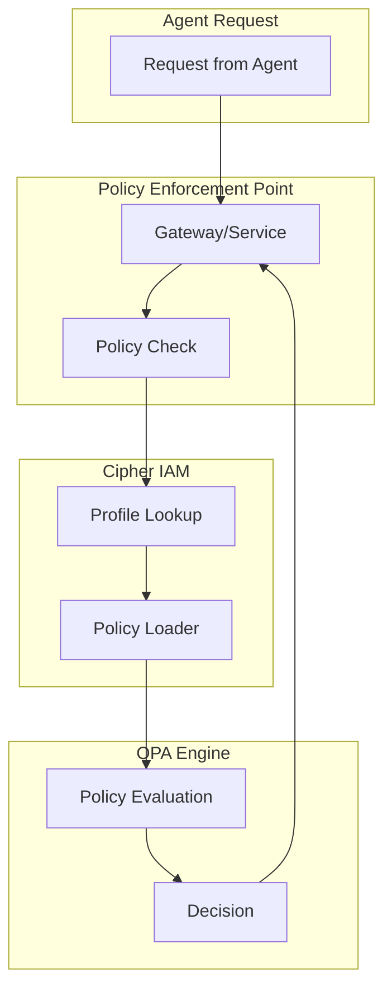
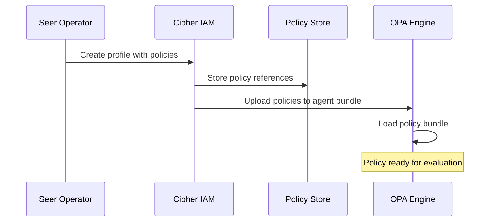

# Policy Enforcement Points

> **Status**: 🟢 Design Complete  
> **Last Updated**: 2026-01-12

---

## Overview

Cipher IAM Extensions supports per-PEP (Policy Enforcement Point) policy configuration. This document describes PEP registration and provides C3-level detail on policy evaluation flow.

---

## PEP Registration

### Registered PEPs

Cipher IAM recognizes the following Policy Enforcement Points:

| PEP ID | Description | Subsystem | Delegation Token |
|--------|-------------|-----------|------------------|
| `tool-gateway` | Tool invocation authorization | Tool Gateway | ✅ Validates |
| `signal-exchange` | Request/response access control | Signal Exchange | ✅ Validates |
| `model-gateway` | LLM access control | Model Gateway | ❌ Agent identity only |
| `memory-service` | Agent memory access control | Memory Service | ❌ Agent identity only |
| `knowledge-service` | Knowledge base access control | Knowledge Service | ❌ Agent identity only |
| `seer-sidecar` | Pre-guardrail delegation check | Seer Sidecar | ✅ Validates |

**Note**: PEPs marked with ✅ validate Delegation Access Tokens when present. Those marked ❌ use agent identity and enterprise delegation only.

### PEP Registration API

```yaml
apiVersion: cipher.olympus.io/v1
kind: PolicyEnforcementPoint
metadata:
  name: model-gateway
  namespace: seer-system
spec:
  pepId: model-gateway
  description: "Seer Model Gateway LLM access control"
  
  policyBundle:
    source: bundles/model-gateway
    version: "1.2.0"
  
  inputSchema:
    ref: schemas/model-gateway-input.json
  
  decisions:
    - allow: boolean
    - deny: array[string]
  
  integration:
    type: sidecar
    opaEndpoint: http://localhost:8181
```

---

## Policy Attachment

### Per-Agent Policy Configuration

Policies are attached per-PEP in the EmploymentSpec:

```yaml
spec:
  delegation:
    policies:
      - pep: "tool-gateway"
        policyRef: "policies/tool-gateway-restrictions.rego"
      - pep: "model-gateway"
        policyRef: "policies/model-access.rego"
      - pep: "signal-exchange"
        policyRef: "policies/signal-exchange-restrictions.rego"
```

### Policy Reference Format

| Field | Description | Example |
|-------|-------------|---------|
| `pep` | PEP identifier | `model-gateway` |
| `policyRef` | Path to policy file | `policies/model-access.rego` |

### Policy File Storage

Policies are stored in:
- **Foundry** — For training-spec-level policies
- **Workbench** — For employment-spec-level policies
- **Platform** — For default/baseline policies

---

## Unknown PEP Handling

### Graceful Degradation

Unknown PEPs are **ignored** with a warning:

```python
def process_policy_attachment(policy_config):
    """Process policy attachment for agent."""
    
    for policy in policy_config:
        pep = policy.pep
        
        # Check if PEP is registered
        if not pep_registry.is_registered(pep):
            # Log warning but continue
            log.warning(f"Unknown PEP '{pep}' - policy ignored")
            continue
        
        # Process known PEP
        load_policy(pep, policy.policy_ref)
```

### Warning in Response

Unknown PEPs generate warnings in API responses:

```json
{
  "profileId": "fraud-analyst-acme-retail",
  "status": "active",
  "warnings": [
    {
      "type": "unknown_pep",
      "pep": "custom-gateway",
      "message": "PEP 'custom-gateway' not registered - policy ignored"
    }
  ]
}
```

---

## Policy Evaluation Flow (C3 Detail)

### PEP Integration Architecture



### Evaluation Algorithm

```python
class PEPPolicyEvaluator:
    """Evaluates policies for a specific PEP."""
    
    def __init__(self, pep_id: str, opa_client, profile_store):
        self.pep_id = pep_id
        self.opa = opa_client
        self.profiles = profile_store
    
    async def evaluate(
        self, 
        agent_id: str, 
        request_context: dict
    ) -> PolicyDecision:
        """
        Evaluate policy for agent request at this PEP.
        
        Args:
            agent_id: Agent profile ID
            request_context: PEP-specific request context
        
        Returns:
            PolicyDecision with allow/deny and reasons
        """
        # Step 1: Load agent profile
        profile = await self.profiles.get(agent_id)
        if not profile:
            return PolicyDecision(
                allowed=False,
                reason="Agent profile not found"
            )
        
        # Step 2: Find policy for this PEP
        pep_policy = self._find_pep_policy(profile.policies)
        if not pep_policy:
            # No specific policy = use default
            pep_policy = self._get_default_policy()
        
        # Step 3: Build OPA input
        opa_input = self._build_input(profile, request_context)
        
        # Step 4: Evaluate with OPA
        result = await self.opa.evaluate(
            path=f"/v1/data/{self.pep_id}/allow",
            input=opa_input
        )
        
        return PolicyDecision(
            allowed=result.get("allow", False),
            reasons=result.get("deny", [])
        )
    
    def _find_pep_policy(self, policies: list) -> Optional[dict]:
        """Find policy for this PEP in agent's policy list."""
        for policy in policies:
            if policy.pep == self.pep_id:
                return policy
        return None
    
    def _build_input(self, profile, request_context: dict) -> dict:
        """Build OPA input document."""
        return {
            "input": {
                "agent": {
                    "id": profile.profile_id,
                    "spiffeId": profile.identity.spiffe_id,
                    "roles": profile.delegation.inherited_roles,
                    "groups": profile.delegation.inherited_groups,
                    "delegator": profile.delegation.delegator,
                    "accountable": profile.delegation.accountable,
                },
                "pep": self.pep_id,
                "request": request_context,
            }
        }
```

### Policy Precedence

When evaluating, policies are applied in order:

```
1. Agent-specific policy (from EmploymentSpec)
2. Training-spec-level policy (from TrainingSpec)
3. PEP default policy (baseline)
```

```python
def resolve_policy(agent_id: str, pep_id: str) -> Policy:
    """Resolve effective policy for agent at PEP."""
    
    # Try agent-specific
    profile = profile_store.get(agent_id)
    for policy in profile.policies:
        if policy.pep == pep_id:
            return load_policy(policy.policy_ref)
    
    # Try training-spec-level
    training_spec = get_training_spec(profile.training_spec)
    for policy in training_spec.policies:
        if policy.pep == pep_id:
            return load_policy(policy.policy_ref)
    
    # Fall back to PEP default
    return get_pep_default_policy(pep_id)
```

---

## Policy Loading

### Policy Bundle Sync

Policies are synced to OPA as bundles:



### Policy Bundle Structure

```
bundles/agents/{agent_id}/
├── main.rego           # Entry point
├── tool-gateway.rego   # Tool Gateway policy
├── model-gateway.rego  # Model Gateway policy
└── data.json           # Static policy data
```

---

## Metrics

### Policy Metrics

```prometheus
# Policy evaluations by PEP
seer_pep_evaluations_total{pep="model-gateway", result="allow"} 12345
seer_pep_evaluations_total{pep="model-gateway", result="deny"} 123

# Policy evaluation latency
seer_pep_evaluation_duration_seconds_bucket{pep="model-gateway", le="0.01"} 10000

# Unknown PEP warnings
seer_pep_unknown_total{pep="custom-gateway"} 5
```

---

---

## Delegation Token Validation

### Validation at PEPs

PEPs that support delegation tokens validate them using local public key verification:

```python
class DelegationTokenValidator:
    """Validates Delegation Access Tokens at PEPs."""
    
    def __init__(self, public_key, revocation_cache):
        self.public_key = public_key
        self.revocation_cache = revocation_cache
    
    async def validate(
        self,
        token: str,
        agent_id: str,
        request_context: dict
    ) -> DelegationValidationResult:
        """Validate a Delegation Access Token."""
        
        # Step 1: Verify signature (local, no network call)
        try:
            claims = jwt.decode(token, self.public_key, algorithms=["RS256"])
        except jwt.InvalidTokenError:
            return DelegationValidationResult.invalid("Signature verification failed")
        
        # Step 2: Check expiry
        if claims["exp"] < datetime.now().timestamp():
            return DelegationValidationResult.expired()
        
        # Step 3: Verify audience binding
        if claims["aud"] != agent_id:
            return DelegationValidationResult.invalid("Token not bound to this agent")
        
        # Step 4: Check revocation (cached)
        cert_id = claims["delegation"]["certificate"]
        if await self.revocation_cache.is_revoked(cert_id):
            return DelegationValidationResult.revoked()
        
        # Step 5: Extract delegation context for policy evaluation
        return DelegationValidationResult.valid(
            delegator=claims["sub"],
            template=claims["delegation"]["template"],
            permissions=claims["delegation"]["permissions"],
            constraints=claims["delegation"]["constraints"]
        )
```

### Policy Composition with Delegation

When delegated authority is used, **all applicable policies must ALLOW** (AND logic):

```python
async def evaluate_with_delegation(
    agent_id: str,
    delegation_token: str,
    request_context: dict
) -> PolicyDecision:
    """Evaluate policies including delegation context."""
    
    # Validate delegation token
    delegation = await token_validator.validate(
        delegation_token, 
        agent_id,
        request_context
    )
    
    if not delegation.valid:
        return PolicyDecision.denied(delegation.reason)
    
    # Build composite policy input
    opa_input = {
        "agent": get_agent_context(agent_id),
        "delegation": {
            "delegator": delegation.delegator,
            "template": delegation.template,
            "permissions": delegation.permissions,
            "constraints": delegation.constraints
        },
        "request": request_context
    }
    
    # Evaluate all policy layers
    # All must ALLOW (intersection/AND logic)
    
    # 1. Training Spec policies
    training_result = await evaluate_training_policies(agent_id, opa_input)
    if not training_result.allow:
        return PolicyDecision.denied(f"Training policy: {training_result.reason}")
    
    # 2. Employment Spec policies
    employment_result = await evaluate_employment_policies(agent_id, opa_input)
    if not employment_result.allow:
        return PolicyDecision.denied(f"Employment policy: {employment_result.reason}")
    
    # 3. Delegation Template policies
    template_result = await evaluate_template_policies(delegation.template, opa_input)
    if not template_result.allow:
        return PolicyDecision.denied(f"Template policy: {template_result.reason}")
    
    return PolicyDecision.allowed()
```

### OPA Input with Delegation Context

```rego
# Example: Tool Gateway policy with delegation
package tool_gateway

default allow = false

# Allow if agent has direct permission OR delegated permission
allow {
    agent_has_permission(input.request.tool)
}

allow {
    delegation_has_permission(input.request.tool)
    delegation_constraints_satisfied(input.request)
}

delegation_has_permission(tool) {
    perm := input.delegation.permissions[_]
    perm.resource == tool
    perm.actions[_] == input.request.action
}

delegation_constraints_satisfied(request) {
    input.delegation.constraints.maxAmount >= request.amount
}
```

---

## Related Documentation

- [Agent Profile API](./agent-profile-api.md) — Profile with policy configuration
- [Model Gateway Policy](../model-gateway/policy-enforcement.md) — Model Gateway PEP details
- [OPA Integration](../../../../olympus-hub-docs/05-infrastructure/opa.md) — OPA documentation
- [Delegation Templates](./delegation-templates.md) — Template policies
- [Request-Scoped Delegation](../../implementation-concepts/request-scoped-delegation.md) — Comprehensive design

---

*Policy Enforcement Points provide per-PEP policy configuration with delegation token validation and policy composition.*
