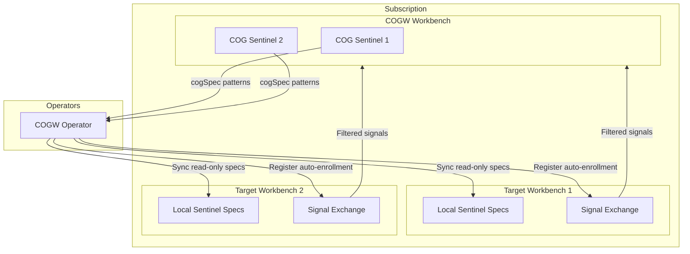

# Cognitive Operations Governance Workbench

> **Status**: 🟢 Design Complete  
> **Last Updated**: 2026-01-14

## Overview

Cognitive Operations Governance Workbench (COGW) provides subscription-wide cognitive operations governance, enabling organizations to deploy AI agents (COG Sentinels) that observe and participate in requests across multiple workbenches. COGW enables multi-domain governance, supervision, and learning using Hub Workbenches and Seer Agents.

---

## Design Documents

| Document | Description | Status |
|----------|-------------|--------|
| [SCOPE.md](./SCOPE.md) | Design scope, coverage summary, key decisions | Overview |
| [COGW Specification](./cogw-specification.md) | Workbench type, default creation, blueprint | C2 |
| [COG Sentinel Specification](./cog-sentinel-specification.md) | COG Sentinel labeling, cogSpec, pattern matching | C2+C3 |
| [COGW Operator](./cogw-operator.md) | Operator scope, reconciliation, sync | C2+C3 |
| [Signal Forwarding](./signal-forwarding.md) | Filtered signal forwarding to COGW | C2 |
| [Administrative Controls](./administrative-controls.md) | Enable/disable, read-only enforcement | C2 |

---

## Architecture

---

## Key Design Decisions

### COGW as Workbench Type

- **`workbench_type: "cogw"`** — Distinct workbench type like `devops`
- **Explicit marker** — Clear identification of governance workbenches
- **Standard workbench features** — Scenarios, triggers, agents apply

### Default COGW at Subscription Creation

- **Auto-created** — Every subscription gets a default COGW at creation
- **Deletable** — Can be deleted if not needed
- **Standard blueprint** — Pre-populated with governance scenarios

### COG Sentinel Model

- **Request Sentinel extension** — COG Sentinels are Request Sentinels with cross-workbench targeting
- **Label + cogSpec** — Identified by metadata label and cogSpec presence
- **Pattern-based targeting** — Apache-style allow/disallow patterns

### One Operator Per Subscription

- **Subscription scope** — Single operator manages all COGWs in subscription
- **Centralized management** — Consistent reconciliation logic
- **Workbench enumeration** — Operator has access to list all workbenches

### Read-only Sync to Target Workbenches

- **Same CRD types** — Read-only annotation on standard specs
- **Local enable/disable** — Target admins can control, not modify
- **Automatic sync** — Updates propagate to all targets

---

## Related

- [Seer Sentinels](../seer-sentinels/README.md) — Base Sentinel subsystem
- [Cognitive Operations Governance Concept](../../implementation-concepts/cognitive-operations-governance.md) — Implementation concept
- [Hub Integration](../../hub-integration/cogw-workbench-integration.md) — Hub integration
- [Cross-Workbench Context Sharing](../../../../olympus-hub-docs/02-system-design/implementation-concepts/workbench-context-sharing.md) — Context sharing pattern
- [DevOps Workbench Reference](../../../../olympus-hub-docs/02-system-design/implementation-concepts/devops-workbench-reference.md) — Similar workbench type pattern
