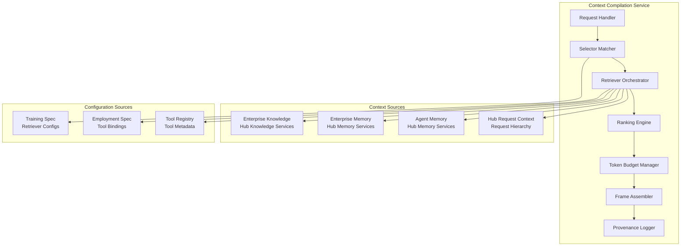
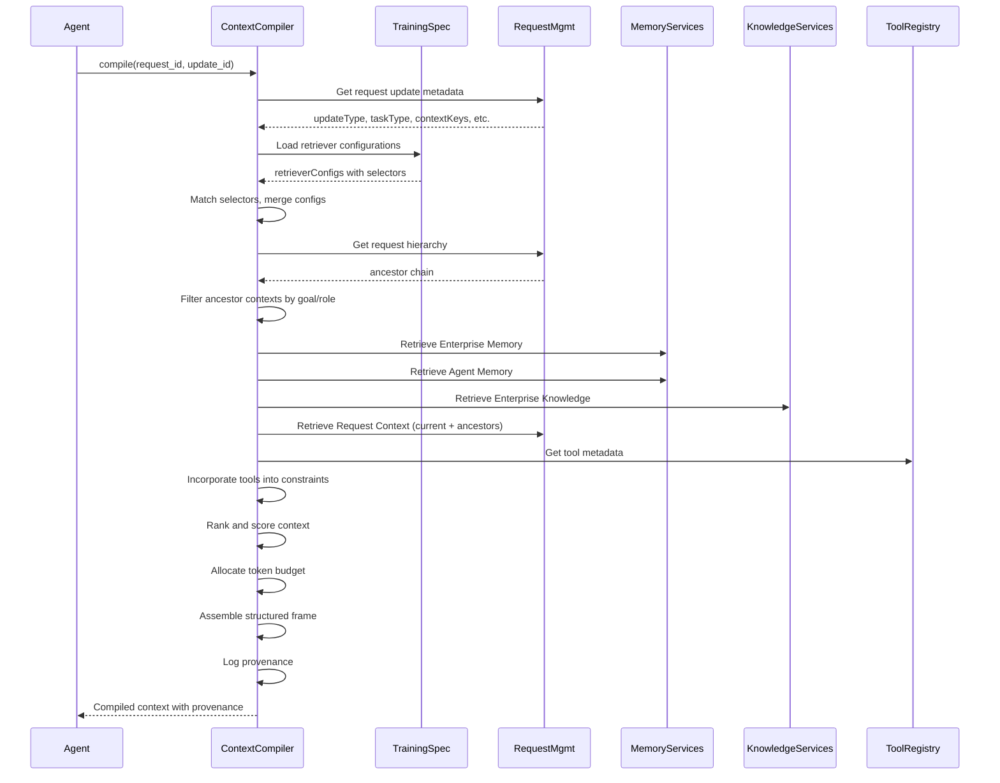
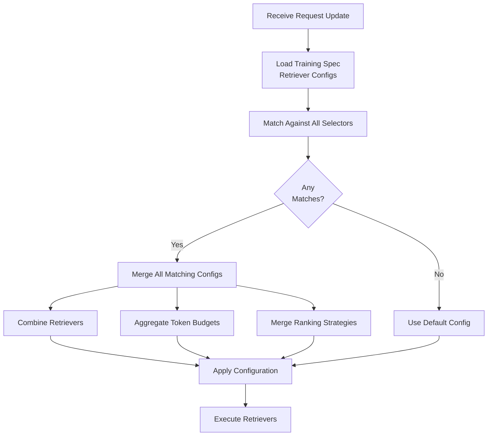

# Context Compilation Service

> **Status**: 🟢 Design Complete  
> **Last Updated**: 2026-01-12  
> **Design Level**: C2 (Container)

---

## Overview

The Context Compilation Service provides the core service implementation for context assembly, compiling context from four distinct sources: Enterprise Knowledge, Enterprise Memory, Agent Memory, and Hub Request Context (including request hierarchy/ancestry topology). The service automatically selects retrievers based on request update metadata matching Training Spec selector criteria, incorporates available tools into context constraints, and manages token budgets, ranking, and provenance tracking.

**Key Design Point**: The service is explicitly invoked by agents — it does not pre-compile context. Agents choose when to invoke compilation, and the service automatically applies Training Spec retriever configurations based on the incoming request update.

---

## Architecture



---

## Functional Scope

### Four-Source Compilation

The Context Compilation Service assembles context from four distinct sources:

| Source | What the Agent Asks | Nature | Owned By |
|--------|---------------------|--------|----------|
| **Enterprise Knowledge** | *"What should I do?"* | Normative — rules, policies, facts | Hub (Knowledge Services) |
| **Enterprise Memory** | *"What has been done?"* | Historical — precedent, outcomes, exceptions | Hub (Memory Services) |
| **Agent Memory** | *"What have I been doing?"* | Operational — session state, recent interactions | Hub (Memory Services) |
| **Hub Request Context** | *"What is the request context chain?"* | Hierarchical — current request + all ancestors | Hub (Request Management) |

### Request Hierarchy Integration

The service traverses the request hierarchy/ancestry topology to access context from all requestors in the ancestry chain:

```
Root Request (depth=0)
├── Child Request (depth=1)
│   └── Grandchild Request (depth=2) ← Current Request
```

**Ancestry Traversal:**
- Retrieves context from current request
- Traverses up the hierarchy to root request
- Accesses context records from each ancestor request
- Applies goal and role-based filtering to determine which ancestor contexts are relevant

**Goal and Role-Based Filtering:**
- Agent goal (from Training Spec) determines which ancestor contexts align with the agent's purpose
- Agent role (from Training Spec) determines which ancestor contexts are within the agent's responsibility scope
- Only relevant ancestor contexts are included in compilation
- Filtering prevents information overload and ensures context relevance

### Request-Update-Based Retriever Configuration

The service automatically selects retrievers based on request update metadata matching Training Spec selector criteria.

**Training Spec Configuration:**
```yaml
spec:
  contextCompilation:
    retrieverConfigs:
      - selector:
          updateType: "task_created"
          taskType: "fraud_investigation"
        retrievers:
          - type: memory.precedent
            query: "fraud investigation cases"
            limit: 5
            minScore: 0.7
          - type: knowledge.search
            knowledgeBase: "fraud-policies"
            query: "investigation procedures"
            limit: 3
        tokenBudget:
          total: 8000
          allocation:
            precedents: 3000
            policies: 2500
            reserve: 2500
        ranking:
          strategy: relevance
          recencyBoost: 0.2
      
      - selector:
          updateType: "context_update"
          contextKeys: ["customer_profile"]
        retrievers:
          - type: memory.case_history
            caseId: "${request.case_id}"
          - type: agent_memory.conversation
            store: "case-dialog"
            lastN: 10
        tokenBudget:
          total: 6000
          allocation:
            case_history: 3000
            conversation: 2000
            reserve: 1000
      
      - selector: {}  # Default fallback
        retrievers:
          - type: knowledge.search
            knowledgeBase: "general-policies"
            limit: 3
        tokenBudget:
          total: 4000
```

**Selector Matching:**
- Service receives request update with metadata (updateType, taskType, contextKeys, scenarioId, workbenchId, etc.)
- Loads Training Spec retriever configurations
- Matches request update against all selector criteria
- When multiple selectors match, **all matching configurations are merged**:
  - Retrievers from all matching configs are combined
  - Token budgets are aggregated
  - Ranking strategies are merged (with precedence rules)
- Falls back to default configuration if no match

**Selector Matching Criteria:**
- `updateType`: Type of request update (e.g., "task_created", "context_update", "decision_requested")
- `taskType`: Type of task (e.g., "fraud_investigation", "dispute_resolution")
- `contextKeys`: Presence of specific context keys in request update
- `scenarioId`: Which scenario triggered the agent
- `workbenchId`: Which workbench context
- Custom metadata fields: Additional matching criteria

### Tool-Aware Compilation

The service incorporates available tools (from Training/Employment Specs) into the context constraints section and uses tool capabilities to influence context retrieval and ranking.

**Tool Integration:**
- Loads tool bindings from Employment Spec
- Loads tool metadata (capabilities, schemas) from Tool Registry
- Includes tool allowlist in context constraints section
- Tool capabilities influence context retrieval:
  - If a tool can query a database, reduce redundant context about that data
  - Prioritize context that helps with tool selection
  - Include tool schemas and usage patterns in context

**Example:**
```yaml
# Context constraints section includes:
constraints:
  tool_allowlist:
    - protocol: "temenos-t24/get-transactions"
      alias: "get_transactions"
      capabilities: ["read_transactions", "filter_by_date"]
    - protocol: "case-management/update-case"
      alias: "update_case"
      capabilities: ["update_status", "add_notes"]
  
  # Tool capabilities influence retrieval:
  # If get_transactions can filter by date, less need for date context
  # Prioritize context about transaction patterns for tool selection
```

### Ranking & Relevance

The service provides multiple ranking strategies to prioritize information by relevance:

**Relevance Ranking** (default):
- Combines semantic similarity, recency, and source weights
- Formula: `score = (semantic_score * 0.6) + (recency_score * 0.2) + (source_weight * 0.2)`
- Configurable recency boost and decay

**Priority Ranking:**
- Fixed priority ordering by source type
- Order: request.context > agent_memory > memory.case_history > memory.precedent > knowledge.search

**Custom Ranking:**
- Agent-defined ranking function reference
- Allows domain-specific ranking logic

### Token Budgeting

The service manages token budgets across context sections:

**Allocation Strategies:**
- **Fixed Allocation**: Explicit token allocation per section
- **Proportional Allocation**: Weight-based proportional distribution
- **Dynamic Allocation**: Priority-based allocation with reserve

**Overflow Handling:**
- `truncate`: Cut off at budget limit
- `summarize`: LLM-based summarization
- `compress`: Remove low-value content
- `paginate`: Return first page, indicate more available

### Provenance Tracking

The service preserves complete provenance for audit and reproducibility:

- Source attribution for every context element
- Timestamp of retrieval
- Version information for immutable sources
- Retrieval parameters used
- Ranking scores applied
- Token budget allocation decisions
- Reproducibility: Same inputs and retrieval state produce same context

---

## Integration Points

### Hub Memory Services
- **Enterprise Memory**: Precedent search, case history, patterns, procedures
- **Agent Memory**: Conversation, key-value stores, documents, audit logs
- **Integration**: Direct API calls to Hub Memory Services

### Hub Knowledge Services
- **Enterprise Knowledge**: RAG-based policy/rule retrieval, reference data lookup
- **Integration**: Direct API calls to Hub Knowledge Services

### Hub Request Management
- **Request Hierarchy**: Ancestry topology traversal, context record access
- **Integration**: API calls to retrieve compiled context with ancestor chain
- **Context Records**: Access to immutable context records from request hierarchy

### Tools Gateway / Tool Registry
- **Tool Metadata**: Capabilities, schemas, usage patterns
- **Integration**: Tool Registry API for tool metadata retrieval

### Agent Lifecycle Manager
- **Training Spec**: Retriever configurations with selectors
- **Employment Spec**: Tool bindings and constraints
- **Integration**: CRD access to Training/Employment Specs

### Model Gateway
- **Token Limits**: Model-specific token limits inform context truncation
- **Integration**: Token limit queries for budget allocation

### Seer Agent SDK
- **SDK APIs**: Service exposed via SDK wrappers
- **Integration**: SDK invokes service API endpoints

---

## Operational Flow

### Context Compilation Flow



### Selector Matching and Merging



---

## Key Design Decisions

### Request-Update-Based Retriever Configuration

**Principle**: Agent code (Raw Agent) is framework-agnostic and precedes Training Spec. Agents cannot be Training-aware.

**Approach**: Training Spec defines retriever configurations with selectors that match against request update metadata. Context Compiler automatically selects the matching configuration based on the incoming request update.

**Benefits:**
- Agent code remains framework-agnostic
- Context compilation behavior configured declaratively in Training Spec
- Automatic adaptation to different request update types
- No code changes needed when retriever strategies evolve

### Multiple Selector Matching and Merging

**Decision**: When multiple selectors match a request update, all matching retriever configurations are merged.

**Merging Behavior:**
- **Retrievers**: Combined (union of all retrievers from matching configs)
- **Token Budgets**: Aggregated (sum of allocations, with reserve preserved)
- **Ranking Strategies**: Merged with precedence rules (most specific strategy wins conflicts)

**Rationale**: Allows fine-grained control while supporting overlapping scenarios (e.g., both "task_created" and "fraud_investigation" match).

### Goal and Role-Based Ancestor Context Filtering

**Decision**: Ancestor contexts are filtered based on agent goal and role to determine relevance.

**Filtering Logic:**
- Agent goal (from Training Spec) determines which ancestor contexts align with agent's purpose
- Agent role (from Training Spec) determines which ancestor contexts are within agent's responsibility scope
- Only relevant ancestor contexts are included in compilation

**Rationale**: Prevents information overload and ensures context relevance. A fraud analyst agent doesn't need context from a customer service ancestor request unless it's relevant to fraud detection.

### Tool-Aware Compilation

**Decision**: Available tools are incorporated into context constraints, and tool capabilities influence context retrieval and ranking.

**Rationale**: 
- Agents need to know what tools are available
- Tool capabilities can reduce redundant context (if tool can query DB, less need for pre-fetched data)
- Context should help with tool selection decisions

---

## Data Models

### Compilation Request

```yaml
compilationRequest:
  request_id: string          # Current request ID
  update_id: string           # Current update ID
  agent_id: string            # Employed Agent ID
  
  # Optional overrides (rarely used - defaults from Training Spec)
  token_budget_override: integer  # Override total budget
  cache: boolean                 # Enable/disable caching
```

### Compilation Response

```yaml
compilationResponse:
  compilationId: string
  timestamp: datetime
  
  context:
    constraints:
      tool_allowlist: array
      safety_rules: array
      policy_constraints: array
    
    goal:
      objective: text
      definition_of_done: text
    
    facts:
      - source: string
        content: object
        confidence: number
    
    precedent:
      - record_id: string
        summary: text
        relevance_score: number
    
    procedures:
      applicable_sops: array
      agent_procedures: array
    
    working_state:
      tool_outputs: array
      session_variables: object
    
    request_context:
      current:
        request_id: string
        context: object
      ancestors:
        - request_id: string
          depth: integer
          context: object
          relevance: string  # "relevant" | "filtered_out"
  
  metadata:
    tokenCount: integer
    budgetRemaining: integer
    compilationTimeMs: integer
    retrievalStats: object
  
  provenance:
    sources: array
    source_versions: object
    hash: string
```

### Retriever Configuration

```yaml
retrieverConfig:
  selector:
    updateType: string        # Optional
    taskType: string         # Optional
    contextKeys: array        # Optional
    scenarioId: string       # Optional
    workbenchId: string      # Optional
    custom: object           # Optional custom metadata
  
  retrievers:
    - type: string
      query: string          # Optional
      limit: integer
      minScore: number       # Optional
      # Type-specific parameters
  
  tokenBudget:
    total: integer
    allocation:
      section_name: integer
      reserve: integer
  
  ranking:
    strategy: string         # "relevance" | "priority" | "custom"
    recencyBoost: number     # Optional
    sourceWeights: object    # Optional
    customRankerRef: string  # Optional
```

---

## Implementation Details Deferred

The following implementation details are deferred to the detailed implementation stage:

| Area | Deferred Details |
|------|------------------|
| **Selector Matching Algorithm** | Specific matching logic, precedence rules for overlapping selectors |
| **Retriever Merging Algorithm** | Detailed merging logic for retrievers, budgets, ranking strategies |
| **Goal/Role Filtering Algorithm** | Specific filtering logic for ancestor context relevance |
| **Token Budget Aggregation** | Detailed aggregation rules when merging configs |
| **Ranking Strategy Merging** | Precedence rules for conflicting ranking strategies |
| **Tool Capability Analysis** | How tool capabilities influence context retrieval |
| **Performance Optimization** | Caching strategies, parallel retrieval, latency optimization |
| **Error Handling** | Specific retry policies, circuit breakers, fallback behaviors |
| **Storage** | Provenance storage backend, retention policies |

---

## Related Documentation

### Seer Design
- [Context Assembly Concepts](../../implementation-concepts/context-assembly.md) — Context assembly principles
- [Agent Lifecycle Manager](../agent-lifecycle-manager/README.md) — Training/Employment Spec management
- [Seer Agent SDK](../seer-agent-sdk/README.md) — SDK APIs for context compilation

### Hub Documentation
- [Hub Request Hierarchy](../../../../olympus-hub-docs/04-subsystems/request-management/request-hierarchy.md) — Request hierarchy and context inheritance
- [Hub Memory Services](../../../../olympus-hub-docs/04-subsystems/memory-services/README.md) — Enterprise Memory and Agent Memory
- [Hub Knowledge Services](../../../../olympus-hub-docs/04-subsystems/knowledge-services/README.md) — Enterprise Knowledge
- [ADR-0066: Request Hierarchy and Context Inheritance](../../../../olympus-hub-docs/decision-logs/0066-request-hierarchy-context-inheritance.md)

---

*Context Compilation Service provides automatic, tool-aware context assembly from four sources with request hierarchy integration and Training Spec-based retriever configuration.*
