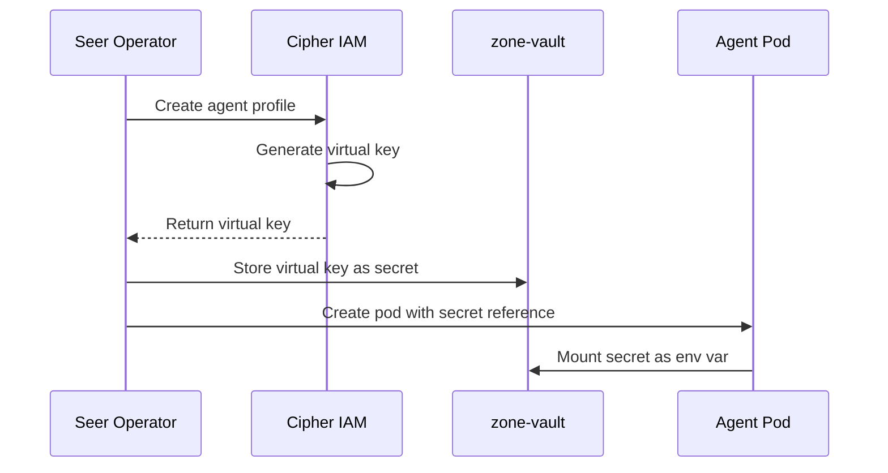
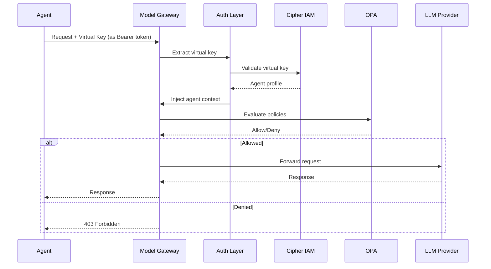

# Agent Access

> **Status**: 🟢 Design Complete  
> **Last Updated**: 2026-01-12

---

## Overview

Model Gateway provides an OpenAI-compatible API for agent access. This document describes the API interface, endpoint discovery, virtual key injection, and authentication flow.

---

## OpenAI-Compatible API

### API Compatibility

Model Gateway provides an **OpenAI-compatible API**, allowing agents to use standard OpenAI client libraries:

| Endpoint | Description |
|----------|-------------|
| `POST /v1/chat/completions` | Chat completions (primary) |
| `POST /v1/embeddings` | Text embeddings |
| `GET /v1/models` | List available models |

### Usage Example

```python
# Agent code (any framework)
from openai import OpenAI
import os

client = OpenAI(
    api_key=os.environ["VIRTUAL_KEY"],      # Injected by Seer
    base_url=os.environ["MODEL_GATEWAY_URL"] # Injected at deployment
)

response = client.chat.completions.create(
    model="gpt-4o",  # Must be in allowed list
    messages=[
        {"role": "system", "content": "You are a fraud analyst..."},
        {"role": "user", "content": "Analyze this transaction..."}
    ],
    temperature=0.7,
    max_tokens=1000
)

print(response.choices[0].message.content)
```

### Streaming Support

Streaming responses are fully supported:

```python
stream = client.chat.completions.create(
    model="gpt-4o",
    messages=[{"role": "user", "content": "Analyze this..."}],
    stream=True
)

for chunk in stream:
    if chunk.choices[0].delta.content:
        print(chunk.choices[0].delta.content, end="")
```

---

## Endpoint Discovery

### Environment Variable Injection

Model Gateway URL and virtual key are injected at deployment by Seer Operator:

```yaml
# Pod specification (created by Seer Operator)
apiVersion: v1
kind: Pod
metadata:
  name: fraud-analyst-acme-retail-pod
spec:
  containers:
    - name: agent
      image: fraud-analyst:v2.1.0
      env:
        - name: MODEL_GATEWAY_URL
          value: "http://model-gateway.seer-system.svc.cluster.local/v1"
        
        - name: VIRTUAL_KEY
          valueFrom:
            secretKeyRef:
              name: fraud-analyst-acme-retail-keys
              key: virtual-key
        
        - name: OPENAI_API_KEY
          valueFrom:
            secretKeyRef:
              name: fraud-analyst-acme-retail-keys
              key: virtual-key
        
        - name: OPENAI_BASE_URL
          value: "http://model-gateway.seer-system.svc.cluster.local/v1"
```

### Environment Variables

| Variable | Description | Example |
|----------|-------------|---------|
| `MODEL_GATEWAY_URL` | Model Gateway endpoint | `http://model-gateway.seer-system.svc.cluster.local/v1` |
| `VIRTUAL_KEY` | Agent's virtual key | `vk_acme_fraud_analyst_retail_001` |
| `OPENAI_API_KEY` | Alias for virtual key (OpenAI SDK compatibility) | Same as `VIRTUAL_KEY` |
| `OPENAI_BASE_URL` | Alias for gateway URL (OpenAI SDK compatibility) | Same as `MODEL_GATEWAY_URL` |

### Service Discovery

Model Gateway is available via Kubernetes service:

```
http://model-gateway.seer-system.svc.cluster.local/v1
```

---

## Virtual Key Injection

### Virtual Key Creation

Virtual keys are created when an Employed Agent is deployed:



### Virtual Key Format

```
vk_{subscription}_{agent_id}_{sequence}

Example: vk_acme_fraud_analyst_retail_001
```

| Component | Description |
|-----------|-------------|
| `vk_` | Virtual key prefix |
| `subscription` | Subscription identifier |
| `agent_id` | Agent identifier (sanitized) |
| `sequence` | Unique sequence number |

### Secret Storage

Virtual keys are stored in zone-vault and mounted as Kubernetes secrets:

```yaml
apiVersion: v1
kind: Secret
metadata:
  name: fraud-analyst-acme-retail-keys
  namespace: acme-disputes
type: Opaque
data:
  virtual-key: dmtfYWNtZV9mcmF1ZF9hbmFseXN0X3JldGFpbF8wMDE=  # base64 encoded
```

---

## Authentication Flow

### Request Authentication



### Authentication Methods

| Method | Header | Usage |
|--------|--------|-------|
| **Bearer Token** | `Authorization: Bearer {virtual_key}` | Standard method |
| **API Key Header** | `X-API-Key: {virtual_key}` | Alternative |
| **OpenAI Format** | `Authorization: Bearer {api_key}` | OpenAI SDK default |

### mTLS Authentication

In addition to virtual key authentication, all traffic uses mTLS via Istio:

```
Agent Pod ──(mTLS)──▶ Model Gateway
     ↑                     ↑
   SPIFFE ID           SPIFFE ID
```

---

## Request/Response Format

### Request Format

Standard OpenAI chat completion request:

```json
{
  "model": "gpt-4o",
  "messages": [
    {"role": "system", "content": "You are a fraud analyst..."},
    {"role": "user", "content": "Analyze this transaction..."}
  ],
  "temperature": 0.7,
  "max_tokens": 1000,
  "stream": false
}
```

### Response Format

Standard OpenAI chat completion response:

```json
{
  "id": "chatcmpl-123abc",
  "object": "chat.completion",
  "created": 1704898200,
  "model": "gpt-4o",
  "choices": [
    {
      "index": 0,
      "message": {
        "role": "assistant",
        "content": "Based on my analysis of the transaction..."
      },
      "finish_reason": "stop"
    }
  ],
  "usage": {
    "prompt_tokens": 500,
    "completion_tokens": 150,
    "total_tokens": 650
  }
}
```

### Error Response

```json
{
  "error": {
    "message": "Model 'gpt-4-turbo' not in allowed list",
    "type": "policy_violation",
    "code": "model_not_allowed",
    "param": "model"
  }
}
```

---

## Framework Integration

### LangChain Integration

```python
from langchain_openai import ChatOpenAI
import os

llm = ChatOpenAI(
    model="gpt-4o",
    api_key=os.environ["VIRTUAL_KEY"],
    base_url=os.environ["MODEL_GATEWAY_URL"]
)

response = llm.invoke("Analyze this transaction...")
```

### LangGraph Integration

```python
from langgraph.graph import StateGraph
from langchain_openai import ChatOpenAI
import os

# Model Gateway integration
llm = ChatOpenAI(
    model="gpt-4o",
    api_key=os.environ["VIRTUAL_KEY"],
    base_url=os.environ["MODEL_GATEWAY_URL"]
)

# Use in graph nodes
def analyze_node(state):
    response = llm.invoke(state["messages"])
    return {"analysis": response.content}
```

### Strands Agents Integration

```python
from strands import Agent
import os

agent = Agent(
    model="gpt-4o",
    api_key=os.environ["VIRTUAL_KEY"],
    base_url=os.environ["MODEL_GATEWAY_URL"]
)

response = agent.run("Analyze this transaction...")
```

---

## Error Handling

### Error Codes

| HTTP Status | Error Code | Description |
|-------------|------------|-------------|
| 400 | `invalid_request` | Malformed request |
| 401 | `invalid_api_key` | Invalid virtual key |
| 403 | `model_not_allowed` | Model not in whitelist |
| 403 | `policy_violation` | OPA policy denied |
| 429 | `budget_exceeded` | Budget limit reached |
| 429 | `rate_limited` | Rate limit exceeded |
| 500 | `internal_error` | Gateway error |
| 502 | `provider_error` | LLM provider error |
| 504 | `timeout` | Request timeout |

### Retry Recommendations

| Error Code | Retry | Notes |
|------------|-------|-------|
| 429 (rate_limited) | Yes | Respect `Retry-After` header |
| 429 (budget_exceeded) | No | Wait for budget reset |
| 500 | Yes | With exponential backoff |
| 502 | Yes | May trigger fallback |
| 504 | Yes | May trigger fallback |

---

## Related Documentation

- [Architecture](./architecture.md) — Model Gateway architecture
- [Model Catalog](./model-catalog.md) — Available models
- [Policy Enforcement](./policy-enforcement.md) — Authorization details
- [Cipher IAM Extensions](../cipher-iam-extensions/README.md) — Virtual key management

---

*Agent Access provides seamless LLM integration for agents via OpenAI-compatible API and automatic credential injection.*
