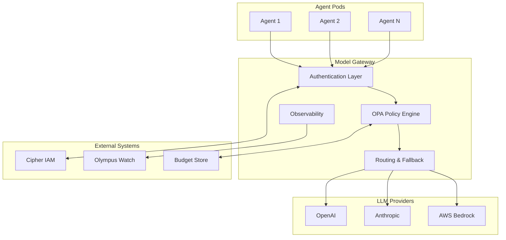

# Model Gateway Architecture

> **Status**: 🟢 Complete  
> **Last Updated**: 2026-01-12

---

## Overview

The Model Gateway provides a unified access layer for Large Language Models (LLMs) and Small Language Models (SLMs). This document describes the deployment model, Bifrost integration, component architecture, and integration points.

---

## Deployment Model

Model Gateway is deployed at **platform level** — one instance per Hub installation:

| Scope | Description |
|-------|-------------|
| **Hub Installation** | Single Model Gateway instance |
| **All Tenants** | Share the gateway |
| **Isolation** | Virtual keys, budgets, and policies per tenant/agent |

### Deployment Architecture

```
┌─────────────────────────────────────────────────────────────────────────────┐
│                     PLATFORM-LEVEL DEPLOYMENT                                │
│                                                                              │
│   Hub Installation                                                           │
│   ├── Seer Namespace                                                         │
│   │   └── Model Gateway (Bifrost)                                           │
│   │       ├── Deployment: model-gateway                                     │
│   │       ├── Service: model-gateway.seer-system.svc.cluster.local         │
│   │       └── ConfigMaps: provider-configs, fallback-chains                │
│   │                                                                          │
│   ├── Tenant A Workbench                                                     │
│   │   ├── Agent 1 → Virtual Key: vk_tenant_a_agent_1                        │
│   │   └── Agent 2 → Virtual Key: vk_tenant_a_agent_2                        │
│   │                                                                          │
│   └── Tenant B Workbench                                                     │
│       ├── Agent 3 → Virtual Key: vk_tenant_b_agent_3                        │
│       └── Agent 4 → Virtual Key: vk_tenant_b_agent_4                        │
│                                                                              │
└─────────────────────────────────────────────────────────────────────────────┘
```

### Scalability

| Aspect | Configuration |
|--------|---------------|
| **Horizontal Scaling** | Multiple replicas behind K8s Service |
| **Load Balancing** | Round-robin across replicas |
| **State** | Stateless — all state in external stores |
| **High Availability** | Minimum 3 replicas in production |

---

## Bifrost Integration

Model Gateway is based on [Bifrost](https://github.com/maximhq/bifrost), an open-source LLM gateway.

### Why Bifrost

| Challenge | Without Gateway | With Bifrost |
|-----------|-----------------|--------------|
| **Provider lock-in** | Tied to one vendor | Switch freely |
| **API differences** | Code changes per provider | Unified interface |
| **Credentials** | Scattered, hard to manage | Centralized |
| **Cost tracking** | Manual aggregation | Automatic attribution |
| **Fallback** | Custom implementation | Built-in |

### Bifrost Capabilities Used

| Capability | Usage |
|------------|-------|
| **Unified API** | OpenAI-compatible interface for all providers |
| **Provider Abstraction** | Single API for OpenAI, Anthropic, Bedrock, etc. |
| **Fallback Chains** | Automatic failover between providers |
| **Load Balancing** | Distribute requests across provider endpoints |
| **Rate Limiting** | Provider-level rate limit handling |

### Hub-Specific Customizations

The following integrations have been added to Bifrost for Hub:

| Integration | Purpose | Implementation |
|-------------|---------|----------------|
| **Cipher IAM** | Authentication and authorization | Custom auth middleware |
| **OPA Policies** | Access control, rate limiting, budget enforcement | Policy evaluation sidecar |
| **Olympus Watch** | Observability (metrics, logs, alerts) | Prometheus exporter + log shipping |
| **Virtual Keys** | Per-agent tracking and budget enforcement | Custom key management layer |

> **Note**: LLM calls are **not** logged to CAF. They are treated as operational logs, not enterprise auditable events.

---

## Component Architecture



### Authentication Layer

**Purpose**: Validate agent identity and extract authorization context.

| Function | Description |
|----------|-------------|
| **Token Validation** | Verify virtual key via Cipher IAM |
| **Agent Identification** | Extract agent ID from virtual key |
| **Context Extraction** | Load agent's allowed models, budget limits |
| **mTLS Verification** | Validate Istio service mesh identity |

**Integration Points**:
- Cipher IAM Extensions for virtual key validation
- Agent profile lookup for authorization context

### OPA Policy Engine

**Purpose**: Enforce access control, rate limiting, and budget constraints.

| Policy Type | Description |
|-------------|-------------|
| **Model Access** | Agent can only use models in their whitelist |
| **Budget Enforcement** | Block requests when budget exhausted |
| **Rate Limiting** | Per-agent request rate limits |
| **Request Validation** | Validate request parameters |

**Policy Evaluation Flow**:
1. Request arrives with virtual key
2. OPA loads agent's policy context (allowed models, budget, rate limits)
3. Policy evaluation returns allow/deny
4. Denied requests return 403 with reason

### Routing & Fallback

**Purpose**: Route requests to appropriate providers with automatic failover.

| Component | Function |
|-----------|----------|
| **Model Router** | Map model name to provider endpoint |
| **Fallback Controller** | Manage failover chains |
| **Circuit Breaker** | Prevent cascading failures |
| **Request Transformer** | Convert to provider-specific format |

**Routing Decision Flow**:
1. Extract model from request
2. Lookup provider endpoint
3. Check circuit breaker status
4. Route to primary or fallback
5. Transform request for provider

### Observability

**Purpose**: Collect metrics, logs, and traces for monitoring and debugging.

| Output | Destination |
|--------|-------------|
| **Metrics** | Prometheus → Olympus Watch |
| **Logs** | Stdout → Watch Log Aggregator |
| **Traces** | Jaeger via Istio sidecar |

---

## Integration Points

### Cipher IAM Integration

```
┌─────────────────────────────────────────────────────────────────────────────┐
│                      CIPHER IAM INTEGRATION                                  │
│                                                                              │
│   Request with Virtual Key                                                   │
│            │                                                                 │
│            ▼                                                                 │
│   ┌─────────────────────────────────────────────────────────────────────┐   │
│   │                    MODEL GATEWAY                                     │   │
│   │                                                                       │   │
│   │   1. Extract virtual key from request                                │   │
│   │   2. Call Cipher IAM to validate key                                 │   │
│   │   3. Load agent profile (allowed models, budget)                     │   │
│   │   4. Inject agent context into request                               │   │
│   │                                                                       │   │
│   └─────────────────────────────────────────────────────────────────────┘   │
│            │                                                                 │
│            ▼                                                                 │
│   ┌─────────────────────────────────────────────────────────────────────┐   │
│   │                    CIPHER IAM EXTENSIONS                             │   │
│   │                                                                       │   │
│   │   • Virtual key → Agent profile lookup                               │   │
│   │   • Allowed models list                                              │   │
│   │   • Budget limits and current usage                                  │   │
│   │   • Rate limit configuration                                         │   │
│   │                                                                       │   │
│   └─────────────────────────────────────────────────────────────────────┘   │
│                                                                              │
└─────────────────────────────────────────────────────────────────────────────┘
```

### Agent Runtime Integration

Model Gateway URL and virtual key are injected at deployment:

```yaml
# Pod specification (created by Seer Operator)
spec:
  containers:
    - name: agent
      env:
        - name: MODEL_GATEWAY_URL
          value: "http://model-gateway.seer-system.svc.cluster.local/v1"
        - name: VIRTUAL_KEY
          valueFrom:
            secretKeyRef:
              name: fraud-analyst-acme-retail-keys
              key: virtual-key
```

### Olympus Watch Integration

| Data Type | Flow |
|-----------|------|
| **Metrics** | Model Gateway → Prometheus → Watch Scraper |
| **Logs** | Model Gateway stdout → Fluentd → Watch Log Store |
| **Alerts** | Watch Alert Manager → Notification Services |

---

## Configuration

### Gateway Configuration

```yaml
apiVersion: v1
kind: ConfigMap
metadata:
  name: model-gateway-config
  namespace: seer-system
data:
  config.yaml: |
    server:
      port: 8080
      metricsPort: 9090
    
    auth:
      type: cipher-iam
      endpoint: http://cipher-iam.hub-system.svc.cluster.local
      cacheSeconds: 300
    
    opa:
      endpoint: http://localhost:8181
      policyPath: /v1/data/seer/model_gateway/allow
    
    providers:
      # Provider configurations loaded from tenant-specific ConfigMaps
      configMapPattern: "model-config-{tenant}"
    
    observability:
      metricsEnabled: true
      loggingLevel: INFO
      tracingEnabled: true
```

### Resource Requirements

| Component | CPU Request | Memory Request | Replicas |
|-----------|-------------|----------------|----------|
| Model Gateway | 500m | 512Mi | 3 (prod) |
| OPA Sidecar | 100m | 128Mi | per pod |

---

## Related Documentation

- [Model Catalog](./model-catalog.md) — Provider and model configuration
- [Routing & Fallback](./routing-fallback.md) — Fallback chain configuration
- [Policy Enforcement](./policy-enforcement.md) — OPA policy details
- [Cipher IAM Extensions](../cipher-iam-extensions/README.md) — Virtual key management

---

*Model Gateway architecture provides a scalable, secure, and observable LLM access layer for all Seer agents.*
