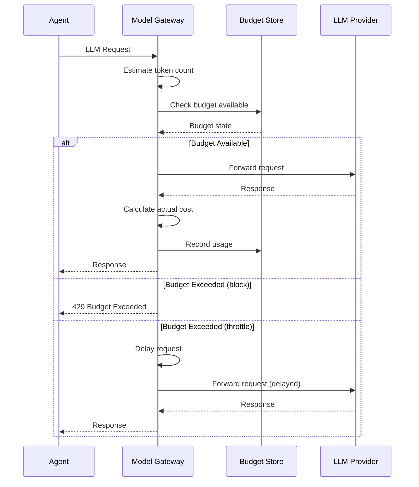

# Governance

> **Status**: 🟢 Design Complete  
> **Last Updated**: 2026-01-12

---

## Overview

Model Gateway enforces governance controls including budget limits, virtual key management, and quota enforcement. This document describes the two-level budget enforcement model and detailed algorithms for tracking and enforcement (C3 detail).

---

## Budget Enforcement

### Two-Level Budget Model

Budgets are enforced at two levels:

| Level | Scope | Purpose |
|-------|-------|---------|
| **Workbench** | All agents in workbench | Aggregate cost control |
| **Agent** | Per Employed Agent | Individual accountability |

### Budget Hierarchy

```
┌─────────────────────────────────────────────────────────────────────────────┐
│                        BUDGET HIERARCHY                                      │
│                                                                              │
│   Workbench Budget: $10,000/month                                           │
│   ├── Agent 1 Budget: $500/month  (5% of workbench)                        │
│   ├── Agent 2 Budget: $2,000/month (20% of workbench)                      │
│   ├── Agent 3 Budget: $1,500/month (15% of workbench)                      │
│   └── Unallocated: $6,000/month (60% shared pool)                          │
│                                                                              │
│   Enforcement:                                                               │
│   • Agent budget checked first                                              │
│   • Workbench budget checked second                                         │
│   • Both must have available budget                                         │
│                                                                              │
└─────────────────────────────────────────────────────────────────────────────┘
```

### Budget Configuration

```yaml
apiVersion: seer.olympus.io/v1
kind: ModelBudget
metadata:
  name: acme-disputes-budget
  namespace: acme-disputes
spec:
  subscription: acme-seer-subscription
  
  budgets:
    workbench:
      monthlyLimit: 10000  # USD
      alertThresholds: [50, 75, 90]  # Percent
      action: alert  # or: throttle, block
    
    perAgent:
      default:
        monthlyLimit: 500
        action: throttle
      
      overrides:
        - agent: fraud-analyst-senior
          monthlyLimit: 2000
        - agent: document-processor
          monthlyLimit: 100
          action: block  # Hard block when exceeded
```

### Budget Actions

| Action | Behavior |
|--------|----------|
| **alert** | Log warning, send notification, continue processing |
| **throttle** | Reduce request rate, queue excess requests |
| **block** | Reject requests with 429 status |

---

## Virtual Key Management

### Virtual Key Purpose

Each Employed Agent receives a **unique virtual key**:

| Function | Description |
|----------|-------------|
| **Identification** | Uniquely identifies the agent |
| **Usage Tracking** | Attributes token usage to specific agent |
| **Budget Enforcement** | Enforces per-agent budget limits |
| **Audit Trail** | Links all requests to accountable agent |

### Virtual Key Mapping

```
┌─────────────────────────────────────────────────────────────────────────────┐
│                          VIRTUAL KEY MAPPING                                 │
│                                                                              │
│   Employed Agent                    Virtual Key                             │
│   ─────────────────────────────────────────────────────────────────────     │
│   fraud-analyst-acme-retail    →    vk_acme_fraud_analyst_retail_001        │
│   fraud-analyst-acme-commercial →   vk_acme_fraud_analyst_commercial_001    │
│   support-agent-acme           →    vk_acme_support_agent_001               │
│                                                                              │
│   Virtual Key Contains:                                                      │
│   • Subscription ID                                                          │
│   • Workbench ID                                                             │
│   • Agent ID                                                                 │
│   • Unique sequence number                                                   │
│                                                                              │
└─────────────────────────────────────────────────────────────────────────────┘
```

### Virtual Key Lifecycle

| Phase | Action |
|-------|--------|
| **Creation** | Generated when EmploymentSpec is deployed |
| **Storage** | Stored in zone-vault, injected as secret |
| **Rotation** | Rotated on security events or schedule |
| **Revocation** | Revoked when agent is retired or killed |

---

## Budget Tracking Algorithm (C3 Detail)

### Token Cost Calculation

```python
def calculate_cost(request, response, model_pricing):
    """
    Calculate cost for an LLM request.
    
    Args:
        request: LLM request
        response: LLM response
        model_pricing: Pricing configuration for the model
    
    Returns:
        Cost in USD
    """
    input_tokens = count_tokens(request.messages, model_pricing.tokenizer)
    output_tokens = response.usage.completion_tokens
    
    input_cost = input_tokens * model_pricing.input_cost_per_million / 1_000_000
    output_cost = output_tokens * model_pricing.output_cost_per_million / 1_000_000
    
    return input_cost + output_cost


# Example pricing
MODEL_PRICING = {
    "gpt-4o": {
        "input_cost_per_million": 2.50,   # $2.50 per 1M input tokens
        "output_cost_per_million": 10.00,  # $10.00 per 1M output tokens
    },
    "gpt-4o-mini": {
        "input_cost_per_million": 0.15,
        "output_cost_per_million": 0.60,
    },
    "claude-3-5-sonnet": {
        "input_cost_per_million": 3.00,
        "output_cost_per_million": 15.00,
    },
}
```

### Budget State Store

```python
class BudgetStore:
    """
    Manages budget state for workbenches and agents.
    Uses Redis for fast access and atomic operations.
    """
    
    def __init__(self, redis_client):
        self.redis = redis_client
    
    def get_budget_state(self, virtual_key):
        """Get current budget state for an agent."""
        agent_key = f"budget:agent:{virtual_key}"
        workbench_key = f"budget:workbench:{self._get_workbench(virtual_key)}"
        
        agent_state = self.redis.hgetall(agent_key)
        workbench_state = self.redis.hgetall(workbench_key)
        
        return BudgetState(
            agent_used=float(agent_state.get("used", 0)),
            agent_limit=float(agent_state.get("limit", 0)),
            workbench_used=float(workbench_state.get("used", 0)),
            workbench_limit=float(workbench_state.get("limit", 0)),
        )
    
    def record_usage(self, virtual_key, cost_usd):
        """
        Record usage against budget.
        Uses atomic increment for consistency.
        """
        agent_key = f"budget:agent:{virtual_key}"
        workbench_key = f"budget:workbench:{self._get_workbench(virtual_key)}"
        
        # Atomic increment for both budgets
        pipe = self.redis.pipeline()
        pipe.hincrbyfloat(agent_key, "used", cost_usd)
        pipe.hincrbyfloat(workbench_key, "used", cost_usd)
        pipe.execute()
    
    def reset_period(self, scope, period):
        """Reset budget for new period (e.g., monthly reset)."""
        if scope == "workbench":
            pattern = f"budget:workbench:*"
        else:
            pattern = f"budget:agent:*"
        
        for key in self.redis.scan_iter(pattern):
            self.redis.hset(key, "used", 0)
            self.redis.hset(key, "period", period)
```

### Budget Check Algorithm

```python
class BudgetEnforcer:
    """Enforces budget limits at request time."""
    
    def __init__(self, budget_store, config):
        self.store = budget_store
        self.config = config
    
    def check_budget(self, virtual_key, estimated_cost):
        """
        Check if request can proceed within budget.
        
        Args:
            virtual_key: Agent's virtual key
            estimated_cost: Estimated cost of the request
        
        Returns:
            BudgetDecision with allow/deny and reason
        """
        state = self.store.get_budget_state(virtual_key)
        agent_config = self.config.get_agent_config(virtual_key)
        
        # Check agent budget first
        agent_available = state.agent_limit - state.agent_used
        if estimated_cost > agent_available:
            return self._handle_exceeded(
                level="agent",
                action=agent_config.action,
                used=state.agent_used,
                limit=state.agent_limit
            )
        
        # Check workbench budget
        workbench_available = state.workbench_limit - state.workbench_used
        if estimated_cost > workbench_available:
            return self._handle_exceeded(
                level="workbench",
                action=self.config.workbench_action,
                used=state.workbench_used,
                limit=state.workbench_limit
            )
        
        # Check alert thresholds
        self._check_thresholds(virtual_key, state)
        
        return BudgetDecision(allowed=True)
    
    def _handle_exceeded(self, level, action, used, limit):
        """Handle budget exceeded based on configured action."""
        if action == "block":
            return BudgetDecision(
                allowed=False,
                reason=f"{level} budget exceeded: ${used:.2f} / ${limit:.2f}"
            )
        elif action == "throttle":
            return BudgetDecision(
                allowed=True,
                throttle=True,
                delay_ms=self._calculate_throttle_delay(used, limit)
            )
        else:  # alert
            self._send_alert(level, used, limit)
            return BudgetDecision(allowed=True)
    
    def _check_thresholds(self, virtual_key, state):
        """Check and trigger alerts for threshold breaches."""
        thresholds = self.config.alert_thresholds  # [50, 75, 90]
        
        for threshold in thresholds:
            agent_percent = (state.agent_used / state.agent_limit) * 100
            if agent_percent >= threshold:
                self._maybe_alert(virtual_key, "agent", threshold, agent_percent)
            
            workbench_percent = (state.workbench_used / state.workbench_limit) * 100
            if workbench_percent >= threshold:
                self._maybe_alert(virtual_key, "workbench", threshold, workbench_percent)
    
    def _calculate_throttle_delay(self, used, limit):
        """Calculate delay based on how far over budget."""
        overage_percent = ((used - limit) / limit) * 100
        # 10% over = 100ms delay, 50% over = 500ms delay, etc.
        return min(overage_percent * 10, 5000)  # Max 5 second delay
```

---

## Quota Enforcement Mechanisms (C3 Detail)

### Pre-Request Budget Check

Budget is checked **before** the request is sent to the provider:



### Token Estimation

For pre-request budget check, tokens are estimated:

```python
def estimate_tokens(request, model):
    """
    Estimate token count before sending request.
    Used for pre-request budget check.
    """
    # Input tokens can be counted exactly
    input_tokens = count_tokens(request.messages, model.tokenizer)
    
    # Output tokens are estimated based on:
    # 1. max_tokens if specified
    # 2. Historical average for this agent
    # 3. Model-specific defaults
    if request.max_tokens:
        estimated_output = request.max_tokens
    else:
        estimated_output = get_historical_average(request.agent_id, model)
        if estimated_output is None:
            estimated_output = model.default_output_estimate
    
    return input_tokens, estimated_output
```

### Usage Reconciliation

After the request completes, actual usage is reconciled:

```python
def reconcile_usage(virtual_key, estimated, actual):
    """
    Reconcile estimated vs actual usage.
    
    If actual < estimated: return credit
    If actual > estimated: record additional usage
    """
    difference = actual - estimated
    
    if difference != 0:
        budget_store.record_usage(virtual_key, difference)
        
        if difference > 0:
            # Over-estimate tolerance check
            overage_percent = (difference / estimated) * 100
            if overage_percent > 50:  # Significant underestimate
                log.warning(f"Token estimate off by {overage_percent:.1f}%")
                update_estimation_model(virtual_key, actual)
```

---

## Budget Periods

### Period Configuration

| Period | Reset Schedule | Use Case |
|--------|----------------|----------|
| **Monthly** | 1st of month, 00:00 UTC | Standard budget cycles |
| **Weekly** | Sunday, 00:00 UTC | Short-term projects |
| **Daily** | Every day, 00:00 UTC | Strict cost control |

### Period Reset

```python
class BudgetPeriodManager:
    """Manages budget period resets."""
    
    def reset_monthly_budgets(self):
        """Reset all monthly budgets at period start."""
        current_period = datetime.now().strftime("%Y-%m")
        
        for workbench in get_all_workbenches():
            # Archive previous period
            self._archive_period(workbench, current_period)
            
            # Reset counters
            budget_store.reset_period("workbench", current_period)
            
            for agent in get_workbench_agents(workbench):
                budget_store.reset_period("agent", current_period)
    
    def _archive_period(self, workbench, period):
        """Archive budget usage for historical analysis."""
        state = budget_store.get_budget_state(workbench)
        
        archive_record = {
            "workbench": workbench,
            "period": period,
            "limit": state.workbench_limit,
            "used": state.workbench_used,
            "utilization": (state.workbench_used / state.workbench_limit) * 100,
        }
        
        archive_store.save(archive_record)
```

---

## Budget Overrides

### Emergency Override

For critical situations, budgets can be temporarily overridden:

```yaml
apiVersion: seer.olympus.io/v1
kind: BudgetOverride
metadata:
  name: fraud-investigation-emergency
spec:
  target:
    type: agent
    name: fraud-analyst-senior
  
  override:
    multiplier: 2.0  # Double the budget
    # or absolute:
    # absoluteLimit: 5000
  
  duration: 4h
  reason: "Critical fraud investigation P1-12345"
  approver: "jane.manager@acme.com"
```

### Override Audit

All budget overrides are logged:

```json
{
  "event": "budget_override_applied",
  "timestamp": "2026-01-12T14:30:00Z",
  "target": "fraud-analyst-senior",
  "original_limit": 2000,
  "new_limit": 4000,
  "duration_hours": 4,
  "reason": "Critical fraud investigation P1-12345",
  "approver": "jane.manager@acme.com",
  "expires_at": "2026-01-12T18:30:00Z"
}
```

---

## Metrics

### Budget Metrics

```prometheus
# Current budget usage
seer_budget_used_usd{scope="agent", agent="fraud-analyst"} 145.50
seer_budget_used_usd{scope="workbench", workbench="acme-disputes"} 1250.00

# Budget limits
seer_budget_limit_usd{scope="agent", agent="fraud-analyst"} 500.00
seer_budget_limit_usd{scope="workbench", workbench="acme-disputes"} 10000.00

# Budget utilization percentage
seer_budget_utilization_percent{scope="agent", agent="fraud-analyst"} 29.1
seer_budget_utilization_percent{scope="workbench", workbench="acme-disputes"} 12.5

# Budget actions taken
seer_budget_action_total{action="block", scope="agent"} 5
seer_budget_action_total{action="throttle", scope="agent"} 23
seer_budget_action_total{action="alert", scope="workbench"} 2
```

---

## Related Documentation

- [Architecture](./architecture.md) — Model Gateway architecture
- [Policy Enforcement](./policy-enforcement.md) — OPA policy details
- [Observability](./observability.md) — Metrics and monitoring
- [Cipher IAM Extensions](../cipher-iam-extensions/README.md) — Virtual key management

---

*Governance provides comprehensive budget and quota management for controlled LLM usage across the enterprise.*
