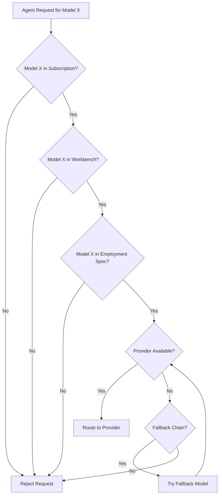

# Model Catalog

> **Status**: 🟢 Design Complete  
> **Last Updated**: 2026-01-12

---

## Overview

The Model Catalog defines which LLM/SLM providers and models are available within a Seer subscription. This document describes provider configuration, model selection hierarchy, and whitelist enforcement mechanisms.

---

## Provider Configuration

### Configuration Ownership

**Tenant admins** configure available providers per Seer Subscription:

| Configuration Scope | Owner | Description |
|---------------------|-------|-------------|
| **Subscription-level** | Tenant Admin | Which providers and models are available |
| **Workbench-level** | Tenant Admin | Which subset is active in a workbench |
| **Agent-level** | Training/Employment Spec | Which models an agent can use |

### Provider Configuration CRD

```yaml
apiVersion: seer.olympus.io/v1
kind: ModelConfiguration
metadata:
  name: acme-disputes-models
  namespace: acme-disputes
spec:
  subscription: acme-seer-subscription
  
  providers:
    - name: openai
      enabled: true
      credentials:
        secretRef: openai-api-key
      models:
        - gpt-4o
        - gpt-4o-mini
        - o1
        - o1-mini
    
    - name: anthropic
      enabled: true
      credentials:
        secretRef: anthropic-api-key
      models:
        - claude-3-5-sonnet
        - claude-3-5-haiku
    
    - name: bedrock
      enabled: true
      credentials:
        iamRoleArn: arn:aws:iam::123456789:role/bedrock-access
      models:
        - amazon.titan-text-premier-v1:0
        - anthropic.claude-3-5-sonnet-v1
```

### Supported Providers

| Provider | Authentication | Models |
|----------|----------------|--------|
| **OpenAI** | API Key | GPT-4o, GPT-4o-mini, o1, o1-mini |
| **Anthropic** | API Key | Claude 3.5 Sonnet, Claude 3.5 Haiku |
| **AWS Bedrock** | IAM Role | Titan, Claude (via Bedrock) |
| **Azure OpenAI** | API Key + Endpoint | GPT models via Azure |
| **Google Vertex AI** | Service Account | Gemini models |
| **Mistral AI** | API Key | Mistral models |
| **Cohere** | API Key | Command models |
| **Custom/SageMaker** | IAM Role | Custom deployed models |

### Custom Models

Tenants can add custom deployed models (e.g., fine-tuned models on SageMaker, Bedrock):

```yaml
providers:
  - name: custom-sagemaker
    type: sagemaker
    endpoint: arn:aws:sagemaker:us-west-2:123456789:endpoint/fraud-classifier
    credentials:
      iamRoleArn: arn:aws:iam::123456789:role/sagemaker-invoke
    models:
      - fraud-classifier-v1
```

> **Note**: Custom model configuration details are beyond the scope of this document.

---

## Model Selection Hierarchy

Models are selected through a **hierarchy of whitelists**. Each layer can only **restrict** (not expand) the set of available models.

### Hierarchy Layers

```
┌─────────────────────────────────────────────────────────────────────────────┐
│                        MODEL SELECTION HIERARCHY                             │
│                                                                              │
│   ┌─────────────────────────────────────────────────────────────────────┐   │
│   │  1. Raw Agent: Declares supported models                             │   │
│   │     models: [gpt-4o, gpt-4o-mini, claude-3-5-sonnet, o1]            │   │
│   └─────────────────────────────────────────────────────────────────────┘   │
│                                 │                                            │
│                                 ▼ subset                                     │
│   ┌─────────────────────────────────────────────────────────────────────┐   │
│   │  2. Training Spec: Selects from Raw Agent's list                    │   │
│   │     allowedModels: [gpt-4o, claude-3-5-sonnet]                      │   │
│   └─────────────────────────────────────────────────────────────────────┘   │
│                                 │                                            │
│                                 ▼ subset                                     │
│   ┌─────────────────────────────────────────────────────────────────────┐   │
│   │  3. Employment Spec: Further restricts for deployment               │   │
│   │     allowedModels: [gpt-4o]                                         │   │
│   └─────────────────────────────────────────────────────────────────────┘   │
│                                                                              │
└─────────────────────────────────────────────────────────────────────────────┘
```

### Layer 1: Raw Agent

The Raw Agent declares which models it is designed to work with:

```yaml
# Raw Agent Specification
apiVersion: seer.olympus.io/v1
kind: RawAgentSpec
metadata:
  name: fraud-analyst-agent
spec:
  models:
    supported:
      - gpt-4o
      - gpt-4o-mini
      - claude-3-5-sonnet
      - o1
    minimumCapabilities:
      - reasoning
      - function-calling
```

### Layer 2: Training Spec

The Training Spec selects a subset of the Raw Agent's models for this trained variant:

```yaml
# Training Spec
apiVersion: seer.olympus.io/v1
kind: TrainingSpec
metadata:
  name: fraud-analyst-trained-v2
spec:
  rawAgentRef:
    name: fraud-analyst-agent
  
  models:
    allowedModels:
      - gpt-4o
      - gpt-4o-mini
      - claude-3-5-sonnet
    preferredModel: gpt-4o
    
    # Optional: model-specific configurations
    configurations:
      gpt-4o:
        temperature: 0.7
        maxTokens: 4096
```

### Layer 3: Employment Spec

The Employment Spec can further restrict models for a specific deployment:

```yaml
# Employment Spec
apiVersion: seer.olympus.io/v1
kind: EmploymentSpec
metadata:
  name: fraud-analyst-acme-retail
spec:
  trainingSpecRef:
    name: fraud-analyst-trained-v2
  
  models:
    allowedModels:
      - gpt-4o  # Restricted to single model for this deployment
    
    # Optional: deployment-specific overrides
    configurations:
      gpt-4o:
        maxTokens: 2048  # Lower limit for this deployment
```

### Subset Validation

At each layer, the system validates that the specified models are a subset of the parent layer:

```
Raw Agent Models:      [gpt-4o, gpt-4o-mini, claude-3-5-sonnet, o1]
                                    ∩
Training Spec Models:  [gpt-4o, claude-3-5-sonnet]  ✅ Valid subset
                                    ∩
Employment Spec Models: [gpt-4o]                     ✅ Valid subset

Employment Spec Models: [gpt-4o, gemini-pro]         ❌ Invalid: gemini-pro not in Training Spec
```

---

## Whitelist Enforcement

### Enforcement Points

Model whitelist is enforced at multiple points:

| Enforcement Point | Mechanism | Action on Violation |
|-------------------|-----------|---------------------|
| **Model Gateway** | OPA policy check | Reject request with 403 |
| **Seer Operator** | Spec validation | Reject EmploymentSpec deployment |
| **Runtime** | Virtual key scope | Reject at authentication |

### OPA Policy Enforcement

```rego
package seer.model_gateway

# Allow only if model is in agent's whitelist
default allow = false

allow {
    model_allowed
    budget_available
}

model_allowed {
    input.request.model == input.agent.allowed_models[_]
}

# Reject with reason
deny[reason] {
    not model_allowed
    reason := sprintf("Model '%s' not in allowed list: %v", 
        [input.request.model, input.agent.allowed_models])
}
```

### Whitelist Caching

To optimize performance, model whitelists are cached:

| Cache Level | TTL | Invalidation |
|-------------|-----|--------------|
| **Gateway-level** | 5 minutes | On EmploymentSpec change |
| **Request-level** | Per request | N/A |

---

## Model Availability

### Model Availability Matrix

The effective model availability is the intersection of all sources:

```
Effective Models = Subscription Models 
                   ∩ Workbench Models 
                   ∩ Employment Spec Models
```

### Availability Check Flow



---

## Configuration Reference

### ModelConfiguration CRD

| Field | Type | Description |
|-------|------|-------------|
| `spec.subscription` | string | Seer subscription reference |
| `spec.providers[]` | array | List of provider configurations |
| `spec.providers[].name` | string | Provider identifier |
| `spec.providers[].enabled` | boolean | Whether provider is active |
| `spec.providers[].credentials` | object | Authentication details |
| `spec.providers[].models` | array | List of enabled models |

### Training Spec Model Fields

| Field | Type | Description |
|-------|------|-------------|
| `spec.models.allowedModels` | array | Models allowed for this training |
| `spec.models.preferredModel` | string | Default model to use |
| `spec.models.configurations` | object | Per-model configuration overrides |

### Employment Spec Model Fields

| Field | Type | Description |
|-------|------|-------------|
| `spec.models.allowedModels` | array | Models allowed for this deployment |
| `spec.models.configurations` | object | Deployment-specific overrides |

---

## Related Documentation

- [Architecture](./architecture.md) — Model Gateway architecture
- [Routing & Fallback](./routing-fallback.md) — Fallback chain configuration
- [Policy Enforcement](./policy-enforcement.md) — OPA policy details

---

*Model Catalog provides hierarchical control over which LLM/SLM models are available to agents at each layer of the Seer deployment.*
