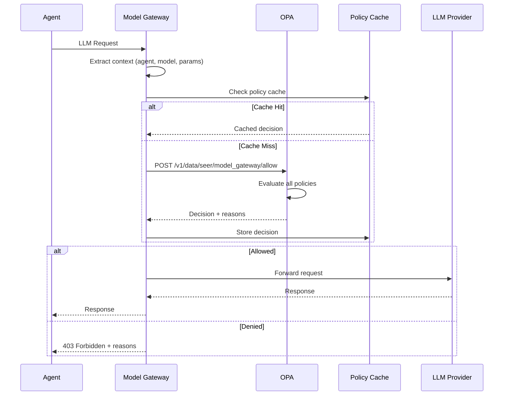
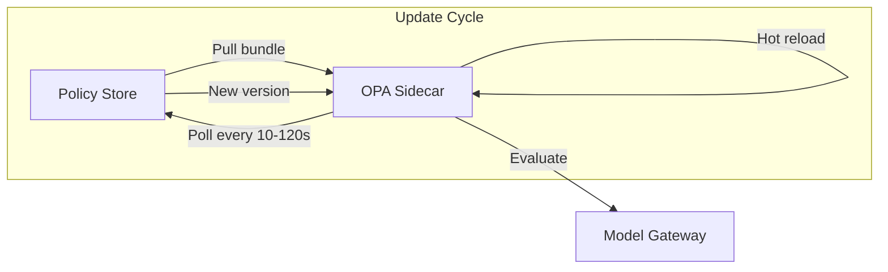

# Policy Enforcement

> **Status**: 🟢 Complete  
> **Last Updated**: 2026-01-12

---

## Overview

Model Gateway uses OPA (Open Policy Agent) for policy enforcement. This document provides C3-level detail on policy integration, evaluation flow, and enforcement mechanisms.

---

## OPA Integration

### Deployment Model

OPA is deployed as a sidecar to Model Gateway:

```
┌─────────────────────────────────────────────────────────────────────────────┐
│                     MODEL GATEWAY POD                                        │
│                                                                              │
│   ┌───────────────────────────────────┐   ┌───────────────────────────────┐ │
│   │        MODEL GATEWAY              │   │           OPA                 │ │
│   │                                   │   │                               │ │
│   │  • Receives agent requests        │   │  • Policy evaluation          │ │
│   │  • Calls OPA for authorization    │◀─▶│  • Policy bundle sync         │ │
│   │  • Routes to providers            │   │  • Decision logging           │ │
│   │                                   │   │                               │ │
│   └───────────────────────────────────┘   └───────────────────────────────┘ │
│                                                                              │
└─────────────────────────────────────────────────────────────────────────────┘
```

### OPA Configuration

```yaml
apiVersion: v1
kind: ConfigMap
metadata:
  name: opa-config
  namespace: seer-system
data:
  config.yaml: |
    services:
      - name: policy-bundle
        url: https://policy-store.seer.local
        credentials:
          bearer:
            token: "${OPA_TOKEN}"
    
    bundles:
      model-gateway:
        service: policy-bundle
        resource: bundles/model-gateway
        polling:
          min_delay_seconds: 10
          max_delay_seconds: 120
    
    decision_logs:
      console: true
      service: policy-bundle
      reporting:
        min_delay_seconds: 30
        max_delay_seconds: 300
```

---

## Policy Types

### Model Access Control

Controls which models an agent can access:

```rego
package seer.model_gateway.access

import future.keywords.if
import future.keywords.in

default allow = false

# Allow if model is in agent's whitelist
allow if {
    input.agent.allowed_models[_] == input.request.model
}

# Deny with reason
deny[reason] if {
    not model_in_whitelist
    reason := sprintf(
        "Model '%s' not in allowed list. Allowed: %v", 
        [input.request.model, input.agent.allowed_models]
    )
}

model_in_whitelist if {
    input.request.model in input.agent.allowed_models
}
```

### Budget Enforcement

Enforces budget limits:

```rego
package seer.model_gateway.budget

import future.keywords.if

default allow = false

# Allow if budget is available
allow if {
    agent_budget_available
    workbench_budget_available
}

agent_budget_available if {
    input.agent.budget.used < input.agent.budget.limit
}

workbench_budget_available if {
    input.workbench.budget.used < input.workbench.budget.limit
}

# Deny with reason
deny[reason] if {
    not agent_budget_available
    reason := sprintf(
        "Agent budget exceeded: $%.2f / $%.2f",
        [input.agent.budget.used, input.agent.budget.limit]
    )
}

deny[reason] if {
    not workbench_budget_available
    reason := sprintf(
        "Workbench budget exceeded: $%.2f / $%.2f",
        [input.workbench.budget.used, input.workbench.budget.limit]
    )
}
```

### Rate Limiting

Enforces request rate limits:

```rego
package seer.model_gateway.rate_limit

import future.keywords.if

default allow = false

# Allow if within rate limits
allow if {
    within_agent_rate_limit
    within_workbench_rate_limit
}

within_agent_rate_limit if {
    input.agent.rate.current < input.agent.rate.limit
}

within_workbench_rate_limit if {
    input.workbench.rate.current < input.workbench.rate.limit
}

# Deny with reason and retry-after
deny[result] if {
    not within_agent_rate_limit
    result := {
        "reason": sprintf(
            "Agent rate limit exceeded: %d / %d requests per minute",
            [input.agent.rate.current, input.agent.rate.limit]
        ),
        "retry_after_seconds": 60
    }
}
```

### Request Validation

Validates request parameters:

```rego
package seer.model_gateway.validation

import future.keywords.if

default allow = false

# Allow if all validations pass
allow if {
    valid_max_tokens
    valid_temperature
    no_forbidden_content
}

valid_max_tokens if {
    input.request.max_tokens <= input.agent.limits.max_tokens
}

valid_max_tokens if {
    not input.request.max_tokens  # Not specified
}

valid_temperature if {
    input.request.temperature >= 0
    input.request.temperature <= 2
}

valid_temperature if {
    not input.request.temperature  # Not specified
}

no_forbidden_content if {
    not contains_forbidden_pattern(input.request.messages)
}

# Check for forbidden patterns
contains_forbidden_pattern(messages) if {
    msg := messages[_]
    pattern := data.forbidden_patterns[_]
    regex.match(pattern, msg.content)
}
```

---

## Policy Evaluation Flow (C3 Detail)

### Request Processing Pipeline



### Input Document Structure

The input document sent to OPA for evaluation:

```json
{
  "input": {
    "request": {
      "model": "gpt-4o",
      "messages": [
        {"role": "user", "content": "Analyze this transaction..."}
      ],
      "max_tokens": 1000,
      "temperature": 0.7,
      "timestamp": "2026-01-12T14:30:00Z"
    },
    "agent": {
      "id": "fraud-analyst-acme-retail",
      "virtual_key": "vk_acme_fraud_analyst_retail_001",
      "allowed_models": ["gpt-4o", "gpt-4o-mini"],
      "budget": {
        "used": 145.50,
        "limit": 500.00
      },
      "rate": {
        "current": 15,
        "limit": 60
      },
      "limits": {
        "max_tokens": 4096
      }
    },
    "workbench": {
      "id": "acme-disputes",
      "subscription": "acme-seer-subscription",
      "budget": {
        "used": 1250.00,
        "limit": 10000.00
      },
      "rate": {
        "current": 150,
        "limit": 1000
      }
    }
  }
}
```

### Combined Policy Evaluation

All policies are evaluated together:

```rego
package seer.model_gateway

import data.seer.model_gateway.access
import data.seer.model_gateway.budget
import data.seer.model_gateway.rate_limit
import data.seer.model_gateway.validation

# Main decision point
default allow = false

# Allow only if all sub-policies allow
allow {
    access.allow
    budget.allow
    rate_limit.allow
    validation.allow
}

# Collect all deny reasons
deny[reason] {
    reason := access.deny[_]
}

deny[reason] {
    reason := budget.deny[_]
}

deny[reason] {
    reason := rate_limit.deny[_]
}

deny[reason] {
    reason := validation.deny[_]
}
```

### Policy Evaluation Code

```python
class PolicyEnforcer:
    """Enforces OPA policies for Model Gateway."""
    
    def __init__(self, opa_client, cache):
        self.opa = opa_client
        self.cache = cache
    
    async def evaluate(self, request, agent_context, workbench_context):
        """
        Evaluate request against all policies.
        
        Args:
            request: LLM request
            agent_context: Agent authorization context
            workbench_context: Workbench authorization context
        
        Returns:
            PolicyDecision with allow/deny and reasons
        """
        # Build input document
        input_doc = self._build_input(request, agent_context, workbench_context)
        
        # Check cache
        cache_key = self._cache_key(input_doc)
        cached = await self.cache.get(cache_key)
        if cached:
            return cached
        
        # Evaluate with OPA
        result = await self.opa.evaluate(
            path="/v1/data/seer/model_gateway",
            input=input_doc
        )
        
        decision = PolicyDecision(
            allowed=result.get("allow", False),
            reasons=result.get("deny", [])
        )
        
        # Cache decision (short TTL for budget-related)
        ttl = 10 if self._is_budget_related(decision) else 60
        await self.cache.set(cache_key, decision, ttl=ttl)
        
        return decision
    
    def _build_input(self, request, agent_context, workbench_context):
        """Build OPA input document."""
        return {
            "input": {
                "request": {
                    "model": request.model,
                    "messages": request.messages,
                    "max_tokens": request.max_tokens,
                    "temperature": request.temperature,
                    "timestamp": datetime.now().isoformat(),
                },
                "agent": {
                    "id": agent_context.agent_id,
                    "virtual_key": agent_context.virtual_key,
                    "allowed_models": agent_context.allowed_models,
                    "budget": {
                        "used": agent_context.budget_used,
                        "limit": agent_context.budget_limit,
                    },
                    "rate": {
                        "current": agent_context.current_rate,
                        "limit": agent_context.rate_limit,
                    },
                    "limits": {
                        "max_tokens": agent_context.max_tokens,
                    },
                },
                "workbench": {
                    "id": workbench_context.workbench_id,
                    "subscription": workbench_context.subscription,
                    "budget": {
                        "used": workbench_context.budget_used,
                        "limit": workbench_context.budget_limit,
                    },
                    "rate": {
                        "current": workbench_context.current_rate,
                        "limit": workbench_context.rate_limit,
                    },
                },
            }
        }
```

---

## PEP Integration (C3 Detail)

### Model Gateway as PEP

Model Gateway is registered as a Policy Enforcement Point (PEP) with Cipher IAM:

| PEP Attribute | Value |
|---------------|-------|
| **PEP ID** | `model-gateway` |
| **Policy Path** | `/v1/data/seer/model_gateway/allow` |
| **Input Schema** | `seer.model_gateway.input` |

### PEP Registration

```yaml
apiVersion: cipher.olympus.io/v1
kind: PolicyEnforcementPoint
metadata:
  name: model-gateway
  namespace: seer-system
spec:
  pepId: model-gateway
  description: "Seer Model Gateway LLM access control"
  
  policyBundle:
    source: bundles/model-gateway
    version: "1.2.0"
  
  inputSchema:
    ref: schemas/model-gateway-input.json
  
  decisions:
    - allow: boolean
    - deny: array[string]
  
  integration:
    type: sidecar
    opaEndpoint: http://localhost:8181
```

### Policy Per Agent

Agents can have custom policies attached via EmploymentSpec:

```yaml
apiVersion: seer.olympus.io/v1
kind: EmploymentSpec
metadata:
  name: fraud-analyst-acme-retail
spec:
  delegation:
    policies:
      - pep: "model-gateway"
        policyRef: "policies/fraud-analyst-model-restrictions.rego"
```

### Policy Loading

```python
class PolicyLoader:
    """Loads and manages agent-specific policies."""
    
    def load_agent_policies(self, agent_id):
        """Load policies for an agent."""
        # Get EmploymentSpec
        spec = employment_spec_client.get(agent_id)
        
        # Find model-gateway policy
        for policy_config in spec.delegation.policies:
            if policy_config.pep == "model-gateway":
                policy_content = policy_store.get(policy_config.policy_ref)
                opa_client.upload_policy(
                    path=f"agents/{agent_id}/model-gateway",
                    content=policy_content
                )
```

---

## Violation Handling

### Violation Response

When a policy denies a request:

```json
{
  "error": {
    "code": "POLICY_VIOLATION",
    "message": "Request denied by policy",
    "violations": [
      {
        "policy": "seer.model_gateway.access",
        "reason": "Model 'gpt-4-turbo' not in allowed list. Allowed: [gpt-4o, gpt-4o-mini]"
      }
    ],
    "request_id": "req-12345",
    "timestamp": "2026-01-12T14:30:00Z"
  }
}
```

### HTTP Status Codes

| Violation Type | HTTP Status | Description |
|----------------|-------------|-------------|
| **Model Access** | 403 | Model not in whitelist |
| **Budget Exceeded** | 429 | Budget limit reached |
| **Rate Limited** | 429 | Too many requests |
| **Validation Error** | 400 | Invalid request parameters |

### Decision Logging

All policy decisions are logged:

```json
{
  "decision_id": "dec-67890",
  "timestamp": "2026-01-12T14:30:00Z",
  "result": "deny",
  "policies_evaluated": [
    "seer.model_gateway.access",
    "seer.model_gateway.budget",
    "seer.model_gateway.rate_limit",
    "seer.model_gateway.validation"
  ],
  "violations": [
    {
      "policy": "seer.model_gateway.access",
      "reason": "Model 'gpt-4-turbo' not in allowed list"
    }
  ],
  "input": {
    "agent_id": "fraud-analyst-acme-retail",
    "model": "gpt-4-turbo",
    "request_id": "req-12345"
  }
}
```

---

## Policy Bundle Management

### Bundle Structure

```
bundles/model-gateway/
├── main.rego              # Entry point
├── access.rego            # Model access policies
├── budget.rego            # Budget enforcement
├── rate_limit.rego        # Rate limiting
├── validation.rego        # Request validation
├── data.json              # Static policy data
└── manifest.yaml          # Bundle metadata
```

### Bundle Versioning

| Version | Description |
|---------|-------------|
| **Major** | Breaking changes to policy behavior |
| **Minor** | New policies or data fields |
| **Patch** | Bug fixes, threshold adjustments |

### Bundle Update Flow



---

## Metrics

### Policy Metrics

```prometheus
# Policy evaluation count
seer_policy_evaluations_total{policy="model-gateway", result="allow"} 12345
seer_policy_evaluations_total{policy="model-gateway", result="deny"} 123

# Policy evaluation latency
seer_policy_evaluation_duration_seconds_bucket{policy="model-gateway", le="0.001"} 10000
seer_policy_evaluation_duration_seconds_bucket{policy="model-gateway", le="0.01"} 12000

# Violation breakdown
seer_policy_violations_total{policy="access"} 50
seer_policy_violations_total{policy="budget"} 30
seer_policy_violations_total{policy="rate_limit"} 25
seer_policy_violations_total{policy="validation"} 18
```

---

## Related Documentation

- [Architecture](./architecture.md) — Model Gateway architecture
- [Governance](./governance.md) — Budget enforcement details
- [Cipher IAM Extensions](../cipher-iam-extensions/README.md) — PEP registration

---

*Policy Enforcement provides comprehensive OPA-based access control for Model Gateway with detailed evaluation and violation handling.*
