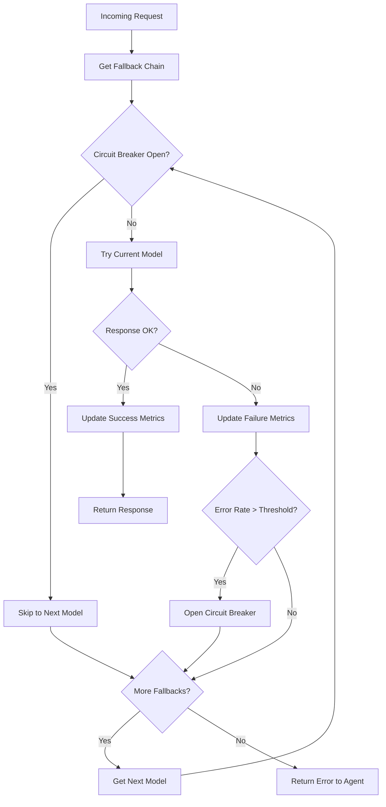

# Routing & Fallback

> **Status**: 🟢 Design Complete  
> **Last Updated**: 2026-01-12

---

## Overview

Model Gateway provides intelligent routing with automatic fallback capabilities. This document describes fallback configuration, routing strategies, and the detailed algorithms for failover handling (C3 detail).

---

## Fallback Configuration

### Configuration Ownership

Fallback is **configured by tenant admin** at the workbench level:

| Configuration Level | Owner | Scope |
|---------------------|-------|-------|
| **Fallback Chains** | Tenant Admin | Workbench-level |
| **Triggers** | Tenant Admin | Per-chain |
| **Circuit Breaker Settings** | Platform Admin | Platform defaults, tenant overrides |

### Fallback Chain Configuration

```yaml
apiVersion: seer.olympus.io/v1
kind: ModelConfiguration
metadata:
  name: acme-disputes-models
  namespace: acme-disputes
spec:
  subscription: acme-seer-subscription
  
  fallback:
    enabled: true
    strategy: priority  # or: round-robin, cost-optimized
    
    chains:
      - name: reasoning-chain
        models:
          - gpt-4o           # Primary
          - claude-3-5-sonnet # Fallback 1
          - o1-mini          # Fallback 2
        
        triggers:
          - type: error
            codes: [429, 500, 502, 503]
          - type: timeout
            thresholdMs: 30000
          - type: circuit-breaker
            errorRate: 0.1
            windowSeconds: 60
      
      - name: fast-chain
        models:
          - gpt-4o-mini      # Primary
          - claude-3-5-haiku # Fallback 1
        
        triggers:
          - type: error
            codes: [429, 500, 502, 503]
          - type: timeout
            thresholdMs: 10000
```

---

## Fallback Strategies

### Priority Strategy (Default)

Models are tried in order until one succeeds:

```
Request → Model 1 (Primary)
              │
              ├── Success → Return Response
              │
              └── Failure → Model 2 (Fallback 1)
                                │
                                ├── Success → Return Response
                                │
                                └── Failure → Model 3 (Fallback 2)
                                                  │
                                                  ├── Success → Return Response
                                                  │
                                                  └── Failure → Return Error
```

### Round-Robin Strategy

Requests are distributed across models for load balancing:

```
Request 1 → Model 1
Request 2 → Model 2
Request 3 → Model 3
Request 4 → Model 1  (cycles back)

On failure: Try next model in rotation
```

### Cost-Optimized Strategy

Routes to cheapest available model that meets requirements:

```
Available Models (sorted by cost):
1. gpt-4o-mini     ($0.15/1M input)
2. claude-3-haiku  ($0.25/1M input)
3. gpt-4o          ($2.50/1M input)

Request → Try cheapest first
              │
              └── Failure → Try next cheapest
```

---

## Routing Behavior

### Behavior Matrix

| Scenario | Behavior |
|----------|----------|
| **Primary available** | Route to primary model |
| **Primary rate-limited (429)** | Fallback to next in chain |
| **Primary timeout** | Fallback to next in chain |
| **Primary server error (5xx)** | Fallback to next in chain |
| **Circuit breaker open** | Skip primary, use fallback |
| **All models unavailable** | Return error to agent |

### Routing Decision Flow



---

## Fallback Trigger Logic (C3 Detail)

### Trigger Types

| Trigger Type | Description | Configuration |
|--------------|-------------|---------------|
| **Error Codes** | HTTP status codes that trigger fallback | `codes: [429, 500, 502, 503]` |
| **Timeout** | Request exceeds time threshold | `thresholdMs: 30000` |
| **Circuit Breaker** | Error rate exceeds threshold | `errorRate: 0.1, windowSeconds: 60` |

### Trigger Evaluation Algorithm

```python
def should_fallback(response, trigger_config):
    """
    Evaluate if fallback should be triggered.
    
    Args:
        response: HTTP response from provider (or None if timeout)
        trigger_config: Trigger configuration from fallback chain
    
    Returns:
        bool: True if fallback should be triggered
    """
    for trigger in trigger_config:
        if trigger.type == "error":
            if response and response.status_code in trigger.codes:
                return True
        
        elif trigger.type == "timeout":
            if response is None:  # Timeout occurred
                return True
            if response.elapsed_ms > trigger.threshold_ms:
                return True
        
        elif trigger.type == "circuit-breaker":
            # Circuit breaker is checked before request
            # This is a post-request update
            pass
    
    return False
```

### Error Classification

| Error Type | HTTP Codes | Behavior |
|------------|------------|----------|
| **Retryable** | 429, 500, 502, 503, 504 | Trigger fallback |
| **Non-Retryable** | 400, 401, 403, 404 | Return error (no fallback) |
| **Timeout** | N/A | Trigger fallback |

---

## Circuit Breaker Algorithm (C3 Detail)

### Circuit Breaker States

```
┌─────────────────────────────────────────────────────────────────────────────┐
│                     CIRCUIT BREAKER STATE MACHINE                            │
│                                                                              │
│   ┌───────────┐                                         ┌───────────┐       │
│   │  CLOSED   │ ── error rate > threshold ──────────▶  │   OPEN    │       │
│   │ (normal)  │                                         │ (blocked) │       │
│   └───────────┘                                         └───────────┘       │
│        ▲                                                      │             │
│        │                                                      │             │
│        │                                                 timeout expired    │
│        │                                                      │             │
│        │                                                      ▼             │
│        │                                               ┌───────────┐       │
│        └──────────── success ◀─────────────────────── │ HALF-OPEN │       │
│                                                        │  (probe)  │       │
│                     failure ──────────────────────────▶└───────────┘       │
│                                                                              │
└─────────────────────────────────────────────────────────────────────────────┘
```

### Circuit Breaker Configuration

```yaml
circuitBreaker:
  # Error threshold to open circuit
  errorRateThreshold: 0.1  # 10%
  
  # Window for calculating error rate
  windowSeconds: 60
  
  # Minimum requests before evaluating
  minimumRequests: 10
  
  # Time to wait before half-open
  openTimeoutSeconds: 30
  
  # Requests allowed in half-open state
  halfOpenRequests: 3
```

### Circuit Breaker Implementation

```python
class CircuitBreaker:
    def __init__(self, config):
        self.config = config
        self.state = CircuitState.CLOSED
        self.failure_count = 0
        self.success_count = 0
        self.last_failure_time = None
        self.window_start = time.now()
    
    def is_open(self):
        """Check if circuit breaker is open (blocking requests)."""
        if self.state == CircuitState.OPEN:
            # Check if timeout has expired
            if self._timeout_expired():
                self.state = CircuitState.HALF_OPEN
                self.half_open_requests = 0
                return False
            return True
        return False
    
    def record_success(self):
        """Record a successful request."""
        self.success_count += 1
        
        if self.state == CircuitState.HALF_OPEN:
            self.half_open_requests += 1
            if self.half_open_requests >= self.config.half_open_requests:
                # Enough successes in half-open, close the circuit
                self._close_circuit()
    
    def record_failure(self):
        """Record a failed request."""
        self.failure_count += 1
        self.last_failure_time = time.now()
        
        if self.state == CircuitState.HALF_OPEN:
            # Any failure in half-open reopens the circuit
            self._open_circuit()
        elif self.state == CircuitState.CLOSED:
            # Check if error rate exceeds threshold
            if self._should_open():
                self._open_circuit()
    
    def _should_open(self):
        """Determine if circuit should open based on error rate."""
        # Reset window if expired
        if self._window_expired():
            self._reset_window()
            return False
        
        total = self.success_count + self.failure_count
        if total < self.config.minimum_requests:
            return False
        
        error_rate = self.failure_count / total
        return error_rate > self.config.error_rate_threshold
    
    def _open_circuit(self):
        """Open the circuit breaker."""
        self.state = CircuitState.OPEN
        self.open_time = time.now()
        log.warning(f"Circuit breaker OPEN for {self.model}")
    
    def _close_circuit(self):
        """Close the circuit breaker."""
        self.state = CircuitState.CLOSED
        self._reset_window()
        log.info(f"Circuit breaker CLOSED for {self.model}")
    
    def _timeout_expired(self):
        """Check if open timeout has expired."""
        return (time.now() - self.open_time).seconds > self.config.open_timeout_seconds
    
    def _window_expired(self):
        """Check if the sliding window has expired."""
        return (time.now() - self.window_start).seconds > self.config.window_seconds
    
    def _reset_window(self):
        """Reset the sliding window."""
        self.failure_count = 0
        self.success_count = 0
        self.window_start = time.now()
```

### Per-Model Circuit Breakers

Each model in a fallback chain has its own circuit breaker:

```
Fallback Chain: reasoning-chain
├── gpt-4o           → CircuitBreaker(model="gpt-4o")
├── claude-3-5-sonnet → CircuitBreaker(model="claude-3-5-sonnet")
└── o1-mini          → CircuitBreaker(model="o1-mini")
```

---

## Timeout Handling (C3 Detail)

### Timeout Configuration

```yaml
timeout:
  # Connection timeout
  connectTimeoutMs: 5000
  
  # Read timeout (waiting for response)
  readTimeoutMs: 30000
  
  # Total request timeout
  totalTimeoutMs: 60000
  
  # Streaming timeout (between chunks)
  streamingIntervalMs: 5000
```

### Timeout Handling Algorithm

```python
async def request_with_timeout(model, request, config):
    """
    Execute request with timeout handling.
    
    Args:
        model: Target model endpoint
        request: LLM request
        config: Timeout configuration
    
    Returns:
        Response or raises TimeoutError
    """
    try:
        async with timeout(config.total_timeout_ms / 1000):
            # Connect phase
            connection = await asyncio.wait_for(
                connect(model.endpoint),
                timeout=config.connect_timeout_ms / 1000
            )
            
            # Send request
            await connection.send(request)
            
            # Receive response (streaming or non-streaming)
            if request.stream:
                return await receive_streaming(
                    connection, 
                    config.streaming_interval_ms
                )
            else:
                return await asyncio.wait_for(
                    connection.receive(),
                    timeout=config.read_timeout_ms / 1000
                )
    
    except asyncio.TimeoutError:
        log.warning(f"Timeout for {model.name}")
        raise TimeoutError(f"Request to {model.name} timed out")


async def receive_streaming(connection, interval_timeout_ms):
    """Receive streaming response with per-chunk timeout."""
    chunks = []
    while True:
        try:
            chunk = await asyncio.wait_for(
                connection.receive_chunk(),
                timeout=interval_timeout_ms / 1000
            )
            if chunk is None:  # End of stream
                break
            chunks.append(chunk)
        except asyncio.TimeoutError:
            log.warning("Streaming interval timeout")
            raise TimeoutError("Streaming response stalled")
    
    return combine_chunks(chunks)
```

---

## Metrics and Observability

### Fallback Metrics

```prometheus
# Fallback events
seer_model_fallback_total{chain="reasoning", from="gpt-4o", to="claude-3-5-sonnet", reason="429"} 15
seer_model_fallback_total{chain="reasoning", from="gpt-4o", to="claude-3-5-sonnet", reason="timeout"} 3

# Circuit breaker state
seer_model_circuit_state{model="gpt-4o"} 0  # 0=closed, 1=open, 2=half-open

# Circuit breaker events
seer_model_circuit_opened_total{model="gpt-4o"} 2
seer_model_circuit_closed_total{model="gpt-4o"} 2
```

### Alerts

| Alert | Condition | Severity |
|-------|-----------|----------|
| **High Fallback Rate** | Fallback rate > 20% for 5 min | Warning |
| **Circuit Breaker Open** | Any circuit breaker open | Warning |
| **All Models Failing** | All models in chain failing | Critical |

---

## Related Documentation

- [Architecture](./architecture.md) — Model Gateway architecture
- [Model Catalog](./model-catalog.md) — Model configuration
- [Governance](./governance.md) — Budget enforcement
- [Observability](./observability.md) — Metrics and monitoring

---

*Routing & Fallback provides resilient LLM access with automatic failover and intelligent circuit breaking.*
