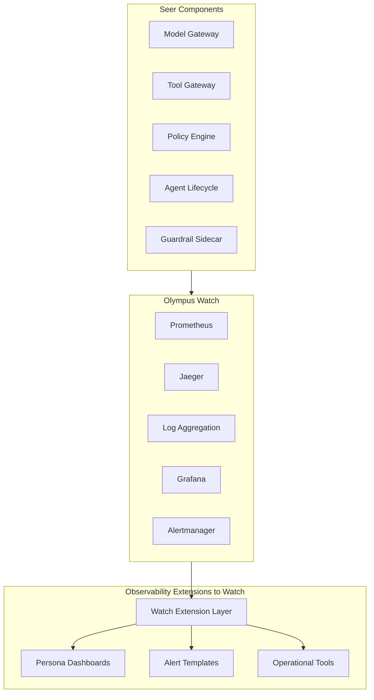

# Observability Extensions to Watch

> **Status**: 🟢 Design Complete  
> **Last Updated**: 2026-01-13

## Overview

Observability Extensions to Watch provides runtime observability extensions to Olympus Watch for AREs and Cognitive Operations Stewards. It is a separate subsystem (like cipher-iam-extensions) that extends Watch infrastructure with Seer-specific capabilities.

**Key Principle**: All extensions are built on Olympus Watch infrastructure—no new observability layer is created. Extensions include dashboards, recording rules, alert configurations, and operational tools.

---

## Design Documents

| Document | Description | Status |
|----------|-------------|--------|
| [SCOPE.md](./SCOPE.md) | Design scope, coverage summary, key decisions | Overview |
| [Watch Extension Layer](./watch-extension-layer.md) | Extension infrastructure, deployment model | C2 |
| [Persona Dashboards](./persona-dashboards.md) | Dashboards for each SRE persona | C2 |
| [Alert Templates](./alert-templates.md) | Pre-built alert definitions and routing | C2 |
| [Operational Tools](./operational-tools.md) | UI tools for operational tasks | C2 |

---

## Architecture

---

## Key Design Decisions

### Separate Subsystem

- **Independent subsystem** like cipher-iam-extensions
- **Clear separation** from Agent Analytics (data mart) and agent-level observability (SDK)
- **Focused on platform-level observability** for SRE personas

### Watch-Based Extension Model

- **All extensions built on Watch infrastructure**—no new observability layer
- **Extends existing Watch capabilities**—Grafana, Prometheus, Alertmanager
- **Follows Watch extension patterns**—consistent with other Watch extensions

### Persona-Focused

- **Dashboards and tools organized by SRE persona** (AI Platform Engineer, LLMOps Engineer, SRE for Agentic Systems, Security Architect)
- **Each persona has tailored observability** for their specific responsibilities
- **Unified operations view** for on-call engineers

---

## Related

- [Agent Analytics](../agent-analytics/README.md) — Historical data mart (separate concern)
- [Agent Observability](../agent-observability.md) — SDK and agent-level instrumentation
- [Seer Sidecar](../seer-sidecar/metrics-service.md) — Metrics source
- [Model Gateway](../model-gateway/observability.md) — Metrics source
- [Olympus Watch](../../../olympus-hub-docs/05-infrastructure/olympus-watch.md) — Watch platform infrastructure

---

*Observability Extensions to Watch provide comprehensive platform-level monitoring for AI Platform Engineers, LLMOps Engineers, Agentic System SREs, and AI Security Architects.*
