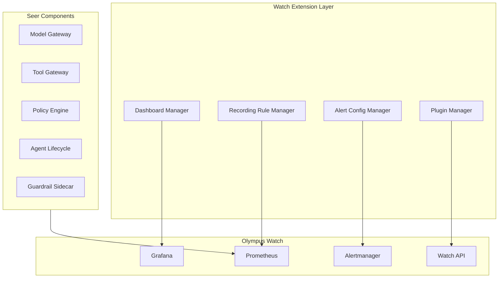
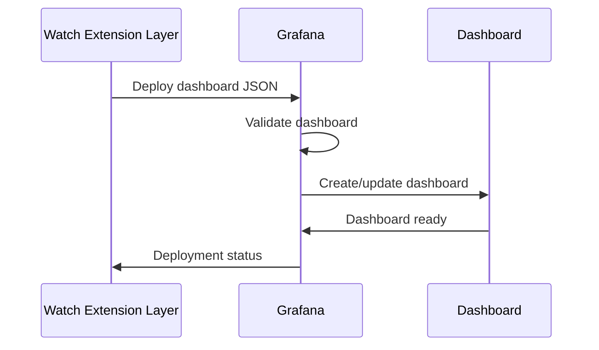
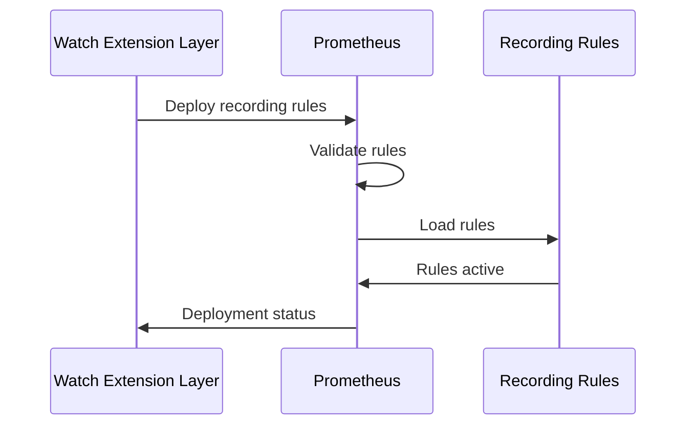
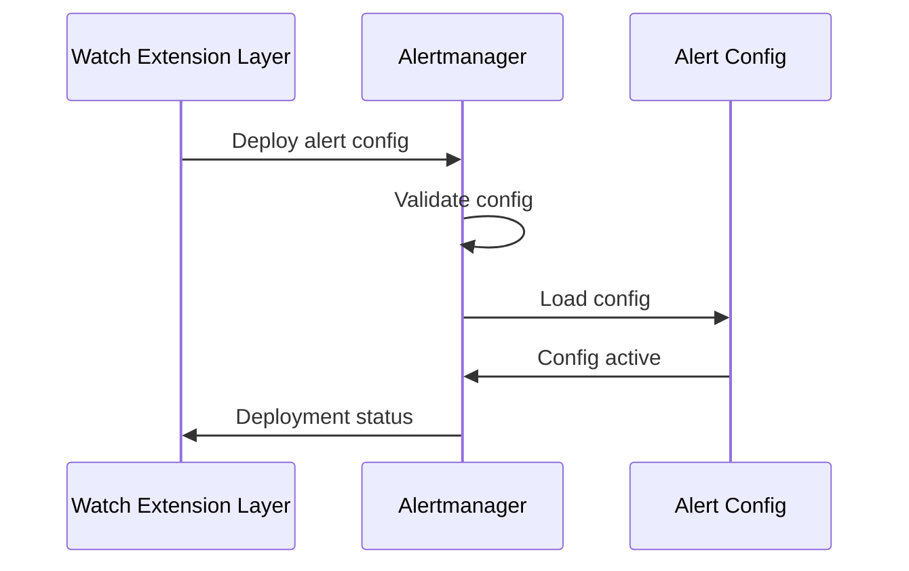
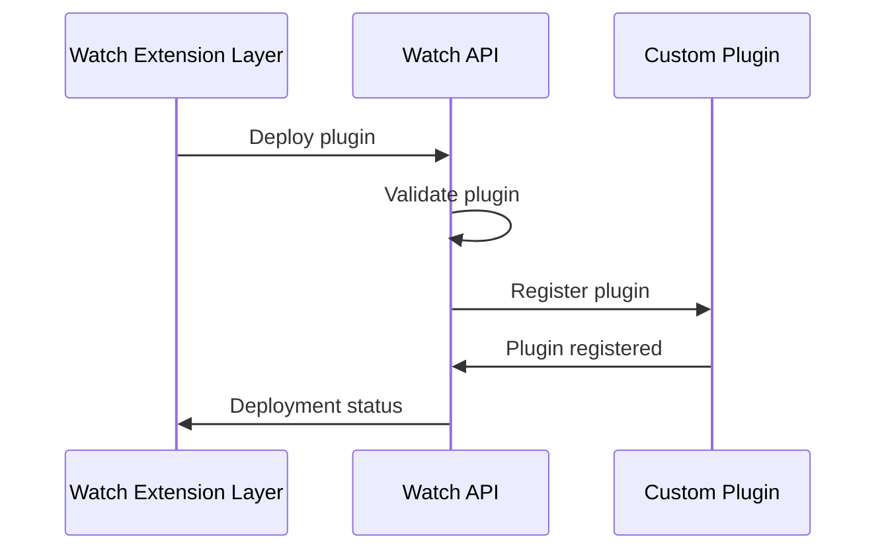
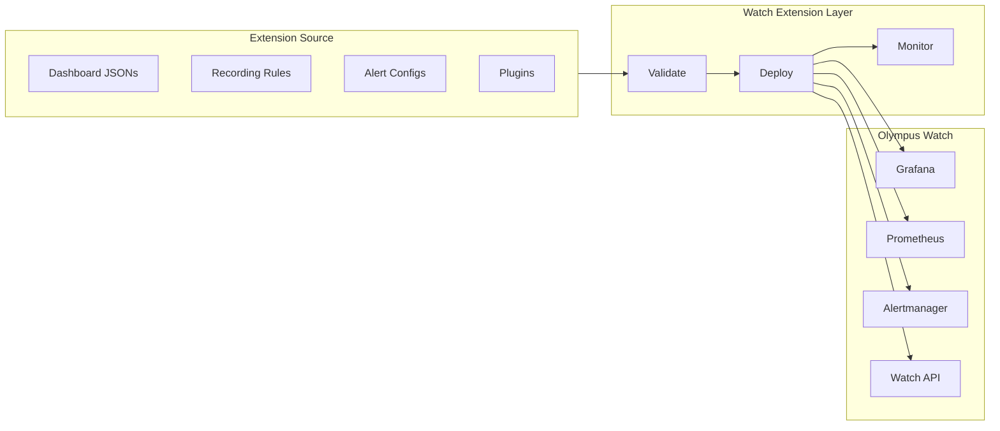
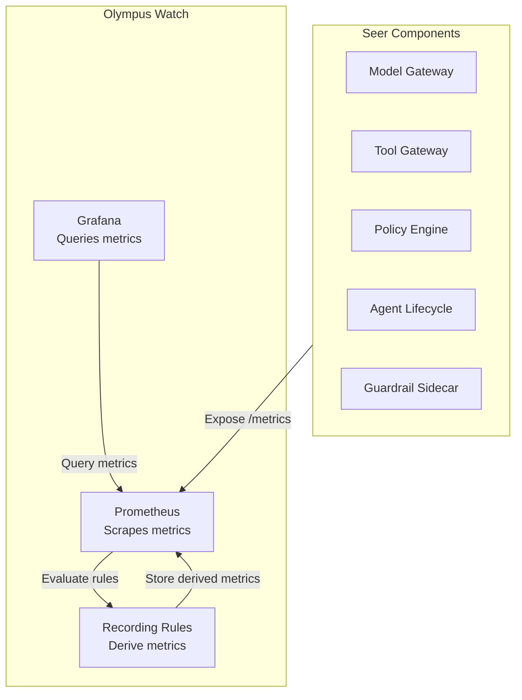

# Watch Extension Layer

> **Status**: 🟢 Design Complete  
> **Last Updated**: 2026-01-13  
> **Design Level**: C2 (Container)

---

## Overview

Watch Extension Layer provides the extension infrastructure for Olympus Watch. It deploys and manages dashboard JSONs, Prometheus recording rules, Alertmanager configurations, and custom Watch plugins to extend Watch with Seer-specific observability capabilities.

**Key Principle**: Watch Extension Layer extends Watch infrastructure—it does not create a new observability layer. All extensions are built on Watch's existing infrastructure (Prometheus, Grafana, Alertmanager).

---

## Architecture



---

## Functional Scope

### Dashboard Manager

Dashboard Manager deploys and manages Grafana dashboard JSONs:

#### Dashboard Deployment

```yaml
dashboard_deployment:
  dashboard_id: "seer-ai-platform-engineer"
  version: "1.0.0"
  grafana_folder: "Seer/AI Platform Engineer"
  dashboard_json: |
    {
      "dashboard": {
        "title": "AI Platform Engineer Dashboard",
        "panels": [...]
      }
    }
  update_strategy: "replace"  # replace | merge
```

#### Dashboard Lifecycle



#### Dashboard Management

| Operation | Description |
|-----------|-------------|
| **Deploy** | Deploy new dashboard or update existing |
| **Delete** | Remove dashboard from Grafana |
| **Version** | Track dashboard versions |
| **Rollback** | Rollback to previous dashboard version |

---

### Recording Rule Manager

Recording Rule Manager deploys and manages Prometheus recording rules:

#### Recording Rule Structure

```yaml
recording_rules:
  - name: "seer_agent_health_score"
    interval: "1m"
    rules:
      - record: "seer:agent:health_score"
        expr: |
          (
            seer_agent_success_rate * 0.3 +
            seer_agent_availability * 0.25 +
            seer_agent_compliance * 0.25 +
            seer_agent_user_satisfaction * 0.2
          )
        labels:
          agent_id: "$1"
          workbench_id: "$2"
  
  - name: "seer_agent_cost_per_request"
    interval: "5m"
    rules:
      - record: "seer:agent:cost_per_request"
        expr: |
          sum(rate(seer_model_cost_total[5m])) by (agent_id) /
          sum(rate(seer_request_total[5m])) by (agent_id)
```

#### Recording Rule Deployment



#### Recording Rule Management

| Operation | Description |
|-----------|-------------|
| **Deploy** | Deploy new recording rules or update existing |
| **Delete** | Remove recording rules from Prometheus |
| **Validate** | Validate recording rule syntax before deployment |
| **Monitor** | Monitor recording rule evaluation errors |

---

### Alert Config Manager

Alert Config Manager deploys and manages Alertmanager configurations:

#### Alert Configuration Structure

```yaml
alert_config:
  alert_rules:
    - alert: "SeerAgentHighErrorRate"
      expr: |
        rate(seer_agent_errors_total[10m]) > 0.05
      for: "10m"
      labels:
        severity: "warning"
        subsystem: "seer"
      annotations:
        summary: "Agent {{ $labels.agent_id }} has high error rate"
        description: "Error rate is {{ $value | humanizePercentage }}"
  
  route:
    receiver: "seer-alerts"
    group_by: [agent_id, workbench_id]
    routes:
      - match:
          severity: critical
        receiver: "seer-critical-alerts"
      - match:
          severity: warning
        receiver: "seer-warning-alerts"
  
  receivers:
    - name: "seer-alerts"
      slack_configs:
        - channel: "#seer-alerts"
          api_url: "https://hooks.slack.com/..."
```

#### Alert Config Deployment



#### Alert Config Management

| Operation | Description |
|-----------|-------------|
| **Deploy** | Deploy new alert config or update existing |
| **Delete** | Remove alert config from Alertmanager |
| **Validate** | Validate alert config syntax before deployment |
| **Test** | Test alert routing and notification delivery |

---

### Plugin Manager

Plugin Manager deploys and manages custom Watch plugins:

#### Plugin Structure

```yaml
plugin:
  name: "seer-agent-isolator"
  version: "1.0.0"
  type: "operational-tool"
  ui_component: "AgentIsolator"
  api_endpoints:
    - path: "/api/seer/isolate-agent"
      method: "POST"
      handler: "isolateAgent"
  permissions:
    - "seer:agent:isolate"
```

#### Plugin Deployment



#### Plugin Management

| Operation | Description |
|-----------|-------------|
| **Deploy** | Deploy new plugin or update existing |
| **Delete** | Remove plugin from Watch |
| **Enable/Disable** | Enable or disable plugin without removing |
| **Version** | Track plugin versions |

---

## Extension Deployment Model

### Deployment Artifacts

Extensions are deployed as:

| Artifact Type | Format | Deployment Target |
|---------------|--------|-------------------|
| **Dashboard JSONs** | JSON | Grafana |
| **Recording Rules** | YAML | Prometheus |
| **Alert Configs** | YAML | Alertmanager |
| **Custom Plugins** | JavaScript/TypeScript | Watch API |

### Deployment Process



### Deployment Strategies

| Strategy | Description | Use Case |
|----------|-------------|----------|
| **Replace** | Replace existing extension completely | Major version updates |
| **Merge** | Merge with existing extension | Minor updates, additions |
| **Rolling** | Deploy gradually across instances | Large-scale deployments |
| **Canary** | Deploy to subset first, then expand | High-risk changes |

---

## Metric Collection Architecture

### Metric Flow



### Metric Collection Pattern

```yaml
# Seer components expose Prometheus metrics
# Collected by Watch's Prometheus instances
# Recording rules compute derived metrics
# Dashboards query Prometheus
# Alerts evaluated by Alertmanager
```

---

## Integration Points

### Upstream Integration

| Service | Integration Method | Purpose |
|---------|-------------------|---------|
| **Seer Components** | Prometheus metrics endpoints | Metric sources |
| **Watch Infrastructure** | Grafana, Prometheus, Alertmanager APIs | Extension deployment targets |

### Downstream Integration

| Service | Integration Method | Purpose |
|---------|-------------------|---------|
| **Persona Dashboards** | Dashboard JSONs | Dashboard display |
| **Alert Templates** | Alert configurations | Alert routing |
| **Operational Tools** | Custom plugins | Tool UI and functionality |

---

## Key Design Decisions

### Watch-Based Extension Model

- **All extensions built on Watch infrastructure**—no new observability layer
- **Extends existing Watch capabilities**—Grafana, Prometheus, Alertmanager
- **Follows Watch extension patterns**—consistent with other Watch extensions

### Separate Subsystem

- **Independent subsystem** like cipher-iam-extensions
- **Clear separation** from Agent Analytics (data mart) and agent-level observability (SDK)
- **Focused on platform-level observability** for SRE personas

### Deployment Model

- **Artifact-based deployment**—dashboards, rules, configs, plugins
- **Version management**—track extension versions
- **Rollback support**—revert to previous versions if needed

---

## Related Documentation

- [Persona Dashboards](./persona-dashboards.md) — Dashboards for each SRE persona
- [Alert Templates](./alert-templates.md) — Pre-built alert definitions
- [Operational Tools](./operational-tools.md) — UI tools for operational tasks
- [Agent Observability](../agent-observability.md) — SDK and agent-level instrumentation
- [Olympus Watch](../../../olympus-hub-docs/05-infrastructure/olympus-watch.md) — Watch platform infrastructure

---

*Watch Extension Layer provides the infrastructure for extending Olympus Watch with Seer-specific observability capabilities.*
