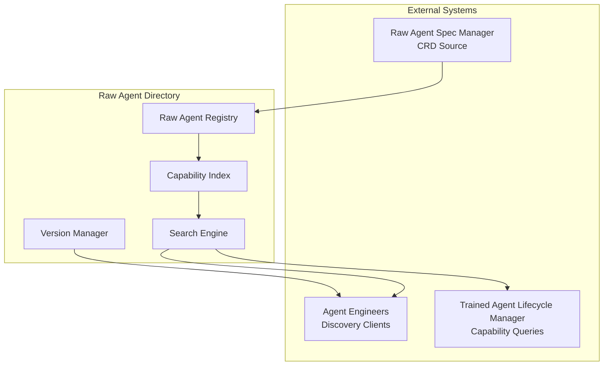

# Raw Agent Directory

> **Status**: 🟢 Design Complete  
> **Last Updated**: 2026-01-12  
> **Design Level**: C2 (Container)

---

## Overview

The Raw Agent Directory provides a registry and discovery service for Raw Agents, enabling Agent Engineers to discover, search, and evaluate Raw Agents based on their capabilities. The directory indexes Raw Agent Specs and provides capability-based search, versioning, and discovery APIs.

**Key Design Point**: The directory enables capability-based discovery, allowing Agent Engineers to find Raw Agents that match specific requirements (tool protocols, archetype roles, orchestration capabilities).

---

## Architecture



---

## Functional Scope

### Raw Agent Registry

- **Registration**: Automatic registration of Raw Agent Specs from CRD
- **Indexing**: Index Raw Agents by capabilities, archetype roles, tool protocols
- **Versioning**: Track all versions of Raw Agents
- **State Management**: Track Raw Agent state (draft, published, deprecated)

### Capability Discovery

- **Capability Search**: Search Raw Agents by capabilities (tool protocols, archetype roles, orchestration)
- **Capability Filtering**: Filter Raw Agents by specific capability requirements
- **Capability Matching**: Match Raw Agents to capability requirements
- **Suitability Scoring**: Score Raw Agents based on capability match

### Versioning

- **Version Tracking**: Track all versions of each Raw Agent
- **Version Search**: Search for specific versions
- **Version Comparison**: Compare capabilities across versions
- **Version History**: Access version history and changelog

### Search

- **Text Search**: Full-text search across Raw Agent names, descriptions
- **Capability Search**: Search by specific capabilities
- **Metadata Search**: Search by labels, annotations, domain
- **Combined Search**: Combine multiple search criteria

---

## API Reference

### Discover Raw Agents

```yaml
# Search by capabilities
GET /raw-agents?capabilities.toolProtocols=temenos-t24/get-transactions&capabilities.archetypeRoles=thinker

# Search by text
GET /raw-agents?q=fraud+analysis

# Search by domain
GET /raw-agents?domain=disputes

# Combined search
GET /raw-agents?q=fraud&capabilities.archetypeRoles=thinker,doer&domain=disputes
```

### Get Raw Agent

```yaml
# Get by name (latest version)
GET /raw-agents/{name}

# Get by name and version
GET /raw-agents/{name}/versions/{version}

# Get all versions
GET /raw-agents/{name}/versions
```

### Capability Matching

```yaml
# Match Raw Agents to requirements
POST /raw-agents/match
body:
  requirements:
    toolProtocols:
      - "temenos-t24/get-transactions"
      - "case-management/update-case"
    archetypeRoles:
      - "thinker"
      - "doer"
    orchestration:
      multiAgentCoordination: true
  response:
    matches:
      - rawAgent: fraud-analyst-base
        version: "2.4.1"
        score: 0.95
        matchedCapabilities:
          - toolProtocols: ["temenos-t24/get-transactions"]
          - archetypeRoles: ["thinker", "doer"]
          - orchestration: ["multiAgentCoordination"]
```

---

## Integration Points

### Raw Agent Spec Manager

- **CRD Source**: Raw Agent Directory watches Raw Agent Spec CRDs
- **Registration**: Automatic registration when Raw Agent Specs are created/updated
- **Validation**: Directory validates Raw Agent Specs before indexing

### Agent Engineers

- **Discovery**: Agent Engineers query directory for suitable Raw Agents
- **Capability Evaluation**: Evaluate Raw Agent capabilities against requirements
- **Documentation Access**: Access Raw Agent documentation via directory

### Trained Agent Lifecycle Manager

- **Capability Queries**: Training Spec creation queries directory for capability matching
- **Raw Agent References**: Training Specs reference Raw Agents from directory
- **Version Resolution**: Directory resolves Raw Agent versions for Training Specs

---

## Key Design Decisions

### Capability-Based Discovery

**Decision**: Directory provides capability-based search and matching.

**Rationale**:
- Agent Engineers need to find Raw Agents that match specific requirements
- Capability-based search is more precise than text search
- Enables automated suitability evaluation

### Automatic Registration

**Decision**: Raw Agent Specs are automatically registered when CRDs are created/updated.

**Rationale**:
- Reduces manual registration overhead
- Ensures directory is always up-to-date
- Prevents registration errors

### Version Tracking

**Decision**: Directory tracks all versions of Raw Agents.

**Rationale**:
- Training Specs may reference specific versions
- Enables version comparison and migration planning
- Supports version-based capability discovery

---

## Related Documentation

- [Raw Agent Spec Manager](raw-agent-spec-manager.md) — Raw Agent Spec management
- [Raw Agent Operators](raw-agent-operators.md) — Raw Agent lifecycle management
- [Training Spec Manager](../agent-lifecycle-manager/training-spec-manager.md) — Training Spec management

---

*Raw Agent Directory provides capability-based discovery and search for Raw Agents, enabling Agent Engineers to find suitable Raw Agents for their use cases.*
