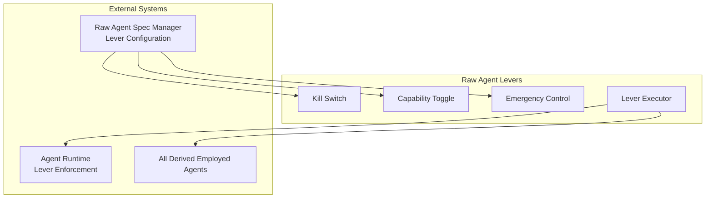

# Raw Agent Levers

> **Status**: 🟢 Design Complete  
> **Last Updated**: 2026-01-12  
> **Design Level**: C2 (Container)

---

## Overview

The Raw Agent Levers provide emergency controls and operational toggles for Raw Agents. Levers affect all derived Employed Agents that reference the Raw Agent, enabling centralized control over agent behavior across all deployments.

**Key Design Point**: Levers provide kill switches, capability toggles, and emergency controls that affect all Employed Agents derived from a Raw Agent, enabling rapid response to issues without requiring individual Employed Agent updates.

---

## Architecture



---

## Functional Scope

### Kill Switches

- **Global Kill Switch**: Immediately disable all derived Employed Agents
- **Selective Kill Switch**: Disable specific capability or feature across all derived agents
- **Graceful Shutdown**: Graceful shutdown of affected agents
- **Emergency Stop**: Immediate stop of all affected agents

### Capability Toggles

- **Capability Enable/Disable**: Enable or disable specific capabilities
- **Feature Flags**: Toggle specific features on/off
- **Tool Protocol Toggles**: Enable/disable specific tool protocols
- **Orchestration Toggles**: Enable/disable orchestration capabilities

### Emergency Controls

- **Rate Limiting**: Apply rate limits to all derived agents
- **Resource Constraints**: Apply resource constraints
- **Access Restrictions**: Restrict access to specific resources
- **Behavior Modifications**: Modify agent behavior (e.g., force escalation)

### Execution Methods

- **Immediate Execution**: Execute lever immediately
- **Scheduled Execution**: Schedule lever execution for future time
- **Conditional Execution**: Execute lever based on conditions
- **Rollback**: Rollback lever execution

---

## Lever Types

### Kill Switch

```yaml
apiVersion: seer.olympus.io/v1
kind: RawAgentLever
metadata:
  name: fraud-analyst-base-kill-switch
spec:
  rawAgent:
    name: fraud-analyst-base
    version: "2.4.1"  # Optional: specific version, or all versions
  
  leverType: "kill_switch"
  action: "disable"  # disable | enable
  
  scope:
    allVersions: true  # Apply to all versions
    # Or specific versions:
    # versions: ["2.4.1", "2.4.0"]
  
  execution:
    method: "immediate"  # immediate | scheduled | conditional
    graceful: true  # Graceful shutdown vs immediate stop
  
  reason: "Security vulnerability discovered"
  authorizedBy: "security-team"
```

### Capability Toggle

```yaml
apiVersion: seer.olympus.io/v1
kind: RawAgentLever
metadata:
  name: fraud-analyst-base-capability-toggle
spec:
  rawAgent:
    name: fraud-analyst-base
  
  leverType: "capability_toggle"
  capability: "toolCalling"
  action: "disable"  # disable | enable
  
  scope:
    toolProtocols:
      - "temenos-t24/get-transactions"  # Disable specific tool protocol
  
  execution:
    method: "immediate"
  
  reason: "Tool protocol deprecated"
```

### Emergency Control

```yaml
apiVersion: seer.olympus.io/v1
kind: RawAgentLever
metadata:
  name: fraud-analyst-base-emergency-control
spec:
  rawAgent:
    name: fraud-analyst-base
  
  leverType: "emergency_control"
  controlType: "rate_limit"  # rate_limit | resource_constraint | access_restriction | behavior_modification
  
  parameters:
    rateLimit:
      requestsPerMinute: 10
      tokensPerHour: 10000
  
  execution:
    method: "immediate"
  
  reason: "High resource usage detected"
  authorizedBy: "operations-team"
```

---

## Integration Points

### Raw Agent Spec Manager

- **Lever Configuration**: Levers are configured via Raw Agent Spec or separate CRD
- **Lever Storage**: Lever configurations stored in Kubernetes
- **Lever Validation**: Validate lever configurations

### Agent Runtime

- **Lever Enforcement**: Agent Runtime enforces levers on Employed Agents
- **Lever Propagation**: Levers propagate to all derived Employed Agents
- **Lever Monitoring**: Monitor lever effectiveness

### All Derived Employed Agents

- **Lever Application**: Levers apply to all Employed Agents derived from Raw Agent
- **Lever Impact**: Track which Employed Agents are affected
- **Lever Rollback**: Rollback levers across all affected agents

---

## Key Design Decisions

### Centralized Control

**Decision**: Levers provide centralized control over all derived Employed Agents.

**Rationale**:
- Enables rapid response to issues
- Single point of control for all deployments
- Reduces operational overhead

### Lever Execution Methods

**Decision**: Levers support immediate, scheduled, and conditional execution.

**Rationale**:
- Immediate execution for emergencies
- Scheduled execution for planned changes
- Conditional execution for dynamic control

### Lever Rollback

**Decision**: Levers can be rolled back to restore previous state.

**Rationale**:
- Enables safe experimentation
- Provides safety net for lever execution
- Supports gradual rollout and rollback

### Lever Scope

**Decision**: Levers can target all versions or specific versions of Raw Agents.

**Rationale**:
- Provides granular control
- Enables version-specific lever application
- Supports gradual rollout strategies

---

## Related Documentation

- [Raw Agent Spec Manager](raw-agent-spec-manager.md) — Raw Agent Spec management
- [Raw Agent Operators](raw-agent-operators.md) — Raw Agent lifecycle management
- [Agent Runtime](../agent-runtime/README.md) — Employed Agent deployment

---

*Raw Agent Levers provide emergency controls and operational toggles that affect all derived Employed Agents, enabling centralized control and rapid response to issues.*
