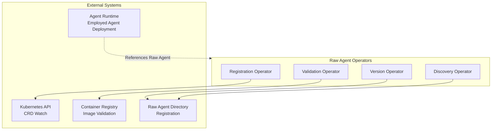
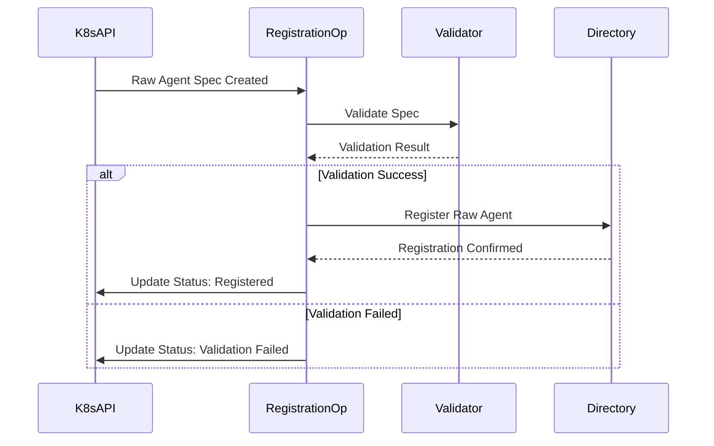
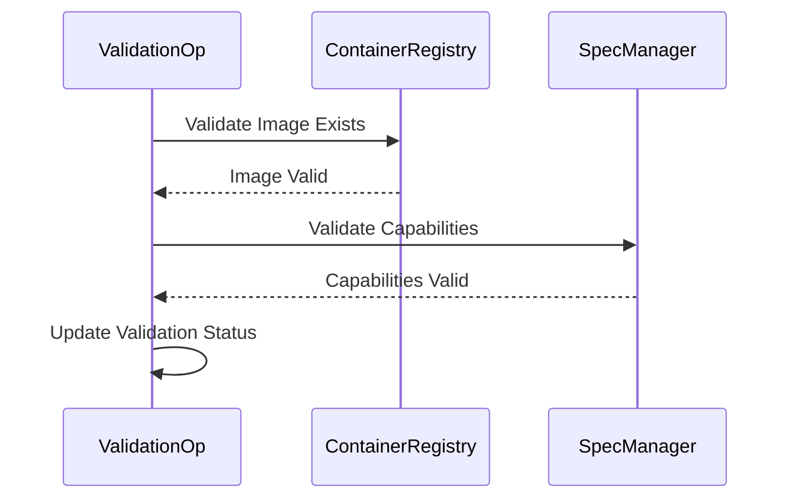

# Raw Agent Operators

> **Status**: 🟢 Design Complete  
> **Last Updated**: 2026-01-12  
> **Design Level**: C2 (Container)

---

## Overview

The Raw Agent Operators manage the lifecycle of Raw Agents, including registration, validation, versioning, and discovery. **Important**: Raw Agents are NOT directly deployed; they are deployed only as part of Employed Agents with associated configs and environment in workbench instances. Operators manage Raw Agent registration, validation, versioning, and discovery, but NOT deployment.

**Key Design Point**: Operators reconcile Raw Agent Spec CRDs, validate container images, manage versions, and update the Raw Agent Directory. Deployment is handled by Agent Runtime when Employed Agents are deployed.

---

## Architecture

---

## Functional Scope

### Registration

- **CRD Watch**: Watch for Raw Agent Spec CRD creation/updates
- **Automatic Registration**: Register Raw Agents in directory
- **State Management**: Track Raw Agent state (draft, published, deprecated)

### Validation

- **Container Image Validation**: Validate container image exists in registry
- **Capability Validation**: Validate capability declarations are consistent
- **Version Validation**: Validate semantic versioning
- **Business Rule Validation**: Validate business rules (no circular dependencies, etc.)

### Versioning

- **Version Tracking**: Track all versions of Raw Agents
- **Version Comparison**: Compare capabilities across versions
- **Version Deprecation**: Mark versions as deprecated
- **Version Migration**: Support version migration planning

### Discovery

- **Directory Updates**: Update Raw Agent Directory with latest information
- **Capability Indexing**: Index capabilities for search
- **Metadata Indexing**: Index metadata for text search

---

## Operator Reconciliation Patterns

### Registration Operator

### Validation Operator

---

## Integration Points

### Kubernetes API

- **CRD Watch**: Watch for Raw Agent Spec CRD changes
- **Status Updates**: Update Raw Agent Spec status
- **Event Publishing**: Publish events for Raw Agent lifecycle changes

### Container Registry

- **Image Validation**: Validate container images exist
- **Image Metadata**: Retrieve image metadata for validation
- **Image Scanning**: Security scanning (future capability)

### Raw Agent Directory

- **Registration**: Register Raw Agents in directory
- **Indexing**: Index capabilities and metadata
- **Updates**: Update directory when Raw Agents change

### Agent Runtime

- **Raw Agent References**: Agent Runtime references Raw Agent containers when deploying Employed Agents
- **Container Pull**: Agent Runtime pulls Raw Agent container images
- **Deployment**: Agent Runtime deploys Employed Agents (not Raw Agents)

---

## Key Design Decisions

### Raw Agents Are NOT Deployable

**Decision**: Operators manage registration, validation, versioning, and discovery; NOT deployment.

**Rationale**:
- Raw Agents are containers referenced by Training Specs
- Only Employed Agents are deployable
- Deployment is handled by Agent Runtime for Employed Agents

### Reconciliation Pattern

**Decision**: Operators use Kubernetes reconciliation patterns.

**Rationale**:
- Consistent with Kubernetes operator patterns
- Handles CRD updates and deletions
- Ensures desired state matches actual state

### Validation Before Registration

**Decision**: Raw Agents are validated before registration in directory.

**Rationale**:
- Prevents invalid Raw Agents from being discoverable
- Ensures directory contains only valid Raw Agents
- Provides clear validation feedback

---

## Related Documentation

- [Raw Agent Spec Manager](raw-agent-spec-manager.md) — Raw Agent Spec management
- [Raw Agent Directory](raw-agent-directory.md) — Raw Agent registry and discovery
- [Agent Runtime](../agent-runtime/README.md) — Employed Agent deployment

---

*Raw Agent Operators manage Raw Agent lifecycle (registration, validation, versioning, discovery) but NOT deployment, which is handled by Agent Runtime for Employed Agents.*
