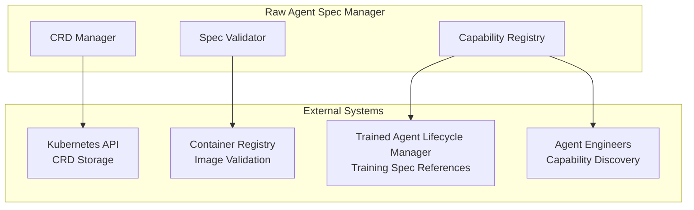

# Raw Agent Spec Manager

> **Status**: 🟢 Design Complete  
> **Last Updated**: 2026-01-12  
> **Design Level**: C2 (Container)

---

## Overview

The Raw Agent Spec Manager manages Raw Agent specifications (CRDs) that define the foundational capabilities of Raw Agents. Raw Agents are NOT deployable on their own; they are containers referenced by Employed Agents through Training Specs and deployed only as part of Employed Agent instances within workbench environments.

**Key Design Point**: Raw Agent Specs include structured/typed capabilities (tool calling, orchestration, archetype roles, prompt tags) that help Agent Engineers evaluate suitability. The spec also includes documentation references for Trained/Employed Agent developers and container image references.

---

## Architecture



---

## Functional Scope

### Raw Agent CRD Structure

- **Identity**: Raw Agent name, version, container image reference
- **Capabilities Specification**: Structured/typed capabilities declaration
- **Documentation Reference**: Links to documentation for Trained/Employed Agent developers
- **Container Image Reference**: Container registry, image, tag
- **Validation Rules**: CRD validation and business rule validation

### Capabilities Specification

- **Tool Calling Capabilities**: Supported tool protocols, tool invocation patterns
- **Orchestration Capabilities**: Multi-agent coordination, workflow orchestration
- **Archetype Roles**: Supported roles (thinker, doer, orchestrator, governor)
- **Prompt Tags**: Tags supported for prompts and their meaning in Authority Enforcement

### Validation

- **CRD Validation**: Kubernetes CRD schema validation
- **Business Rule Validation**: Capability consistency, container image validation
- **Version Validation**: Semantic versioning validation

---

## Raw Agent CRD Structure

### Complete CRD Example

```yaml
apiVersion: seer.olympus.io/v1
kind: RawAgentSpec
metadata:
  name: fraud-analyst-base
  namespace: seer-agents
  labels:
    seer.olympus.io/resource-type: raw-agent
    seer.olympus.io/domain: disputes
  annotations:
    seer.olympus.io/description: "Base fraud analyst agent with transaction analysis capabilities"
    seer.olympus.io/owner: disputes-team

spec:
  # Identity
  identity:
    name: fraud-analyst-base
    version: "2.4.1"
    displayName: "Fraud Analyst Base"
    description: "Foundational fraud analysis agent for dispute resolution"
  
  # Container Image Reference
  container:
    registry: registry.olympus.io
    repository: seer/agents/fraud-analyst
    image: fraud-analyst-base:2.4.1
    pullPolicy: IfNotPresent
  
  # Capabilities Specification
  capabilities:
    # Tool Calling Capabilities
    toolCalling:
      supportedProtocols:
        - "temenos-t24/get-transactions"
        - "temenos-t24/get-account-details"
        - "case-management/update-case"
        - "case-management/create-note"
      invocationPatterns:
        - "synchronous"
        - "asynchronous"
        - "batch"
      toolDiscovery: true
      toolSchemaValidation: true
    
    # Orchestration Capabilities
    orchestration:
      multiAgentCoordination: true
      workflowOrchestration: true
      taskDelegation: true
      coordinationPatterns:
        - "request-response"
        - "publish-subscribe"
        - "workflow"
    
    # Archetype Roles Supported
    archetypeRoles:
      - "thinker"      # Reasoning and decision-making
      - "doer"         # Action execution
      # orchestrator and governor not supported
    
    # Prompt Tags for Authority Enforcement
    promptTags:
      - name: "fraud_analysis"
        description: "Tag for fraud analysis prompts"
        authorityEnforcementMeaning: "Prompts with this tag enforce fraud analysis authority constraints"
      - name: "customer_communication"
        description: "Tag for customer communication prompts"
        authorityEnforcementMeaning: "Prompts with this tag enforce customer communication authority constraints"
      - name: "escalation"
        description: "Tag for escalation prompts"
        authorityEnforcementMeaning: "Prompts with this tag enforce escalation authority constraints"
  
  # Documentation Reference
  documentation:
    agentEngineerDocs: "https://docs.olympus.io/agents/fraud-analyst-base/agent-engineer"
    trainedAgentDeveloperDocs: "https://docs.olympus.io/agents/fraud-analyst-base/trained-agent"
    employedAgentDeveloperDocs: "https://docs.olympus.io/agents/fraud-analyst-base/employed-agent"
  
  # Container Requirements
  requirements:
    runtime: "python:3.11"
    resources:
      cpu: "500m"
      memory: "1Gi"
    dependencies:
      - "seer-sdk>=1.0.0"
      - "langchain>=0.1.0"

status:
  state: "published"
  publishedAt: "2026-01-12T10:00:00Z"
  derivedAgents:
    trained:
      - name: fraud-analyst-v2
        trainingSpec: fraud-analyst-v2
        count: 3
    employed:
      - name: fraud-analyst-acme-retail
        employmentSpec: es-fraud-analyst-acme-retail
        count: 5
```

---

## Capabilities Specification Details

### Tool Calling Capabilities

```yaml
toolCalling:
  supportedProtocols:
    - "protocol-name"  # Tool protocol identifiers
  invocationPatterns:
    - "synchronous"    # Synchronous tool calls
    - "asynchronous"   # Async tool calls
    - "batch"          # Batch tool invocations
  toolDiscovery: true  # Can discover tools dynamically
  toolSchemaValidation: true  # Validates tool schemas
```

### Orchestration Capabilities

```yaml
orchestration:
  multiAgentCoordination: true  # Can coordinate with other agents
  workflowOrchestration: true   # Can orchestrate workflows
  taskDelegation: true          # Can delegate tasks to other agents
  coordinationPatterns:
    - "request-response"        # Request-response coordination
    - "publish-subscribe"       # Pub-sub coordination
    - "workflow"                # Workflow-based coordination
```

### Archetype Roles

```yaml
archetypeRoles:
  - "thinker"      # Reasoning and decision-making
  - "doer"         # Action execution
  - "orchestrator" # Workflow coordination
  - "governor"     # Observation and auditing
```

**Archetype Role Definitions:**
- **Thinker**: Analyzes information, forms judgments, makes decisions
- **Doer**: Executes actions, invokes tools, produces results
- **Orchestrator**: Assigns tasks, coordinates agents, manages workflow
- **Governor**: Monitors, audits, flags issues (read-only)

### Prompt Tags

```yaml
promptTags:
  - name: "tag-name"
    description: "Human-readable description"
    authorityEnforcementMeaning: "How this tag affects authority enforcement"
```

Prompt tags are used in Authority Enforcement to determine which prompts are applicable based on the agent's authority configuration.

---

## Validation Rules

### CRD Schema Validation

- **Required Fields**: identity, container, capabilities
- **Version Format**: Semantic versioning (major.minor.patch)
- **Container Image**: Valid container registry and image reference
- **Capabilities**: Valid capability structure

### Business Rule Validation

- **Container Image Exists**: Container image must exist in registry
- **Capability Consistency**: Capabilities must be internally consistent
- **Version Uniqueness**: Version must be unique per Raw Agent name
- **No Circular Dependencies**: No circular dependencies in agent references

---

## Integration Points

### Kubernetes API

- **CRD Storage**: Raw Agent Specs stored as Kubernetes CRDs
- **CRD Validation**: Kubernetes CRD schema validation
- **CRD Watch**: Watch for Raw Agent Spec changes

### Container Registry

- **Image Validation**: Validate container image exists
- **Image Metadata**: Retrieve image metadata for validation
- **Image Scanning**: Security scanning (future capability)

### Trained Agent Lifecycle Manager

- **Training Spec References**: Training Specs reference Raw Agent Specs
- **Capability Matching**: Training Specs can query Raw Agent capabilities
- **Derived Agent Tracking**: Track which Training Specs use this Raw Agent

### Agent Engineers

- **Capability Discovery**: Agent Engineers query Raw Agent capabilities
- **Suitability Evaluation**: Evaluate if Raw Agent meets requirements
- **Documentation Access**: Access agent documentation

---

## Key Design Decisions

### Raw Agents Are NOT Deployable

**Decision**: Raw Agents are containers referenced by Training Specs; only Employed Agents are deployable.

**Rationale**:
- Raw Agents are foundational artifacts without organizational knowledge
- Training Specs add organizational knowledge and domain skills
- Employment Specs add authority and work context
- Only Employed Agents have complete configuration for deployment

### Structured/Typed Capabilities

**Decision**: Capabilities are structured and typed (not free-form text).

**Rationale**:
- Enables programmatic capability discovery
- Supports automated suitability evaluation
- Ensures consistent capability declarations
- Enables capability-based search and filtering

### Capability Declaration for Agent Engineers

**Decision**: Capabilities are declared for Agent Engineers to evaluate suitability.

**Rationale**:
- Agent Engineers need to understand what Raw Agents can do
- Capabilities help match Raw Agents to use cases
- Supports informed selection of Raw Agents for Training Specs

### Documentation References

**Decision**: Raw Agent Specs include documentation references for different developer personas.

**Rationale**:
- Agent Engineers need capability documentation
- Trained Agent developers need integration documentation
- Employed Agent developers need deployment documentation
- Different personas need different documentation

### Identity for Recognizing Derived Agents

**Decision**: Raw Agent identity is used to recognize derived Trained and Employed Agents.

**Rationale**:
- Enables tracking of agent lineage
- Supports impact analysis when Raw Agents change
- Enables capability-based agent discovery
- Supports agent version management

---

## Related Documentation

- [Raw Agent Directory](raw-agent-directory.md) — Raw Agent registry and discovery
- [Raw Agent Operators](raw-agent-operators.md) — Raw Agent lifecycle management
- [Training Spec Manager](../agent-lifecycle-manager/training-spec-manager.md) — Training Spec management
- [Agent Archetypes](../../../why-seer/part-2-how-seer-solves/11-multi-agent-patterns-in-seer/11-2-agent-archetypes.md)

---

*Raw Agent Spec Manager manages Raw Agent specifications with structured capabilities, enabling Agent Engineers to evaluate suitability and Trained/Employed Agent developers to integrate and deploy agents.*
