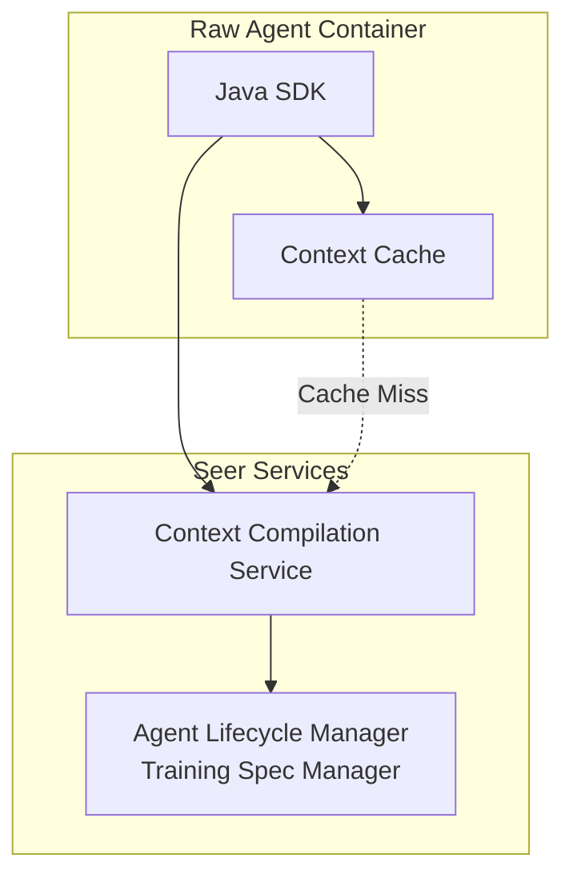

# Java SDK: Context Compiler APIs

> **Status**: 🟢 Design Complete  
> **Last Updated**: 2026-01-12  
> **Design Level**: C2 (Container)

---

## Overview

The Context Compiler APIs provide Java SDK wrappers for the Context Compilation Service, enabling Raw Agents to compile context from four sources: Enterprise Knowledge, Enterprise Memory, Agent Memory, and Hub Request Context (including request hierarchy/ancestry topology). The SDK handles automatic retriever selection based on request update metadata matching Training Spec selector criteria.

**Key Design Point**: The SDK provides a simple, framework-agnostic interface that automatically handles retriever configuration selection from Training Specs. Agent code remains framework-agnostic and doesn't need to specify retrievers.

---

## Architecture



---

## Functional Scope

### Context Compilation

- **Compile Context**: Compile context from four sources with automatic retriever selection
- **Compile with Overrides**: Compile context with optional overrides (token budget, cache control)
- **Async Compilation**: Asynchronous context compilation for non-blocking operations
- **Batch Compilation**: Compile context for multiple requests in parallel

### Automatic Retriever Selection

- **Request-Update-Based Selection**: Automatic retriever selection based on request update metadata
- **Training Spec Integration**: Retrievers configured in Training Spec with selector criteria
- **Selector Matching**: Automatic matching against updateType, taskType, contextKeys, etc.
- **Configuration Merging**: Multiple matching configurations are automatically merged

### Request Hierarchy Integration

- **Ancestry Traversal**: Automatic traversal of request hierarchy to access ancestor contexts
- **Goal and Role-Based Filtering**: Ancestor contexts filtered based on agent goal and role
- **Context Inheritance**: Access to context from all requestors in ancestry chain

### Tool-Aware Compilation

- **Tool Integration**: Available tools automatically incorporated into context constraints
- **Tool Capability Influence**: Tool capabilities influence context retrieval and ranking
- **Tool Metadata**: Tool schemas and usage patterns included in context

### Caching

- **Local Cache**: Compiled context cached locally for performance
- **Cache Invalidation**: Cache automatically invalidated on context updates
- **Cache Refresh**: Configurable refresh interval and on-demand refresh

---

## API Reference

### Initialization

```java
import io.olympus.seer.sdk.SeerSDK;
import io.olympus.seer.sdk.context.ContextCompilerClient;

// Initialize SDK (auto-detects agent identity from environment)
SeerSDK sdk = SeerSDK.fromEnvironment();

// Access Context Compiler APIs
ContextCompilerClient contextCompiler = sdk.getContextCompilerClient();
```

### Compile Context

```java
// Basic compilation (automatic retriever selection)
CompiledContext context = contextCompiler.compile(
    "req-abc123",
    "upd-xyz789"
).join();

// Access compiled context
System.out.println(context.getConstraints());
System.out.println(context.getFacts());
System.out.println(context.getPrecedent());
System.out.println(context.getProcedures());
System.out.println(context.getWorkingState());
System.out.println(context.getRequestContext());
```

### Compile with Options

```java
// Compile with token budget override
CompileOptions options = CompileOptions.builder()
    .tokenBudget(10000)  // Override total budget
    .build();
CompiledContext context = contextCompiler.compile(
    "req-abc123",
    "upd-xyz789",
    options
).join();

// Compile with cache control
CompileOptions cacheOptions = CompileOptions.builder()
    .useCache(true)      // Use cache if available (default: true)
    .refreshCache(false)  // Force refresh from source (default: false)
    .build();
CompiledContext context = contextCompiler.compile(
    "req-abc123",
    "upd-xyz789",
    cacheOptions
).join();
```

### Async Compilation

```java
// Async compilation
CompletableFuture<CompiledContext> future = contextCompiler.compile(
    "req-abc123",
    "upd-xyz789"
);

// Handle completion
future.thenAccept(context -> {
    System.out.println("Context compiled: " + context.getMetadata().getTokenCount() + " tokens");
});
```

### Batch Compilation

```java
// Compile context for multiple requests
List<CompileRequest> requests = Arrays.asList(
    new CompileRequest("req-001", "upd-001"),
    new CompileRequest("req-002", "upd-002"),
    new CompileRequest("req-003", "upd-003")
);

List<CompiledContext> contexts = contextCompiler.compileBatch(requests).join();
for (CompiledContext context : contexts) {
    System.out.println(context.getRequestId() + ": " + 
                       context.getMetadata().getTokenCount() + " tokens");
}
```

### Context Fields Access

```java
CompiledContext context = contextCompiler.compile(
    "req-abc123",
    "upd-xyz789"
).join();

// Constraints (tool allowlist, safety rules, policy constraints)
Constraints constraints = context.getConstraints();
System.out.println(constraints.getToolAllowlist());
System.out.println(constraints.getSafetyRules());
System.out.println(constraints.getPolicyConstraints());

// Goal
Goal goal = context.getGoal();
System.out.println(goal.getObjective());
System.out.println(goal.getDefinitionOfDone());

// Facts
for (Fact fact : context.getFacts()) {
    System.out.println(fact.getSource() + ": " + fact.getContent() + 
                       " (confidence: " + fact.getConfidence() + ")");
}

// Precedent
for (Precedent precedent : context.getPrecedent()) {
    System.out.println(precedent.getRecordId() + ": " + precedent.getSummary() + 
                       " (relevance: " + precedent.getRelevanceScore() + ")");
}

// Procedures
Procedures procedures = context.getProcedures();
System.out.println(procedures.getApplicableSops());
System.out.println(procedures.getAgentProcedures());

// Working State
WorkingState workingState = context.getWorkingState();
System.out.println(workingState.getToolOutputs());
System.out.println(workingState.getSessionVariables());

// Request Context
RequestContext requestContext = context.getRequestContext();
System.out.println("Current: " + requestContext.getCurrent().getRequestId());
for (AncestorContext ancestor : requestContext.getAncestors()) {
    System.out.println("Ancestor " + ancestor.getDepth() + ": " + 
                       ancestor.getRequestId() + " (" + ancestor.getRelevance() + ")");
}
```

### Context Metadata

```java
CompiledContext context = contextCompiler.compile(
    "req-abc123",
    "upd-xyz789"
).join();

// Metadata
ContextMetadata metadata = context.getMetadata();
System.out.println("Token count: " + metadata.getTokenCount());
System.out.println("Budget remaining: " + metadata.getBudgetRemaining());
System.out.println("Compilation time: " + metadata.getCompilationTimeMs() + "ms");
System.out.println("Retrieval stats: " + metadata.getRetrievalStats());
```

### Provenance

```java
CompiledContext context = contextCompiler.compile(
    "req-abc123",
    "upd-xyz789"
).join();

// Provenance
Provenance provenance = context.getProvenance();
for (SourceInfo source : provenance.getSources()) {
    System.out.println(source.getType() + ": " + source.getRecordsReturned() + 
                       " records in " + source.getLatencyMs() + "ms");
    System.out.println("  Query: " + source.getQuery());
    System.out.println("  Version: " + source.getVersion());
}

// Reproducibility hash
System.out.println("Context hash: " + provenance.getHash());
```

### Context Text Format

```java
CompiledContext context = contextCompiler.compile(
    "req-abc123",
    "upd-xyz789"
).join();

// Get context as formatted text
String text = context.getAsText();
System.out.println(text);

// Get context as structured map
Map<String, Object> contextMap = context.getAsDict();
System.out.println(contextMap);
```

### Cache Management

```java
// Invalidate cache for a request
contextCompiler.getCache().invalidate("req-abc123").join();

// Refresh cache
contextCompiler.getCache().refresh("req-abc123").join();

// Check cache status
CacheStatus cacheStatus = contextCompiler.getCache().getStatus("req-abc123").join();
System.out.println(cacheStatus.isValid());
System.out.println(cacheStatus.getLastUpdated());
System.out.println(cacheStatus.getVersion());
```

---

## Automatic Retriever Selection

The SDK automatically selects retrievers based on request update metadata matching Training Spec selector criteria. Agent code doesn't need to specify retrievers.

### How It Works

1. **Request Update Metadata**: SDK extracts metadata from request update (updateType, taskType, contextKeys, etc.)
2. **Training Spec Lookup**: SDK loads Training Spec retriever configurations
3. **Selector Matching**: SDK matches request update against selector criteria
4. **Configuration Merging**: When multiple selectors match, configurations are merged
5. **Context Compilation**: SDK invokes Context Compilation Service with selected configuration

### Example

```java
// Agent code - doesn't know about Training Spec
// Just invokes context compilation with request update
CompiledContext context = contextCompiler.compile(
    invocation.getRequest().getRequestId(),
    invocation.getUpdate().getUpdateId()
    // No retriever specification needed!
    // SDK automatically matches request update against Training Spec selectors
).join();
```

### Training Spec Configuration

```yaml
# Training Spec defines retriever configurations with selectors
spec:
  contextCompilation:
    retrieverConfigs:
      - selector:
          updateType: "task_created"
          taskType: "fraud_investigation"
        retrievers: [...]
        tokenBudget: {...}
        ranking: {...}
      - selector:
          updateType: "context_update"
          contextKeys: ["customer_profile"]
        retrievers: [...]
        tokenBudget: {...}
      - selector: {}  # Default fallback
        retrievers: [...]
```

---

## Integration Points

### Context Compilation Service

- **Service API**: Direct API calls to Context Compilation Service
- **Integration**: SDK wraps service API with convenience methods
- **Authentication**: Uses agent's SPIFFE identity for authentication

### Agent Lifecycle Manager

- **Training Spec Manager**: Source of retriever configurations
- **Integration**: SDK loads Training Spec for retriever configuration selection

### Local Cache

- **In-Memory Cache**: Fast local access to compiled context
- **Cache Invalidation**: Listens for context update events
- **Cache Refresh**: Periodic refresh and on-demand refresh

---

## Key Design Decisions

### Framework-Agnostic Design

**Decision**: SDK APIs are framework-agnostic and work with any Java agentic framework.

**Rationale**:
- Raw Agents may use different frameworks (custom Java frameworks)
- SDK should not impose framework constraints
- Simple, direct API surface

### Automatic Retriever Selection

**Decision**: SDK automatically selects retrievers based on request update metadata matching Training Spec selector criteria.

**Rationale**:
- Agent code remains framework-agnostic
- Context compilation behavior configured declaratively in Training Spec
- No code changes needed when retriever strategies evolve

### Request Hierarchy Integration

**Decision**: SDK automatically traverses request hierarchy and filters ancestor contexts based on agent goal and role.

**Rationale**:
- Agents need access to ancestor context
- Goal and role-based filtering ensures relevance
- Prevents information overload

### Async/Await Pattern

**Decision**: Java SDK uses CompletableFuture for async operations.

**Rationale**:
- Non-blocking I/O for better performance
- Standard Java async pattern
- Compatible with reactive frameworks

---

## Error Handling

```java
import io.olympus.seer.sdk.exceptions.ContextCompilationException;
import io.olympus.seer.sdk.exceptions.RetrieverConfigNotFoundException;

try {
    CompiledContext context = contextCompiler.compile(
        "req-abc123",
        "upd-xyz789"
    ).join();
} catch (ContextCompilationException e) {
    // Context compilation failed
    System.err.println("Compilation error: " + e.getMessage());
    System.err.println("Retry after: " + e.getRetryAfter());
} catch (RetrieverConfigNotFoundException e) {
    // No retriever configuration found for request update
    System.err.println("No retriever configuration found");
}
```

---

## Observability

The SDK automatically instruments context compilation:

- **Metrics**: Compilation latency, token usage, cache hit/miss rates, retrieval stats
- **Traces**: Full trace context for compilation operations
- **Logs**: Structured logging for compilation, retriever selection, and errors

---

## Related Documentation

- [Context Compilation Service](../../context-compiler/compilation-service.md)
- [Context Assembly Concepts](../../../implementation-concepts/context-assembly.md)
- [Java SDK: Overview](../README.md)

---

*Context Compiler APIs provide automatic, tool-aware context compilation from four sources with request hierarchy integration and Training Spec-based retriever configuration.*
