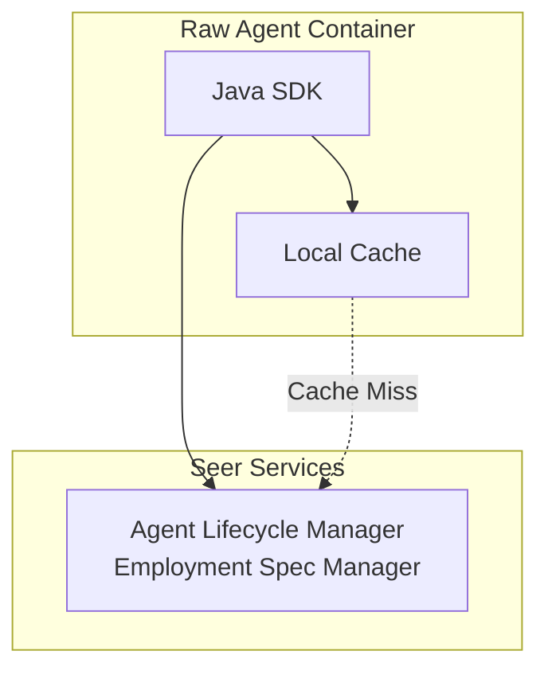

# Java SDK: Employment Spec Access APIs

> **Status**: 🟢 Design Complete  
> **Last Updated**: 2026-01-12  
> **Design Level**: C2 (Container)

---

## Overview

The Employment Spec Access APIs provide Java SDK interfaces for Raw Agents to retrieve, cache, and access their Employment Specification. The Employment Spec contains authority delegation, work scope, resource quotas, tool bindings, and operational environment configuration.

**Key Design Point**: Employment Specs are retrieved from the Agent Lifecycle Manager and cached locally for performance. The SDK handles versioning, cache invalidation, and automatic refresh.

---

## Architecture



---

## Functional Scope

### Employment Spec Retrieval

- **Get Current Employment Spec**: Retrieve the Employment Spec for the current agent instance
- **Get Spec by ID**: Retrieve a specific Employment Spec by ID (for multi-agent scenarios)
- **Get Spec Version**: Retrieve a specific version of an Employment Spec
- **List Available Versions**: List all available versions of an Employment Spec

### Caching

- **Local Cache**: Employment Specs are cached in memory for performance
- **Cache Invalidation**: Cache automatically invalidated on spec updates
- **Cache Refresh**: Configurable refresh interval and on-demand refresh
- **Cache Key**: Based on agent ID and spec version

### Versioning

- **Version Resolution**: Automatic version resolution (latest vs. specific version)
- **Version Locking**: Support for version pinning to prevent unexpected changes
- **Version History**: Access to version history and change tracking

---

## API Reference

### Initialization

```java
import io.olympus.seer.sdk.SeerSDK;
import io.olympus.seer.sdk.employment.EmploymentSpecClient;

// Initialize SDK (auto-detects agent identity from environment)
SeerSDK sdk = SeerSDK.fromEnvironment();

// Access Employment Spec APIs
EmploymentSpecClient employmentSpec = sdk.getEmploymentSpecClient();
```

### Get Current Employment Spec

```java
// Get current agent's employment spec (cached)
EmploymentSpec spec = employmentSpec.getCurrent().join();

// Access spec fields
System.out.println(spec.getAgentId());
System.out.println(spec.getWorkScope().getWorkbench());
System.out.println(spec.getAuthority().getCeilings().getMaxSingleTransaction());
System.out.println(spec.getToolBindings());
```

### Get Spec with Options

```java
// Get with cache control
GetSpecOptions options = GetSpecOptions.builder()
    .useCache(true)          // Use cache if available (default: true)
    .refreshCache(false)     // Force refresh from source (default: false)
    .version(null)           // Specific version (default: latest)
    .build();

EmploymentSpec spec = employmentSpec.getCurrent(options).join();

// Get specific version
EmploymentSpec spec = employmentSpec.getVersion("1.2.3").join();

// Get by spec ID
EmploymentSpec spec = employmentSpec.getById("es-fraud-analyst-001").join();
```

### Cache Management

```java
// Invalidate cache
employmentSpec.getCache().invalidate().join();

// Refresh cache
employmentSpec.getCache().refresh().join();

// Check cache status
CacheStatus status = employmentSpec.getCache().getStatus().join();
System.out.println(status.isValid());
System.out.println(status.getLastUpdated());
System.out.println(status.getVersion());
```

### Version Management

```java
// List available versions
List<VersionInfo> versions = employmentSpec.listVersions().join();
for (VersionInfo version : versions) {
    System.out.println(version.getVersion() + ": " + version.getCreatedAt());
}

// Get version info
VersionInfo versionInfo = employmentSpec.getVersionInfo("1.2.3").join();
System.out.println(versionInfo.getChanges());
System.out.println(versionInfo.getCreatedBy());
```

### Spec Fields Access

```java
EmploymentSpec spec = employmentSpec.getCurrent().join();

// Authority delegation
Delegation delegation = spec.getDelegation();
System.out.println(delegation.getType());  // "user" | "role"
System.out.println(delegation.getDelegator());
System.out.println(delegation.getAccountable());

// Work scope
WorkScope workScope = spec.getWorkScope();
System.out.println(workScope.getWorkbench());
System.out.println(workScope.getScenarios());
System.out.println(workScope.getTemporalScope());

// Authority ceilings
AuthorityCeilings ceilings = spec.getAuthority().getCeilings();
System.out.println(ceilings.getMaxSingleTransaction());
System.out.println(ceilings.getMaxDailyTotal());
System.out.println(ceilings.getMaxPerCustomer());

// Resource quotas
ResourceQuotas quotas = spec.getResources().getQuotas();
System.out.println(quotas.getCompute().getCpu());
System.out.println(quotas.getCompute().getMemory());
System.out.println(quotas.getTokens().getDaily());

// Tool bindings
List<ToolBinding> toolBindings = spec.getOperationalEnv().getToolBindings();
for (ToolBinding binding : toolBindings) {
    System.out.println(binding.getAlias() + ": " + binding.getProtocol());
}

// Memory bindings
List<MemoryBinding> memoryBindings = spec.getOperationalEnv().getMemoryBindings();
for (MemoryBinding binding : memoryBindings) {
    System.out.println(binding.getName() + ": " + binding.getWorkbenchStore());
}
```

---

## Integration Points

### Agent Lifecycle Manager

- **Employment Spec Manager**: Source of truth for Employment Specs
- **Integration**: Direct API calls to Employment Spec Manager
- **Authentication**: Uses agent's SPIFFE identity for authentication

### Local Cache

- **In-Memory Cache**: Fast local access to Employment Spec
- **Cache Invalidation**: Listens for spec update events
- **Cache Refresh**: Periodic refresh and on-demand refresh

---

## Key Design Decisions

### Caching Strategy

**Decision**: Employment Specs are cached locally in memory for performance.

**Rationale**:
- Employment Specs change infrequently
- Fast access needed for every agent operation
- Reduces load on Agent Lifecycle Manager

**Cache Invalidation**:
- Automatic invalidation on spec updates (via event subscription)
- Manual invalidation via API
- Configurable TTL as fallback

### Version Resolution

**Decision**: SDK supports both latest version and version pinning.

**Rationale**:
- Latest version for normal operations
- Version pinning for stability in production
- Version history for audit and debugging

### Framework-Agnostic Design

**Decision**: APIs are framework-agnostic and work with any Java agentic framework.

**Rationale**:
- Raw Agents may use different frameworks (custom Java frameworks)
- SDK should not impose framework constraints
- Simple, direct API surface

### Async/Await Pattern

**Decision**: Java SDK uses CompletableFuture for async operations.

**Rationale**:
- Non-blocking I/O for better performance
- Standard Java async pattern
- Compatible with reactive frameworks

---

## Error Handling

```java
import io.olympus.seer.sdk.exceptions.EmploymentSpecNotFoundException;
import io.olympus.seer.sdk.exceptions.CacheException;

try {
    EmploymentSpec spec = employmentSpec.getCurrent().join();
} catch (EmploymentSpecNotFoundException e) {
    // Spec not found for current agent
    System.err.println("Employment spec not found");
} catch (CacheException e) {
    // Cache error, will retry from source
    GetSpecOptions options = GetSpecOptions.builder()
        .useCache(false)
        .build();
    EmploymentSpec spec = employmentSpec.getCurrent(options).join();
}
```

---

## Observability

The SDK automatically instruments Employment Spec access:

- **Metrics**: Cache hit/miss rates, retrieval latency
- **Traces**: Full trace context for spec retrieval operations
- **Logs**: Structured logging for cache operations and errors

---

## Request-Scoped Delegation Configuration

When an Employment Spec has `requestScoped.enabled: true`, agents can receive additional authority from business users at runtime. The Employment Spec APIs provide access to this configuration.

### Checking Request-Scoped Delegation Status

```java
// Check if request-scoped delegation is enabled
EmploymentSpec spec = employmentSpec.getCurrent().join();

if (spec.getDelegation().getRequestScoped().isEnabled()) {
    System.out.println("Request-scoped delegation is enabled");
    System.out.println("Allowed templates: " + spec.getDelegation().getRequestScoped().getAllowedTemplates());
    System.out.println("Chaining policy: " + spec.getDelegation().getRequestScoped().getChainingPolicy());
    System.out.println("On denial behavior: " + spec.getDelegation().getRequestScoped().getOnDelegationDenied());
} else {
    System.out.println("Using enterprise delegation only");
    System.out.println("Delegation type: " + spec.getDelegation().getEnterprise().getType());
}
```

For runtime delegation operations (requesting authority, getting tokens), see [Delegation APIs](./delegation-apis.md).

---

## Related Documentation

- [Agent Lifecycle Manager: Employment Spec Manager](../../agent-lifecycle-manager/employment-spec-manager.md)
- [Employment Spec CRD](../../hub-integration/employment-spec-crd.md)
- [Java SDK: Overview](../README.md)
- [Delegation APIs](./delegation-apis.md) — Runtime delegation operations
- [Request-Scoped Authority Delegation](../../implementation-concepts/request-scoped-delegation.md) — End-to-end design

---

*Employment Spec Access APIs provide fast, cached access to Employment Specifications with versioning and cache management.*
