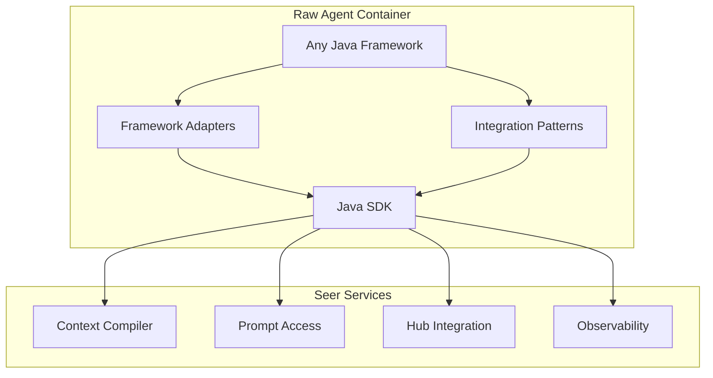

# Java SDK: Framework Convenience APIs

> **Status**: 🟢 Design Complete  
> **Last Updated**: 2026-01-12  
> **Design Level**: C2 (Container)

---

## Overview

The Framework Convenience APIs provide Java SDK patterns and utilities for integrating Seer services with any Java agentic framework. The SDK maintains framework-agnostic design principles, providing adapters and patterns that work with any framework rather than framework-specific builders.

**Key Design Point**: The SDK provides framework-agnostic patterns, adapters, and utilities that can be integrated with any Java agentic framework, while maintaining the core SDK APIs as framework-agnostic.

---

## Architecture



---

## Functional Scope

### Framework-Agnostic Patterns

- **Context Compilation Pattern**: Pattern for integrating context compilation with any framework
- **Prompt Access Pattern**: Pattern for integrating prompt access with any framework
- **Tool Integration Pattern**: Pattern for integrating Hub tools with any framework
- **Observability Pattern**: Pattern for integrating observability with any framework

### Framework Adapters

- **Context Compilation Adapter**: Adapter interface for context compilation integration
- **Prompt Access Adapter**: Adapter interface for prompt access integration
- **Tool Integration Adapter**: Adapter interface for tool integration
- **Observability Adapter**: Adapter interface for observability integration

### Integration Utilities

- **Service Initialization**: Utilities for initializing Seer services in framework context
- **Error Handling**: Utilities for consistent error handling across frameworks
- **Configuration**: Utilities for framework-agnostic configuration management

### Framework-Agnostic Core

- **Core SDK APIs**: All core SDK APIs remain framework-agnostic
- **No Framework Lock-In**: Developers can use core APIs with any framework
- **Framework Integration**: Framework-specific integration is developer responsibility

---

## API Reference

### Context Compilation Pattern

```java
import io.olympus.seer.sdk.SeerSDK;
import io.olympus.seer.sdk.frameworks.ContextCompilationAdapter;

// Initialize SDK
SeerSDK sdk = SeerSDK.fromEnvironment();

// Create context compilation adapter
ContextCompilationAdapter adapter = new ContextCompilationAdapter(sdk.getContextCompilerClient());

// Use in framework
public class MyAgent {
    private final ContextCompilationAdapter contextAdapter;
    
    public MyAgent() {
        this.contextAdapter = new ContextCompilationAdapter(
            SeerSDK.fromEnvironment().getContextCompilerClient()
        );
    }
    
    public AgentResponse process(AgentRequest request) {
        // Compile context
        CompiledContext context = contextAdapter.compile(
            request.getRequestId(),
            request.getUpdateId()
        ).join();
        
        // Use context in agent logic
        return processWithContext(request, context);
    }
}
```

### Prompt Access Pattern

```java
import io.olympus.seer.sdk.frameworks.PromptAccessAdapter;

// Create prompt access adapter
PromptAccessAdapter promptAdapter = new PromptAccessAdapter(
    sdk.getPromptClient()
);

// Use in framework
public class MyAgent {
    private final PromptAccessAdapter promptAdapter;
    
    public String getSystemPrompt() {
        return promptAdapter.getSystemPrompt().join().getContent();
    }
}
```

### Tool Integration Pattern

```java
import io.olympus.seer.sdk.frameworks.ToolIntegrationAdapter;

// Create tool integration adapter
ToolIntegrationAdapter toolAdapter = new ToolIntegrationAdapter(
    sdk.getHubClient().getTools()
);

// Use in framework
public class MyAgent {
    private final ToolIntegrationAdapter toolAdapter;
    
    public Object invokeTool(String toolName, Map<String, Object> params) {
        return toolAdapter.invoke(toolName, params).join().getData();
    }
}
```

### Observability Pattern

```java
import io.olympus.seer.sdk.frameworks.ObservabilityAdapter;

// Create observability adapter
ObservabilityAdapter obsAdapter = new ObservabilityAdapter(
    sdk.getObservabilityClient()
);

// Use in framework
public class MyAgent {
    private final ObservabilityAdapter obsAdapter;
    
    public AgentResponse process(AgentRequest request) {
        try (Span span = obsAdapter.startSpan("agent.process")) {
            span.setAttribute("request_id", request.getRequestId());
            // Agent logic
            return result;
        }
    }
}
```

### Service Initialization Utility

```java
import io.olympus.seer.sdk.frameworks.SeerServiceInitializer;

// Initialize all Seer services
SeerServices services = SeerServiceInitializer.initialize();

// Access services
CompiledContext context = services.getContextCompiler()
    .compile(requestId, updateId).join();
    
Prompt prompt = services.getPrompts()
    .getSystemPrompt().join();
    
ToolResult result = services.getTools()
    .invoke(toolName, params).join();
```

---

## Integration Points

### Core SDK APIs

- **Context Compiler APIs**: Adapters use core context compilation APIs
- **Prompt Access APIs**: Adapters use core prompt access APIs
- **Hub Integration APIs**: Adapters use core Hub integration APIs
- **Observability APIs**: Adapters use core observability APIs

### Framework Integration

- **Framework-Specific**: Developers implement framework-specific integration using adapters
- **Pattern-Based**: Integration follows documented patterns
- **Flexible**: Supports any Java agentic framework

---

## Key Design Decisions

### Framework-Agnostic Design

**Decision**: SDK provides framework-agnostic patterns and adapters rather than framework-specific builders.

**Rationale**:
- Java agentic framework landscape is less standardized than Python
- Framework-agnostic approach supports any framework
- Developers can implement framework-specific integration as needed

### Adapter Pattern

**Decision**: SDK provides adapter interfaces that wrap core APIs for framework integration.

**Rationale**:
- Maintains single source of truth (core APIs)
- Adapters provide framework-friendly interfaces
- Easier to maintain and extend

### Pattern-Based Integration

**Decision**: SDK documents integration patterns rather than providing framework-specific builders.

**Rationale**:
- Patterns are more flexible than builders
- Supports diverse framework architectures
- Developers can adapt patterns to their needs

---

## Related Documentation

- [Java SDK: Employment Spec APIs](employment-spec-apis.md)
- [Java SDK: Prompt APIs](prompt-apis.md)
- [Java SDK: Context Compiler APIs](context-compiler-apis.md)
- [Java SDK: Overview](../README.md)

---

*Framework Convenience APIs provide framework-agnostic patterns and adapters for integrating Seer services with any Java agentic framework.*
